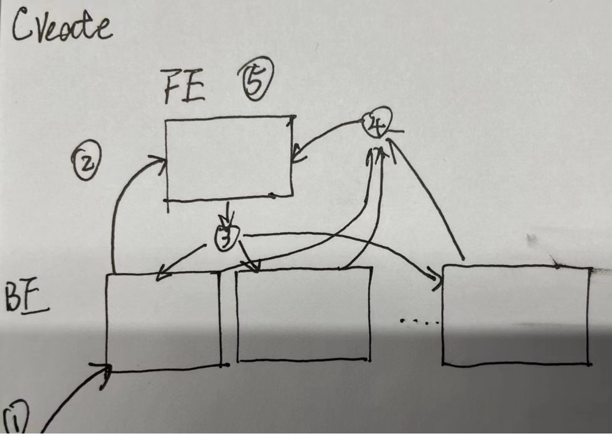
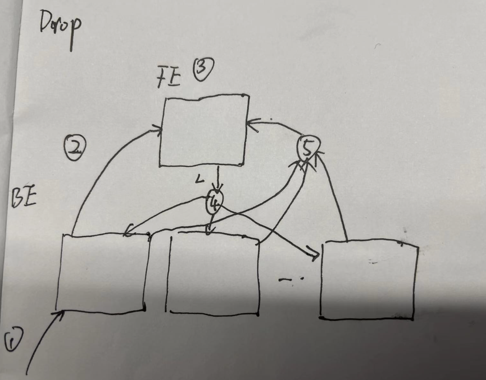

# Report

  

1. Client 发送 CREATE TABLE/DATABASE xxx ON CLUSTER
2. BE 转发 CREATE 到 FE
3. FE 分发 Tasks 到 BE
4. BE finishTask 到 FE
5. FE 在 finishJob 的时候更新 FE 内存

Report 操作的时间点 T 可能发生在上述 5 个时刻的任何区间内。
我们以 FE 中的元数据为准，根据 BE 在不同时间点汇报的不同结果，可以得到如下表格，纵向代表 FE 上是否有对应的元数据，横向代表 BE 进行 report 的时候是否有对应的元数据，符号 X 表示不可能出现的情况，Y 表示不需要特殊处理的情况（并不代表此时一定正确，只是不需要处理），Q 表示需要分析这种 case 如何处理。

**1 < T < 5**

||Null|Not Null|
|--|--|--|
|Null|Y|X|
|Not Null|Q1|X|

**5 < T**

||Null|Not Null|
|--|--|--|
|Null|X|Q2|
|Not Null|X|Y|

在时刻 5 之前，FE 上都无法在内存中找到 db，但是由于不同 be 完成 db 创建的时刻不一致，所以 fe 上是有可能在此时段内既收到 not null 也收到 null 的。

如果在此时间段内，BE 汇报的 db list 为空，那么我们不需要去处理这种情况，因为此时 BE 可能处于 3 之前，也可能是执行 create task 失败，无法判断此时 BE 的正确状态，所以 FE 不需要任何操作，所以在均为 null 的情况下标记为 Y。

Q1 case 中，FE 上没有 db，但是 report 中有 db，FE BE 数据不一致，那么需要去检查 creating db，如果有某个 create db job 正好对应 be report，那么这个 db 就不需要被删除，否则需要执行一次 drop；

Q2 case 中，FE 上有 db，但是 report 中没有 db。首先可以确认，此时任何 BE 都没有执行 drop db task，因为 fe 在分发 drop db task 之前就会在内存中将 db 删除。同时任何 be 此时都已经完成了 create db task，不会出现一些 be 处于时间点 3 之前的情况。因此，可以确认，只要出现 Q2，那么必须对该 be 下发 create db task。

**1 < T < 3**

||Null|Not Null|
|--|--|--|
|Null|X|Q3|
|Not Null|X|Y|

**3 < T**

||Null|Not Null|
|--|--|--|
|Null|Y|X|
|Not Null|Q4|X|

Q3 的处理逻辑与 Q2 一致。
Q4 的处理逻辑与 Q1 一致。

