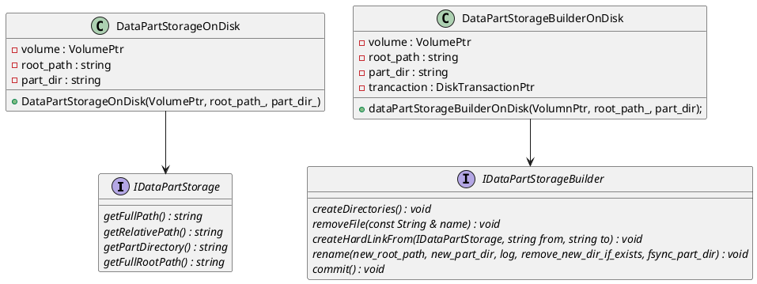

```plantuml
class TransactionInfoContext
{
    table : StorageID
    part_name : String
    covering_part : String
}

class VersionMetadata
{
    create_tid : TransactionID
    removal_tid : TransactionID
    
}


```

IMergeTreeDataPart 在构造的时候会构造 PartMetadataManagerOrdinary 对象。
```c++
IMergeTreeDataPart::IMergeTreeDataPart(
    const MergeTreeData & storage_,
    const String & name_,
    const DataPartStoragePtr & data_part_storage_,
    Type part_type_,
    const IMergeTreeDataPart * parent_part_)
    : storage(storage_)
    , name(name_)
    , info(MergeTreePartInfo::fromPartName(name_, storage.format_version))
    , data_part_storage(parent_part_ ? parent_part_->data_part_storage : data_part_storage_)
    , index_granularity_info(storage_, part_type_)
    , part_type(part_type_)
    , parent_part(parent_part_)
    , use_metadata_cache(storage.use_metadata_cache)
{
    if (parent_part)
        state = State::Active;
    incrementStateMetric(state);
    incrementTypeMetric(part_type);

    minmax_idx = std::make_shared<MinMaxIndex>();

    initializePartMetadataManager();
}

void IMergeTreeDataPart::initializePartMetadataManager()
{
#if USE_ROCKSDB
    if (use_metadata_cache)
        metadata_manager = std::make_shared<PartMetadataManagerWithCache>(this, storage.getContext()->getMergeTreeMetadataCache());
    else
        metadata_manager = std::make_shared<PartMetadataManagerOrdinary>(this);
#else
        metadata_manager = std::make_shared<PartMetadataManagerOrdinary>(this);
#endif
}
```


```c++
MergedBlockOutputStream::MergedBlockOutputStream(
    const MergeTreeDataPartPtr & data_part,
    DataPartStorageBuilderPtr data_part_storage_builder_,
    const StorageMetadataPtr & metadata_snapshot_,
    const NamesAndTypesList & columns_list_,
    const MergeTreeIndices & skip_indices,
    CompressionCodecPtr default_codec_,
    const MergeTreeTransactionPtr & txn,
    bool reset_columns_,
    bool blocks_are_granules_size,
    const WriteSettings & write_settings)
    : IMergedBlockOutputStream(std::move(data_part_storage_builder_), data_part, metadata_snapshot_, columns_list_, reset_columns_)
    , columns_list(columns_list_)
    , default_codec(default_codec_)
{
    ...

    TransactionID tid = txn ? txn->tid : Tx::PrehistoricTID;
    /// NOTE do not pass context for writing to system.transactions_info_log,
    /// because part may have temporary name (with temporary block numbers). Will write it later.
    data_part->version.setCreationTID(tid, nullptr);
    data_part->storeVersionMetadata();

    writer = data_part->getWriter(data_part_storage_builder, columns_list, metadata_snapshot, skip_indices, default_codec, writer_settings, {});
}
```
```plantuml
class IPartMetadataManager
{
    # part : IMergeTreeDataPart
}


class IMergeTreeDataPart
{
    # use_metadata_cache : bool 
    # metadata_manager : mutable PartMetadataManagerPtr
}

IMergeTreeDataPart *-- IPartMetadataManager
```



