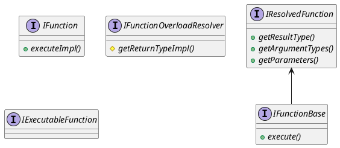

```cpp
ColumnPtr ColumnFunction::replicate(const Offsets & offsets) const
{
    // offsets.size == 1
    if (elements_size != offsets.size())
        throw Exception(ErrorCodes::SIZES_OF_COLUMNS_DOESNT_MATCH, "Size of offsets ({}) doesn't match size of column ({})",
                        offsets.size(), elements_size);
    // captue.size == 0
    ColumnsWithTypeAndName capture = captured_columns;
    for (auto & column : capture)
        column.column = column.column->replicate(offsets);

    // replicated_size == 1
    size_t replicated_size = 0 == elements_size ? 0 : offsets.back();
    return ColumnFunction::create(replicated_size, function, capture, is_short_circuit_argument, is_function_compiled);
}
```

```cpp

```