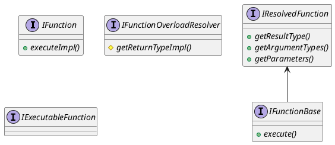

```cpp
ColumnPtr ColumnFunction::replicate(const Offsets & offsets) const
{
    // offsets.size == 1
    if (elements_size != offsets.size())
        throw Exception(ErrorCodes::SIZES_OF_COLUMNS_DOESNT_MATCH, "Size of offsets ({}) doesn't match size of column ({})",
                        offsets.size(), elements_size);
    // captue.size == 0
    ColumnsWithTypeAndName capture = captured_columns;
    for (auto & column : capture)
        column.column = column.column->replicate(offsets);

    // replicated_size == 1
    size_t replicated_size = 0 == elements_size ? 0 : offsets.back();
    return ColumnFunction::create(replicated_size, function, capture, is_short_circuit_argument, is_function_compiled);
}
```
arrayFold 中这里的 captured_columns 包含两部分，一部分是构造 ColumnFunction 时传递的，另一部分是之后通过appendArguments添加的。第一部分是固定参数。
比如
`SELECT arrayFold((x, y, z, acc) -> (((acc + (x * 2)) + (y * 3)) + (z * 4)), [1, 2, 3, 4], [5, 6, 7, 8], [9, 10, 11, 12], toInt64(3))`，
这里的固定参数就是 ColumnConst 1， 2，3


`PATH=$PATH:/data/hzq/ClickHouse/build/programs tests/clickhouse-test`