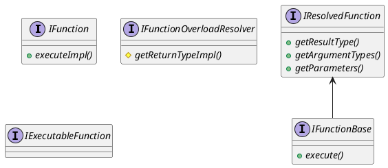

```plantuml
@startuml
interface IFunction
{
    + {abstract} executeImpl()

}

interface IFunctionOverloadResolver
{
    # {abstract} getReturnTypeImpl()
}
interface IResolvedFunction
{
    + {abstract} getResultType()
    + {abstract} getArgumentTypes()
    + {abstract} getParameters()
}
interface IFunctionBase
{
    + {abstract} execute()
}

IResolvedFunction <-- IFunctionBase

interface IExecutableFunction
{

}
@enduml
```