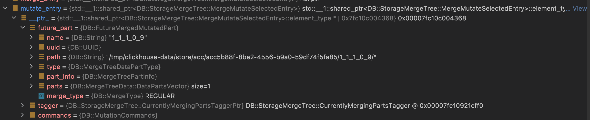

[TOC]
## ALTER 分类
通过 ALTER TABLE 执行的语句在内核会被区分为四类：
```c++
BlockIO InterpreterAlterQuery::execute()
{
    ...
    for (const auto & child : alter.command_list->children)
    {
        auto * command_ast = child->as<ASTAlterCommand>();
        if (auto alter_command = AlterCommand::parse(command_ast))
            alter_commands.emplace_back(std::move(*alter_command));
        else if (auto partition_command = PartitionCommand::parse(command_ast))
        {
            partition_commands.emplace_back(std::move(*partition_command));
        }
        else if (auto mut_command = MutationCommand::parse(command_ast))
        {
            if (mut_command->type == MutationCommand::MATERIALIZE_TTL && !metadata_snapshot->hasAnyTTL())
                throw Exception("Cannot MATERIALIZE TTL as there is no TTL set for table "
                    + table->getStorageID().getNameForLogs(), ErrorCodes::INCORRECT_QUERY);

            mutation_commands.emplace_back(std::move(*mut_command));
        }
        else if (auto live_view_command = LiveViewCommand::parse(command_ast))
            live_view_commands.emplace_back(std::move(*live_view_command));
        else
            throw Exception("Wrong parameter type in ALTER query", ErrorCodes::LOGICAL_ERROR);
    }
    ...
}
```
各种 ALTET 类型具体包含哪些子关键字不详细列出，只列出一两个典型的：
* `ALTER`: `ADD_COLUMN`，`ADD_COLUMN`，`MODIFY_ORDER_BY`，...
* `PARTITION`:`DROP_PARTITION`，`FETCH_PARTITION` ...
* `MUTATION`:`DELETE`，`RENAME_COLUMN`，...
* `LIVEVIEW`:`REFRESH`

对不同类型的 ALTER 操作，后续执行的流程是不同的。比如对于 ALTER 操作，首先修改记录元数据的 .sql 文件，；对于 MUTATION 操作，真正执行是后台异步任务完成的，“前台”过程只是创建 MUTATION 任务相关信息。

### StorageMergeTree::alter
```c++
BlockIO InterpreterAlterQuery::executeToTable(const ASTAlterQuery & alter)
{
    ...
    if (!alter_commands.empty())
    {
        auto alter_lock = table->lockForAlter(getContext()->getSettingsRef().lock_acquire_timeout);
        StorageInMemoryMetadata metadata = table->getInMemoryMetadata();
        alter_commands.validate(metadata, getContext());
        alter_commands.prepare(metadata);
        table->checkAlterIsPossible(alter_commands, getContext());
        table->alter(alter_commands, getContext(), alter_lock);
    }

    return res;
}
```

### StorageMergeTree::mutate
```c++
InterperterAlterQuery::execute()
{
    ...
    StoragePtr table = DatabaseCatalog::instance().getTable(table_id, getContext());
    auto alter_lock = table->lockForAlter(getContext()->getCurrentQueryId(), getContext()->getSettingsRef().lock_acquire_timeout);
    ... 
    MutationCommands mutation_commands;
    ...
    else if (auto mut_command = MutationCommand::parse(command_ast)) {
        ...
        mutation_commands.emplace_back(std::move(*mut_command));
    }
    ...
    if (!mutation_commands.empty())
    {
        table->checkMutationIsPossible(mutation_commands, getContext()->getSettingsRef());
        MutationsInterpreter(table, metadata_snapshot, mutation_commands, getContext(), false).validate();
        table->mutate(mutation_commands, getContext());
    }
}
```
```sql
ALTER TABLE ... DELETE WHERE ...
```
第一阶段的核心函数是 **StorageMergeTree::startMutation**
```c++

Int64 StorageMergeTree::startMutation(const MutationCommands & commands, String & mutation_file_name)
{
    /// Choose any disk, because when we load mutations we search them at each disk
    /// where storage can be placed. See loadMutations().
    auto disk = getStoragePolicy()->getAnyDisk();
    Int64 version;
    {
        std::lock_guard lock(currently_processing_in_background_mutex);

        MergeTreeMutationEntry entry(commands, disk, relative_data_path, insert_increment.get());
        version = increment.get(); /// #9，mutation version 与 block number 在同一序列
        entry.commit(version);
        mutation_file_name = entry.file_name;   /// mutation_9.txt
        auto insertion = current_mutations_by_id.emplace(mutation_file_name, std::move(entry));
        current_mutations_by_version.emplace(version, insertion.first->second);

        LOG_INFO(log, "Added mutation: {}", mutation_file_name);
    }
    background_executor.triggerTask();
    return version;
}
```
注意`version = increment.get()`，mutation version 与 block num 共处同一序列在之后真正执行时可以帮助判断 mutation 执行涉及到的 parts。将本次 mutation 操作记录在 table 内存结构中：
```c++
current_mutations_by_version.emplace(version, insertion.first->second);
```
注意，此时 mutation 操作并未被持久化，只是生成了文件名`mutation_9.txt`，至此mutation的第一阶段结束，后台异步任务`DataProcessingJob`负责真正执行mutation的第二阶段。
### MergeTreeDataMergerMutator::selectPartsToMutate

```c++
std::optional<JobAndPool> StorageMergeTree::getDataProcessingJob()
{
    ...
    merge_entry = selectPartsToMerge(metadata_snapshot, false, {}, false, nullptr, share_lock);
    if (!merge_entry)
        mutate_entry = selectPartsToMutate(metadata_snapshot, nullptr, share_lock);
    ...
    if (merge_entry || mutate_entry) 
    {
        ... 
        mutateSelectedPart(metadata_snapshot, *mutate_entry, share_lock);
    }
}
```
当 DataProcessingJob 发现本次执行没有 part 可以进行合并时，就会尝试选择 part 进行 mutate
```c++
std::shared_ptr<StorageMergeTree::MergeMutateSelectedEntry> StorageMergeTree::selectPartsToMutate(
    const StorageMetadataPtr & metadata_snapshot, String * /* disable_reason */, TableLockHolder & /* table_lock_holder */)
{
    ...
    for (const auto & part : getDataPartsVector())
    {
        if (currently_merging_mutating_parts.count(part)) /// 当前 part 正在 merge 或者 mutate 则跳过
            continue;

        auto mutations_begin_it = current_mutations_by_version.upper_bound(part->info.getDataVersion());
        if (mutations_begin_it == mutations_end_it)
            continue;

        size_t max_source_part_size = merger_mutator.getMaxSourcePartSizeForMutation(); /// 56464492581236
        if (max_source_part_size < part->getBytesOnDisk())
        {
            LOG_DEBUG(...);
            continue;
        }
        ...
        auto new_part_info = part->info;
        new_part_info.mutation = current_mutations_by_version.rbegin()->first;

        future_part.parts.push_back(part);
        future_part.part_info = new_part_info;
        future_part.name = part->getNewName(new_part_info);
        future_part.type = part->getType();

        return std::make_shared<MergeMutateSelectedEntry>(future_part, std::move(tagger), commands);
    }
}
```
`selectPartsToMutate`通过判断是否有 大于 part 的 dataversion 的 mutation version 来决定该 part 是否需要被执行 mutation 
```c++
auto mutations_begin_it = current_mutations_by_version.upper_bound(part->info.getDataVersion());
if (mutations_begin_it == mutations_end_it)
    continue;
```
返回遇到的**第一个**可以 mutate 的 part：
  

```c++
bool StorageMergeTree::mutateSelectedPart(const StorageMetadataPtr & metadata_snapshot, MergeMutateSelectedEntry & merge_mutate_entry, TableLockHolder & table_lock_holder)
{
    ...
    new_part = merger_mutate.mutatePartToTemporaryPart(...);
    renameTempPartAndReplace(new_part);
    updateMutationEntriesErrors(future_part, true, "");
    write_part_log({});
    ...
    return true;
}
```

```c++
MergeTreeData::MutableDataPartPtr MergeTreeDataMergerMutator::mutatePartToTemporaryPart(
    ... )
{
    if (future_part.parts.size() != 1)
        throw Exception("Trying to mutate " + toString(future_part.parts.size()) + " parts, not one. "
            "This is a bug.", ErrorCodes::LOGICAL_ERROR);
}
```
### StorageMergeTree::alter
```c++
BlockIO InterpreterAlterQuery::execute()
{
    ...
    for (const auto & child : alter.command_list->children)
    {
        auto * command_ast = child->as<ASTAlterCommand>();
        if (auto alter_command = AlterCommand::parse(command_ast))
            alter_commands.emplace_back(std::move(*alter_command));
        ...
    }
    ...
    if (!alter_commands.empty())
    {
        StorageInMemoryMetadata metadata = table->getInMemoryMetadata();
        alter_commands.validate(metadata, getContext());
        alter_commands.prepare(metadata);
        table->checkAlterIsPossible(alter_commands, getContext());
        table->alter(alter_commands, getContext(), alter_lock);
    }
}
```
具体到 MergeTree 执行 alter：
```c++
void StorageMergeTree::alter(
    const AlterCommands & commands,
    ContextPtr local_context,
    TableLockHolder & table_lock_holder)
{
    ...
    DatabaseCatalog::instance().getDatabase(table_id.database_name)->alterTable(local_context, table_id, new_metadata);
    if (!maybe_mutation_commands.empty())
        mutation_version = startMutation(maybe_mutation_commands, mutation_file_name);
    ...
}
```
DatabaseOrdinary::alterTable 做了四件事：
1. 将记录 table 现有 meta 的 .sql 读进内存
2. applyMetadataChangesToCreateQuery
3. 将新的 .sql 写入临时文件
4. rename tmp

如果该 ALTER 操作需要配合 MUTATION 完成，则还会调用 mutate，后续路径和 ALTER-MUTATE 一致。这些 ALTER 包活：MODIFY_COLUMN，DROP_COLUMN，DROP_INDEX，RENAME_COLUMN
