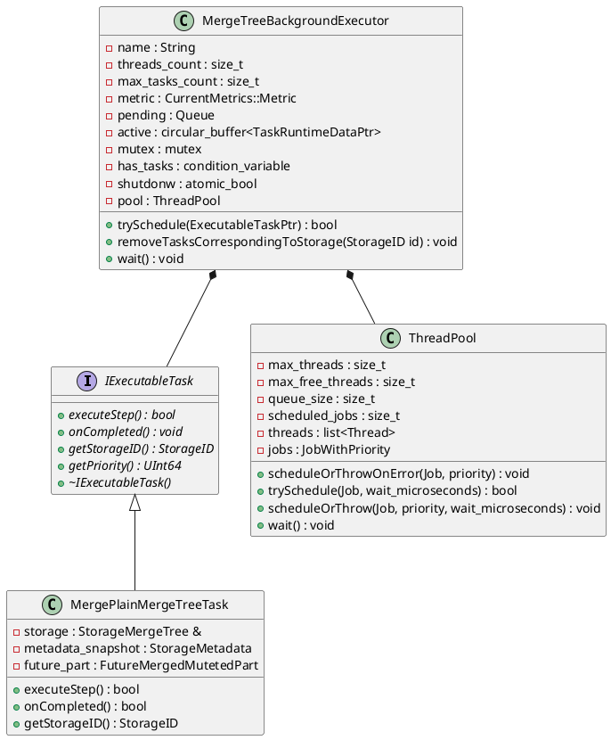
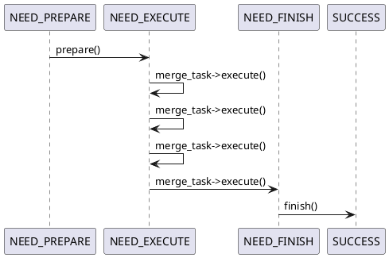
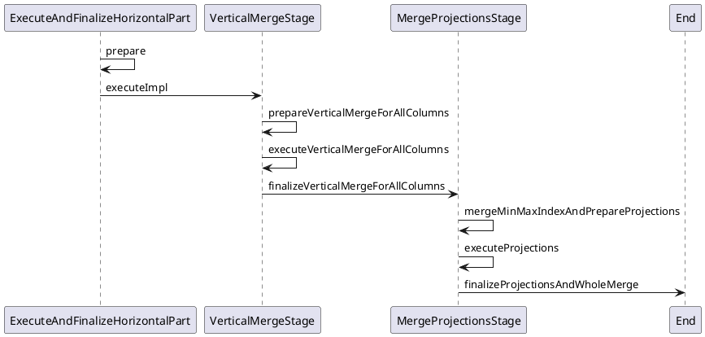

[TOC]


## ThreadPool, Thread, Executor, Task

Context 全局共享，其中包含多个全局共享的 thread pool 以及 executor。

```plantuml
class Context
{
    ...
    - schedule_pool : BackgroundSchedulePool
    - distributed_schedule_pool : BackgroundSchedulePool
    ...
    - merge_mutate_executor : MergeMutateBackgroundExecutorPtr
    - moves_executor : OrdinaryBackgroundExecutorPtr 
    - fetch_executor : OrdinaryBackgroundExecutorPtr
    - common_executor : OrdinaryBackgroundExecutorPtr 
    ...    
}
```
### BackgroundThreadPool
BackgroundSchedulePool: 在某个时间点调度执行 threadFunction。
```plantuml
class BackgroundSchedulePool
{
    - size : size_t
    - threads : Threads
    - queue : Queue
    ...
    + createTask(log_name, function) : BackgroundSchedulePoolTaskHolder
}

BackgroundSchedulePool *-- BackgroundSchedulePoolTaskHolder

class BackgroundSchedulePoolTaskHolder
{
    - task_info : BackgroundSchedulePoolTaskInfo
}

BackgroundSchedulePoolTaskHolder *-- BackgroundSchedulePoolTaskInfo

class BackgroundSchedulePoolTaskInfo
{
    + schedule() : bool
    + scheduleAfter(size_t) : bool
    + deactivate() : void
    + activate() : void
    + activateAndSchedule() : bool
    - execute() : void
    - pool : BackgroundSchedulePool &
    - function : BackgroundSchedulePool::TaskFunc
    ...
}

BackgroundSchedulePoolTaskInfo *-- BackgroundSchedulePool
```
典型的使用方式：在 BackgroundSchedulePool 中创建一个 task，当你确实需要执行该 task 时，再调用该 task 的 schedule 方法。比如 BackgroundJobsAssignee 在其 start 方法中创建一个 task：
```c++
void BackgroundJobsAssignee::start()
{
    std::lock_guard lock(holder_mutex);
    if (!holder)
        holder = getContext()->getSchedulePool().createTask("BackgroundJobsAssignee:" + toString(type), [this]{ threadFunc(); });

    holder->activateAndSchedule();
}
```
BackgroundSchedulePool 就是一个最简单的 thread pool 模型。唯一需要注意的是，BackgroundSchedulePool 的 worker thread 并不是操作系统直接提供的线程，而是 GlobalThread 中的一个 “task”。所有 BackgroundSchedulePool 都是在全局的线程池中创建任务，执行 `BackgroundSchedulePool::threadFunction()`。观察其构造函数：
```c++
BackgroundSchedulePool::BackgroundSchedulePool(size_t size_, CurrentMetrics::Metric tasks_metric_, const char *thread_name_)
    : size(size_)
    , tasks_metric(tasks_metric_)
    , thread_name(thread_name_)
{
    LOG_INFO(&Poco::Logger::get("BackgroundSchedulePool/" + thread_name), "Create BackgroundSchedulePool with {} threads", size);

    threads.resize(size);
    for (auto & thread : threads)
        thread = ThreadFromGlobalPool([this] { threadFunction(); });

    delayed_thread = ThreadFromGlobalPool([this] { delayExecutionThreadFunction(); });
}
```
全局的 GlobalPool 中 task 如何调度，以及 BackgroundScuedulePool 中的各个 task 如何调度对于使用者来说是透明的。

GlobalContext 中除了 BackgroundSchedulePool 之外，还有一些 Executor。我们称 BackgroundSchedulePool 能够执行的 task 为 background job，还有一种 task 类型是 executable task，这类 task 由各种 Executor 执行。

以 Merge 为例，“MergeJob” 是 BackgroundSchedulePool 中的一个 job，这个 job 执行的内容是决定如何进行 merge，创建一个 MergePlainMergeTreeTask 对象，将该对象交给全局的 MergeMutateExecutor 去执行。

### Executor

`MergeTreeBackgroundExecutor`也是一个线程池实现。与 BackgroundSchedulePool 一样，它的 worker thread 也是来自于 GlobalThreadPool 中的线程。Executor 与 ThreadPool 的区别在于两者执行 task 的方式不同。

Executor 执行的是 Executable task，它是 Clickhouse 自己写的 coroutine，所有的后台操作都可以通过实现 `IExecutableTask` 来创建一个 task。每个 Task 都是 a sequence of steps, 较重的 task 需要更多的 steps，Executor 每次只调度 task 执行一个 step，这样可以实现不同 task 穿插执行。

在原先的设计中，一次Merge交给一个线程全程执行，现在将线程细分到coroutine之后，需要额外保存每个coroutine的执行上下文，确保coroutine切换回来再次执行的时候能够继续上次的状态。MergeTask::IStageRuntimeContext 用于完成该目标。

## WriteTempPart
```c++
SinkToStoragePtr
StorageMergeTree::write(const ASTPtr & /*query*/, const StorageMetadataPtr & metadata_snapshot, ContextPtr local_context)
{
    const auto & settings = local_context->getSettingsRef();
    return std::make_shared<MergeTreeSink>(
        *this, metadata_snapshot, settings.max_partitions_per_insert_block, local_context);
}
```


```c++
MergeTreeDataWriter::TemporaryPart MergeTreeDataWriter::writeTempPart(
    BlockWithPartition & block_with_partition, const StorageMetadataPtr & metadata_snapshot, ContextPtr context)
{
    ...

    auto relative_path = TMP_PREFIX + part_name;
    VolumePtr data_part_volume = createVolumeFromReservation(reservation, volume);

    auto data_part_storage = std::make_shared<DataPartStorageOnDisk>(
        data_part_volume,
        data.relative_data_path,
        relative_path);

    auto data_part_storage_builder = std::make_shared<DataPartStorageBuilderOnDisk>(
        data_part_volume,
        data.relative_data_path,
        relative_path);

    auto new_data_part = data.createPart(
        part_name,
        data.choosePartType(expected_size, block.rows()),
        new_part_info,
        data_part_storage);
    
    ...

    SyncGuardPtr sync_guard;
    if (new_data_part->isStoredOnDisk())
    {
        /// The name could be non-unique in case of stale files from previous runs.
        String full_path = new_data_part->data_part_storage->getFullPath();

        if (new_data_part->data_part_storage->exists())
        {
            LOG_WARNING(log, "Removing old temporary directory {}", full_path);
            data_part_storage_builder->removeRecursive();
        }

        data_part_storage_builder->createDirectories();

        if (data.getSettings()->fsync_part_directory)
        {
            const auto disk = data_part_volume->getDisk();
            sync_guard = disk->getDirectorySyncGuard(full_path);
        }
    }


}
```

### index
```plantuml
class IMergeTreeDataPart
{
    index : Index
    minmax_idx : MinMaxIndex
}

IMergeTreeDataPart *-- Index
IMergeTreeDataPart *-- MinMaxIndex

class Index
{
    std::vector<IColumn>
}

Index *-- IColumn
```
两部分 index，一个是 index 数据成员，将 primary key 所在的列全部保存在内存里，另一个是 minmaxindex。

Index 的初始化：
1. 写入 part 时的初始化：
```c++
MergeTreeDataWriter::TemporaryPart MergeTreeDataWriter::writeTempPart(
    BlockWithPartition & block_with_partition, const StorageMetadataPtr & metadata_snapshot, ContextPtr context)
{
    ...
    auto finalizer = out->finalizePartAsync(new_data_part, data_settings->fsync_after_insert);
    ...   
}

MergedBlockOutputStream::Finalizer MergedBlockOutputStream::finalizePartAsync(
        MergeTreeData::MutableDataPartPtr & new_part,
        bool sync,
        const NamesAndTypesList * total_columns_list,
        MergeTreeData::DataPart::Checksums * additional_column_checksums)
{
    ...
    new_part->index = writer->releaseIndexColumns();
    ...
}
```
2. 启动时候 loadIndex
```c++
void IMergeTreeDataPart::loadColumnsChecksumsIndexes(bool require_columns_checksums, bool check_consistency)
{
    ...
    loadIndex();     /// Must be called after loadIndexGranularity as it uses the value of `index_granularity`
    ...
}

void IMergeTreeDataPart::loadIndex()
{
    ...
    index.assign(std::make_move_iterator(loaded_index.begin()), std::make_move_iterator(loaded_index.end()));
}
```


```c++
auto minmax_idx = std::make_shared<IMergeTreeDataPart::MinMaxIndex>();
minmax_idx->update(block, data.getMinMaxColumnsNames(metadata_snapshot->getPartitionKey()));
...
new_data_part->minmax_idx = std::move(minmax_idx;
```

## Merge
MergeTreeData 所处的位置：

```plantuml
abstract class IStorage

IStorage <-- MergeTreeData

abstract class MergeTreeData

MergeTreeData <-- StorageMergeTree
MergeTreeData <-- StorageReplicatedMergeTree
MergeTreeData <-- StorageShareDiskMergeTree
```

数据成员（Merge相关）：
```plantuml
abstract class MergeTreeData {
    - relative_data_path : String
    - data_parts_mutex : mutex
    - data_parts_indexes : DataPartsIndexes
    - background_operations_assignee : BackgroundJobsAssignee
    ...
}

MergeTreeData *-- BackgroundJobsAssignee

class BackgroundJobsAssignee {
    + BackgroundJobsAssignee(MergeTreeData&, Type, ContexPtr)
    - data : MergeTreeData&
    - holder : BackgroundSchedulePool::TaskHolder
    + start() : void
    + trigger() : void
    + postpone() : void
    + finish() : void
    - threadFunc() : void
}
```

MergeTreeData 的 contructor 中构造 BackgroundJobsAssignee 对象。

在 MergeTree 对象启动时，会创建相关的 background job，相关的代码如下：
```c++
StorageMergeTree(
    const StorageID & table_id_,
    ...
    ) : MergeTreeData(
        table_id_,
        ...
    )
)

MergeTreeData::MergeTreeData(
    const StorageID & table_id_,
    ...)
    : ...
    , ...
    , background_operations_assignee(*this, BackgroundJobsAssignee::Type::DataProcessing, getContext())
    ...)
{
    ...
}

BackgroundJobsAssignee(MergeTreeData & data_, Type type, ContextPtr global_context_)
    : ..., data(data_), ... {}

StorageMergeTree::startup()
{
    ...
    background_operations_assignee.start();
    ...
}

void BackgroundJobsAssignee::start()
{
    std::lock_guard lock(holder_mutex);
    if (!holder)
        holder = getContext()->getSchedulePool().createTask("BackgroundJobsAssignee:" + toString(type), [this]{ threadFunc(); });

    holder->activateAndSchedule();
}
```
也就是说，StorageMergeTree 对象的 start 方法会在 schedule pool 创建一个 job，该 job 执行的是`BackgroundJobsAssignee::threadFunc()` 方法，
```c++
void BackgroundJobsAssignee::threadFunc()
{
    try
    {
        bool succeed = false;
        switch (type)
        {
            case Type::DataProcessing:
                succeed = data.scheduleDataProcessingJob(*this);
                break;
            case Type::Moving:
                succeed = data.scheduleDataMovingJob(*this);
                break;
        }

        if (!succeed)
            postpone();
    }
    catch (...) /// Catch any exception to avoid thread termination.
    {
        tryLogCurrentException(__PRETTY_FUNCTION__);
        postpone();
    }
}
```
对于 merge&mutate，最终执行的是`StorageMergeTree::scheduleDataProcessingJob(BackgroundJobAssignee&)`。

```c++
bool StorageMergeTree::scheduleDataProcessingJob(BackgroundJobsAssignee & assignee)
{
    ...
    auto metadata_snapshot = getInMemoryMetadataPtr();
    std::shared_ptr<MergeMutateSelectedEntry> merge_entry, mutate_entry;

    auto share_lock = lockForShare(RWLockImpl::NO_QUERY, getSettings()->lock_acquire_timeout_for_background_operations);

    ...

    bool has_mutations = false;
    {
        std::unique_lock lock(currently_processing_in_background_mutex);
        if (merger_mutator.merges_blocker.isCancelled())
            return false;

        merge_entry = selectPartsToMerge(metadata_snapshot, false, {}, false, nullptr, share_lock, lock);
        if (!merge_entry)
            mutate_entry = selectPartsToMutate(metadata_snapshot, nullptr, share_lock, lock, were_some_mutations_skipped);

        has_mutations = !current_mutations_by_version.empty();
    }

    if ((!mutate_entry && has_mutations) || were_some_mutations_skipped)
    {
        /// Notify in case of errors or if some mutation was skipped (because it has no effect on the part).
        /// TODO @azat: we can also spot some selection errors when `mutate_entry` is true.
        std::lock_guard lock(mutation_wait_mutex);
        mutation_wait_event.notify_all();
    }

    if (merge_entry)
    {
        auto task = std::make_shared<MergePlainMergeTreeTask>(*this, metadata_snapshot, false, Names{}, merge_entry, share_lock, common_assignee_trigger);
        assignee.scheduleMergeMutateTask(task);
        return true;
    }
}

void BackgroundJobsAssignee::scheduleMergeMutateTask(ExecutableTaskPtr merge_task)
{
    bool res = getContext()->getMergeMutateExecutor()->trySchedule(merge_task);
    res ? trigger() : postpone();
}
```
这里 BackgroundJobsAssignee 作用总结为：
1. schedule_pool 执行的是 `BackgroundJobsAssignee::thread_func`
2. 根据 BackgroundJobsAssignee 的类型，来决定执行 mergemutate 还是 move
3. 执行 MergeTreeData::scheduleDataProcessingJob 或者 MergeTreeData::scheduleDataMovingJob 来确定如何 mergemutate/move
4. 创建 Executable Task 交给 Executor 执行

在前面的代码中，出现了两种创建 task 的方法：
1. `getContext()->getSchedulePool()->createTask()`;
2. `getContext()->getMergeMutateExecutor()->trySchedule()`

第一个方式创建的即是前面提到的 Background Job，执行 `BackgroundJobsAssignee::thread_func`
第二个方式由 BackgroundJobsAssignee 在自己的 scheduleMergeMutateTask/scheduleMoveTask 中调用，用于创建执行具体 mergemutate/move 的 Executabl Task
### selectPartsToMerge
```plantuml
class MergeMutateSelectedEntry {
    - future_part : FutureMergedMutatedPart
    - tagger : CurrentlyMergeingPartsTagger
    - command : MutationCommands
}

MergeMutateSelectedEntry *-- FutureMergedMutatedPart
MergeMutateSelectedEntry *-- CurrentlyMergeingPartsTagger
MergeMutateSelectedEntry *-- MutationCommands

class FutureMergedMutatedPart {
    - name : String
    - uuid : UUID
    - path : String
    - type : MergeTreeDataPartType
    - part_info : MergeTreePartInfo
    - parts : DataPartsVector
    - merge_type : MergeType
    + assign(DataPartsVector) : void
    + assign(DataPartsVector, future_part_type) : void
    + updatePath(MergeTreeData, IReservation) : void
}
```
StorageMergeTree::selectPartsToMerge 函数通过上述的数据结构，来标记哪些 part 可以被 merge。
```c++
std::shared_ptr<MergeMutateSelectedEntry> StorageMergeTree::selectPartsToMerge(
    const StorageMetadataPtr & metadata_snapshot,
    bool aggressive,
    const String & partition_id,
    bool final,
    String * out_disable_reason,
    TableLockHolder & /* table_lock_holder */,
    std::unique_lock<std::mutex> & lock,
    bool optimize_skip_merged_partitions,
    SelectPartsDecision * select_decision_out);
```
该函数的入参包含 `std::unique_lock lock(currently_processing_in_background_mutex);` 的引用。这个锁用于保护 `StorageMergeTree::currently_merging_mutating_parts`，记录了当前有哪些 part 正在被 merge 或者 mutate。

selectPartsToMerge 的返回值中包含 CurrentlyMergeingPartsTagger，在构造该对象时，会将 parts 插入到 `StorageMergeTree::currently_merging_mutating_parts` 中，在该对象的析构函数中，会再次加锁，然后修改 `StorageMergeTree::currently_merging_mutating_parts` 删除被添加的 parts。因此，要求该对象构造时，调用者加锁，该对象析构时，锁已经被释放。


### MergeJob

```c++
bool StorageMergeTree::scheduleDataProcessingJob(BackgroundJobsAssignee & assignee)
{
    ...
    merge_entry = selectPartsToMerge(metadata_snapshot, false, {}, false, nullptr, share_lock, lock);
    if (!merge_entry)
        mutate_entry = selectPartsToMutate(metadata_snapshot, nullptr, share_lock, lock, were_some_mutations_skipped);
    ...
    if (merge_entry)
    {
        auto task = std::make_shared<MergePlainMergeTreeTask>(*this, metadata_snapshot, false, Names{}, merge_entry, share_lock, common_assignee_trigger);
        assignee.scheduleMergeMutateTask(task);
        return true;
    }
    ...
}
```
`StorageMergeTree::selectPartsToMerge`函数返回一个 MergeMutateSelectedEntry 对象，记录本次 merge 需要将哪些 part 合并成新的 part。然后创建一个 MergePlainMergeTreeTask 对象，将这个 task 交给 MergeMutateExecutor 执行。
### MergePlainMergeTreeTask

```plantuml
class MergePlainMergeTreeTask {
    - storage : StorageMergeTree &
    - metadata_snapshot : StorageMetadata
    - future_part : FutureMergedMutetedPart
    + executeStep() : bool
    + onCompleted() : bool
    + getStorageID() : StorageID 
}

MergePlainMergeTreeTask *-- MergeMutateSelectedEntry


class MergeMutateSelectedEntry {
    + future_part : FutureMergedMutatedPart
    + tagger : CurrentlyMergingPartsTagger
    + commands : MutationCommands
}

MergeMutateSelectedEntry *-- FutureMergedMutatedPart
MergeMutateSelectedEntry *-- CurrentlyMergingPartsTagger
MergeMutateSelectedEntry *-- MutationCommand

class FutureMergedMutatedPart {
    + name : String
    + uuid : UUID
    + path : String
    + type : MergeTreeDataPartType
    + part_info : MergeTreePartInfo
    + parts : DataPartsVector
    + merge_type : MergeType
    + getPartition() : MergeTreePartition
    + assign(DataPartsVector) : void
    + assign(DataPartsVector, future_part_type) : void
    + updatePath(MergeTreeData &, IReservation) : void   
}

class CurrentlyMergingPartsTagger {
    + future_part : FutureMergedMutatedPart
    + reserved_space : Reservation
    + storage : StorageMergeTree &
    + tagger : CurrentlySubmergingEmergingTagger
}

class MutationCommand {
    + type : Type
    + predicate : ASTPtr
    + column_to_update_expression : map<String, ASTPtr>
    + index_name : String
    + projection_name : String
    + partition : ASTPtr
    + column_name : String
    + data_type : DataType
    ...
}
```
对于 MergePlainMergeTreeTask 来说，其执行一共有四个阶段（stage）：

1. NEED_PREPARE
2. NEED_EXECUTE
3. NEED_FINISH
4. SUCCESS


NEED_PREPATE 阶段的主要任务是创建一个 MergeTask 对象。
NEED_EXECUTE 阶段每次都会调用 merge_task 的 execute 方法， 当该方法返回 true 时，Stage 不会更替，下次调度到当前 MergePlainMergeTreeTask 时还会执行 execute 方法，当该方法返回 false 时，表示 task 完成，需要进入下一个 stage。

对于 MergeTask 来说，其execute函数执行路径包含如下的 step，对应代码中的 MergeTask::IStage，**每个 step 还包含 subtask**，不同 step
包含的 subtask 数量不同，每次调用 `merge_task->execute()` 都会使 merge_task 在每个step的subtask间切换


#### MergeTask
```plantuml
class MergeTask {
    - stages : array<StagePtr, 3>
    - global_ctx : GlobalRuntimeContext
}

interface IStage {
    + {abstract} setRuntimeContext(local, global) : void
    + {abstract} getContextForNextStage() : StageRuntimeContext
    + {abstract} execute() : bool
    + {abstract} \~IStage()
}

IStage <|-- ExecuteAndFinalizeHorizontalPart
IStage <|-- VerticalMergeStage
IStage <|-- MergeProjectionStage

MergeTask *-- ExecuteAndFinalizeHorizontalPart
MergeTask *-- VerticalMergeStage
MergeTask *-- MergeProjectionStage

class ExecuteAndFinalizeHorizontalPart {
    + prepare() : bool
    + executeImpl() : bool
    + subtasks : array<function<bool()>, 2>
    + chooseMergeAlgorithm() : MergeAlgorithm
    + createMergedStream() : void
    + global_ctx : GlobalRuntimeContext
    + ctx : ExecuteAndFinalizeHorizontalPartRuntimeContext
}

class VerticalMergeStage {
    + prepareVerticalMergeForAllColumns() : bool
    + executeVerticalMergeForAllColumns() : bool
    + finalizeVerticalMergeForAllColumns() : bool
    + subtasks : array<function<bool()>, 3>
    ...
}

class MergeProjectionStage {
    + mergeMinMaxIndexAndPrepareProjections() : bool
    + executeProjections() : bool
    + finalizeProjectionsAndWholeMerge() : bool
    + subtasks : array<function<bool()>, 3>
    ...
}
```
##### ExecuteAndFinalizeHorizontalPart
* prepare()
```c++
bool MergeTask::ExecuteAndFinalizeHorizontalPart::prepare()
{
    ...
    ctx->disk = global_ctx->space_reservation->getDisk();
    ...
    auto local_single_disk_volume = std::make_shared<SingleDiskVolue>("volume_" + global_ctx->future_part->name, ctx->disk, 0);
    global_ctx->new_data_part = global_ctx->data->createPart(
        global_ctx->future_part->name,
        global_ctx->future_part->type,
        global_ctx->future_part->part_info,
        local_single_disk_volume,
        local_tmp_part_basename,
        global_ctx->parent_part);
    ...
    ctx->tmp_disk = global_ctx->context->getTemporaryVolume()->getDisk();
    
    switch (global_ctx->chosen_merge_algorithm)
    {
        ...
        ctx->tmp_disk = global_ctx->context->getTemporaryVolume()->getDisk();
    }

    ...

    createMergedStream();

    global_ctx->to = std::make_shared<MergedBlockOutputStream>(
        global_ctx->new_data_part,
        global_ctx->metadata_snapshot,
        global_ctx->merging_columns,
        MergeTreeIndexFactory::instance().getMany(global_ctx->metadata_snapshot->getSecondaryIndices()),
        ctx->compression_codec,
        /*reset_columns=*/ true,
        ctx->blocks_are_granules_size);

    ...
    return false;
}
```
在`ExecuteAndFinalizeHorizontalPart::prepare()`阶段，创建相关的对象，设置本次 MergeTask 的 global_ctx。


### Part Description
```plantuml
class IMergeTreeDataPart {
    + {abstract} getReader(...) : MergeTreeRreader
    + {abstract} getWriter(...) : MergeTreeWriter
    + {abstract} isStoredOnDisk() : bool
    + stoarge : MergeTreeData &
    + info : MergeTreePartInfo
    + volume : Volumn
    + relative_path : String
    # columns : NamesAndTypesList
    ...
}

IMergeTreeDataPart *-- MergeTreeDataWriter

class MergeTreeDataWriter {
     + {static} splitBlockIntoParts(...) :  BlocksWithPartition
     + writeTempPart(...) : MutableDataPart
     + {static} mergeBlock(...) : Block
     ...
     - data : MergeTreeData &
}
```
在 `MergeTreeDataWriter::writeTempPart`中，会根据 storage policy 来确定 temp part 应该写入哪个磁盘
```c++
ReservationPtr reservation = data.reserveSpacePreferringTTLRules(
    metadata_snapshot, expected_size, move_ttl_infos, time(nullptr), 0, true);
VolumePtr volume = data.getStoragePolicy()->getVolume(0);

auto new_data_part = data.createPart(
    part_name,
    data.choosePartType(expected_size, block.rows()),
    new_part_info,
    createVolumeFromReservation(reservation, volume),
    TMP_PREFIX + part_name);

if (data.storage_settings.get()->assign_part_uuids)
    new_data_part->uuid = UUIDHelpers::generateV4();
```

```plantuml
class IStoragePolicy {

}

class IVolumn


class IReservation {
    + {abstract} getSize() : UInt64
    + {abstract} getDisk(size_t) : DiskPtr
    + {abstract} getDisks() : Disks
    + {abstract} update(new_size : void
}
```

在 MergeTask::ExecuteAndFinalizeHorizontalPart::prepare() 中，将会决定 merge 得到的 new_part 被写入哪个磁盘
```c++
bool MergeTask::ExecuteAndFinalizeHorizontalPart::prepare()
{
    ...
    ctx->disk = global_ctx->space_reservation->getDisk();
    ...
    auto local_single_disk_volume = std::make_shared<SingleDiskVolue>("volume_" + global_ctx->future_part->name, ctx->disk, 0);
    global_ctx->new_data_part = global_ctx->data->createPart(
        global_ctx->future_part->name,
        global_ctx->future_part->type,
        global_ctx->future_part->part_info,
        local_single_disk_volume,
        local_tmp_part_basename,
        global_ctx->parent_part);
    ...
}
```
这里`ctx->disk`溯源来自于 `MergeMutateSelectedEntry::CurrentlyMergingPartsTagger`，
```c++
MergeTasl::MergeTask(
    FutureMergedMutatedPartPtr future_part_,
    StorageMetadataPtr metadata_snapshot_,
    ...
    ReservationSharedPtr space_reservation_,
    ...)
{
    global_ctx = std::make_shared<GlobalRuntimeContext>();

    global_ctx->future_part = std::move(future_part_);
    global_ctx->metadata_snapshot = std::move(metadata_snapshot_);
    ...
    global_ctx->space_reservation = std::move(space_reservation_);
    ...
}

MergeTreeDataMergerMutator::mergePartsToTemporaryPart(
    FutureMergedMutatedPartPtr future_part,
    const StorageMetadataPtr & metadata_snapshot,
    ...
    ReservationSharedPtr space_reservation,
    ...)
{
    return std::make_shared<MergeTask>(
        future_part,
        ...
        space_reservation,
        ...
    )
}

void MergePlainMergeTreeTask::prepare()
{
    ...
    merge_task = storage.merger_mutator.mergePartsToTemporaryPart(
            future_part,
            metadata_snapshot,
            ...
            merge_mutate_entry->tagger->reserved_space,
            ...);
}

bool StorageMergeTree::scheduleDataProcessingJob(BackgroundJobsAssignee & assignee)
{
    ...
    merge_entry = selectPartsToMerge(metadata_snapshot, false, {}, false, nullptr, share_lock, lock);
    ...
    if (merge_entry)
    {
        auto task = std::make_shared<MergePlainMergeTreeTask>(*this, metadata_snapshot, false, Names{}, merge_entry, share_lock, common_assignee_trigger);
        assignee.scheduleMergeMutateTask(task);
        return true;
    }
}

std::shared_ptr<MergeMutateSelectedEntry> StorageMergeTree::selectPartsToMerge(
    ...)
{
    CurrentlyMergingPartsTaggerPtr merging_tagger;
    ...
    merging_tagger = std::make_unique<CurrentlyMergingPartsTagger>(future_part, MergeTreeDataMergerMutator::estimateNeededDiskSpace(future_part->parts), *this, metadata_snapshot, false);
    return std::make_shared<MergeMutateSelectedEntry>(future_part, std::move(merging_tagger), MutationCommands::create());
}

CurrentlyMergingPartsTagger::CurrentlyMergingPartsTagger(
    FutureMergedMutatedPartPtr future_part_,
    size_t total_size,
    StorageMergeTree & storage_,
    const StorageMetadataPtr & metadata_snapshot,
    bool is_mutation)
    : future_part(future_part_), storage(storage_)
{
    ...
    reserved_space = storage.balancedReservation(
            metadata_snapshot,
            total_size,
            max_volume_index,
            future_part->name,
            future_part->part_info,
            future_part->parts,
            &tagger,
            &ttl_infos);
    ...
}
```


该对象构造的时候选择了 disk
```c++
CurrentlyMergingPartsTagger::CurrentlyMergingPartsTagger(
    FutureMergedMutatedPartPtr future_part_,
    size_t total_size,
    StorageMergeTree & storage_,
    const StorageMetadataPtr & metadata_snapshot,
    bool is_mutation)
    : future_part(future_part_), storage(storage_)
{
    if (is_mutation)
        reserved_space = storage.tryReserveSpace(total_size, future_part->parts[0]->volume);
    else
    {
        IMergeTreeDataPart::TTLInfos ttl_infos;
        size_t max_volume_index = 0;
        for (auto & part_ptr : future_part->parts)
        {
            ttl_infos.update(part_ptr->ttl_infos);
            max_volume_index = std::max(max_volume_index, storage.getStoragePolicy()->getVolumeIndexByDisk(part_ptr->volume->getDisk()));
        }

        reserved_space = storage.balancedReservation(
            metadata_snapshot,
            total_size,
            max_volume_index,
            future_part->name,
            future_part->part_info,
            future_part->parts,
            &tagger,
            &ttl_infos);
    }
}
```
#### getActivePartsToReplace
```c++
ReservationPtr MergeTreeData::balancedReservation(
    const StorageMetadataPtr & metadata_snapshot,
    size_t part_size,
    size_t max_volume_index,
    const String & part_name,
    const MergeTreePartInfo & part_info,
    MergeTreeData::DataPartsVector covered_parts,
    std::optional<CurrentlySubmergingEmergingTagger> * tagger_ptr,
    const IMergeTreeDataPart::TTLInfos * ttl_infos,
    bool is_insert)
{

}
```
part_name: all_1_3_2
covered_parts: all_1_2_1, all_3_3_0

## Move
```c++
bool MergeTreeData::scheduleDataMovingJob(BackgroundJobsAssignee & assignee)
{

}
```


```c++
bool MergeTreePartsMover::selectPartsForMove(
    MergeTreeMovingParts & parts_to_move,
    const AllowedMovingPredicate & can_move,
    const std::lock_guard<std::mutex> & /* moving_parts_lock */)
{
    MergeTreeData::DataPartsVector data_parts = data->getDataPartsVector();

    if (data_parts.empty())
        return false;

    std::unordered_map<DiskPtr, LargestPartsWithRequiredSize> need_to_move;
    const auto policy = data->getStoragePolicy();
    const auto & volumes = policy->getVolumes();

    ...

    if (!volumes.empty())
    {
        /// Do not check last volume
        for (size_t i = 0; i != volumes.size() - 1; ++i)
        {
            for (const auto & disk : volumes[i]->getDisks())
            {
                UInt64 required_maximum_available_space = disk->getTotalSpace() * policy->getMoveFactor();
                UInt64 unreserved_space = disk->getUnreservedSpace();

                if (unreserved_space < required_maximum_available_space && !disk->isBroken())
                    need_to_move.emplace(disk, required_maximum_available_space - unreserved_space);
            }
        }
    }

    ...

    for (const auto & part : data_parts)
    {
        if (!can_move(part, &reason))
            continue;
        
        auto ttl_entry = selectTTLDescriptionForTTLInfos(metadata_snapshot->getMoveTTLs(), part->ttl_infos.moves_ttl, time_of_move, true);


    }
}
```