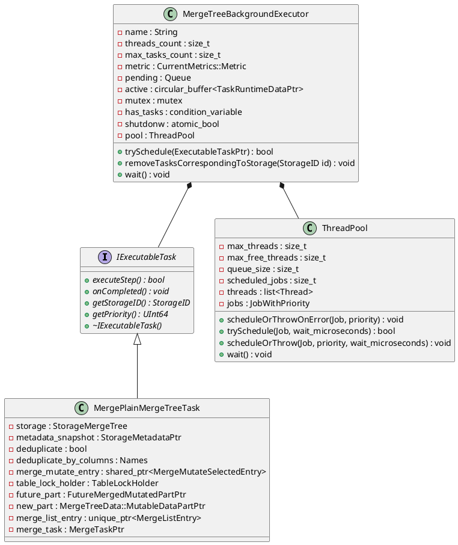
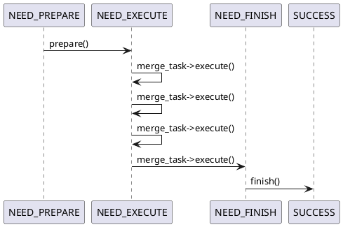
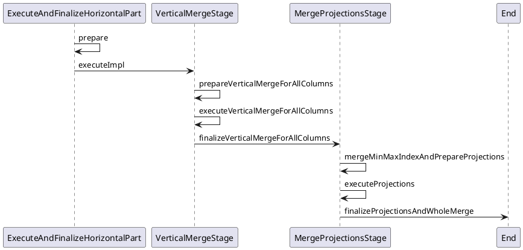

MergeTreeData 所处的位置：

```plantuml
abstract class IStorage

IStorage <-- MergeTreeData

abstract class MergeTreeData

MergeTreeData <-- StorageMergeTree
MergeTreeData <-- StorageReplicatedMergeTree
MergeTreeData <-- StorageShareDiskMergeTree
```

数据成员（Merge相关）：
```plantuml
abstract class MergeTreeData {
    - relative_data_path : String
    - data_parts_mutex : mutex
    - data_parts_indexes : DataPartsIndexes
    - background_operations_assignee : BackgroundJobsAssignee
    ...
}

MergeTreeData *-- BackgroundJobsAssignee

class BackgroundJobsAssignee {
    + BackgroundJobsAssignee(MergeTreeData&, Type, ContexPtr)
    - data : MergeTreeData&
    - holder : BackgroundSchedulePool::TaskHolder
    + start() : void
    + trigger() : void
    + postpone() : void
    + finish() : void
    - threadFunc() : void
}
```

MergeTreeData 的 contructor 中构造 BackgroundJobsAssignee 对象。

后台任务的启动流程：
```c++
BackgroundJobsAssignee(MergeTreeData & data_, Type type, ContextPtr global_context_)
    : ..., data(data_), ... {}

MergeTreeData::MergeTreeData(
    const StorageID & table_id_,
    ...)
    : ...
    , ...
    , background_operations_assignee(*this, BackgroundJobsAssignee::Type::DataProcessing, getContext())
    ...)
{
    ...
}

StorageMergeTree(
    const StorageID & table_id_,
    ...
    ) : MergeTreeData(
        table_id_,
        ...
    )
)

StorageMergeTree::startup()
{
    ...
    background_operations_assignee.start();
    ...
}

void BackgroundJobsAssignee::start()
{
    std::lock_guard lock(holder_mutex);
    if (!holder)
        holder = getContext()->getSchedulePool().createTask("BackgroundJobsAssignee:" + toString(type), [this]{ threadFunc(); });

    holder->activateAndSchedule();
}
```
也就是说，在StorageMergeTree 对象的 start 方法中，在 schedule pool 创建一个 task，该 task 执行的是`BackgroundJobsAssignee::threadFunc()` 方法，
```c++
void BackgroundJobsAssignee::threadFunc()
{
    try
    {
        bool succeed = false;
        switch (type)
        {
            case Type::DataProcessing:
                succeed = data.scheduleDataProcessingJob(*this);
                break;
            case Type::Moving:
                succeed = data.scheduleDataMovingJob(*this);
                break;
        }

        if (!succeed)
            postpone();
    }
    catch (...) /// Catch any exception to avoid thread termination.
    {
        tryLogCurrentException(__PRETTY_FUNCTION__);
        postpone();
    }
}
```
最终执行的是`StorageMergeTree::scheduleDataProcessingJob(BackgroundJobAssignee&)`。

```c++
bool StorageMergeTree::scheduleDataProcessingJob(BackgroundJobsAssignee & assignee)
{
    ...
    auto metadata_snapshot = getInMemoryMetadataPtr();
    std::shared_ptr<MergeMutateSelectedEntry> merge_entry, mutate_entry;

    auto share_lock = lockForShare(RWLockImpl::NO_QUERY, getSettings()->lock_acquire_timeout_for_background_operations);

    ...

    bool has_mutations = false;
    {
        std::unique_lock lock(currently_processing_in_background_mutex);
        if (merger_mutator.merges_blocker.isCancelled())
            return false;

        merge_entry = selectPartsToMerge(metadata_snapshot, false, {}, false, nullptr, share_lock, lock);
        if (!merge_entry)
            mutate_entry = selectPartsToMutate(metadata_snapshot, nullptr, share_lock, lock, were_some_mutations_skipped);

        has_mutations = !current_mutations_by_version.empty();
    }

    if ((!mutate_entry && has_mutations) || were_some_mutations_skipped)
    {
        /// Notify in case of errors or if some mutation was skipped (because it has no effect on the part).
        /// TODO @azat: we can also spot some selection errors when `mutate_entry` is true.
        std::lock_guard lock(mutation_wait_mutex);
        mutation_wait_event.notify_all();
    }

    if (merge_entry)
    {
        auto task = std::make_shared<MergePlainMergeTreeTask>(*this, metadata_snapshot, false, Names{}, merge_entry, share_lock, common_assignee_trigger);
        assignee.scheduleMergeMutateTask(task);
        return true;
    }
}
```
```c++
void BackgroundJobsAssignee::scheduleMergeMutateTask(ExecutableTaskPtr merge_task)
{
    bool res = getContext()->getMergeMutateExecutor()->trySchedule(merge_task);
    res ? trigger() : postpone();
}
```
在前面的代码中，出现了两种创建 task 的方法：
1. `getContext()->getSchedulePool()->createTask()`;
2. `getContext()->getMergeMutateExecutor()->trySchedule()`


下面先分析一下Clickhouse中的任务调度机制
### ThreadPool, Thread, Executor, Task

Context 全局共享。

```plantuml
class Context
{
    ...
    - schedule_pool : BackgroundSchedulePool
    - distributed_schedule_pool : BackgroundSchedulePool
    ...
    - merge_mutate_executor : MergeMutateBackgroundExecutorPtr
    - moves_executor : OrdinaryBackgroundExecutorPtr 
    - fetch_executor : OrdinaryBackgroundExecutorPtr
    - common_executor : OrdinaryBackgroundExecutorPtr 
    ...    
}
```
BackgroundSchedulePool: 在某个时间点调度执行functions。基本上，所有的 tasks 都会被添加到一个 queue 中，然后被 worker threads 处理。典型的使用方式：在 BackgroundSchedulePool 中创建一个 task，当你确实需要执行该 task 时，再调用该 task 的 schedule 方法。

```plantuml
class BackgroundSchedulePool
{
    - size : size_t
    - threads : Threads
    - queue : Queue
    ...
    + createTask(log_name, function) : BackgroundSchedulePoolTaskHolder
}

BackgroundSchedulePool *-- BackgroundSchedulePoolTaskHolder

class BackgroundSchedulePoolTaskHolder
{
    - task_info : BackgroundSchedulePoolTaskInfo
}

BackgroundSchedulePoolTaskHolder *-- BackgroundSchedulePoolTaskInfo

class BackgroundSchedulePoolTaskInfo
{
    + schedule() : bool
    + scheduleAfter(size_t) : bool
    + deactivate() : void
    + activate() : void
    + activateAndSchedule() : bool
    - execute() : void
    - pool : BackgroundSchedulePool &
    - function : BackgroundSchedulePool::TaskFunc
    ...
}

BackgroundSchedulePoolTaskInfo *-- BackgroundSchedulePool
```
我们称 BackgroundSchedulePool 能够执行的 task 为 background task，还有一种 task 类型是 executable task，这类 task 由各种 Executor 执行。
从 MergeTree 的 Merge 过程我们可以简单对这两类 task 进行区分，background task 的任务是决定如何进行 merge，executable task 的任务是真正进行 merge 动作。

Executor



Executable task 是 Clickhouse 自己写的 coroutine，所有的后台操作都可以通过实现 `IExecutableTask` 来创建一个 task。每个 Task 都是 a sequence of steps, 较重的 task 需要更多的 steps，Executor 每次只调度 task 执行一个 step，这样可以实现不同 task 穿插执行。
对于 MergePlainMergeTreeTask 来说，其执行一共有四个阶段（stage）：

1. NEED_PREPARE
2. NEED_EXECUTE
3. NEED_FINISH
4. SUCCESS


NEED_PREPATE 阶段的主要任务是创建一个 MergeTask 对象。
NEED_EXECUTE 阶段每次都会调用 merge_task 的 execute 方法， 当该方法返回 true 时，Stage 不会更替，下次调度到当前 MergePlainMergeTreeTask 时还会执行 execute 方法，当该方法返回 false 时，表示 task 完成，需要进入下一个 stage。

对于 MergeTask 来说，其执行包含如下的 step，对应代码中的 MergeTask::IStage，**每个 step 还包含 subtask**，不同 step
包含的 subtask 数量不同，每次调用 `merge_task->execute()` 都会使 merge_task 在每个step的subtask间切换

在原先的设计中，一次Merge交给一个线程全程执行，现在将线程细分到coroutine之后，需要额外保存每个coroutine的执行上下文，确保coroutine切换回来再次执行的时候能够继续上次的状态。MergeTask::IStageRuntimeContext 用于完成该目标。

