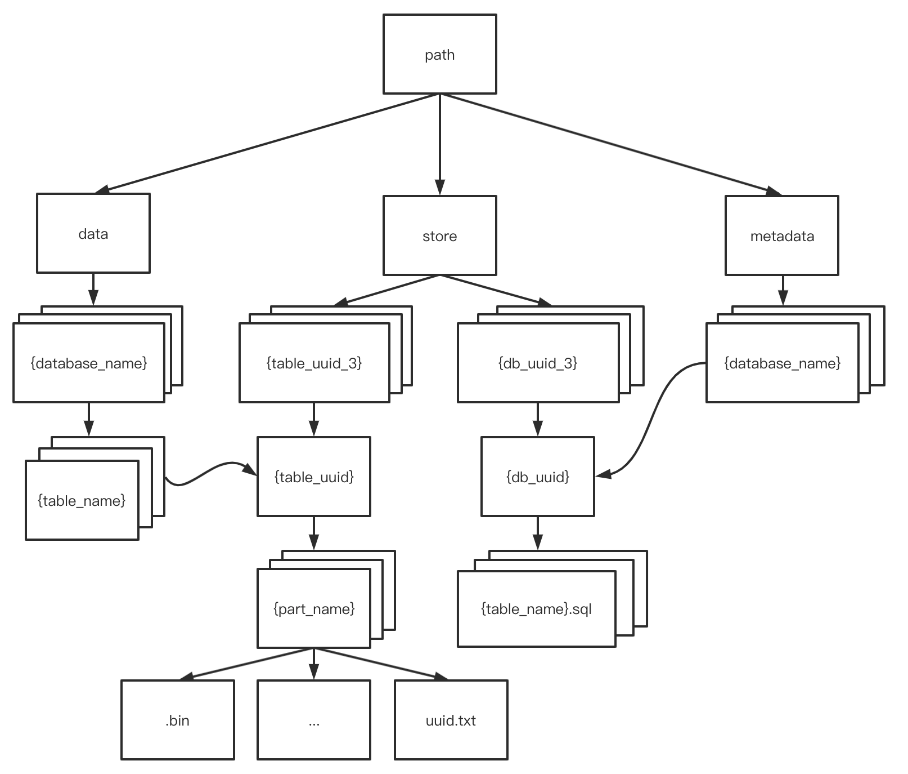

<!-- @import "[TOC]" {cmd="toc" depthFrom=1 depthTo=6 orderedList=false} -->

<!-- code_chunk_output -->

- [InterpreterCreateQuery](#interpretercreatequery)
- [CREATE DATABASE](#create-database)
- [CREATE TABLE](#create-table)
- [Start](#start)
  - [ATTACH DATABASE](#attach-database)

<!-- /code_chunk_output -->


<center>
  
</center>


## InterpreterCreateQuery
```c++
BlockIO InterpreterCreateQuery::execute()
{
    FunctionNameNormalizer().visit(query_ptr.get());
    auto & create = query_ptr->as<ASTCreateQuery &>();
    if (!create.cluster.empty())
    {
        prepareOnClusterQuery(create, getContext(), create.cluster);
        return executeDDLQueryOnCluster(query_ptr, getContext(), getRequiredAccess());
    }

    getContext()->checkAccess(getRequiredAccess());

    ASTQueryWithOutput::resetOutputASTIfExist(create);

    /// CREATE|ATTACH DATABASE
    if (!create.database.empty() && create.table.empty())
        return createDatabase(create);
    else
        return createTable(create);
}
```

## CREATE DATABASE


```c++
// DatabaseFactory.cpp
DatabasePtr DatabaseFactory::get(const ASTCreateQuery & create, const String & metadata_path, ContextPtr context)
{
    ...
    // 1
    fs:create_directories(fs::path(metadata_path).parent_path()); 
    ...
    // 2
    DatabasePtr impl = getImpl(create, metadata_path, context); 
    ...
    WriteBufferFromOwnString statement_buf;
    formatAST(create, statement_buf, false);
    writeChar('\n', statement_buf);
    String statement = statement_buf.str();

    /// Exclusive flag guarantees, that database is not created right now in another thread.
    // 3
    WriteBufferFromFile out(metadata_file_tmp_path, statement.size(), O_WRONLY | O_CREAT | O_EXCL); 
    writeString(statement, out);
    ...
    // 4
    DatabaseCatalog::instance().attachDatabase(database_name, database);
    ...
    // 5 
    renameNoReplace(metadata_file_tmp_path, metadata_file_path);
    // 6
    database->loadStoredObjects(getContext()->getGlobalContext(), has_force_restore_data_flag, create.attach && force_attach);

}
```
1. 创建 store/xxx
2. 构造 Database 对象，创建 metadata/database_name，以及软链接
```c++
DatabaseAtomic::DatabaseAtomic(String name_, String metadata_path_, UUID uuid, const String & logger_name, ContextPtr context_)
    : DatabaseOrdinary(name_, std::move(metadata_path_), "store/", logger_name, context_)
    , path_to_table_symlinks(fs::path(getContext()->getPath()) / "data" / escapeForFileName(name_) / "")
    , path_to_metadata_symlink(fs::path(getContext()->getPath()) / "metadata" / escapeForFileName(name_))
    , db_uuid(uuid)
{
    assert(db_uuid != UUIDHelpers::Nil);
    fs::create_directories(path_to_table_symlinks);
    tryCreateMetadataSymlink();
}
```
3. 创建 metadata/database_name.sql.tmp
4. attach database，作用是将 database 添加到内存中的DatabaseCatalog中
```c++
void DatabaseCatalog::attachDatabase(const String & database_name, const DatabasePtr & database)
{
    std::lock_guard lock{databases_mutex};
    assertDatabaseDoesntExistUnlocked(database_name);
    databases.emplace(database_name, database);
    UUID db_uuid = database->getUUID();
    if (db_uuid != UUIDHelpers::Nil)
        db_uuid_map.emplace(db_uuid, database);
}
```
5. rename .sql.tmp to .sql
6. load table (重启的时候有用)

## CREATE TABLE
```c++
bool InterpreterCreateQuery::doCreateTable(ASTCreateQuery & create,
                                           const InterpreterCreateQuery::TableProperties & properties)
{
    ...
    // 1
    // "store/a99/a993f3e9-0949-4c28-a993-f3e90949ac28/"
    data_path = database->getTableDataPath(create);
    ...
    StoragePtr res;
    ...
    // 2
    res = StorageFactory::instance().get(create,
            data_path,
            getContext(),
            getContext()->getGlobalContext(),
            properties.columns,
            properties.constraints,
            false);
    ...
    // 3
    database->createTable(getContext(), create.table, res, query_ptr);
    ...
    // 4
    res->startup();
    return true;
}
```
1. 为 table 创建一个 data path
2. 创建 MergeTrerData 对象
3. 创建 table_name.sql，将 table 添加到内存的 database 中

```c++
void DatabaseOnDisk::createTable(
    ContextPtr local_context,
    const String & table_name,
    const StoragePtr & table,
    const ASTPtr & query)
{
    ...
    // 3.1 
    // "/private/tmp/clickhouse/rep1/store/ccc/ccca3a52-1f7b-4cff-8cca-3a521f7bdcff/startDebugTable.sql"
    String table_metadata_path = getObjectMetadataPath(table_name);
    ...
    String statement;
    {
        // ATTACH TABLE _ UUID 'xxxyyyy-'
        statement = getObjectDefinitionFromCreateQuery(query);

        /// Exclusive flags guarantees, that table is not created right now in another thread. Otherwise, exception will be thrown.
        WriteBufferFromFile out(table_metadata_tmp_path, statement.size(), O_WRONLY | O_CREAT | O_EXCL);
        writeString(statement, out);
        out.next();
        if (settings.fsync_metadata)
            out.sync();
        out.close();
    }
    // 3.2 
    commitCreateTable(create, table, table_metadata_tmp_path, table_metadata_path, local_context);
    ...
}
```
3.1 table_metadata_path 就是持久化 table_name.sql 的位置，在 store/{database_uid_3}/{database_uid}/{table_name}.sql 
3.2 将 table 添加到内存的 database 中
```c++
void DatabaseWithOwnTablesBase::attachTable(const String & table_name, const StoragePtr & table, const String &)
{
    std::unique_lock lock(mutex);
    attachTableUnlocked(table_name, table, lock);
}
```
4. 启动 table 相关的后台线程


## Start

```bash

default        default.sql    startDebug     startDebug.sql
system         system.sql
```
启动的时候首先遍历 metadata/ 下保存的所有 database_name.sql，然后依此 loadDatabase
```c++
// loadMetadata.cpp
void loadMetadata(ContextMutablePtr context, const String & default_database_name)
{
    // "/tmp/clickhouse/rep1/metadata"
    String path = context->getPath() + "metadata";

    std::map<String, String> databases;
    for (fs::directory_iterator it(path); it != dir_end; ++it)
    {
        if (it->is_symlink())
            continue;
        ...
        if (fs::path(current_file).extension() == ".sql")
        {
            String db_name = fs::path(current_file).stem();
            if (db_name != DatabaseCatalog::SYSTEM_DATABASE)
                databases.emplace(unescapeForFileName(db_name), fs::path(path) / db_name);
        }
        ...
    }

    for (const auto & [name, db_path] : databases)
        loadDatabase(context, name, db_path, has_force_restore_data_flag);

    ...
}
```
加载 database 在内存中的操作与 create database 的过程相似，但是此时 .sql 中的语句已经被改成
```sql
ATTACH DATABASE _ UUID "xxxxx"
ENGINE = Atomic
```
这样的形式，所以 InterpreterCreateQuery 将会走 ATTACH DATABASE 的分支
 
```c++
// loadMetadata.cpp
static void loadDatabase(
    ContextMutablePtr context,
    const String & database,
    const String & database_path,
    bool force_restore_data)
{
    String database_attach_query;
    String database_metadata_file = database_path + ".sql";

    if (fs::exists(fs::path(database_metadata_file)))
    {
        /// There is .sql file with database creation statement.
        ReadBufferFromFile in(database_metadata_file, 1024);
        readStringUntilEOF(database_attach_query, in);
    }
    ...

    try
    {
        executeCreateQuery(database_attach_query, context, database, database_metadata_file, force_restore_data);
    }
}
```
### ATTACH DATABASE
在
```c++
BlockIO InterpreterCreateQuery::createDatabase(ASTCreateQuery & create)
{
    ...
    metadata_path = metadata_path / "store" / DatabaseCatalog::getPathForUUID(create.uuid);

    try
    {
        DatabaseCatalog::instance().attachDatabase(database_name, database);
        ...
    }

}
```
```c++
void DatabaseAtomic::loadStoredObjects(ContextMutablePtr local_context, bool has_force_restore_data_flag, bool force_attach)
{
    ...
    DatabaseOrdinary::loadStoredObjects(local_context, has_force_restore_data_flag, force_attach);
    ...
}

void DatabaseOrdinary::loadStoredObjects(ContextMutablePtr local_context, bool has_force_restore_data_flag, bool /*force_attach*/)
{
    ...
    iterateMetadataFiles(local_context, process_metadata);
    ...
    /// file_names: ["startDebugTable.sql"]
    /// Attach tables.
    for (const auto & name_with_query : file_names)
    {
        const auto & create_query = name_with_query.second->as<const ASTCreateQuery &>();

        if (!create_query.is_dictionary)
        {
            pool.scheduleOrThrowOnError([&]()
            {
                tryAttachTable(
                    local_context,
                    create_query,
                    *this,
                    database_name,
                    getMetadataPath() + name_with_query.first,
                    has_force_restore_data_flag);

                /// Messages, so that it's not boring to wait for the server to load for a long time.
                logAboutProgress(log, ++tables_processed, total_tables, watch);
            });
        }
    }
    startupTables(pool);
}
```