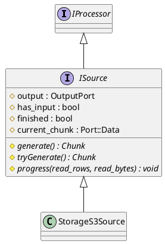

[TOC]

CREATE TABLE skip_table
(
  my_key UInt64,
  my_value UInt64
)
ENGINE MergeTree primary key my_key
SETTINGS index_granularity=8192;

INSERT INTO skip_table SELECT number, intDiv(number,4096) FROM numbers(100000000);


# Pipeline
```c++
  executeQuery::executeQueryImpl
  {
    res = InterpereterSelectQuery::execute()
    {
      QueryPlan::buildQueryPipeline(...)
      {
        ...
        IQueryPlanStep::updatePipeline(std::move(frame.pipelines), build_pipeline_settings)
        {
          ...
          initializePipeline(*pipeline, settings);
          processors.insert(processors.end(), added_processors.begin(), added_processors.end());
          ...
        }
        ...
      }

    }

  }

void TCPHandler::runImpl()
{
  ...

  state.io = executeQuery(state.query, query_context, false, state.stage);  /// 创建QueryPlan，创建物理执行计划

  ...

  if (state.io.pipeline.pushing())
  /// FIXME: check explicitly that insert query suggests to receive data via native protocol,
  {
      state.need_receive_data_for_insert = true;
      processInsertQuery();
  }
  else if (state.io.pipeline.pulling())
  {
      processOrdinaryQueryWithProcessors();
  }
  ...
}

TCPHandler::processOrdinaryQueryWithProcessors()
{
  auto & pipeline = state.io.pipeline;

  ...

  {
    PullingAsyncPipelineExecutor executor(pipeline);
    
    ...

    while (executor.pull(block, interactive_delay / 1000))
    {
      ...
    }
  }
}

bool PullingAsyncPipelineExecutor::pull(Chunk &)
{
  if (!data)
  {
    data = std::make_unique<Data>();
    data->executor = std::make_shared<PipelineExecutor>(pipeline.processors, pipeline.process_list_element);
    ...
    auto func = [&, thread_group = CurrentThread::getGroup()]()
    {
        threadFunction(*data, thread_group, pipeline.getNumThreads());
    };

    data->thread = ThreadFromGlobalPool(std::move(func));
  }
}

static void threadFunction(PullingAsyncPipelineExecutor::Data & data, ThreadGroupStatusPtr thread_group, size_t num_threads)
{
    setThreadName("QueryPullPipeEx");

    try
    {
        if (thread_group)
            CurrentThread::attachTo(thread_group);

        data.executor->execute(num_threads);  /// NOTE
    }
    catch (...)
    {
        data.exception = std::current_exception();
        data.has_exception = true;

        /// Finish lazy format in case of exception. Otherwise thread.join() may hung.
        if (data.lazy_format)
            data.lazy_format->finalize();
    }

    data.is_finished = true;
    data.finish_event.set();
}

```c++
/// Execute pipeline in multiple threads. Must be called once.
/// In case of exception during execution throws any occurred.
void PipelineExecutor::execute(size_t num_threads)
{
    checkTimeLimit();
    if (num_threads < 1)
        num_threads = 1;

    try
    {
        executeImpl(num_threads);

        /// Execution can be stopped because of exception. Check and rethrow if any.
        for (auto & node : graph->nodes)
            if (node->exception)
                std::rethrow_exception(node->exception);

        /// Exception which happened in executing thread, but not at processor.
        tasks.rethrowFirstThreadException();
    }
    catch (...)
    {
#ifndef NDEBUG
        LOG_TRACE(log, "Exception while executing query. Current state:\n{}", dumpPipeline());
#endif
        throw;
    }

    finalizeExecution();
}

void PipelineExecutor::executeImpl(size_t num_threads)
{
    initializeExecution(num_threads);

    bool finished_flag = false;

    SCOPE_EXIT_SAFE(
        if (!finished_flag)
        {
            finish();
            joinThreads();
        }
    );

    if (num_threads > 1)
    {
        spawnThreads(); // start at least one thread
        tasks.processAsyncTasks();
        joinThreads();
    }
    else
    {
        auto slot = slots->tryAcquire();
        executeSingleThread(0);
    }

    finished_flag = true;
}
```
```plantuml
@startuml
class PipelineExecutor {
  - graph : ExecutingGraph
  - tasks : ExecutorTasks
  - threads : std::vector<ThreadFromGlobalPool>
}

class Pipe {
  - header : Block
  - Processors : Processors
  - output_ports : OutputPortRawPtrs
  - max_parallel_streams : size_t
}

PipelineExecutor *-- ExecutorTasks

class ExecutorTasks {
  - executor_contexts : vector<ExecutionThreadContext>
  - task_queue : TaskQueue<ExecutingGraph>
  - threads_queue : ThreadsQueue
  + finish() : void
  + isFinished() : bool
  + pushTasks(queue &, async_queue, context) : void
  + init(num_threads, use_threads_, ...) : void
}


ExecutorTasks *-- ExecutionThreadContext

class ExecutionThreadContext {·
  - node : ExecutingGraph:Node *
  + executeTask() : bool

}
@enduml
```

```c++
ExecutionThreadContext::executeTask()
{
  ...
  executeJob(node, read_progress_callback);
  ...
}
```

最终执行 IProcessorWork::work
大部分SCAN算子都是继承实现 ISource 接口。
