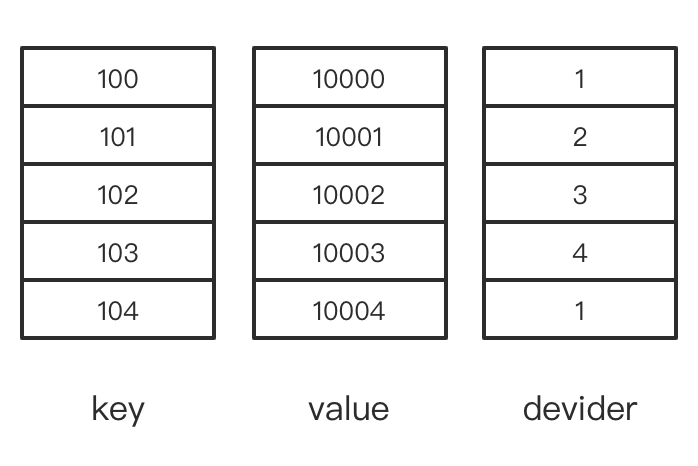
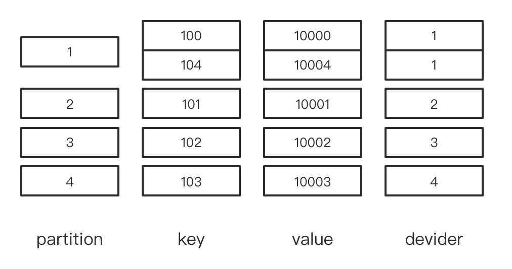

[TOC]
### TODO
- 标记Mutation的Block number为何与Insert的Block number在一个序列中；
- MergeTreeData::renameTempPartAndReplace 需要详细分析其中的冲突检测逻辑

## MergeTree
### MergeTreeBlockOutputStream::write
分析一个函数 MergeTreeBlockOutputStream::write(const Block & block)

数据样本：
```sql    
CREATE TABLE test_table(key Int64, value Int64, devider Int64) ENGINE=MergeTree ORDER BY key PARTITION BY devider

INSERT INTO TABLE test_table VALUES (100, 10000, 1),(101, 10001, 2),(102, 10002, 3),(103, 10003, 4),(104, 10004, 1)
```

对于我们的输入样本，实参的 block 将会长这样（抽象）：

  
```c++
auto part_blocks = storage.writer.splitBlockIntoParts(block, max_parts_per_block, metadata_snapshot);
```
part_blocks 是一个数组，每个元素是一个 partition + block 的组合，按照我们的输入一共有 4 个不同的 partition，因此 part_blocks 将会包含 4 个元素
  

下一步动作是循环将每个 partitionAndBlock 写入磁盘。单就一次写入来说，有多少个 partition 就会产生多少个 part 文件。
```c++
for (auto & current_block : part_blocks)
    {
        Stopwatch watch;

        MergeTreeData::MutableDataPartPtr part = storage.writer.writeTempPart(current_block, metadata_snapshot, optimize_on_insert);

        /// If optimize_on_insert setting is true, current_block could become empty after merge
        /// and we didn't create part.
        if (!part)
            continue;

        /// Part can be deduplicated, so increment counters and add to part log only if it's really added
        if (storage.renameTempPartAndAdd(part, &storage.increment, nullptr, storage.getDeduplicationLog()))
        {
            PartLog::addNewPart(storage.getContext(), part, watch.elapsed());

            /// Initiate async merge - it will be done if it's good time for merge and if there are space in 'background_pool'.
            storage.background_executor.triggerTask();
        }
    }
```
写入动作分为两步，首先`writeTempPart`创建目录`temp_insert_1_1_1_0`，然后`renameTempPartAndAdd`将其重命名为`1_1_1_0`。
#### StorageMergeTree::MergeTreeDataWriter::writeTempPart
```c++
MergeTreePartInfo new_part_info(partition.getID(metadata_snapshot->getPartitionKey().sample_block), temp_index, temp_index, 0);
...
part_name = new_part_info.getPartName();    // 1_5_5_0
```
后续到真正把part写入磁盘之前都是在内存中初始化 new_data_part，比如各种`*MergeTree`的自定义合并策略是在这一阶段完成的：
```c++
if (optimize_on_insert)
    block = mergeBlock(block, sort_description, partition_key_columns, perm_ptr);
```

这些步骤完成后，真正将 part 加入到代表这张表的内存对象中：
```c++
auto new_data_part = data.createPart(
    part_name,
    data.choosePartType(expected_size, block.rows()),
    new_part_info,
    createVolumeFromReservation(reservation, volume),
    TMP_PREFIX + part_name);
```


然后开始写入磁盘
```c++
if (new_data_part->isStoredOnDisk())
{
    /// The name could be non-unique in case of stale files from previous runs.
    String full_path = new_data_part->getFullRelativePath();

    if (new_data_part->volume->getDisk()->exists(full_path))
    {
        LOG_WARNING(log, "Removing old temporary directory {}", fullPath(new_data_part->volume->getDisk(), full_path));
        new_data_part->volume->getDisk()->removeRecursive(full_path);
    }

    const auto disk = new_data_part->volume->getDisk();
    disk->createDirectories(full_path);

    if (data.getSettings()->fsync_part_directory)
        sync_guard = disk->getDirectorySyncGuard(full_path);
}
```
这里的 full_path 是`store/e48/e482171d-25db-4c80-87dc-ba3b25298d38/tmp_insert_1_1_1_0/`，检查一下对应的磁盘目录
```bash
➜  e482171d-25db-4c80-87dc-ba3b25298d38 ls -ls
total 8
0 drwxr-x---  2 hzq  wheel  64 Sep 17 10:14 detached
8 -rw-r-----  1 hzq  wheel   1 Sep 17 10:14 format_version.txt
0 drwxr-x---  2 hzq  wheel  64 Sep 17 10:24 tmp_insert_1_1_1_0

➜  e482171d-25db-4c80-87dc-ba3b25298d38 cd tmp_insert_1_1_1_0
➜  tmp_insert_1_1_1_0 ls -lh
```

到这里只是创建了目录，还未写入内容。
```c++
MergedBlockOutputStream out(new_data_part, metadata_snapshot, columns, index_factory.getMany(metadata_snapshot->getSecondaryIndices()), compression_codec);

out.writePrefix();
out.writeWithPermutation(block, perm_ptr);
out.writeSuffixAndFinalizePart(new_data_part, sync_on_insert);
```
类`MergedBlockOutputStream`用于完成对一个 part 的磁盘写入，其写入也是分为两步，第一步通过 `MergeTreeDataPartWriter::finish`完成 bin 文件、mrk文件以及主键的索引文件写入
```bash
➜  tmp_insert_1_1_1_0 ls -lh
total 24
-rw-r-----  1 hzq  wheel   118B Sep 17 10:36 data.bin
-rw-r-----  1 hzq  wheel   112B Sep 17 10:36 data.mrk3
-rw-r-----  1 hzq  wheel    16B Sep 17 10:36 primary.idx
```
然后通过`finalizePartOnDisk(new_part, part_columns, checksums, sync)`完成其余元信息的写入
```bash
➜  tmp_insert_1_1_1_0 ls -lh
total 72
-rw-r-----  1 hzq  wheel   253B Sep 17 10:37 checksums.txt
-rw-r-----  1 hzq  wheel    79B Sep 17 10:37 columns.txt
-rw-r-----  1 hzq  wheel     1B Sep 17 10:37 count.txt
-rw-r-----  1 hzq  wheel   118B Sep 17 10:36 data.bin
-rw-r-----  1 hzq  wheel   112B Sep 17 10:36 data.mrk3
-rw-r-----  1 hzq  wheel    10B Sep 17 10:37 default_compression_codec.txt
-rw-r-----  1 hzq  wheel    16B Sep 17 10:37 minmax_devider.idx
-rw-r-----  1 hzq  wheel     8B Sep 17 10:37 partition.dat
-rw-r-----  1 hzq  wheel    16B Sep 17 10:36 primary.idx
```
#### MergeTreeData::renameTempPartAndReplace
TODO:需要详细分析其中的冲突检测逻辑

每次写入的 part 具有相同的 min_block 和 max_block，这里的 block 感觉实际上是标记 table 的写入次数
```c++
part_info.min_block = part_info.max_block = increment->get();
```

#### Summary
我们重新从整体来回顾一下写入过程，对于目标是 MergeTree Engine 的一条 INSERT 语句，经过层层调用最终会执行到 `MergeTreeBlockOutputStream::write`，该方法首先将 Block 分割为 Parts，然后遍历 PartitionsWithBlock，在`MergeTreeDataWriter::writeTempPart`函数中通过构造`MergedBlockOutputStream`对象完成一个 Part 的写入。

每个新写入的 Part 名称为 `PartitionID_MinBlock_MaxBlock_Level`，尤其需要注意的是，此时 MinBlock 与 MaxBlock 一定是相等的。这里命名为 Block 个人感觉容易产生误解，因为该值实际上是 Table 内所有 Partition 共享的一个递增计数器，与每次写入的数据行数、大小无关，每次写入产生一个 part 就会使这个 ID + 1，所以这里 MinBlock 与 MaxBlcok 实际上代表的是当前 part 中的数据是由哪个“稀疏”写入范围产生的，这里加“稀疏”的意义可以通过如下例子明白：
```sql
INSERT INTO TABLE test_table VALUES(1,1,1), (2,2,2)
```
本次写入将会产生如下的 part：`1_1_1_0, 2_2_2_0`，然后我们再次写入
```sql
INSERT INTO TABLE test_table VALUES(3,3,1), (4,4,2)
```
新的 part：`1_3_3_0, 2_4_4_0`，这样的经过一次合并（准确说是两次，因为一次合并只会选择一个partition进行合并），我们会得到这样两个 part：`1_1_3_1, 2_2_4_1`。

所以合并得到新 part 的 MinBlock 与 MaxBlock 并不表示该 part 由 MinBlock 到 MaxBlock 之间的所有 part 合并得到！而是表示一个稀疏范围！这一点在不涉及到 ReplicatedMergeTree 时，不会有什么大的影响，因为不会影响到合并：`1_1_1_0`照样可以与`1_3_3_0`合并，但是在 ReplicatedMergeTree 下，缺少的 `1_2_2_0` 就很麻烦了，因为你不知道缺少的 part 是真的没有还是被写到了另一个 replicate 上，具体处理逻辑我们在介绍到 ReplicatedMergeTree 时做分析。

### Mutation


## ReplicatedMergeTree
### ReplicatedMergeTreeBlockOutputStream::write

writeTempPart -> commitPart，没有执行 renameAndReplace


