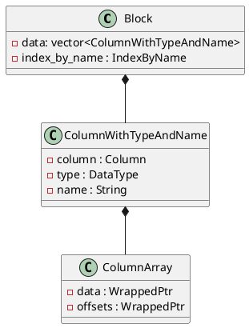

[TOC]


## Clickhouse Array 

```cpp
class IColumn : public COW<IColumn>
{
public:
    using Offsets = PaddedPODArray<Offset>
...
}

class ColumnArray final : public COWHelper<IColumn, ColumnArray>
{
public:
    IColumn & getOffsetsColumn() { return *offsets; }
    const IColumn & getOffsetsColumn() const { return *offsets; }

    Offsets & ALWAYS_INLINE getOffsets()
    {
        return assert_cast<ColumnOffsets &>(*offsets).getData();
    }

    const Offsets & ALWAYS_INLINE getOffsets() const
    {
        return assert_cast<const ColumnOffsets &>(*offsets).getData();
    }

private:
    WrappedPtr offsets;
};
```
#### Scatter 操作
遍历当前列的每一行，按照某个规则将每一行都 scatter(散射) 到 `vector<IColumn::MutablePtr>` 的某一个位置。
比如举个例子，有一个列中的元素都为整数，内容是这样的一个向量
```txt
[1,2,3,4,5,6,7,8,9,10]
```
现在希望将这个列的元素按照某个规则进行重新分类，得到一个 `vector<IColumn::MutablePtr>`，结果的第一个列中只包含原始列中小于5的行，第二个列中只包含大于等于5的偶数，第三个列是大于等于5的奇数。

为了实现我们的目的，我们需要一个 selector 数组，对原始 column 使用 selector 进行 scatter 之后，我们可以得到我们想要的结果如下：
```
array   selector    result[0]   result[1]   result[2]
1       0           1           6           5
2       0           2           8           7
3       0           3           10          9
4       0           4
5       2           
6       1           
7       2
8       1
9       2
10      1
```

```cpp
using ColumnIndex = UInt64;
using Selector = PaddedPODArray<ColumnIndex>;

template <typename Derived>
std::vector<IColumn::MutablePtr> IColumn::scatterImpl(ColumnIndex num_columns,
                                             const Selector & selector) const
{
    size_t num_rows = size();

    if (num_rows != selector.size())
        throw Exception(...);
    
    std::vector<MutablePtr> columns(num_columns);
    for (auto & column : columns)
        column = cloneEmpty();

    {
        size_t reserve_size = static_cast<size_t>(num_rows * 1.1 / num_columns);    /// 1.1 is just a guess. Better to use n-sigma rule.

        if (reserve_size > 1)
            for (auto & column : columns)
                column->reserve(reserve_size);
    }

    for (size_t i = 0; i < num_rows; ++i)
        static_cast<Derived &>(*columns[].insertFrom(*this, i));

    return columns;
}
```
scatter 的核心操作就是这一行：
```cpp
for (size_t i = 0; i < num_rows; ++i)
    static_cast<Derived &>(*columns[selector[i]].insertFrom(*this, i));
```


#### Permute
```cpp
/// Permutes elements using specified permutation. Is used in sorting.
/// limit - if it isn't 0, puts only first limit elements in the result.
using Permutation = PaddedPODArray<size_t>;
[[nodiscard]] virtual Ptr permute(const Permutation & perm, size_t limit) const = 0;

ColumnPtr ColumnArray::permute(const Permutation & perm, size_t limit) const
{
    return permuteImpl(*this, perm, limit);
}

template <typename Column>
ColumnPtr permuteImpl(const Column & column, const IColumn::Permutation & perm, size_t limit)
{
    limit = getLimitForPermutation(column.size(), perm.size(), limit);
    return column.indexImpl(perm, limit);
}

template <typename T>
ColumnPtr ColumnArray::indexImpl(const PaddedPODArray<T> & indexes, size_t limit) const
{
    assert(limit <= indexes.size());
    if (limit == 0)
        return ColumnArray::create(data->cloneEmpty());

    /// Convert indexes to UInt64 in case of overflow.
    auto nested_indexes_column = ColumnUInt64::create();
    PaddedPODArray<UInt64> & nested_indexes = nested_indexes_column->getData();
    nested_indexes.reserve(getOffsets().back());

    auto res = ColumnArray::create(data->cloneEmpty());

    Offsets & res_offsets = res->getOffsets();
    res_offsets.resize(limit);
    size_t current_offset = 0;

    for (size_t i = 0; i < limit; ++i)
    {
        for (size_t j = 0; j < sizeAt(indexes[i]); ++j)
            nested_indexes.push_back(offsetAt(indexes[i]) + j);
        current_offset += sizeAt(indexes[i]);
        res_offsets[i] = current_offset;
    }

    if (current_offset != 0)
        res->data = data->index(*nested_indexes_column, current_offset);

    return res;
}
```


### Array 的内存表示

array 类型对应的内存中的类型为 ColumnArray，该类型包含两个数组，一个 data 数组顺序保存该 array 所有的 element，这个数组是连续的，另一个 offset 数组保存每个 array 在 ColumnArray 中的起始位置，以下面的 sql 为例，
```sql
create table arrayTest(key Int8,  arr Array(Int8)) engine=MergeTree() order by key;

insert into table arrayTest values (1, [1,2,3,4]),(2,[5,6,7,8]),(3,[9,10])
```
对应 ColumnArray 的内存分布类似下图：
```txt
data:   [1,2,3,4,5,6,7,8,9,10]
offset: [4,8,10]
```
观察 `ColumnArray::getDataAt(size_t n)` 的实现以更好的理解：
```c++
StringRef ColumnArray::getDataAt(size_t n) const
{
    assert(n < size());

    /** Returns the range of memory that covers all elements of the array.
      * Works for arrays of fixed length values.
      */

    /// We are using pointer arithmetic on the addresses of the array elements.
    if (!data->isFixedAndContiguous())
        throw Exception(ErrorCodes::NOT_IMPLEMENTED, "Method getDataAt is not supported for {}", getName());

    size_t array_size = sizeAt(n);
    if (array_size == 0)
        return StringRef(nullptr, 0);

    size_t offset_of_first_elem = offsetAt(n);
    StringRef first = getData().getDataAt(offset_of_first_elem);

    return StringRef(first.data, first.size * array_size);
}
size_t ALWAYS_INLINE offsetAt(ssize_t i) const { return getOffsets()[i - 1]; }
size_t ALWAYS_INLINE sizeAt(ssize_t i) const { return getOffsets()[i] - getOffsets()[i - 1]; }
```
`offsetAt(n)`的计算利用了 PODArray 的一个特性：在 -1 的位置填充默认值，对于 ColumeOffset 这个默认值为 0。所以`sizeAt(0)`的结果就是`4-0=4`。

所以当我们想要获取第一个数组的起始offset时，`offsetAt(0) == getOffsets()[-1]`，结果为 0。

对前面的ColumnArray每个元素执行一次`getDataAt`将会对应下面的结果：
```c++
MutableColumnPtr ColumnArray::cloneResized(size_t to_size) const
{
    auto res = ColumnArray::create(getData().cloneEmpty());

    if (to_size == 0)
        return res;
    
    size_t from_size = size();

    if (to_size <= from_size)
}
```

#### Block


### Higher-order function for arrays
高阶函数：functional argument 必须是一个 lambda 函数。
高阶函数 apply a map(transform) to array (or multiple arrays of identical size) by lambda function. and return some result bases on that transformation.
#### lambda 函数

lambda 函数：以箭头为标志，左边是一组 formal parameters，右边是一个可以使用这些 formal parameters 的表达式
```
x -> 2 * x
str -> str != Referer
```
以上是 lambda 函数的基础概念。


### arrayMap 是怎么执行的

```sql
select arrayMap(x -> (x + 2), arr) from arrayTest;
```
InterperterFactory 构造一个 InterpreterSelectQuery 对象。
在 InterpreterSelectQuery 的构造函数中，通过对 AST 进行分析，完成 Logical Plan 的构造，包括基于规则的查询优化都是在构造函数期间完成的。关于 Logical Plan 的构造这里不介绍，我们主要关注高阶函数在这其中牵涉到的地方。

在构造 Logical Plan 的时候我们需要知道每个 Plan Node 的输入与输出，所以这里会解析 arrayMap 这个 higher-order function 的 schema 信息。这一步是在 `InterpreterSelectQuery::getSampleBlockImpl()` 中进行的
```c++
InterpreterSelectQuery::getSampleBlockImpl()
{
    ...
    analysis_result = ExpressionAnalysisResult(*query_analyzer, metadata_snapshot, ...);
    ...
}

ExpressionAnalysisResult::ExpressionAnalysisResult(...)
{
    ...
    ExpressionActionsChain chain(context);
    ...
    query_analyzer.appendSelect(chain, ...);
    ...
}

void SelectQueryExpressionAnalyzer::appendSelect(
    ExpressionActionsChain & chain, bool only_types)
{
    ...
    getRootActions(select_query->select(), only_types, step.actions());
    ...
}

void ExpressionAnalyzer::getRootActions(const ASTPtr & ast, bool no_subqueries, ActionsDAGPtr & actions, bool only_consts)
{
    LogAST log;
    ActionsVisitor::Data visitor_data(getContext(), settings.size_limits_for_set, subquery_depth,
                                   sourceColumns(), std::move(actions), prepared_sets, subqueries_for_sets,
                                   no_subqueries, false, only_consts, !isRemoteStorage());
    ActionsVisitor(visitor_data, log.stream()).visit(ast);
    actions = visitor_data.getActions();
}

template <typename Matcher, bool _top_to_bottom, bool need_child_accept_data = false, typename T = ASTPtr>
class InDepthNodeVisitor
{
public:
    ...
    void visit(T & ast)
    {
        DumpASTNode dump(*ast, ostr, visit_depth, typeid(Matcher).name());

        if constexpr (!_top_to_bottom)
            visitChildren(ast);

        try
        {
            Matcher::visit(ast, data);
        }
        catch (Exception & e)
        {
            e.addMessage("While processing {}", ast->formatForErrorMessage());
            throw;
        }

        if constexpr (_top_to_bottom)
            visitChildren(ast);
    }
    ...
}
```
`InDepthNodeVisitor`是一个模板类，在我们的例子中，用来实例化该类的Matcher为`ActionMatcher`
```c++
void ActionsMatcher::visit(const ASTPtr & ast, Data & data)
{
    ...
    else if (const auto * node = ast->as<ASTFunction>())
        visit(*node, ast, data);
    ...
}

void ActionsMatcher::visit(const ASTFunction & node, const ASTPtr & ast, Data & data)
{
    ...
    /// 如果目标函数没有在 FunctionFactory 注册，这里会抛出异常
    function_builder = FunctionFactory::instance().get(node.name, data.getContext());
    ...
    /// arrayMap 有两个 child node
    if (node.arguments)
    {
        size_t num_arguments = node.arguments->children.size();
        for (size_t arg = 0; arg < num_arguments; ++arg)
        {
            auto & child = node.arguments->children[arg];

            const auto * function = child->as<ASTFunction>();
            const auto * identifier = child->as<ASTTableIdentifier>();
            /// arrayMap 的第一个参数为 lambda 表达式
            if (function && function->name == "lambda")
            {
                if (function->arguments->children.size() != 2)
                    throw Exception("lambda requires two arguments", ErrorCodes::NUMBER_OF_ARGUMENTS_DOESNT_MATCH);

                const auto * lambda_args_tuple = function->arguments->children.at(0)->as<ASTFunction>();

                if (!lambda_args_tuple || lambda_args_tuple->name != "tuple")
                    throw Exception("First argument of lambda must be a tuple", ErrorCodes::TYPE_MISMATCH);

                has_lambda_arguments = true;
                argument_types.emplace_back(std::make_shared<DataTypeFunction>(DataTypes(lambda_args_tuple->arguments->children.size())));
                /// Select the name in the next cycle.
                argument_names.emplace_back();
            }
            ...
            /// 第二个参数为一个标识符
            else   
            {
                /// If the argument is not a lambda expression, call it recursively and find out its type.
                visit(child, data);

                if (auto name_type = getNameAndTypeFromAST(child, data))
                {
                    argument_types.push_back(name_type->type);
                    argument_names.push_back(name_type->name);
                }
                else
                    arguments_present = false;
            }
    }
    ...
    if (has_lambda_arguments && !data.only_consts)
    {
        function_builder->getLambdaArgumentTypes(argument_types);
        /// Call recursively for lambda expressions.
        for (size_t i = 0; i < node.arguments->children.size(); ++i)
        {
            ASTPtr child = node.arguments->children[i];

            const auto * lambda = child->as<ASTFunction>();
            if (lambda && lambda->name == "lambda")
            {
                /// 这里需要处理 lambda 表达式的输入输出类型
               ...
            }
        }
    }
    ...
    auto lambda_actions = std::make_shared<ExpressionActions>(
                        lambda_dag,
                        ExpressionActionsSettings::fromContext());
    }
}
```
当 InterperterSelectQuery 对象构造完毕后，Logical plan 也就构造好了，下一步是构造物理执行计划，这一步是在 `InterpreterSelectQuery::execute()` 中完成的
```c++
BlockIO InterpreterSelectQuery::execute()
{
    BlockIO res;
    QueryPlan query_plan;

    buildQueryPlan(query_plan);

    res.pipeline = QueryPipelineBuilder::getPipeline(std::move(*query_plan.buildQueryPipeline(
        QueryPlanOptimizationSettings::fromContext(context), BuildQueryPipelineSettings::fromContext(context))));
    return res;
}
```
返回的 BlockIO 将会交给执行器执行。
```c++
void InterpreterSelectQuery::buildQueryPlan(QueryPlan & query_plan)
{
    executeImpl(query_plan, std::move(input_pipe));
    ...
}

/// 构造物理执行计划
void InterpreterSelectQuery::executeImpl(QueryPlan & query_plan, std::optional<Pipe> prepared_pipe)
{
    ...
    /// 产生表达式的物理执行计划
    executeExpression(query_plan, expressions.before_order_by, "Before ORDER BY");
    ...
}


void InterpreterSelectQuery::executeExpression(QueryPlan & query_plan, const ActionsDAGPtr & expression, const std::string & description)
{
    if (!expression)
        return;

    auto expression_step = std::make_unique<ExpressionStep>(query_plan.getCurrentDataStream(), expression);

    expression_step->setStepDescription(description);
    query_plan.addStep(std::move(expression_step));
}
```


```c++
/// ExpressionActions.cpp
static void executeAction(const ExpressionActions::Action & action, ExecutionContext & execution_context, bool dry_run)
{
    ...
    switch (action.node->type)
    {
        case ActionsDAG::ActionType::FUNCTION:
        {
            ...
            res_column.column = action.node->function->execute(arguments, res_column.type, num_rows, dry_run);
        }
    }
}
```
----
来看一下 arrayMap 具体是如何执行的：
```shell
select arrayMap(x -> (x + 2), arr) from arrayTest;
```

```c++
ColumnPtr executeImpl(
    const ColumnsWithTypeAndName & arguments, 
    const DataTypePtr &, size_t) const override
{
    ...
    /// A 找到需要执行的 lambda 表达式
    const auto & column_with_type_and_name = arguments[0];
    if (!column_with_type_and_name.column)
        throw Exception("First argument for function " + getName() + " must be a function.",
            ErrorCodes::ILLEGAL_TYPE_OF_ARGUMENT);

    const auto * column_function = typeid_cast<const ColumnFunction *>(column_with_type_and_name.column.get());

    if (!column_function)
        throw Exception("First argument for function " + getName() + " must be a function.",
            ErrorCodes::ILLEGAL_TYPE_OF_ARGUMENT);
    ...
    /// B 找到所有的需要进行 arrayMap 的 ColumnArray
    ColumnsWithTypeAndName arrays;
    arrays.reserve(arguments.size() - 1);
    /// 注意 index 从 1 开始
    for (size_t i = 1; i < arguments.size(); ++i)
    {
        const auto & array_with_type_and_name = arguments[i];
        ColumnPtr column_array_ptr = array_with_type_and_name.column;
        const auto * column_array = checkAndGetColumn<ColumnArray>(column_array_ptr.get());

        const DataTypePtr & array_type_ptr = array_with_type_and_name.type;
        const auto * array_type = checkAndGetDataType<typename Impl::data_type>(array_type_ptr.get());

        if (!column_array)
            ...
        if (!array_type)
            ...
        ...
        /// C 把所有后续需要进行计算的列添加到 arrays 中
        arrays.emplace_back(ColumnWithTypeAndName(
            column_array->getDataPtr(),
            recursiveRemoveLowCardinality(array_type->getNestedType()),
            array_with_type_and_name.name));
    }

    /// D 参数对齐 + lambda 表达式运算
    auto replicated_column_function_ptr = IColumn::mutate(column_function->replicate(getOffsets(*column_first_array)));
    auto * replicated_column_function = typeid_cast<ColumnFunction *>(replicated_column_function_ptr.get());
    replicated_column_function->appendArguments(arrays);
    auto lambda_result = replicated_column_function->reduce();
    
    ...
    return Impl::execute(*column_first_array, lambda_result.column);
}
```
* A
这里说明，物理查询计划执行时，第一个参数为我们需要执行的 function。TODO：在哪构造的这个 ColumnFunction 对象
* B
预先进行所有array列的合法性校验，确保所有的列都是array
* C
把所有后续需要进行计算的列添加到 arrays 中
* D 
进行**参数对齐**，并且对lambda函数进行运算。

参数对齐是指给lambda函数传入相同“长度”的参数，以向量计算的模式，得到运算结果。这里向量计算的体现就是一次lambda函数计算，得到多个行的结果，而不是对每一行都执行一次lambda函数。

参数对齐要求我们处理的两个向量具有相同的长度，因此当 arrayMap 处理多个 array 列时，要求这些列上同一行的array具有相同的大小。否则我们就无法进行向量化运算啦！比如，对于如下的表，如果我们希望对 arr 列的所有arr都进行向量加二，对arr2列都进行向量加三，
```sql
select * from arrayTest2 order by key

┌─key─┬─arr───────┬─arr2──────────┐
│   1 │ [1,2,3,4] │ [-1,-2,-3,-4] │
│   2 │ [5,6,7,8] │ [-5,-6,-7,-8] │
│   3 │ [9,10]    │ [-9,-10]      │
│   4 │ [11,12]   │ [-11,-12,-13] │
└─────┴───────────┴───────────────┘
```
那么我们直觉上希望通过如下的map达到目标：
```sql
select arrayMap(x,y -> (x+2,y+3), arr, arr2) from arrayTest2
```
如果我们不了解底层的执行过程，可能会认为，lambda 函数中x与y又不需要直接进行相互运算，所以即使arr与arr2并不是“模式相同”的列，那应该也不会相互影响，但是实际上由于在clickhouse中，arrayMap 是一批次处理它的所有参数的，所以要求这两个列必须具有相同的模式！
```sql
select arrayMap(x,y -> (x+2,y+3), arr, arr2) from arrayTest2;

┌─arrayMap(lambda(tuple(x, y), tuple(plus(x, 2), plus(y, 3))), arr, arr2)─┐
│ [(3,2),(4,1),(5,0),(6,-1)]                                              │
│ [(7,-2),(8,-3),(9,-4),(10,-5)]                                          │
│ [(11,-6),(12,-7)]                                                       │
└─────────────────────────────────────────────────────────────────────────┘

Received exception from server (version 23.4.1):
DB::Exception: Arrays passed to arrayMap must have equal size: while executing 
'FUNCTION arrayMap(__lambda :: 4, arr :: 0, arr2 :: 1) -> arrayMap(lambda(tuple(x, y),tuple(plus(x, 2), plus(y, 3))), arr, arr2) 
Array(Tuple(Int16, Int16)) : 3'. (SIZES_OF_ARRAYS_DONT_MATCH)
```


#### 参数对齐
对于我们的demo，arr 列为
```
[1,2,3,4]
[5,6,7,8]
[9,10]
```
对于 `x -> (x + 2)`，要完成的计算过程类似对下面的一张表进行运算
```
2   [1,2,3,4]
2   [5,6,7,8]
2   [9,10]
```
如果是暴力写法，我们只需要两个 for 循环，累计 10 次执行lambda函数
```
for (arr : arrays) {
    for (item : arr) {
        res = lambda(2, item)
    }
}
```
现在为了利用SIMD指令，我们需要执行一个“对齐”操作，将所有的数据在内存中重新匹配排列一把如下
```
2   1
2   2
2   3
2   4
2   5
2   6
2   7
2   8
2   9
2   10
```
这样子我们就构造了两个向量，执行一次lambda函数`res = lambda_func(vec1, vec2)`。arr 列刚被加载到内存中时就是数组，ColumnConst本身也是数组，但是由于我们的另一个列是array，其展开开后的行数与ColumnConst不一致，因此需要对ColumnConst列进行复制
```cpp
ColumnFunction::replicate(const Offsets & offset) const
{
    ...

    /// A 进行 column 的复制
    ColumnsWithTypeAndName capture = captured_columns;
    for (auto & column : capture)
        column.column = column.column->replicate(offsets);

    size_t replicated_size = 0 == elements_size ? 0 : offsets.back();
    return ColumnFunction::create(replicated_size, function, capture, is_short_circuit_argument, is_function_compiled);
}
```
* A
对于 x -> (x + 2) 这个lambda函数来说，captured_columns 就是一个 ColumnConst，ColumnConst 进行 replicate 之后，原先的 3 行 ColumnConst 就变为了 4 + 4 + 2 行。


--- 

---- 
```sql
create table arrayFoldDemo (array1 Array, array2 Array, ..., arrayn Array)
```
we have an arrayFold query like below:
```sql
select arrayFold(x1, ..., xn, accum -> expression, array1, ..., arrayn, init_accum) from arrayFoldDemo
```
Suppose table `arrayFoldDemo` has `M` rows, "biggest" array item has `H` elements, and table has `N` array columns in total.


and we have pseudocode implementation of below:
```txt
let acc = init_accum
for i = 0; i < num_rows_in_column; ++i
    acc = expression(array1, ..., arrayN, accum)
return acc
```
the implementation in [PR](https://github.com/ClickHouse/ClickHouse/pull/21589) will call lambda expression at most M times, and we suppose total cost virtual function call is C.

the vectorized fashion, according to my understand, will call lambda expression at most H times, and total cose of virtual function is almost same with C.
```txt
let filter_mask = vector<size_t>(size_of(first_array_column))
filter_mask[0] = first_array_column_offsets[0];
let array_max_size = -INFINITE

for i = 1; i < num_rows_in_first_column; ++i
    filter_mask[i] = first_array_column_offsets[i] - first_array_column_offsets[i - 1];
    array_max_size = max(array_max_size, filter_mask[i])

for i = 0; i < array_max_size; ++i
    lambda_input_arrays = empty_columns_array
    for mask_copy : filter_mask:
        height = mask_copy - i;
        if height <= 0:
            continue;
        /// 
        
```

---

##### ColumnArray::filter
```c++
ColumnPtr ColumnArray::filter(const Filter & filt, ssize_t result_size_hint) const
{
    if (typeid_cast<const ColumnUInt8 *>(data.get()))      return filterNumber<UInt8>(filt, result_size_hint);
    ...
}

template <typename T>
ColumnPtr ColumnArray::filterNumber(const Filter & filt, ssize_t result_size_hint) const
{
    if (getOffsets().empty())
        return ColumnArray::create(data);

    auto res = ColumnArray::create(data->cloneEmpty());

    auto & res_elems = assert_cast<ColumnVector<T> &>(res->getData()).getData();
    Offsets & res_offsets = res->getOffsets();

    filterArraysImpl<T>(assert_cast<const ColumnVector<T> &>(*data).getData(), getOffsets(), res_elems, res_offsets, filt, result_size_hint);
    return res;
}

template <typename T, typename ResultOffsetsBuilder>
void filterArraysImplGeneric(
    const PaddedPODArray<T> & src_elems, const IColumn::Offsets & src_offsets, PaddedPODArray<T> & res_elems, IColumn::Offsets * res_offsets, const IColumn::Filter & filt, ssize_t result_size_hint)
{
    const size_t size = src_offsets.size();
    if (size != filt.size())
        throw Exception("Size of filter does not match size of column.", ErrorCodes::SIZES_OF_COLUMNS_DOESNT_MATCH);

    ResultOffsetsBulder result_offsets_builder(res_offsets);

    if (result_size_hint)
    {
        ...
    }

    const UInt8 * filt_pos = filt.data();
    const auto * filt_end = filt_pos + size;

    const auto * offsets_pos = src_offsets.data();
    const auto * offsets_begin = offsets_pos;

    const auto copy_array = [&] (const IColumn::Offset * offset_ptr)
    {
        /// 需要拷贝的 array 的起始位置
        const auto arr_offset = offset_ptr == offsets_begin ? 0 : offset_ptr[-1];
        const auto arr_size = *offset_ptr - arr_offset;

        result_offsets_builder.insertOne(arr_size);

        const auto elems_size_old = res_elems.size();
        res_elems.resize(elems_size_old + arr_size);
        memcpy(&res_elems[elems_size_old], &src_elems[arr_offset], arr_size * sizeof(T));
    }

    static constexpr size_t SIMD_BYTES = 64;
    const auto * filt_and_aligned = filt_pos + size / SIMD_BYTES * SIMD_BYTES;
}
```

### arrayFold
#### 实现
```sql
SELECT arrayFold(x, acc -> acc + x * 2, [1,2,3,4], toInt64(3));
```
写成数学计算过程
```c++
acc = 3;

for x in [1,2,3,4] do:
    acc = acc + x * 2;

return acc
```
arrayFlod 这个函数整体来看有两个入参，第一个参数是一个 lambda 函数，第二个参数是 lambda 函数的入参。
比如`arrayFold(x, acc -> acc + x * 2, [1,2,3,4], toInt64(3))` 的第一个参数是一个 lambda 函数 `x, acc -> acc + x * 2`，该 lambda 函数接收两个参数， arrayFold 的第二个参数是`[1,2,3,4], toInt64(3)`，这个参数由两部分组成，第一部分是一个 array，对应 lambda 函数的第一个入参，第二个部分是一个 int64，对应 lambda 函数的第二个入参。
```
x         acc    acc
1 * 2  +  3   =  5
2 * 2  +  5   =  9
3 * 2  +  9   =  15
4 * 2  +  14  =  23
```
根据上述思路，可以通过如下方式实现arrayFold
```
for row in rows:
    for idx = 0; idx < cur_array_size; ++idx:   // 计算当前行的 final acc
        acc = lambda(acc, row)  
```
上述过程中，我们需要计算 lambda 函数一共 N 次，其中 N 等于某列下，所有array中元素的个数相加。
考虑到lambda函数其实每次都是接收一组向量进行计算的，如果我们假设所有array的大小都等于 n，这样每个批次处理的数据就是一个长方体，我们可以把这个长方体按照z轴切为n个切片，第一个切片由所有坐标为`(~,~,0)`的元素组成，第二个切片由所有`(~,~,1)`组成，
```
for slice in slices:
    acc = lambda(acc, slice)
```
这样我们可以把lambda函数的计算次数减少为 n 次。

在实际情况中，arrayFold 并没有要求所有的array大小相等，这一事实会导致 arrayFold的实现难度提高，但是基本的处理思路还是进行切片，只不过需要增加一些分支处理逻辑。

### bug
这里提示信息出现了`Function(? -> ?)`
```
<Debug> executeQuery: (from [::1]:35528) select arrayMap(x -> (x + 2), arr, arr2) from arrayTest2; (stage: Complete)
2023.04.28 09:41:16.793422 [ 684731 ] {0b6da4c7-55ac-4a0f-949f-ab3af1184d25} <Error> executeQuery: Code: 43. DB::Exception: First argument for this overload of arrayMap must be a function with 2 arguments, found Function(?
 -> ?) instead: While processing arrayMap(x -> (x + 2), arr, arr2). (ILLEGAL_TYPE_OF_ARGUMENT) (version 23.4.1.1) (from [::1]:35528) (in query: select arrayMap(x -> (x + 2), arr, arr2) from arrayTest2;), Stack trace (when
copying this message, always include the lines below):

0. /data/hzq/ClickHouse/contrib/llvm-project/libcxx/include/exception:134: std::exception::capture() @ 0x1a23a902 in /data/hzq/ClickHouse/build/programs/clickhouse
1. /data/hzq/ClickHouse/contrib/llvm-project/libcxx/include/exception:112: std::exception::exception[abi:v15000]() @ 0x1a23a8cd in /data/hzq/ClickHouse/build/programs/clickhouse
2. /data/hzq/ClickHouse/base/poco/Foundation/src/Exception.cpp:27: Poco::Exception::Exception(String const&, int) @ 0x32806ce0 in /data/hzq/ClickHouse/build/programs/clickhouse
3. /data/hzq/ClickHouse/src/Common/Exception.cpp:89: DB::Exception::Exception(DB::Exception::MessageMasked&&, int, bool) @ 0x22cfcbae in /data/hzq/ClickHouse/build/programs/clickhouse
4. /data/hzq/ClickHouse/src/Common/Exception.h:54: DB::Exception::Exception(String&&, int, bool) @ 0x1a22dc0a in /data/hzq/ClickHouse/build/programs/clickhouse
5. /data/hzq/ClickHouse/src/Common/Exception.h:81: DB::Exception::Exception<String, unsigned long, String>(int, FormatStringHelperImpl<std::type_identity<String>::type, std::type_identity<unsigned long>::type, std::type_id
entity<String>::type>, String&&, unsigned long&&, String&&) @ 0x1b34b008 in /data/hzq/ClickHouse/build/programs/clickhouse
6. /data/hzq/ClickHouse/src/Functions/array/FunctionArrayMapped.h:160: DB::FunctionArrayMapped<DB::ArrayMapImpl, DB::NameArrayMap>::getLambdaArgumentTypes(std::vector<std::shared_ptr<DB::IDataType const>, std::allocator<st
d::shared_ptr<DB::IDataType const>>>&) const @ 0x226aab05 in /data/hzq/ClickHouse/build/programs/clickhouse
7. /data/hzq/ClickHouse/src/Functions/IFunctionAdaptors.h:144: DB::FunctionToOverloadResolverAdaptor::getLambdaArgumentTypesImpl(std::vector<std::shared_ptr<DB::IDataType const>, std::allocator<std::shared_ptr<DB::IDataTyp
e const>>>&) const @ 0x1a22b08d in /data/hzq/ClickHouse/build/programs/clickhouse
8. /data/hzq/ClickHouse/src/Functions/IFunction.cpp:449: DB::IFunctionOverloadResolver::getLambdaArgumentTypes(std::vector<std::shared_ptr<DB::IDataType const>, std::allocator<std::shared_ptr<DB::IDataType const>>>&) const
 @ 0x299d64fb in /data/hzq/ClickHouse/build/programs/clickhouse
```