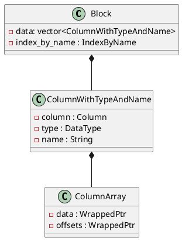

### Array 的内存表示
```sql
create table arrayTest(key Int8,  arr Array(Int8)) engine=MergeTree() order by key;

insert into table arrayTest2 values (1, [1,2,3,4]),(2,[2,3,4,5]),(3,[3,4])
```
array 类型对应的内存中的类型为 ColumnArray，该类型包含两个数组，一个 data 数组顺序保存该所有的 element，这个数组是连续的，另一个 offset 数组保存每个 element 中包含多少个“元素”，类似下图：
```txt
data:   [1,2,3,4,2,3,4,5,3,4]
offset: [3,7,9]
```
观察 `ColumnArray::getDataAt(size_t n)` 的实现更好的理解：
```c++
StringRef ColumnArray::getDataAt(size_t n) const
{
    /** Returns the range of memory that covers all elements of the array.
      * Works for arrays of fixed length values.
      * For arrays of strings and arrays of arrays, the resulting chunk of memory may not be one-to-one correspondence with the elements,
      *  since it contains only the data laid in succession, but not the offsets.
      */

    size_t offset_of_first_elem = offsetAt(n);
    StringRef first = getData().getDataAtWithTerminatingZero(offset_of_first_elem);

    size_t array_size = sizeAt(n);
    if (array_size == 0)
        return StringRef(first.data, 0);

    size_t offset_of_last_elem = getOffsets()[n] - 1;
    StringRef last = getData().getDataAtWithTerminatingZero(offset_of_last_elem);

    return StringRef(first.data, last.data + last.size - first.data);
}
```
#### Block


### arrayMap 是怎么执行的
```sql
select arrayMap(x -> (x + 2), arr) from arrayTest;
```
InterperterFactory 构造一个 InterpreterSelectQuery 对象。
在 InterpreterSelectQuery 的构造函数中，通过对 AST 进行分析，完成 Logical Plan 的构造，包括基于规则的查询优化都是在构造函数期间完成的。关于 Logical Plan 的构造这里不介绍，我们主要关注高阶函数在这其中牵涉到的地方。

在构造 Logical Plan 的时候我们需要知道每个 Plan Node 的输入与输出，所以这里会解析 arrayMap 这个 higher-order function 的 schema 信息。这一步是在 `InterpreterSelectQuery::getSampleBlockImpl()` 中进行的
```c++
InterpreterSelectQuery::getSampleBlockImpl()
{
    ...
    analysis_result = ExpressionAnalysisResult(*query_analyzer, metadata_snapshot, ...);
    ...
}

ExpressionAnalysisResult::ExpressionAnalysisResult(...)
{
    ...
    ExpressionActionsChain chain(context);
    ...
    query_analyzer.appendSelect(chain, ...);
    ...
}

void SelectQueryExpressionAnalyzer::appendSelect(
    ExpressionActionsChain & chain, bool only_types)
{
    ...
    getRootActions(select_query->select(), only_types, step.actions());
    ...
}

void ExpressionAnalyzer::getRootActions(const ASTPtr & ast, bool no_subqueries, ActionsDAGPtr & actions, bool only_consts)
{
    LogAST log;
    ActionsVisitor::Data visitor_data(getContext(), settings.size_limits_for_set, subquery_depth,
                                   sourceColumns(), std::move(actions), prepared_sets, subqueries_for_sets,
                                   no_subqueries, false, only_consts, !isRemoteStorage());
    ActionsVisitor(visitor_data, log.stream()).visit(ast);
    actions = visitor_data.getActions();
}

template <typename Matcher, bool _top_to_bottom, bool need_child_accept_data = false, typename T = ASTPtr>
class InDepthNodeVisitor
{
public:
    ...
    void visit(T & ast)
    {
        DumpASTNode dump(*ast, ostr, visit_depth, typeid(Matcher).name());

        if constexpr (!_top_to_bottom)
            visitChildren(ast);

        try
        {
            Matcher::visit(ast, data);
        }
        catch (Exception & e)
        {
            e.addMessage("While processing {}", ast->formatForErrorMessage());
            throw;
        }

        if constexpr (_top_to_bottom)
            visitChildren(ast);
    }
    ...
}
```
`InDepthNodeVisitor`是一个模板类，在我们的例子中，用来实例化该类的Matcher为`ActionMatcher`
```c++
void ActionsMatcher::visit(const ASTPtr & ast, Data & data)
{
    ...
    else if (const auto * node = ast->as<ASTFunction>())
        visit(*node, ast, data);
    ...
}

void ActionsMatcher::visit(const ASTFunction & node, const ASTPtr & ast, Data & data)
{
    ...
    /// 如果目标函数没有在 FunctionFactory 注册，这里会抛出异常
    function_builder = FunctionFactory::instance().get(node.name, data.getContext());
    ...
    /// arrayMap 有两个 child node
    if (node.arguments)
    {
        size_t num_arguments = node.arguments->children.size();
        for (size_t arg = 0; arg < num_arguments; ++arg)
        {
            auto & child = node.arguments->children[arg];

            const auto * function = child->as<ASTFunction>();
            const auto * identifier = child->as<ASTTableIdentifier>();
            /// arrayMap 的第一个参数为 lambda 表达式
            if (function && function->name == "lambda")
            {
                if (function->arguments->children.size() != 2)
                    throw Exception("lambda requires two arguments", ErrorCodes::NUMBER_OF_ARGUMENTS_DOESNT_MATCH);

                const auto * lambda_args_tuple = function->arguments->children.at(0)->as<ASTFunction>();

                if (!lambda_args_tuple || lambda_args_tuple->name != "tuple")
                    throw Exception("First argument of lambda must be a tuple", ErrorCodes::TYPE_MISMATCH);

                has_lambda_arguments = true;
                argument_types.emplace_back(std::make_shared<DataTypeFunction>(DataTypes(lambda_args_tuple->arguments->children.size())));
                /// Select the name in the next cycle.
                argument_names.emplace_back();
            }
            ...
            /// 第二个参数为一个标识符
            else   
            {
                /// If the argument is not a lambda expression, call it recursively and find out its type.
                visit(child, data);

                if (auto name_type = getNameAndTypeFromAST(child, data))
                {
                    argument_types.push_back(name_type->type);
                    argument_names.push_back(name_type->name);
                }
                else
                    arguments_present = false;
            }
    }
    ...
    if (has_lambda_arguments && !data.only_consts)
    {
        function_builder->getLambdaArgumentTypes(argument_types);
        /// Call recursively for lambda expressions.
        for (size_t i = 0; i < node.arguments->children.size(); ++i)
        {
            ASTPtr child = node.arguments->children[i];

            const auto * lambda = child->as<ASTFunction>();
            if (lambda && lambda->name == "lambda")
            {
                /// 这里需要处理 lambda 表达式的输入输出类型
               ...
            }
        }
    }
    ...
    auto lambda_actions = std::make_shared<ExpressionActions>(
                        lambda_dag,
                        ExpressionActionsSettings::fromContext(
}

```
当 InterperterSelectQuery 对象构造完毕后，Logical plan 也就构造好了，下一步是构造物理执行计划，这一步是在 `InterpreterSelectQuery::execute()` 中完成的
```c++
BlockIO InterpreterSelectQuery::execute()
{
    BlockIO res;
    QueryPlan query_plan;

    buildQueryPlan(query_plan);

    res.pipeline = QueryPipelineBuilder::getPipeline(std::move(*query_plan.buildQueryPipeline(
        QueryPlanOptimizationSettings::fromContext(context), BuildQueryPipelineSettings::fromContext(context))));
    return res;
}
```
返回的 BlockIO 将会交给执行器执行。
```c++
void InterpreterSelectQuery::buildQueryPlan(QueryPlan & query_plan)
{
    executeImpl(query_plan, std::move(input_pipe));
    ...
}

/// 构造物理执行计划
void InterpreterSelectQuery::executeImpl(QueryPlan & query_plan, std::optional<Pipe> prepared_pipe)
{
    ...
    /// 产生表达式的物理执行计划
    executeExpression(query_plan, expressions.before_order_by, "Before ORDER BY");
    ...
}


void InterpreterSelectQuery::executeExpression(QueryPlan & query_plan, const ActionsDAGPtr & expression, const std::string & description)
{
    if (!expression)
        return;

    auto expression_step = std::make_unique<ExpressionStep>(query_plan.getCurrentDataStream(), expression);

    expression_step->setStepDescription(description);
    query_plan.addStep(std::move(expression_step));
}
```


```c++
/// ExpressionActions.cpp
static void executeAction(const ExpressionActions::Action & action, ExecutionContext & execution_context, bool dry_run)
{
    ...
    switch (action.node->type)
    {
        case ActionsDAG::ActionType::FUNCTION:
        {
            ...
            res_column.column = action.node->function->execute(arguments, res_column.type, num_rows, dry_run);
        }
    }
}
```
----
来看一下 arrayMap 具体是如何执行的：
```c++
ColumnPtr executeImpl(const ColumnsWithTypeAndName & arguments, const DataTypePtr &, size_t) const override
{
    ...
    /// A 找到需要执行的 lambda 表达式
    const auto & column_with_type_and_name = arguments[0];
    if (!column_with_type_and_name.column)
        throw Exception("First argument for function " + getName() + " must be a function.",
            ErrorCodes::ILLEGAL_TYPE_OF_ARGUMENT);

    const auto * column_function = typeid_cast<const ColumnFunction *>(column_with_type_and_name.column.get());

    if (!column_function)
        throw Exception("First argument for function " + getName() + " must be a function.",
            ErrorCodes::ILLEGAL_TYPE_OF_ARGUMENT);
    ...
    /// B 找到所有的需要进行 arrayMap 的 ColumnArray
    ColumnsWithTypeAndName arrays;
    arrays.reserve(arguments.size() - 1);
    /// 注意 index 从 1 开始
    for (size_t i = 1; i < arguments.size(); ++i)
    {
        const auto & array_with_type_and_name = arguments[i];
        ColumnPtr column_array_ptr = array_with_type_and_name.column;
        const auto * column_array = checkAndGetColumn<ColumnArray>(column_array_ptr.get());


    }
}
```
* A
这里说明，物理查询计划执行时，第一个参数为我们需要执行的 function。TODO：在哪构造的这个 ColumnFunction 对象


--- 
### ColumnFunction
```plantuml

IColumn <|-- ColumnFunction

class ColumnFunction 
{
    - size_t : size_t
    - function : FunctionBasePtr
    - captured_columns : ColumnsWithTypeAndName
}
``` 

---- 
```sql
create table arrayFoldDemo (array1 Array, array2 Array, ..., arrayn Array)
```
we have an arrayFold query like below:
```sql
select arrayFold(x1, ..., xn, accum -> expression, array1, ..., arrayn, init_accum) from arrayFoldDemo
```
Suppose table `arrayFoldDemo` has `M` rows, "biggest" array item has `H` elements, and table has `N` array columns in total.


and we have pseudocode implementation of below:
```txt
let acc = init_accum
for i = 0; i < num_rows_in_column; ++i
    acc = expression(array1, ..., arrayN, accum)
return acc
```
the implementation in [PR](https://github.com/ClickHouse/ClickHouse/pull/21589) will call lambda expression at most M times, and we suppose total cost virtual function call is C.

the vectorized fashion, according to my understand, will call lambda expression at most H times, and total cose of virtual function is almost same with C.
```txt
let filter_mask = vector<size_t>(size_of(first_array_column))
filter_mask[0] = first_array_column_offsets[0];
let array_max_size = -INFINITE

for i = 1; i < num_rows_in_first_column; ++i
    filter_mask[i] = first_array_column_offsets[i] - first_array_column_offsets[i - 1];
    array_max_size = max(array_max_size, filter_mask[i])

for i = 0; i < array_max_size; ++i
    lambda_input_arrays = empty_columns_array
    for mask_copy : filter_mask:
        height = mask_copy - i;
        if height <= 0:
            continue;
        /// 
        
```
