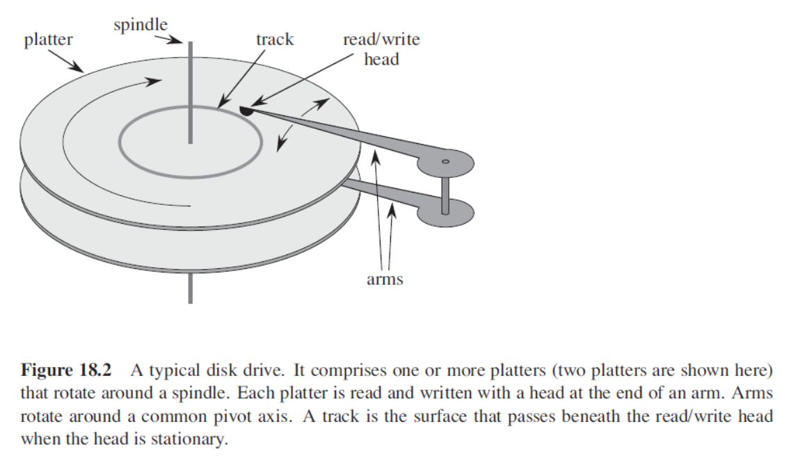
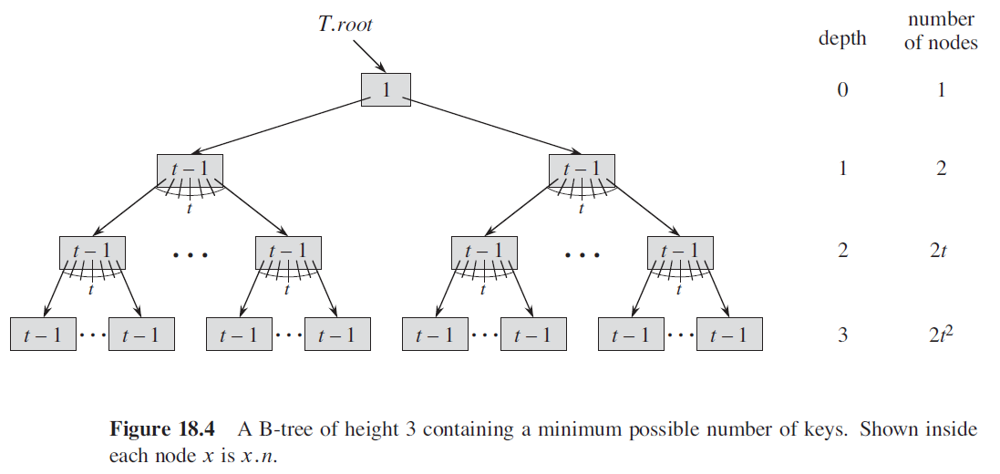
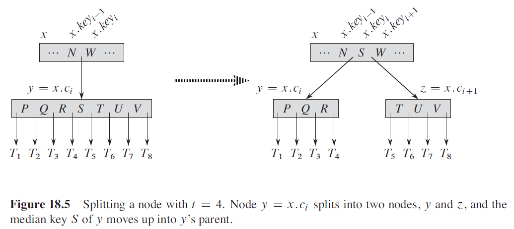
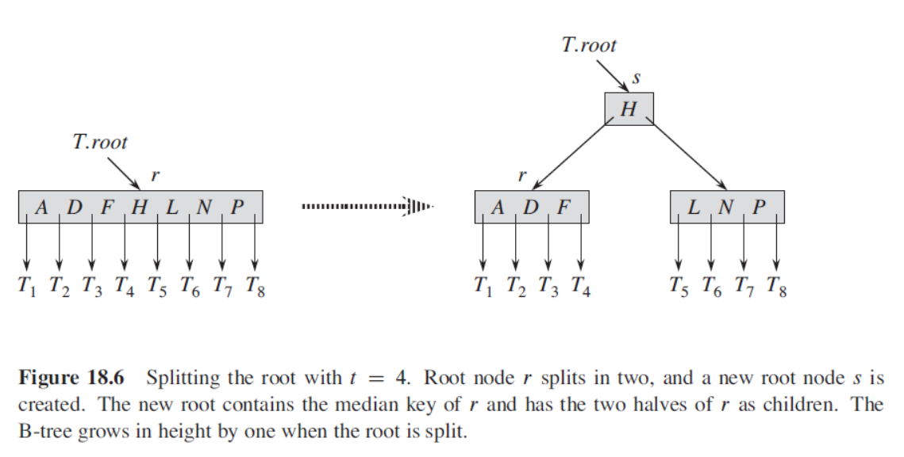

# B-Tree

B树是对二叉搜索树的一种扩充。如果一个B树的一个内部结点x包含x.n个关键字，那么结点x就有x.n+1个孩子。结点x中的关键字就是分隔点，它把结点x中所处理的关键字的属性分割为x.n+1个子域，每个子域都由x的一个孩子处理。

B树的高度仅随它所包含的结点数按对数增长。对数的底数与B-Tree的最小度相关。

### 辅存上的数据结构



一个7200RPM的机械硬盘，旋转一周需要8.33ms。而硅存储常见的存取时间为50 ns。也就是说，如果不得不等待一个磁盘旋转完整的一圈，让一个特定的项到达读/写磁头下方，我们可能存取主存超过100000次。

为了摊还机械移动需要的时间，磁盘会一次读取多个数据项而不是一个。信息被分为一系列相等大小的在柱面内连续出现的位页面，并且每个磁盘读或写一个或多个完整的页面。


存储的信息被分为一系列大小相等的在柱面内连续出现的位页面，并且每个磁盘读或者写一个或者多个完整的页面。

使用需要读出或者写入磁盘的信息的页数来衡量磁盘存取次数。

x是一个指向某个对象的指针，如果该对象正在主存中，那么可以像平常一样引用该对象的各个属性。如果x所指向的对象驻留在磁盘上，那么在引用它的属性之前必须先执行`DISK-READ(x)`(如果`x`已经在主存中，那么`DISK-READ(x)`就是一个空操作)。类似的，`DISK-WRITE(x)`将所有对`x`的修改保存到硬盘中。

    x = a pointer to some object
    DISK-READ(x)
    operations that access and/or modify the attributes of x
    DISK-WRITE(x) //omitted if no attributes of x were changed
    other operations that access but do not    modify attributes of x


为了减少磁盘读取的次数，我们通常保证一个B树结点和一个完整磁盘页一样大，并且磁盘页的大小限制了一个B树结点可以含有的孩子个数。

## B树的定义


一棵B树T是具有以下性质的有根树：
1. 每一个结点x都具有如下`attributes`：
   a. `x.n` 是结点x中当前存储的关键字数量
   b. `x.n` 个关键字$x.key_{1},x.key_{2},...,x.key_{x.n}$按照非递减顺序存储，因此有$x.key_{1}\leq x.key_{2} \leq ... \leq x.key_{x.n}$
   c. `x.leaf`如果x是叶子结点，那么`x.leaf`为`TRUE`,如果是内部结点那么为`FALSE`
2. 每个内部结点x同样包含`x.n + 1`个指针$x.c_{1},...,x.c_{x.n+1}$，每个指针指向一个孩子结点。叶子结点没有孩子，因此他们的$c_{i}$为`NULL`
3. 关键字$x.key_{i}$将子树中的关键字分成一个个range：如果$k_{i}$是树$x.c_{i}$中的某个子树的关键字，那么一定有
$$
k_{1}\leq x.key_{1}\leq k_{2}\leq x.key_{2}\leq ... \leq x.key_{x.n}\leq k_{x.n+1}
$$
4. 所有叶子节点都有相同的深度，等于树的高度 h
5. 每个结点能够存储的关键字数量有上下界。使用一个叫做 B树的最小度的 固定整数 t ($\geq 2$) 来表示边界的大小：
   a. 除了根节点之外的所有结点必须至少有 t - 1 个关键字。因此除了根节点外的每个内部节点都至少有 t 个孩子。如果树是非空的，那么根节点至少必须有一个关键字。
   b. 每个结点都至多包含 2t-1 个关键字。因此一个内部节点至多有 2t 个孩子。如果某个结点正好有 2k-1 个关键字，那么就称该结点是满的。

最简单的B树的 t 等于 2。 那么每个内部节点就有 2、3、4个孩子。

### B-树的高度
在B树上的操作所需要的磁盘访问数量与B-树的高度成正比。最差情况下B-树的高度：

如果 $n\geq 1$，那么对于一个高度为 h，最小度 $t\geq 2$ 的具有 n 个关键字的B-Tree来说，满足：
$$
h \leq log_{t}\frac{n+1}{2}
$$

**证明**
B-树的根节点最少有1个关键字，其他内部结点包含最少 t-1 个关键字。因此高度为 h 的B-树在 depth 1 最少具有2个结点，在 depth 2 最少具有 2t 个结点，在 depth 3 最少具有 $2t * t=t^{2}$个结点(depth 2 最少 2t 个结点，每个结点最少 t 个孩子结点)。因此在 depth h 最少具有$2t^{h-1}$个结点。

关键字的数量 n 满足不等式：
$$
\begin{matrix}
n\geq 1+(t-1)\sum_{i=1}^{h}2t^{i-1}\\
\ = 1 + 2(t-1)(\frac{t^{h}-1}{t-1})\\
= 2t^{h} -1
\end{matrix}
$$
所以得到$h\leq log_{t}\frac{n+1}{2}$

与红黑树相比，尽管树的高度都是按照O(lg n)


## B-树的基本操作
两个约定：
* B树的根节点始终在主存中
* 任何作为参数传递的结点都必须在这之前进行一次DISK-READ操作

### Searching a B-tree
与搜索二叉搜索树很像，区别在于B-Tree在每个结点根据孩子结点个数做出多路分支选择。更具体来说，对于每个内部结点x，每次有`(x.n+1)`种路径可选。

`B-TREE-SEARCH(T.root, k)`。如果关键字 k 在树中，那么返回一个有序对(y,i),其中 y 表示包含关键字 k 的结点，i 表示$y.key_{i}==k$。否则返回NIL
```c++{set number}
B-TREE-SEARCH(T.root, k)
    i = 1
    while(i<=x.n && k>x.getKey(i))
        i = i + 1
    if(i<=x.n && k==x.getKey(i))
        return (x, i)
    elseif(x.isleaf())
        return NULL
    else
        DISK-WRITE(x.getChild(i))
        return B-TREE-SEARCH(x.getChild, k)    
```
循环`while(i<=x.n && k>x.getKey(i))`寻找满足`k<=x.getKey(i)`的最小 i，否则`i=x.n+1`。

### Creating an empty B-tree
为了创建一个B-Tree，首先使用 B-TREE-CREATE 来创建一个空的根节点，然后调用 B-TREE-INSERT 来添加新关键字。所有这些步骤都使用一个辅助步骤 ALLOCATE-NODE。假设 ALLOCATE-NODE 创建的结点不需要 DISK-READ。
```c++
B-TREE-CREATE(T)
    x = ALLOCATE-NODE()
    x.leaf = true
    x.n = 0
    DISK-WRITE(x)
    T.root = x
```
### Inserting a key into a B-tree
正如二叉搜索树一样，我们在叶子结点中寻找添加新关键字的位置。然而在 B-Tree 中我们不能直接就创建一个叶子结点然后 insert，因为这有可能会破坏B-Tree的性质。Instead，we insert the new key into an existing leaf node. 由于不能向 full lead node 添加关键字，我们引入`split`操作，将一个 full node y 从它的 median key $y.key_{t}$分割成两个结点，每个结点只包含 t-1 个关键字（回顾B-Tree的定义，每个结点至多2t-1个关键字），剩下的那个关键字被向上移动到结点 y 的双亲结点。The median key moves up into y's parent to identify the dividing point between the two new trees. 但是如果 y 的 parent node 也是满的，那么同样需要对它进行 `split`

正如二叉搜索树，我们可以通过一个从根到叶子的简单路径来向B-Tree添加关键字。为了达成目标，我们不会守株待兔，等着需要进行`split`才能insert key 的情况发生，而是：当我们 travel down the tree searching for the position where the new key belongs, 我们主动对遇到的 full node(including the leaf itself) 进行`split`。这就保证了当我们需要 split a full node y, we are assured that its parent is not full.

### Splitting a node in a B-tree
B-TREE-SPLIT-CHILD 接收一个非空的内部结点x(假设已经被放入主存)，一个索引 i ，$x.c_{i}$是 x 的 full child。The procedure then splites this child in two and adjusts x so that it has an additional child。如果是对根结点分割，首先需要将根节点转为一个新的空结点的孩子结点，然后再对新的根节点使用B-TREE-SPLIT-CHILD。如此一来树的高度增加一；`SPLIT`是唯一使得树的高度增加的方法。



We split the full node $y=x.c_{i}$ about its median key S, which moves up into y's parent node x. 原先 y 中更大的那些关键字被转移进一个新的结点 z，which becomes a new child of x.
```c++
B-TREE-SPLIT-CHILD(x,i)
    z = ALLOCATE-NODE()
    y = x.childArray[i]
    z.leaf = y.leaf
    z.n = t - 1
    for j = 1 to t - 1
        z.keyArray[j] = y.keyArray[j+t]
    if not z.laef
        z.childArray[j] = y.chileArray[j+t]
    y.n = t - 1
    for j = x.n + 1 downto i + 1
        x.childArray[j+1] = x.childArray[j]
    x.childArray[i+1] = z
    for j = x.n downto i 
        x.keyArray[j+1] = x.keyArray[j]
    x.key[i] = y.key[t]
    DISK-WRITE(y)
    DISK-WRITE(z)
    DISK-WRITE(x)
```
需要注意的点是，如果 y 是 x 的第 i 个孩子结点，那么 x 的第 i-1 个 key 是 **最大的** 比 y 中所有 key 都小的关键字，x 的第 i 个关键字是 **最小的** 比 y 中所有关键字都大的关键字。所以在将 y's median key move up to y's parent node x的时候，应该是`x.insertKey(i, y.medianKey)`

### Inserting a key into a B-tree in a single pass down the tree
将一个关键字 k 插入一个高度为 h 的B-tree T，需要 O(h) 次disk access. CPU 时间为 $O(th)=O(tlog_{t}(n))$。`B-TREE-INSERT`使用`B-TREE-INSERT-NONFULL`来保证递不会向一个 full node 进行插入操作。
```c++
B-TREE-INSERT(T,k)
    r = T.root
    if r.n == 2t-1
        s = ALLOCATE-NODE()
        T.root = s
        s.leaf = false
        s.n = 0
        s.c1 = r
        B-TREE-SPLIT-CHILD(s,1) 
        B-TREE-INSERT-NONFULL(s,k)
    else
        B-TREE-INSERT-NOT-FULL(r,k)
```


辅助过程`B-TREE-INSERT-NONFULL`将关键字 k 插入结点 x，在调用 B-TREE-INSERT-NONFULL时需要保证结点 x 未满。
```c++
B-TREE-INSERT-NONFULL(x,k)
    i = x.n
    if x.isleaf()
        while i>=1 and k<x.getKey(i)
            x.insertKey(i+1, x.getKey(i))
            i = i - 1
        x.insertKey(i, k)
        x.n = x.n + 1
        DISK-WRITE(x)
    else 
        while(i>=1 and k<x.getKey(i))
            i = i - 1
        i = i + 1
        DISK-READ(x.getChild(i))
        if(x.getChild(i).isfull())
            B-TREE-SPLIT-CHILD(x,i)
            if k > x.getKey(i)
                i = i + 1
        B-TREE-INSERT-NONFULL(x.getChild(i), k)
```
当 x 不是叶子结点时，不能在 x 中插入关键字。**这时需要找到 x 中最小的比 k 大的关键字的索引 i**，x 的第 i 个孩子结点`y = x.getChild(i)`就是下一个待考察结点（y 中的关键字都比$x.key_{i}$小）。如果`x.getChild(i)`是满结点，那么首先将它`SPLIT`，即`B-TREE-SPLID-CHILD(x,i)`，然后这时因为 y 的 median key is moved up to x.key(i)，所以需要根据当前`x.getKey(i)`的值来重新调整 i，保证 i 始终是 x 中最小的大于 k 的关键字的索引。