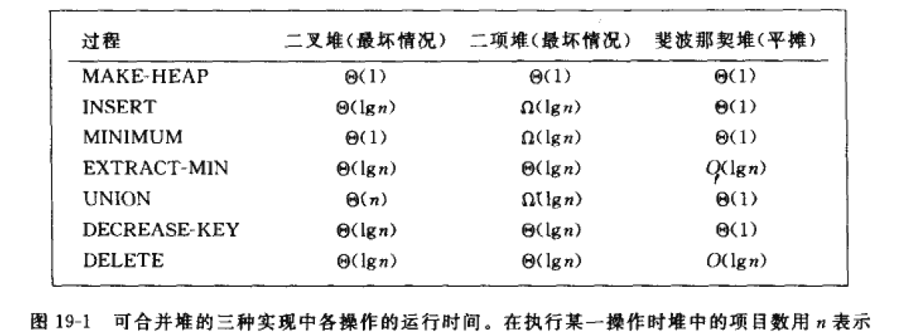
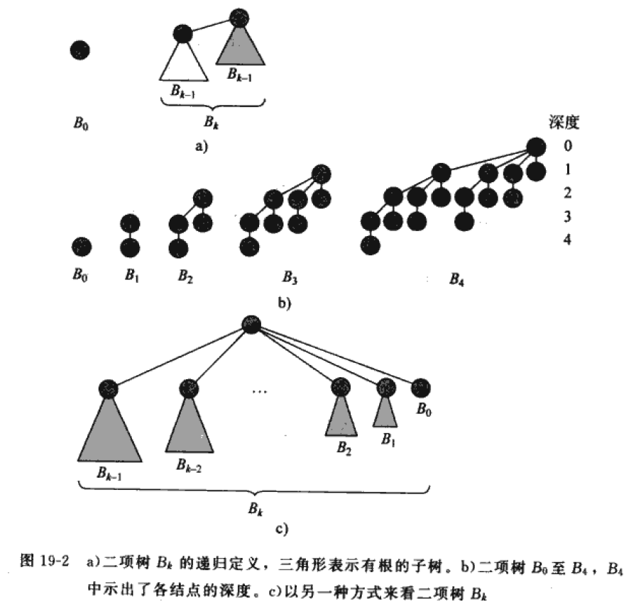
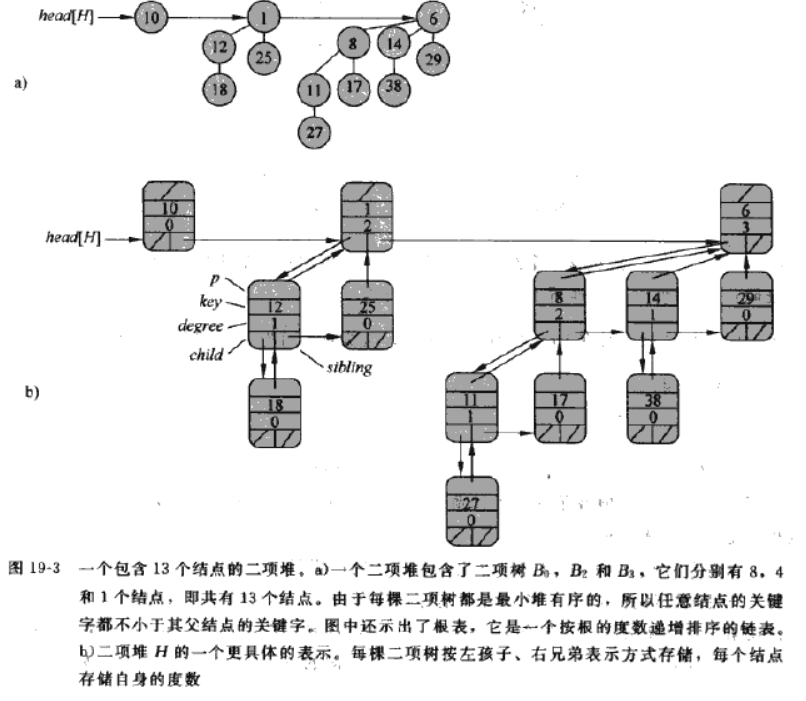
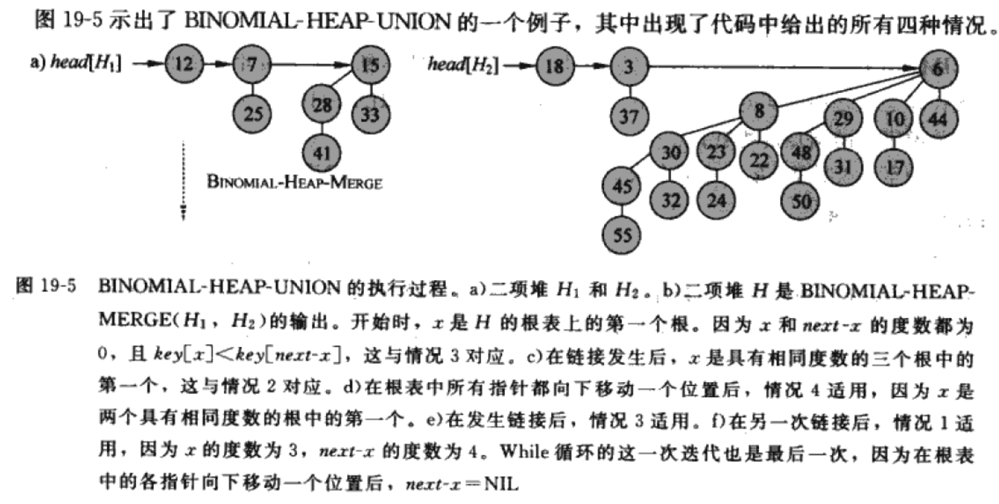
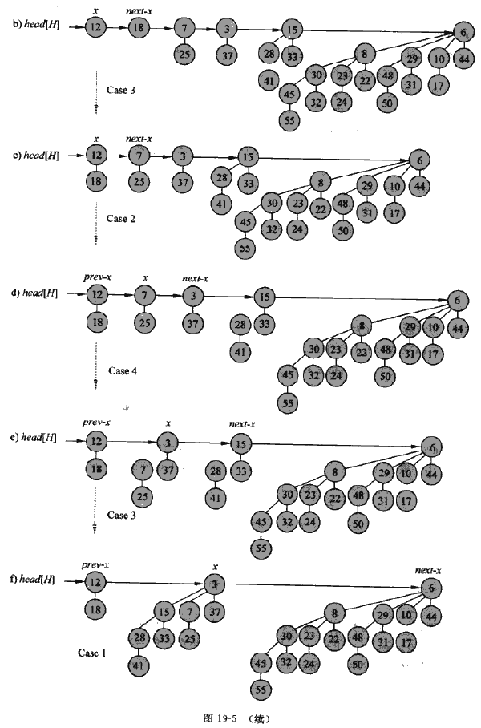
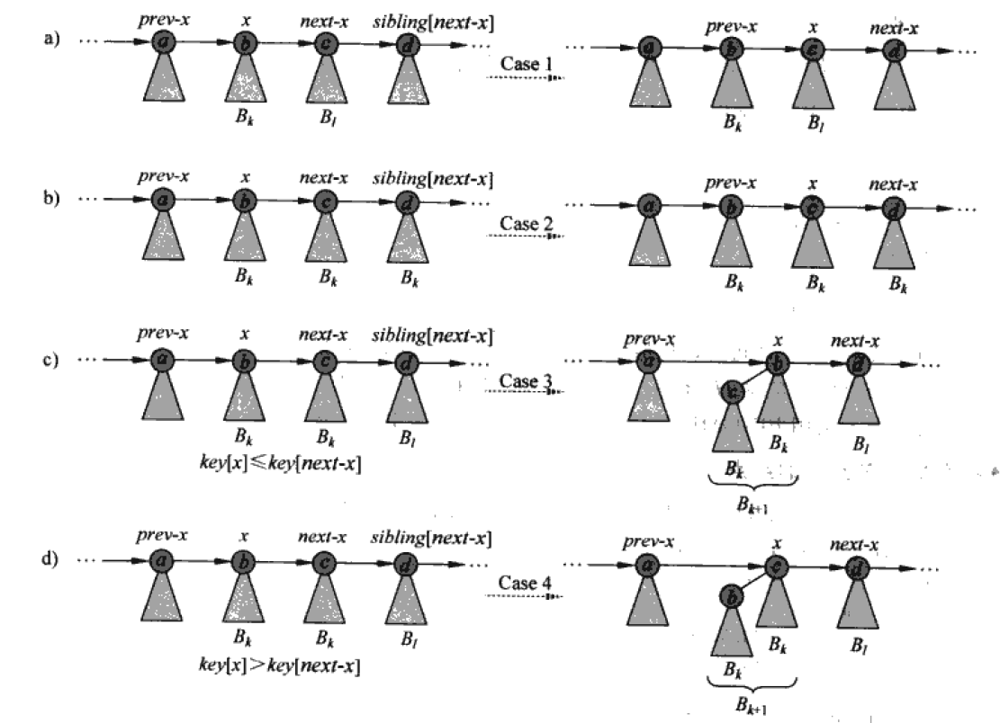
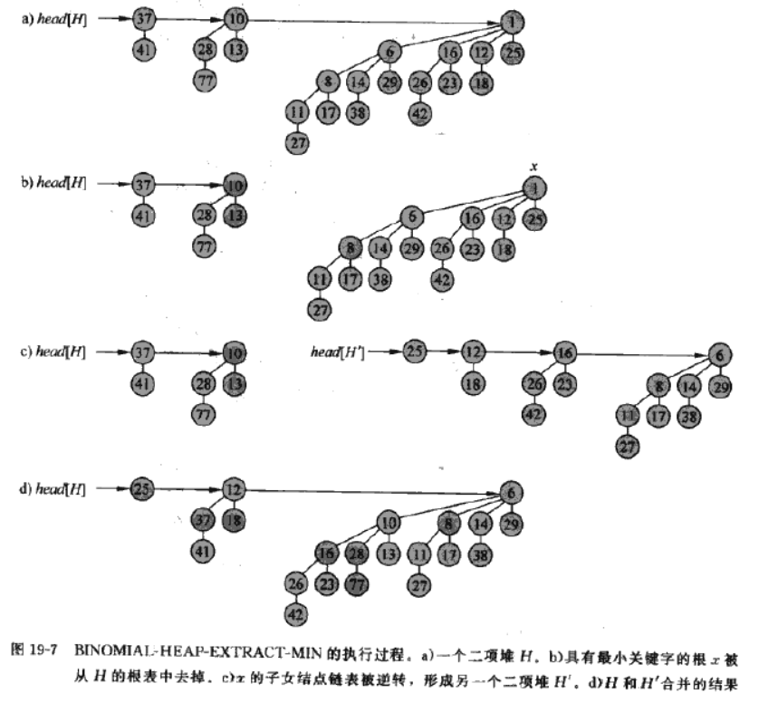

可合并堆，支持五种操作：
* `MAKE-HEAP()`
* `INSERT(H, x)`
* `MINIMUM(H)`: 返回一个指向堆 H 中包含最小关键字的节点的指针
* `EXTRACT-MIN(H)`：将堆 H 中包含最小关键字的节点删除，并返回一个指向该节点的指针。
* `UNION(H1, H2)`: 创建并返回一个包含堆 H1 和 H2 中所有节点的新堆。同时删除原 H1 和 H2

二项堆和斐波那契堆支持的额外两种操作：
* `DERCREASE-KEY(H, x, k)`: 将新关键字值 k 赋给堆 H 中的节点 x，k 值小于 x.key
* `DELETE(H, x)`
  

当不需要合并操作时，二叉堆就可以满足要求，但是当执行 UNION 时，二叉堆的时间复杂度达到 O(n)

上图中斐波那契堆的时间界是平摊时间界

## 二项树与二项堆
一个二项堆由一组二项树所构成，
### 二项树
递归定义：二项树 $B_{k}$ 由 2 棵二项树 $B_{k-1}$ 连接而成：其中一棵树的根是另一颗树的根的最左孩子。


### 二项树$B_{k}$的性质
1. 共有 $2^{k}$ 个节点
2. 树的高度为 k
3. 在深度 i 处恰有 $C_{k}^{i}$ 个节点，其中 i 从 0 到 k
4. 根的度数为 k，它大于任何其他节点的度数；并且如果根的子女节点从左到右编号为 k-1, k-2, ..., 0, 子女 i 是子树 $B_{i}$ 的根。

推论: 在一棵包含 n 个节点的二项树中，任意结点的最大度数为 $\log_{2} n$

### 二项堆
二项堆 H 由一组满足下面的二项堆性质的二项树组成。
1. H 中的每个二项树遵循最小堆性质：节点的关键字大于或等于其父节点的关键字
2. 对任意非负整数k，在 H 中至多有一颗二项树的根具有度数 k。

由性质 1 知道：一个最小堆有序二项树中，其根包含了树中最小的关键字；

关于性质二：
对于包含 n 个节点的二项堆，必须满足性质二，而如何才能满足性质二呢？
想到 n 的二进制表示。将 n 表示为二进制后，第 i 位的 1 或者 0 刚好表示要构成 n 是否需要该 $2^i$。而二项树 $B_{k}$共有$2^{k}$个结点，他的根的度刚好为k！！你说巧不巧？？！！

还不懂？简而言之，就是如何判断一个包含 n 个元素的二项堆由哪几个二项树构成呢？将 n 写成二进制形式，哪一位为 1，那一位对应的二项树就应该存在。
比如包含13个节点的二项堆，13的二进制表示为`1101`，那么该二项堆由二项树$B_{3}$$B_{2}$和$B_{0}$构成。

这样又推出：**含有 n 个节点的二项堆最多有$\lfloor lgn \rfloor + 1$棵二项树。**



二项堆中所有二项树的根结点被组织成一个链表，称之为根表。在遍历根表时，各根的度是严格单调递增的。

## 对二项堆的操作
### 创建一个新二项堆
MAKE-BINARY-HEAP
### 寻找最小关键字
BINOMIAL-HEAP-MUINIMUM
二项堆是最小堆有序的，所以最小关键字一定在二项树根节点中。遍历根表将指向最小关键字根节点的指针赋给y。
```
y <- NUL
x <- head[H]
min <- ∞
while x != NIL
    do  if key[x] < min
        then min <- key[x]
             y <- x
        x <- sibling[x]
return y
```
由前面分析知道，根表最多有 $\lfloor lgn \rfloor + 1$ 棵二项树，所以寻找最小关键字操作的运行时间为 $O(lg n)$
### 合并两个二项堆
合并两个二项堆的运行时间为 $O(lgn)$

BINOMIAL-HEAP-UNION 反复连接根节点的度数相同的二项树。

需要几个单独子过程：
BINOMIAL-LINK将以节点 y 为根的$B_{k-1}$树与以节点 z 为根的$B_{k-1}$连接起来，并且使得 z 成为 y 的父节点，成为一棵$B_{k}$树的根。
```
BINOMIAL-LINK(y, z)
p[y] <- z
sibling[y] <- child[z]
child[z] <- y
degree[z] <- degree[z] + 1
```

BINOMIAL-HEAP-MERGE(h1, h2)将 h1 和 h2 的根表合并成一个按度数单调递增次序排列的链表。
```
BINOMIAL-HEAP-MERGE(h1, h2)
dummy <- new root;
cur <- dummy;

while(h1 != NIL && h2 != NIL)
    if(degree[h1] <= degree[h2])
        sibling[cur] <- h1
        h1 <- sibling[h1]
    else
        sibling[cur] <- h2
        h2 <-sibling[h2]
    cur <- sibling[cur]

if(h1 != NIL)
    sibling[cur] <- h1
else
    sibling[cur] <- h2

return sibling[dummy]
```

下面是合并二项堆的伪代码：
```
BINOMIAL-HEAP-UNION(h1, h2)
h <- MAKE-BINOMIAL-HEAP()
head[h] <- BINOMIAL-HEAP-MERGE(h1, h2)
if head[h] = NIL
    return H
prev-x <- NIL
x <- head[h]
next-x <- sibling[x]
while next-x != NIL
    do  if(degree[x] != degree[next-x]) or
            (sibling[next-x] != NIL and degree[sibling[next-x]] = degree[x])
        then prev-x <- x                            *Cases 1 and 2
             x <- next-x                            *Cases 1 and 2
        else if key[x] <= key[next-x]
             then sibling[x] <- sibling[next-x]     *Cases 3
                BINOMIAL-LINK(next-x, x)            *Cases 3
        else if prev-x = NIL                        *Cases 4
                then head[h] <- next-x              *Cases 4
                else sibling[prev-x] <- next-x      *Cases 4
            BINOMIAL-LINK(x, next-x)                *Cases 4
            x <- next-x
        next-x <- sibling[x]
return h
```





合并过程其实可以总结为：
1. 首先通过 BINOMIAL-HEAP-MERGE 将 h1 h2 的根表合并为 degree 单调递增的根表， prev-x、x、next-x 表示对链表进行操作用到的指针，记为操作指针
2. 如果 degree[x] != degree[next-x] ，或者 degree[x] = degree[sibling[x]] (三个连续根的degree相等，只需要合并后面两个根)，那么操作指针集体后移一位
3. 如果 degree[x] = degree[next-x] 那么按照正确的key关系将 x 和 next-x 合并成新二项树



### 插入一个结点
构造一个只带插入结点 x 的二项堆，然后把该二项堆和原二项堆合并。
```
BINOMIAL-HEAP-INSERT(H, x)
H' <- MAKE-BINOMIAL-HEAP()
p[x] <- NIL
child[x] <- NIL
sibling[x] <- NIL
degree[x] <- 0
head[H'] <- x
H <- BINOMIAL-HEAP-UNION(H, H')
```

### 抽取具有最小关键字的节点
首先从根表中找到具有最小关键字的根，然后将这个根从其对应的二项树 $B_{k}$ 中删除，该根的度为 k ，那么将这 k 棵子树组成一个新的二项树，再和原先根表中二项树组成的二项堆合并。

```
BINOMIAL-HEAP-EXTRACT-MIN(H)
find the root x with the minimum key in the root list of H, and remove x from the root list of H
H' <- MAKE-BINOMIAL-HEAP()
reverse the order of the linked list of x's child, and set head[H'] to point to the head of the resulting list
H <- BINOMIAL-HEAP-UNION(H, H')
return x
```



### 减小关键字的值
将二项堆 H 中的某一个节点 x 的关键字减小为一个新值 k
```
BINOMIAL-HEAP-DECREASE-KEY(H, x, k)
if k > key(x)
    then error "new key is greater than current key"
key[x] <- k
y <- x
z <- p[y]
while z != NIL and key[x] < key[z]
    do exchange key[x] <-> key[z]
        y <- z
        z <- p[y]
```
说人话就是将 x 的 key 设置为 k， 如果 k 比 `key[p[x]]` 小，那么执行类似冒泡排序的过程将 x 和 p[x] 的key交换，直到满足条件或者 x 变为根节点

### 删除一个节点
从二项堆 H 中删除节点 x

就是将结点 x 的 key 值设置为无穷小，然后通过 `BINOMIAL-HEAP-DECRESE-KEY` 以一个类似冒泡的过程将该节点上浮到根结点，再将二项堆根表中的这个结点删除。
```
BINOMIAL-HEAP-DELETE(H, x)
    BINOMIAL-HEAP-DECRESE-KEY(H, x, -∞)
    BINOMIAL-HEAP-EXTRACT-MIN(H)
```