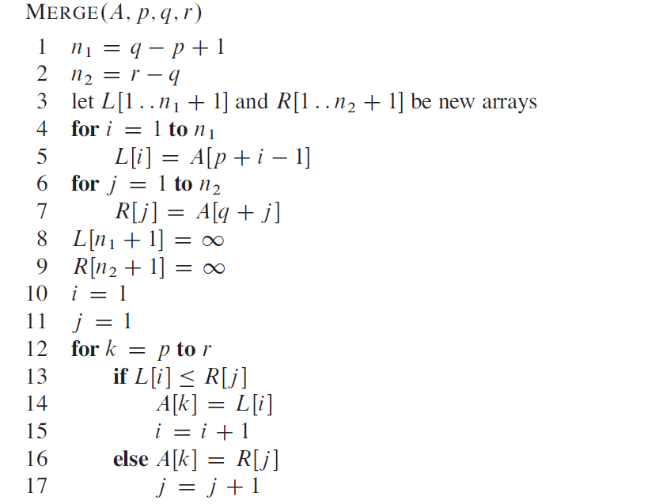

# 分治法(Divide-and-Conquer)
[TOC]
---
## 基本思想
基本思想：将原问题分别为几个规模较小但是类似于原问题的子问题，递归地求解这些子问题，然后再合并这些子问题的解来建立原问题的解。

归并排序完全遵循分治法的思想：
1. 分解：将待排序的n个元素分裂成各具n/2个元素的两个子序列
2. 解决：使用归并排序递归地排序两个子序列（对子序列继续分解直到达到子问题容易在常数时间内解决）
3. 合并：将两个已经排好序的子序列合并成一个已经排好序的原序列。

在第二步中，当我们迭代地将子问题分解，直到子问题中序列规模为1时，子问题就自然而然得到了解决。

在第三步合并过程中，我们调用一个辅助过程 MERGE(A,p,q,r) 来完成合并，该过程假设子数组 A[p,q] 和 A[q+1,r] 已经排好序，它合并这两个排好序的子数组形成单一的已排好序的子数组A[p,r]。



容易知道MERGE这个辅助过程的时间复杂度为O(n)

完整的MERGE-SORT过程：

```
MERGE-SORT(A, p, r)
    if(p < r)
        q = (p + r)/2
        MERGE-SORT(A, p, q)
        MERGE-SORT(A, q+1, r)
        MERGE(A, p, q, r)
```

## 代码实现

对于数组序列的MERGE—SORT比较容易实现，就不写代码了。对Linked-List的MERGE-SORT稍微复杂。列出代码实现：
```C++
/**
 * Definition for singly-linked list.
 * struct ListNode {
 *     int val;
 *     ListNode *next;
 *     ListNode(int x) : val(x), next(NULL) {}
 * };
 */

#include<iostream>
struct ListNode
{
    int val;
    ListNode *next;
    ListNode(int x) : val(x), next(nullptr);
};

/*merge sort*/
class Solution {
public:
    ListNode* sortList(ListNode* head){ 
        if(head == NULL || head->next == NULL) return head;
        
        ListNode* mid = findMiddle(head);
        
        ListNode* grter = sortList(mid->next);
        mid->next = NULL;
        ListNode* less = sortList(head);
        
        return merge(less, grter);
    }

private:
    ListNode* findMiddle(ListNode* head){
        if(head == NULL) return head; // one node 
        
        ListNode *slow = head;
        ListNode *fast = head->next;
        
        while(fast != NULL && fast->next != NULL){
            slow = slow->next;
            fast = fast->next->next;
        }
        
        return slow;
    }
    
    ListNode* merge(ListNode *h1, ListNode *h2){
        ListNode *dummy = new ListNode(0);
        ListNode *tail = dummy;
        
        while(h1 != NULL && h2 != NULL){
            if(h1->val <= h2->val){
                tail->next = h1;
                h1 = h1->next;
            }
            else{
                tail->next = h2;
                h2 = h2->next;
            }
            tail = tail->next;
        }
        if(h1 != NULL)
            tail->next = h1;
        else
            tail->next = h2;
         return dummy->next;
    }
};
```
## 递归算法的分析
个人觉得使用递归树比较直观且容易。但是画图麻烦啊！所以这里列出使用 MASTER 方法分析的思路。

MASTER 方法为形如下式的递归式提供通了一种“菜谱”式的求解方法：
$$
T(n)=aT(n/b)+f(n)
$$
其中 $a\geq 1 $ 和 $b > 1$是常数，f(n) 是渐进正函数。

该递归式描述这样一种算法：它将原来规模为 n 的问题分解为 a 个子问题，每个子问题的规模为 n/b。而 f(n) 代表了问题分解和子问题合并的代价。

对于归并排序来说，其算法每一步对原问题的分解需要的代价为$\Theta(n)$，每一步合并子问题的代价为$\Theta (n)$。所以其递归式中$f(n)=\Theta(n)$。而递归算法将问题分解为两个规模为 n/2 的子问题，所以得到描述其运行时间的递归式为
$$
T(n)=
\begin{cases}
    1,\ \ \ \ \ \ \ \ \ \ \ \ \ n=1 \\
    2T(\frac{n}{2})+\Theta(n)\ \ \ \ \ n\geq 2
\end{cases}
$$
可以应用MASTER方法。

MASTER方法依赖于主定理：
令 $a\geq 1$ 和 $b > 1$是常数，f(n) 是一个函数，T(n) 是定义在非负整数上的递归式：
$$
T(n)=aT(n/b)+f(n)
$$
那么T(n)具有如下渐近界：

1. 若对某个常数$\epsilon>0$ ，有$f(n)=O(n^{log_{b}^{a-\epsilon}})$ ，则$T(n)=\Theta(n^{log_{b}^{a-\epsilon}})$ 
2. 若$f(n)=\Theta(n^{log_{b}a})$，则有$T(n)=\Theta(n^{log_{b}a} lgn)$