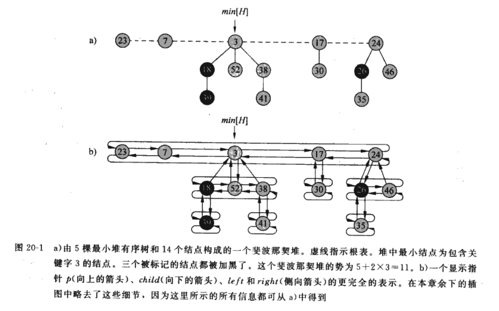

# 斐波那契堆
斐波那契堆有两个作用。首相，它支持一组可合并堆的操作。其次，许多基于斐波那契堆的操作都具有常数的运行时间。

## 斐波那契堆的结构
斐波那契堆有一组最小堆有序树构成，但是其中的树并不一定是二项树。二项堆中根表是有序排列的，斐波那契堆中的根是无序的。

每个节点包含一个指向其双亲节点的指针 p[x]，以及一个指向其任意子女的指针 child[x]。x的所有子女被链接成一个环形双链表，称为 x 的子女表。子女表中的每个孩子 y 都有指针 left[y] 和 right[y]，指向其左右兄弟。如果无左右兄弟，那么 left[y] = right[y] = y。节点 x 子女的个数存在 degree[x] 中。布尔值域 mark[x] 指示自从 x 上一次称为另一个结点子女以来，它是否失掉了一个孩子。

**势函数**
对于一个给定的斐波那契堆 H，用 t(H) 来表示 H 的根表中树的棵树，用 m(H) 来表示 H 中有标记结点的个数。斐波那契堆H 的势定义为：
$$
\Phi(H) = t(H) + 2m(H)
$$
嘉定一个单位的势可以支付常数量的工作，此处的常数足够大，可以覆盖任何常数时间的工作。

## 可合并堆的操作
介绍斐波那契堆 如何实现可合并堆的操作。

如果只需要支持 MAKE-HEAP, INSERT, MINIMUM, EXTRACT-MIN 和 UNION 操作，则每个斐波那契堆就是一组无序的二项树。

二项树的定义是递归的：二项树$B_{k}$由两棵二项树$B_{k-1}$连接而成：其中一棵树的根是另一颗树的根的**最左孩子**。
无序二项树的定义也是递归的：无序二项树$U_{k}$由两棵无序二项树$U_{k-1}$连接而成：其中一棵树的根是另一颗树的根的**任意孩子结点**。

我们已经知道二项树具有如下性质：

**二项树$B_{k}$的性质**
1. 共有 $2^{k}$ 个节点
2. 树的高度为 k
3. 在深度 i 处恰有$\left( \begin{matrix} k \\ i \end{matrix}\right)$个节点，其中i从0到k
4. 根的度数为k，它大于任何其他节点的度数；并且如果根的子女节点从左到右编号为k-1，k-2，。。。，0，子女i是子树$B_{i}$的根。

推论：在一棵包含n个节点的二项树中，任意结点的最大度数为$\log_{2} n$

二项树的其他性质对于无需二项树依然成立，除了性质四进行如下修改：
4. 对无序二项树$U_{k}$，根的度数为k，它大于任何其他结点的度数。根的子女按某种顺序分别为子树 $U_{0},U_{1},...,U_{k-1}$的根。
   
于是对于一个有n个结点的斐波那契堆，则任意结点的最大度数 D(n) = lg n

