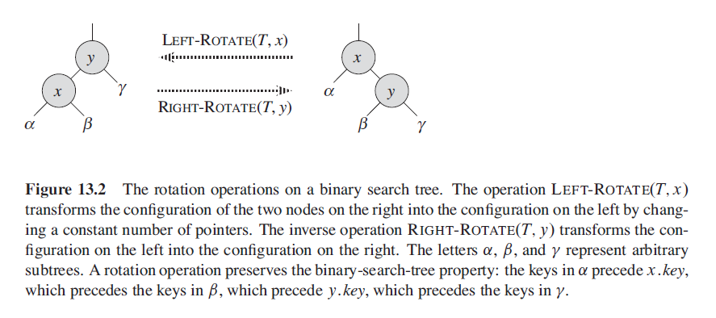
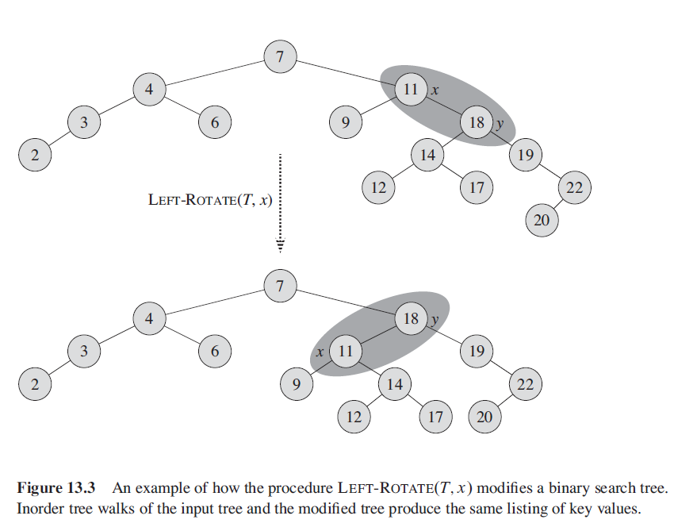

## 二叉树基本性质

二叉树结点 x 的高度：从结点 x 到叶节点的简单路径上边的数量。

二叉树结点 x 的深度：从根节点到结点 x 的简单路径上边的数量。

结点 B 的高度为 2，深度为 1

结点 C 的高度为 1，深度为 1

结点 A 的高度为 3，深度为 0

二叉树的高度为 3

## 二叉搜索树

二叉搜索树上执行的基本操作的时间与数的高度成正比。对于一颗含有 n 个节点的完全二叉树，这些操作的最坏情况运行时间为$\Theta(lgn)$。如果树是含 n 个结点的线性链，则这些操作的最坏情况运行时间为$\Theta(n)$。

每个节点上的卫星数据包括三个用来记录树的结构的字段。In addition to a key and satellite data, each node contains attributes left, right, and p that point to the nodes corresponding to its left child, its right child, and its parent, respectively. If a child or the parent is missing, the appropriate attribute contains the value NIL. The root node is the only node in the tree whose parent is NIL.

先序遍历，中序遍历，后序遍历

### 查询

    TREE-SEARCH(x, k)
        if x == NIL or k == x.key
            return x
        if x.key < k
            return TREE-SEARCH(x.right, k) 
        else return TREE-SEARCH(x.left, k)
    
    ITERATIVE-TREE-SEARCH(x, k)
        while x!= NIL and k != x.key
            if x.key < k
                x = x.right
            else x = x.left
        return x
    
    TREE-MINUMUM(x)
        while x.left != NIL
            x = x.left
        return x
    
    TREE-MAXIMUM(x)
        while x.right != NIL
            x = x.right
        return x

查找中序遍历顺序下 x 的后继节点。
* 如果 x 右子树不为空，那么其后继节点一定是右子树的最左结点
* 如果 x 右子树为空，且 x 必有后继 y。那么其后继节点 y 一定是 x 的 最底层祖先，并且 y 的左孩子也是 x 的祖先（每个结点都是它自己的祖先）
  
        TREE-SUCCESSOR(x)
            if x.right != NIL
                return TREE-MINIMUM(x.right)
            y = x.parent
            while y != NIL && y.right == x
                x = y
                y = y.parent
            return y

证明第二条：若 x 的右子树为空，那么 x 就是以 x 为根的子树中的最大节点。若此时 x 为其双亲节点的左孩子，那么根据中序遍历，x 的后继就是其双亲节点。若 x 为其双亲节点 y 的右孩子，那么说明 x 是以 y 为根的子树 subTree 中的最大节点，则 x 的后继节点一定是二叉搜索树除去 subTree 后的最左节点。

### 插入与删除

## 红黑树
[TOC]
---
### 1. 红黑树的性质
红黑树是一种接近平衡的二叉查找树。

通过限制节点的颜色，红黑树能够保证从根到叶子节点的任意一条简单路径的长度不会超过其他路径的两倍。因此二叉树是近似平衡的。

树中每个节点包含五个域：color, key, left, right 和 p。如果一个结点没有子节点或者父节点，则该节点相应指针属性的值为 NIL。将 NIL 视为二叉搜索树的叶节点，把带有关键字的节点视为内部节点。

一棵二叉查找树如果满足下面的性质，则为一棵红黑树：
1. 每个节点不是红色就是黑色；
2. 根节点是黑色
3. 每个叶子节点（NIL）是黑的
4. 如果一个节点是红的，则它的两个儿子都是黑色
5. 对于每个节点，从该节点到其子孙节点的所有路径上包含相同数量的黑节点

为了便于处理边界条件，使用一个哨兵节点来代表`NIL`。对于一棵红黑树，哨兵节点`T.nil`与其他普通节点具有的属性相同，但是其颜色属性为黑色，它的其他属性可以取任意值。

**黑高度**：从节点 x 开始（不包括节点 x）到叶子节点的简单路径上所包含的黑节点的数量被称为黑高度，标记为 bh(x)

**具有 n 个内部节点的红黑树的最大高度为$2lg(n+1)$**

### 2. 旋转
插入和删除操作会改变红黑树的性质。为了维护红黑树的性质，我们需要修改有些节点的颜色，同时修改指针结构。

使用旋转操作来修改指针结构。

对 x 节点做左旋，假设其右孩子不是 T.nil; x 可以是树中右孩子不为 T.nil 的节点中的任何一个。左旋操作以 x 到 y 的 link 作为支点进行旋转。左旋操作使得 y 成为子树新的根节点，x 成为 y 的左孩子，同时 y 原先的左孩子成为 x 的右孩子。

### 3. 插入

可以以O(lg n)的运行时间往红黑树中插入一个节点。

首先把待插入节点颜色涂为红色。

    为什么带插入节点颜色先涂为红色：如果插入的为黑色节点，则一定会破坏红黑树的性质（黑高度相同）
    而插入的若为红色，则有可能不会破坏红黑树的性质（当待插入节点的双亲节点为黑色，不会破坏红黑树性质）。

为了保持红黑树的性质，可以调用一个辅助过程 RB-INSERT-FIXUP，该过程可以对相关节点重新填色并且旋转。

    RB-INSERT(T, z)
        y = T.nil
        x = T.root
        while x != T.nil
            y = x
            if z.key < x.key
                x = x.;eft
            else x = x.right
        z.p = y
        if y == T.nil
            T.root = z
        elseif z.key < y.key
            y.left = z
        else y.right = z
        z.left = T.nil
        z.right = T.nil
        z.color = RED
        RB-INSERT-FIXUP(T, z)

### 4. 删除
