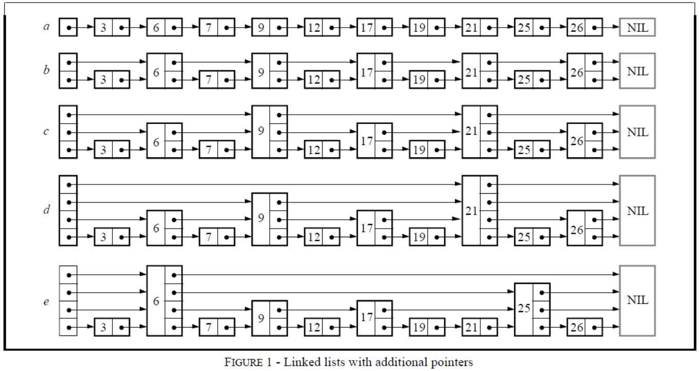
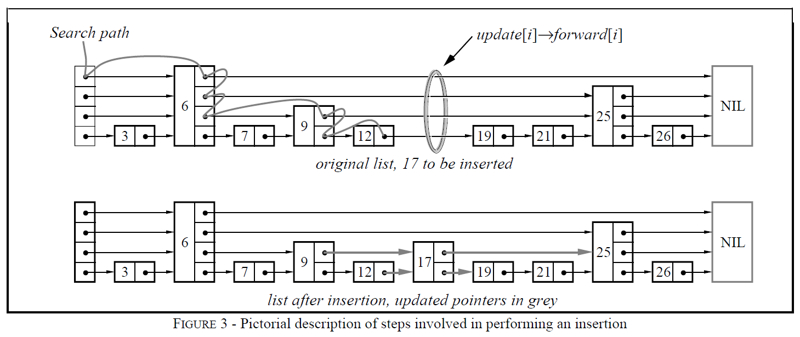
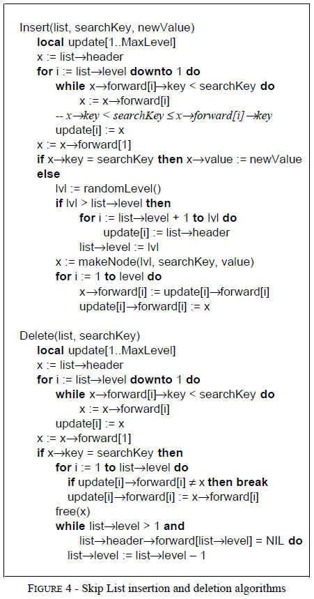
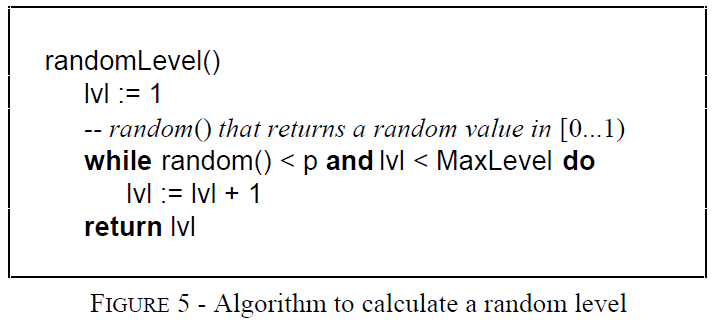
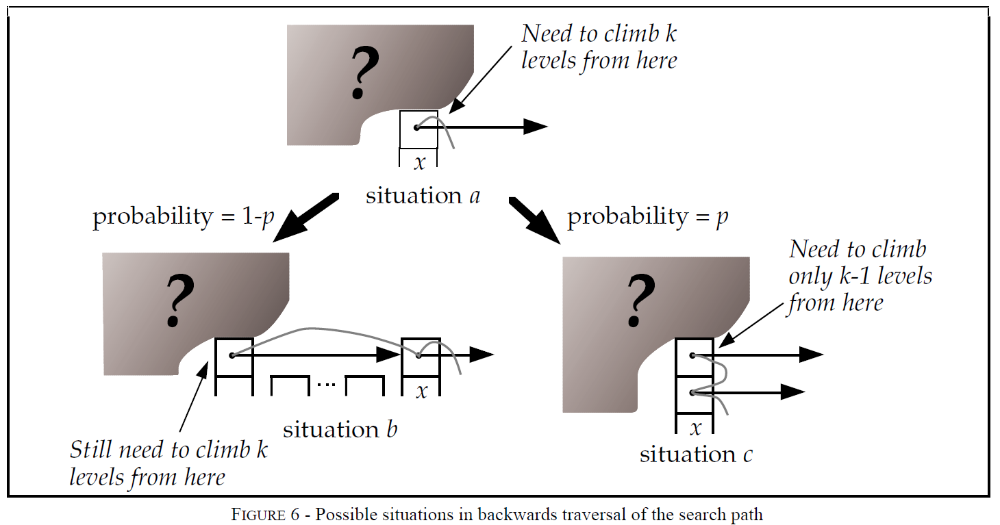
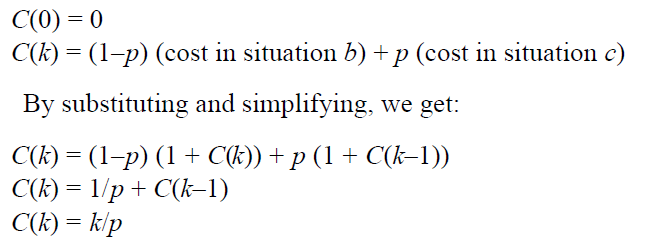
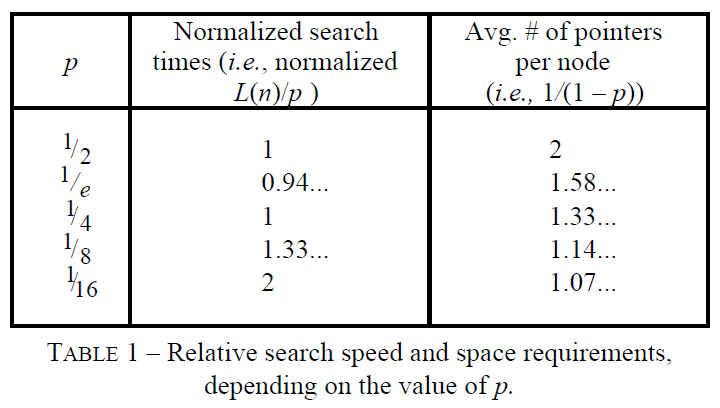

# Skip Lists: A Probabilistic Alternative to Balanced Trees
[TOC]
---
    

可以使用跳表来代替平衡树。跳表使用随机化来实现平衡(probabilistic balancing)，而不是使用严格操作限制来实现平衡(strictly enforced balancing)。因此在跳表中进行插入和删除会比在平衡树中更快更简单。

平衡树可以用来实现例如字典以及有序表等抽象数据结构。当元素以随机的顺序插入时，平衡树的效果很好。然而在一些序列化操作，比如依顺序插入元素时，可能会产生性能非常差的数据结构。如果有可能将元素列表重新随机排列，那么平衡树将会对序列化输入数据具有很好的性能。而在大多数情况下，查询操作需要在线解答（立刻得到答案）。因此随机排序查询顺序是不可行的。平衡树算法在执行操作时重新排列树，以保持一定的平衡条件，保证良好的性能。

跳表(Skip lists)是对平衡树的一个probabilistic alternative。跳表通过查询一个随机数产生器来实现平衡。尽管跳表在最差情况下的性能很差，但是没有哪个输入序列能够始终产生最差的性能(很像随机选择主元素时的快速排序)。对于一个跳表来说，它变得及其不平衡是不太可能的（比如，对于一个具有250个元素的字典，查询操作会花费预期时间3倍的概率不超过一百万分之一）。跳表的平衡性很像通过随机插入构造的搜索树的平衡性，然而跳表的平衡性并不需要严格的随机插入。

Balancing a data structure probabilistically is easier than explicitly maintaining the balance. 对于许多应用而言，跳表是一个更加自然的选择，并且相比平衡树实现更简单。

## Skip Lists
对于一个linked list来说，如果要查找某个元素，我们可能需要遍历整个链表。如果list是有序的，并且每两个结点都有一个指针指向它之后两位的结点(Figure 1b)，那么我们可以通过查找不超过$\lceil \frac{n}{2} \rceil + 1$个结点来完成查找。如果每四个结点都有一个指针指向其之后四位的结点，那么只需要检查最多$\lceil \frac{n}{4} \rceil + 2$个结点(Figure 1c)。如果所有的第$(2^{i})$个结点都有一个指针指向其$2^{i}$之后的结点(Figure 1d)，那么最大需要被检查的结点个数为$\lceil log_{n}2 \rceil$，代价仅仅是将需要的指针数量加倍。这种数据结构的查询效率很高，但是对它的插入和删除几乎是不可实现的。

一个具有 k 个`forward pointers`的结点称为一个`level k`结点。如果每$2^{i}$个结点都有一个指向其之后第$2^{i}$结点的指针，那么所有结点的`level`就是一个很简单的分布：50%的结点是`level 1`，25%的结点是`level 2`，12.5%的结点是`level 3` and so on。如果我们随机选择结点的`level`，并且还要保持相同的性质，结果会如何呢(Figure 1e)？这会导致**一个结点的第`i`个`forward pointer`指向下一个`level`为 i 或者更高的结点，而不是指向之后第$2^{i-1}$个结点**。

这样，插入和删除操作只需要进行本地修改；结点的`level`会在结点被插入时随机地选择，并且永远不会被改变。有时候对`level`的选择会导致很差的执行时间，但是后面我们会发现，这种情况其实很罕见。因为这些数据结构是具有额外指针的链表，这些额外指针会跳过中间的内部结点，所以称这种数据结构为跳表。

## Skip List Algorithm
介绍基本操作：
`Search`操作返回目标关键字所关联的value，如果没有该关键字则返回`failure`

`Insert`操作对目标关键字更新value，如果目标关键字不存在，则将关键字插入

`Delete`操作删除目标关键字。

像类似`Find the minimum key`以及`find the next key`的额外操作较容易实现。

每个元素以结点的形式存在，每个结点的`level`都是在插入时随机选择的。一个`level i`结点中有`i`个前向指针，索引从 1 到 i。结点的`level`被控制在一个适当的常数`MaxLevel`范围内。`Skip List`的`level`是当前list中的最大`level`。The header of a list has forward pointers at levels one through MaxLevel.在高于列表当前最大`level`的级别上，头的向前指针指向NIL。

### Initialization
空结点 `NIL` 中的关键字比所有有效结点中的关键字都大。新产生的list的`level`为1，并且list's header的所有`forward pointers`指向`NIL`。

### Search Algorithm
通过遍历所有含有不超过目标关键字的结点的前向指针，我们来对目标进行搜索。

当在当前`level`中没有满足条件的`forward pointers`之后，去下一层`level`继续搜索。当在`level 1`中没有满足条件的结点之后，那下一个结点就是我们所要搜索的包含目标关键字的结点。

### Insertion and Deletion Algorithm
为了添加或者删除一个结点，我们只需要进行搜索以及拼接，正如`Figure 3`所示。

搜索结束时，向量`update`中的元素`update[i]`保存一个指针，该指针指向`search`结束位置所有左侧结点中，最靠右边的`level i`结点。

如果插入操作产生了一个比之前`list`中最大`level`还大的结点，那么我们需要更新`the maximum level of the list`并且初始化`update`向量的适当的部分。在每次删除之后，我们会检查是否删除了`list`中的最大`level`结点。如果删除了也需要更新`maximum level of the list`。

### Choosing a Random Level
起初我们论证了，具有`level i`前向指针的结点中的一半也会具有`level i+1`指针。我们可以说，`p`比例的`level i`结点中会包含`level i+1`前向指针。`Level`是由`Figure 5`中的类似算法随机产生的。

### At what level do we start a search? Defining L(n)

在一个$p=\frac{1}{2}$，具有16个元素的跳表中，可能恰巧有9个`level 1`结点，3个`level 2`结点，三个`level 3`结点和一个`level 4`结点。如果如果我们使用标准搜索算法， 从`level 4`开始搜索，会做很多无用功。

我们的分析显示，理想情况下，我们应该在具有$\frac{1}{p}$个结点的`Level L`处开始搜寻。此时$L=log_{\frac{1}{p}}n$(原论文中是这个，但我觉得应该是$L=lon_{\frac{1}{p}}n-1$?)，由于我们会频繁使用这个公式，所以简记为L(n)。

Skip List中有时会出现在某个不寻常的`level`上只有一个元素的情况，有如下三种解决方法：
* Don't worry, be happy. 依然在list中的最高level上开始搜索。正如将在分析中看到的那样，一个n结点的list中的最高`level`大于L(n)的概率是非常小的。从最高`level`开始搜索仅仅会对最终的预期搜索时间添加一个常数时间项。这也是我们所采用的方法。
  
* Use less than you are given. 尽管某个元素可能会具有14个指针，我们并不需要使用所有的14个指针。我们可以只选择使用L(n)。有很多方法实现这种策略，但是实际带来的提升并不是很明显，因此并不推荐这种方法。

* Fix the dice. 如果产生一个比当前maximum level更大的结点，那么我们将新节点的`level`设置为`current maximum level + 1`。直觉上来看，这种方法似乎很好，但是实际上它会完全摧毁我们所有分析的基础：因为结点的`level`不再是随机值。

### Determining MaxLevel
如前所述，设置最大`level`为L(N)，可以保证我们快速地执行搜索。此处N表示跳表中所有元素的一个上界。如果p=1/2，那么对于一个包含$2^{16}$个元素的跳表来说，选择Maximum Level为16是一个适当的选择。

## Analysis of Skip List Algorithm

执行`Search, Delete and Insert`操作需要的时间由搜素目标元素的时间决定。对于`Insert` 和 `Delete`操作来说，有一个额外开销，该开销与被操作结点的`level`成比例。 寻找指定元素需要的时间与搜索路径的长度成比例，搜索路径则是由当我们遍历list时遇到的结点的level所决定。

### Probabilistic Philosophy

跳表的结构仅仅由其中元素的数量以及随机数产生器的结果决定。

### Analysis of expected search cost

我们从下往上从右往左分析搜索路径。

在climb的每个结点，我们都与`Figure 6`中 a 的情况相似————我们是结点 x 的第 i 个前向指针，并且我们不知道 x 左侧结点的 level，也不知道 x 的 level。假设 x 不是头结点。如果`level of x`是 i，那么就是情况 b，如果 x 的level比 i 大，那么就是情况 c。我们处于情况 c 的概率为 p（level i 结点中，有 p 比例的结点同时也是 level i+1 结点）。当我们处于情况 c 时，我们总是会 `climb up a level`。假设 C(k) 表示在一个无限的list中，向上爬 k 层需要的代价。那么有：

当我们向上爬爬到Head时，就不再进行左移。那么在一个 n 个元素的跳表中，从`level 1`爬到`level L(n)`的预期路径长度的上界为：`(L(n)-1)/p`。对于剩余的左移部分，`level L(n)`上结点数量的期望为 `1/p`，所以剩余的左移的期望代价为`1/p`。

跳表的最大高度大于list的可能性为$1-(1-p^{k})^{n}$，接近$np^{k}$。

Putting our results together, we find:

Total expected const to climb out of a list of n elements <= L(n)/p + 1/(1-p), which is O(log n)

### Number of comparisons

one plus the length of the search path.

### Probabilistic Analtsis
### Choosing p

减少p也增加了运行时间的可变性（方差）。建议 p 取 1/4，如果运行时间的可变性是首要关注点（要求运行时间方差较小），那么可以选 p 为 1/2。

