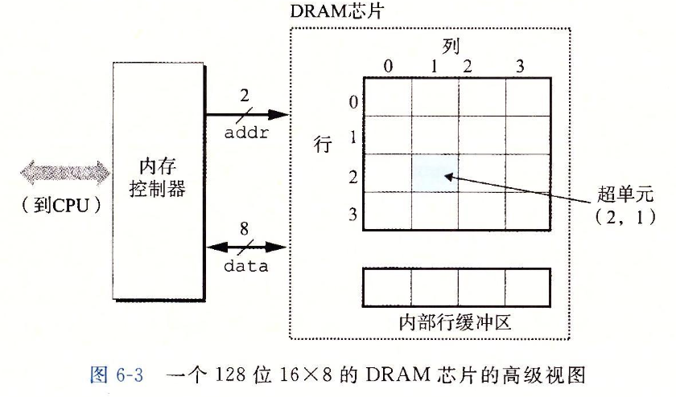
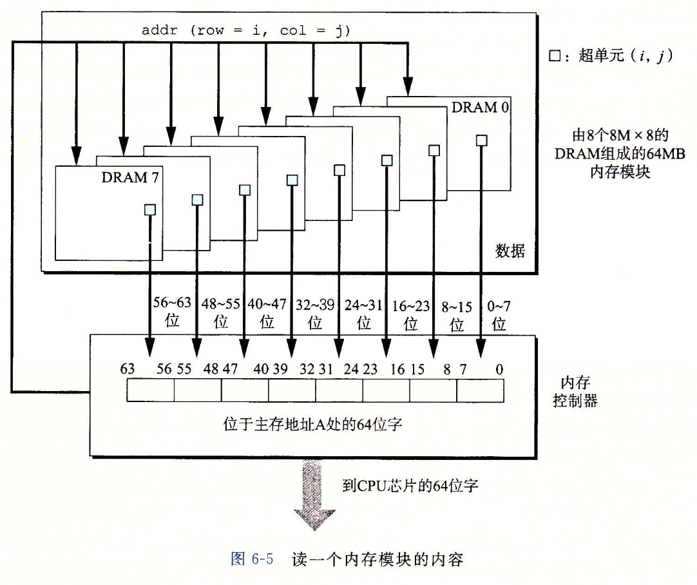

<!-- @import "[TOC]" {cmd="toc" depthFrom=1 depthTo=6 orderedList=false} -->

<!-- code_chunk_output -->

- [6 存储器层级结构](#6-存储器层级结构)
  - [6.1 存储技术](#61-存储技术)
    - [6.1.1 随机访问存储器](#611-随机访问存储器)
    - [6.1.2 磁盘存储](#612-磁盘存储)
    - [6.1.3 固态硬盘](#613-固态硬盘)
  - [6.2 局部性](#62-局部性)
    - [6.2.1 对程序数据引用的局部性](#621-对程序数据引用的局部性)
    - [6.2.2 取指令的局部性](#622-取指令的局部性)
    - [6.2.3 局部性小结](#623-局部性小结)

<!-- /code_chunk_output -->


# 6 存储器层级结构
## 6.1 存储技术
### 6.1.1 随机访问存储器
Random-Access Memory(RAM)
1. Static RAM: 稳定，高读写性能，贵，用于高速缓存

2. Dynamic RAM: 对环境敏感，访问时间是SRAM的10倍，价格为SRAM的1/1000，用于主存

每个 DRAM 都由 d 个 supercell 组成，每个 supercell 被分成 w 个 DRAM 单元。
每个 supercell 被组织成 r 行 c 列，`r * c = d`



比如上图是一个 16 * 8 的 DRAM，16 表示其有 16 个 supercell，每个 supercell 都是 8 位。所有的 supercell 按照 4 * 4 排列，4 行 4 列。

DRAM 芯片与内存控制器之间用两组引脚连接。一组 addr 引脚，携带两位的行+列的 supercell 地址，另一组 date 引脚为 8 位，表示从DRAM一次读写的一个字节数据。

**但是 DRAM 内部处理数据的读写请求时并不是以一个 supercell (1字节) 为单位的。**
DRAM 内部有行缓冲区，当CPU要求读 supercell (2,1) 时，DRAM 首先将第二行的所有 supercell 都读到行缓冲区内，然后再将行缓冲区列地址一的8位数据通过 data 引脚发送到内存控制器。

在实际的系统中会使用多块内存组成内存模块。比如，要读取主存地址 A 处的一个字（8字节），内存控制器将 A 转换成一个 supercell 地址 (i,j)，并将其发送到内存模块，然后每个内存块都读取各自的 (i,j)，其中 0 号内存芯片组成主存的第一个字节，依此类推。


### 6.1.2 磁盘存储
### 6.1.3 固态硬盘

## 6.2 局部性

在一个具有良好时间局部性的程序中，被引用过一次的内存位置很可能在不远的将来再被多次引用。
在一个具有良好空间局部性的程序中，如果一个内存位置被引用了一次，那么程序很可能在不远的将来引用附近的一个内存位置。

### 6.2.1 对程序数据引用的局部性
```cpp
int sumvec(int v[N])
{
    int i, sum = 0;
    for (i = 0; i < N; i++)
    {
        sum += v[i];
    }

    return sum;
}
```
对数组 v 的访问有很好的空间局部性：连续访问相邻的内存地址。时间局部性较差，每个地址只被访问一次。

步长为1的引用模式被称为顺序引用模式。

### 6.2.2 取指令的局部性
6.2.1 中的 for 循环具有很好的时间局部性，因为 for 内部的指令会被反复执行。

### 6.2.3 局部性小结
* 重复引用相同变量的程序具有良好的时间局部性
* 对于步长为 k 的引用模式的程序，步长越小，空间局部性越好。在内存中以大步长跳来跳去的程序空间局部性不好
* 对于取指令来说，循环具有较好的时间和空间局部性。并且循环体越小，循环迭代次数越多，局部性越好
