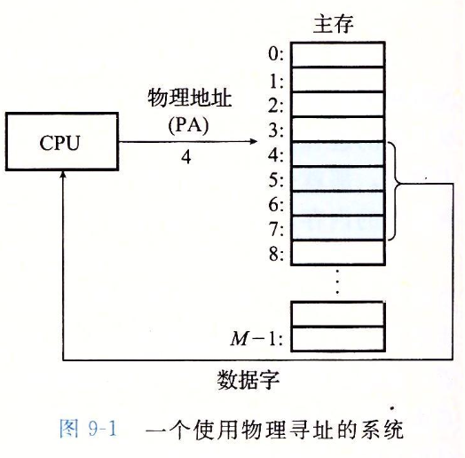
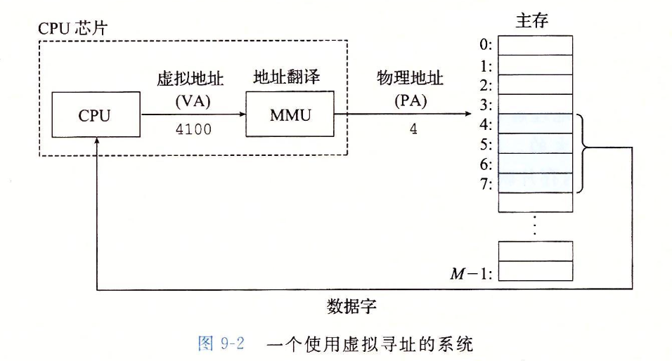
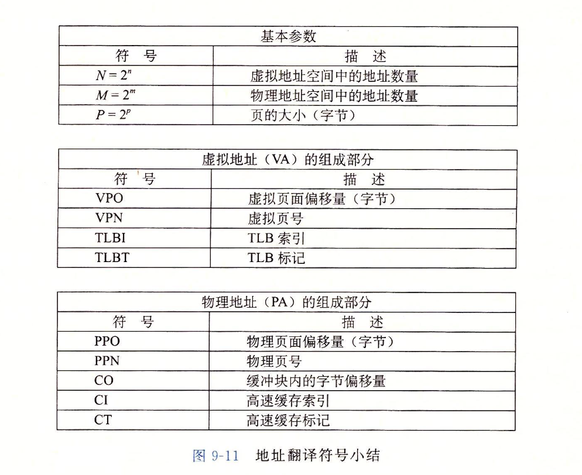
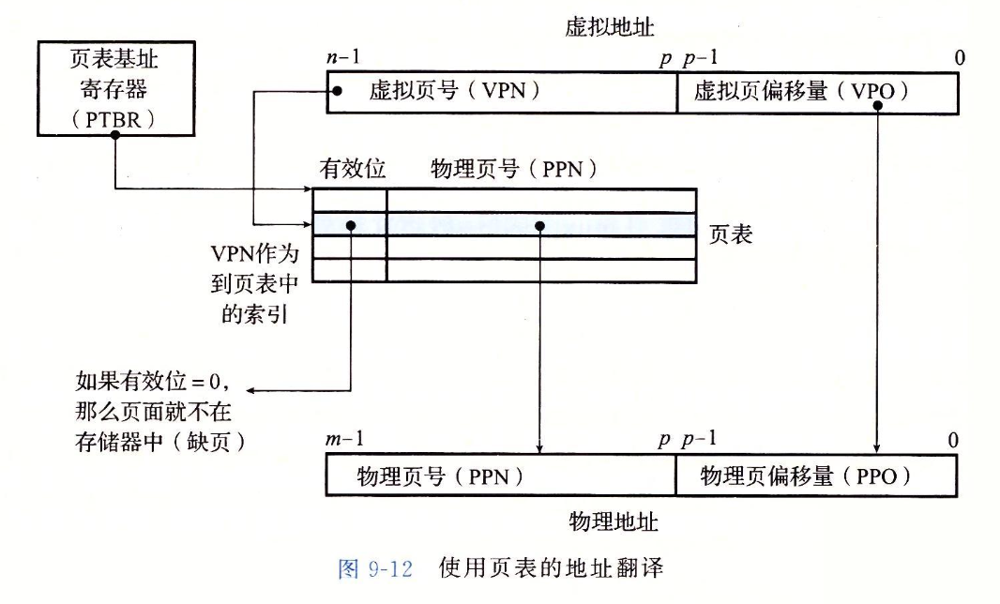
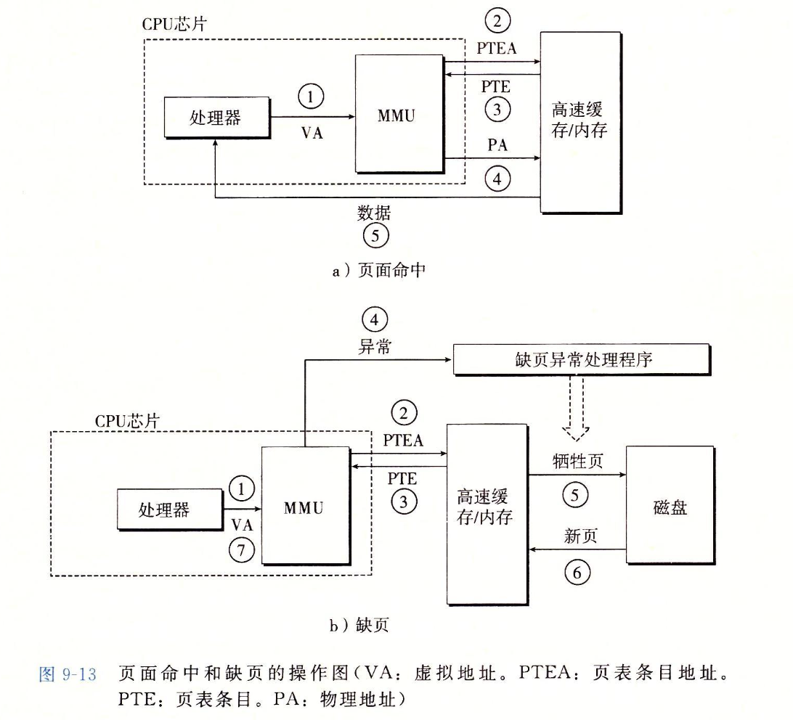
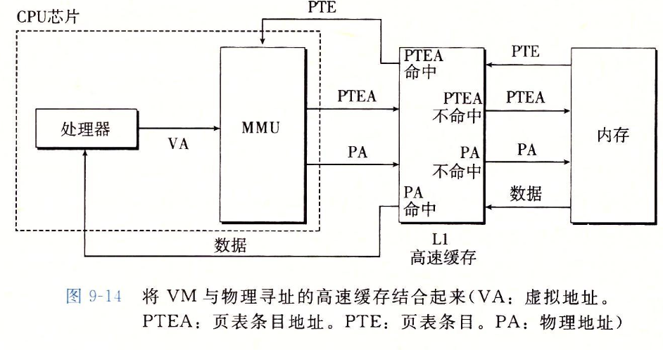

<!-- @import "[TOC]" {cmd="toc" depthFrom=1 depthTo=6 orderedList=false} -->

<!-- code_chunk_output -->

- [9 虚拟内存](#9-虚拟内存)
  - [9.1 物理和虚拟寻址](#91-物理和虚拟寻址)
  - [9.2 地址空间](#92-地址空间)
  - [9.3 虚拟内存作为缓存的工具](#93-虚拟内存作为缓存的工具)
    - [9.3.1 DRAM 缓存的组织结构](#931-dram-缓存的组织结构)
    - [9.3.2 页表](#932-页表)
  - [9.6 地址翻译](#96-地址翻译)
    - [9.6.1 结合高速缓存与虚拟内存](#961-结合高速缓存与虚拟内存)
    - [9.6.2 使用 TLB 加速地址翻译](#962-使用-tlb-加速地址翻译)

<!-- /code_chunk_output -->

# 9 虚拟内存
虚拟内存为每个进程提供了一个大的，一致的和私有的地址空间。
## 9.1 物理和虚拟寻址
CPU 访问内存的最自然的方式是使用物理地址，这种方式称为物理寻址。

现代处理器使用虚拟寻址的方式

CPU 生成一个虚拟地址来访问主存，这个虚拟地址在被送到内存之前被翻译成适当的物理地址。CPU 中的内存管理单元（Memory Management Unit, MMU）是一种专用硬件，利用存放在主存中的查询表来动态翻译虚拟地址。

## 9.2 地址空间
## 9.3 虚拟内存作为缓存的工具
虚拟内存被 VM 系统分割为虚拟页，每个虚拟页的大小固定。虚拟页是在磁盘和主存之间传输数据块的传输单元。

一个进程内的所有虚拟页被分为三类
* 未分配的：未被创建的页，不占用任何磁盘空间
* 缓存的：当前已经缓存在物理内存中的已分配页
* 未缓存的：未被缓存在物理内存观众的已分配页

### 9.3.1 DRAM 缓存的组织结构
由于 DRAM 的不命中惩罚要比 SRAM 大的多，所以虚拟页的大小往往很大，通常为 4KB ~ 2MB。操作系统对于 DRAM 缓存使用了非常精密复杂的替换算法。

### 9.3.2 页表
同任何缓存 一样，虚拟内存系统必须有某种方法来判定 一个虚拟页是否缓存在 DRAM 中的某个地方。如果是，系统还必须确定这 个虚拟页存放在哪 个物理页中。如果 不命中，系统必须判断这个虚拟页存放在磁盘的哪 个位置，在物理内存中选择一个牺牲 页，并将虚拟页从磁盘复制到DRAM 中，替换这个牺牲页。

这些功能是由软硬件联合提供的，包括操作系统软件、MMU(内存管理单元)中的地 址翻译硬件和 一个存放在物理内存中叫做页表(page table)的数据结构，页表将虚拟页映 射到物理页。每次地址翻译硬件将 一个虚拟地址转换为物理地址时，都会读取页表。操作 系统负责维护页表的内容，以及在磁盘与DRAM 之间来回传送页。

## 9.6 地址翻译

上图左上角的 PTBR 是 CPU 中的一个控制寄存器，叫做页表基址寄存器（Page Table Base Register），指向当前页表的基地址。MMU 如何得到物理地址：
1. 根据 VA 得到 VPN
2. 读 PTBR 获得页表地址
3. 使用 VPN 作为索引在页表中查询 page table entry
4. 找到 PPN
5. PPN + VPO 得到 PA

注意上图，PT 本身是存在主存中的（大概率被缓存在高速缓存中，但是访问其内容还是需要物理地址）

### 9.6.1 结合高速缓存与虚拟内存
前面我们提到，PT本身是存在主存中的，虽然其大概率被缓存在SRAM中，但是访问SRAM时通常是使用物理地址的！因为使用物理地址，多个进程同时在高速缓存中有存储块和共享来自相同虚拟页面的块成为简单的事情。

看上图，关键点是，地址翻译发生在高速缓存查找之前。

### 9.6.2 使用 TLB 加速地址翻译
前面提到，页表本身是保存在主存中的，虽然其可能会被缓存在SRAM中，但是在最糟糕的情况下，我们依然会导致多一次的内存访问。为了解决这个情况，大多数系统都在 MMU 中为页表项增加了一个单独的缓存，称为翻译后备缓冲器(Translation Lookaside Buffer, TLB)。

