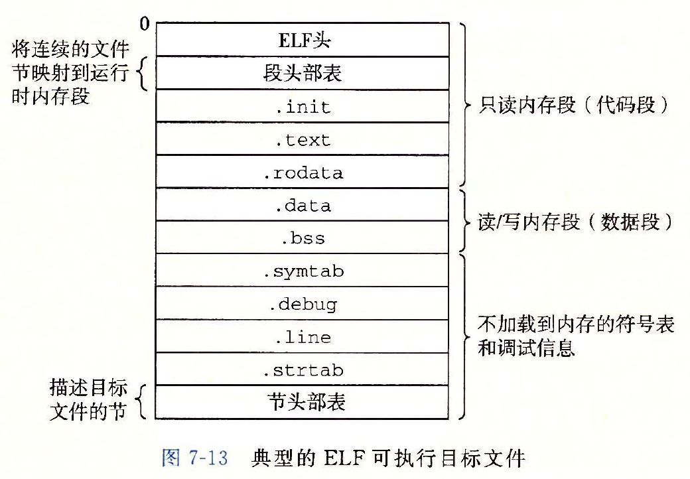
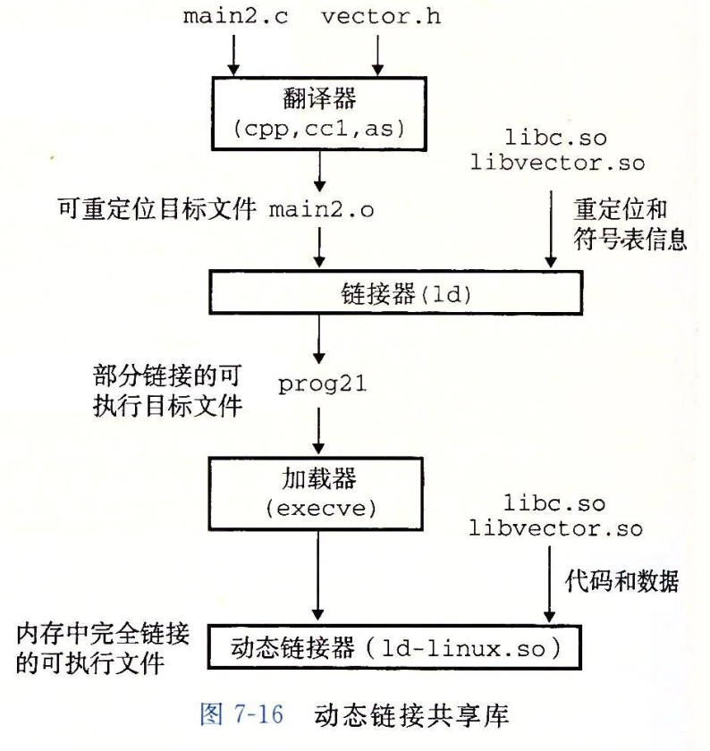

[TOC]
# Linking
什么是链接：Linking is a process of collecting and combining various pieces of code and data into a single file that can be loaded (copied) into memory and executed.
更加朴素的说法，链接是将输入的一组代码和数据的集合重新整理成一个文件，该文件可以被加载进内存并且运行。

为了规范描述，我们这里将链接器的输入文件称为可重定位目标文件，将链接器的输出文件称为可执行目标文件，有时会忽略两者的目标二字。

链接器为了得到一个可执行文件，需要完成两个主要任务：
1. Symbol resolution（符号解析）
2. Relocation（重定位）

第一个任务通俗来说，就是为每个符号找到其定义。比如我们在 main.cpp 中有这样的代码：
```c++
#include "myheader.h"

int main()
{
    ...
    auto result = myheader::Func();
    ...
    return 0;
}
```
编译器编译的时候在 myheader.h 中只找到了 `myheader::Func()` 的声明，没找到定义啊，定义在 myheader.cpp 里呢，编译器汇编器把 myheader.cpp 编译后得到了 myheader.o。main.o 跟 myheader.o 输入给链接器以后，链接器就去找到 myheader.o 中 Func 的位置，填到 main.o 中合适的位置。这个过程就是 symbol resolution，当然我这里说的很粗糙，但是就这么个整体意思。

第二个任务，重定位，则是说，main.o 既然要跟 myheader.o 合并到一起，那么新文件里，已有的符号怎么安排呢？谁在前谁在后呢？这就是重定位做的事。

## 7.4 可重定位目标文件
目标文件分为三类：
1. Relocatable object file
2. Executable object file
3. Shared object file

所有的这三类目标文件都具有相同的文件格式，称为对象文件格式。在现代的 x86-64 Linux 系统以及 UNIX 系统上，使用 Executable and Linkable Format(ELF)，其他系统使用不同的对象文件格式。目标文件中的内容，包含三部分，指令，数据以及格式信息，格式信息告诉使用者（链接器与加载器）如何解读指令与数据。

<center>
  
</center>

上图中描述了一个典型的 ELF 格式的可重定位目标文件，具体每个部分的作用与内容还是通过一个例子学习一下：
```c
// m.c
#include <stdio.h>
void swap();

int buf[2] = {1, 2};

int main()
{
    printf("Main Start\n");
    swap();
    return 0;
}

// swap.c
extern int buf[];

int *bufp0 = &buf[0];
int *bufp1;

void swap()
{
     int temp;

     bufp1 = &buf[1];
     temp = *bufp0;
     *bufp0 = *bufp1;
     *bufp1 = temp;
}
```
生成 m.o：
```bash
gcc -c m.c
```
首先看一下 ELF 头的内容，主要包含生成该文件的系统的信息以及帮助链接器进行语法分析和解读目标文件的信息。
```bash
[root@VM-211-238-centos csapp]# readelf -e main.o
ELF Header:
  Magic:   7f 45 4c 46 02 01 01 00 00 00 00 00 00 00 00 00
  Class:                             ELF64
  Data:                              2's complement, little endian
  Version:                           1 (current)
  OS/ABI:                            UNIX - System V
  ABI Version:                       0
  Type:                              REL (Relocatable file)
  Machine:                           Advanced Micro Devices X86-64
  Version:                           0x1
  Entry point address:               0x0
  Start of program headers:          0 (bytes into file)
  Start of section headers:          688 (bytes into file)
  Flags:                             0x0
  Size of this header:               64 (bytes)
  Size of program headers:           0 (bytes)
  Number of program headers:         0
  Size of section headers:           64 (bytes)
  Number of section headers:         12
  Section header string table index: 1

Section Headers:
  [Nr] Name              Type             Address           Offset
       Size              EntSize          Flags  Link  Info  Align
  [ 0]                   NULL             0000000000000000  00000000
       0000000000000000  0000000000000000           0     0     0
  [ 1] .strtab           STRTAB           0000000000000000  00000222
       0000000000000089  0000000000000000           0     0     1
  [ 2] .text             PROGBITS         0000000000000000  00000040
       0000000000000030  0000000000000000  AX       0     0     16
  [ 3] .rela.text        RELA             0000000000000000  000001c0
       0000000000000048  0000000000000018          11     2     8
  [ 4] .data             PROGBITS         0000000000000000  00000070
       0000000000000008  0000000000000000  WA       0     0     4
  [ 5] .rodata.str1.1    PROGBITS         0000000000000000  00000078
       000000000000000c  0000000000000001 AMS       0     0     1
  [ 6] .comment          PROGBITS         0000000000000000  00000084
       0000000000000041  0000000000000001  MS       0     0     1
  [ 7] .note.GNU-stack   PROGBITS         0000000000000000  000000c5
       0000000000000000  0000000000000000           0     0     1
  [ 8] .eh_frame         X86_64_UNWIND    0000000000000000  000000c8
       0000000000000038  0000000000000000   A       0     0     8
  [ 9] .rela.eh_frame    RELA             0000000000000000  00000208
       0000000000000018  0000000000000018          11     8     8
  [10] .llvm_addrsig     LOOS+0xfff4c03   0000000000000000  00000220
       0000000000000002  0000000000000000   E      11     0     1
  [11] .symtab           SYMTAB           0000000000000000  00000100
       00000000000000c0  0000000000000018           1     4     8
Key to Flags:
  W (write), A (alloc), X (execute), M (merge), S (strings), I (info),
  L (link order), O (extra OS processing required), G (group), T (TLS),
  C (compressed), x (unknown), o (OS specific), E (exclude),
  l (large), p (processor specific)

There are no program headers in this file.
```

**.text** ：已编译程序的机器代码
**.rodata**：只读数据，比如 printf 语句中的格式串
```bash
readelf -p 5 m.o

String dump of section '.rodata':
  [     0]  Main Start
```

**.data**：已初始化的全局和静态C变量
**.bss**：未初始化的全局和静态C变量
**.systab**：符号表，之后会介绍，主要是用于链接器进行符号解析和重定位
**.debug**：调试符号表，使用 -g 参数编译才会得到该表
**strtab**：字符串表，其内容包含 .systab 和 .debug 中的符号表以及 section header 中的 section name
```bash
readelf -p 11 m.o

String dump of section '.strtab':
  [     1]  m.c
  [     5]  buf
  [     9]  main
  [     e]  puts
  [    13]  swap
```

## 7.5 符号与符号表
每一个可重定位目标文件的模块 m 均包含一个符号表。该符号表记录了模块 m 定义以及引用的所有符号信息。在链接器的语境下，符号被分为三类：

* 由模块 m 定义，且可以被其他模块引用的符号的全局符号。比如模块 m 中定义的 nonstatic function 以及 global variables
* 被模块 m 引用，但是由其他模块定义的全局符号。比如 m1 引用了 m2 定义的 nonstatic function。
* 由模块 m 定义并且只可以被模块 m 引用的本地符号。比如模块 m 中的 static function 以及 static global variables

第三类中提到的本地符号并不包括任何 local nonstatic 变量，如函数的局部变量，链接器并不关心这类变量的地址。这类变量是在运行时被创建在栈上的。

**编译器负责为每个符号（不包括 local nonstatic）创建一个 unique name，汇编器将会使用这些 name 来构造符号表（symbol table）**

符号表被保存在目标文件的 `.symtab` 段内，符号表的每个项具有如下信息：
```c
typedef struct {
    int name;
    char type:4,
         binding:4;
    char reserved;
    short section;
    long value;
    long size;
} Elf64_Symbol;
```
name 字段可以简单理解为是符号的名称（实际上有区别），不过注意，这里符号名称并不一定就是符号在源码中的命名，通常是经过编码或者改写后的名字，目的是为了防止重复，由编译器最初产生。

value 是符号的地址，对于可重定位目标文件，value 是该符号到其所在 section 开始位置的偏移量；对于可执行目标文件（链接后），value 通常是一个运行时的绝对地址。

size（bytes）是该对象的大小。type 字段表明符号类型，不是 data 就是 function。binding 字段表明该字段是 local （再次强调，不包含 local nonstatic）还是 global。

其它字段具体含义不细说。

我们已以下代码为例查看一下实际的符号表长什么样：
```c
// m.c
void swap();

int buf[2] = {1, 2};

int main()
{
    swap();
    return 0;
}

// swap.c
extern int buf[];

int *bufp0 = &buf[0];
int *bufp1;

void swap()
{
     int temp;

     bufp1 = &buf[1];
     temp = *bufp0;
     *bufp0 = *bufp1;
     *bufp1 = temp;
}
```
生成 m.o，并通过 readelf 查看其符号表内容
```bash
gcc -c m.c

readelf -s m.o
```
得到的精简版符号表：
```bash
Num:    Value          Size Type    Bind   Vis      Ndx Name
...
8: 0000000000000000       8 OBJECT  GLOBAL DEFAULT    3 buf
9: 0000000000000000      21 FUNC    GLOBAL DEFAULT    1 main
10: 0000000000000000      0 NOTYPE  GLOBAL DEFAULT  UND swap
```
这里 Ndx 表示该符号在 section header 的第几个 section 中：
```bash
readelf -S m.o

There are 12 section headers, starting at offset 0x260:

Section Headers:
  [Nr] Name              Type             Address           Offset
       Size              EntSize          Flags  Link  Info  Align
  ...
  [ 1] .text             PROGBITS         0000000000000000  00000040
       0000000000000015  0000000000000000  AX       0     0     1
  [ 2] .rela.text        RELA             0000000000000000  000001d0
       0000000000000018  0000000000000018   I       9     1     8
  [ 3] .data             PROGBITS         0000000000000000  00000058
       0000000000000008  0000000000000000  WA       0     0     8
  [ 4] .bss              NOBITS           0000000000000000  00000060
       0000000000000000  0000000000000000  WA       0     0     1
  ...
  [ 9] .symtab           SYMTAB           0000000000000000  000000b0
       0000000000000108  0000000000000018          10     8     8
  ...
```
所以，buf 是一个被定义在 .data section 中偏移量为 0 字节的 8 字节对象，main 是一个被定义在 .text section 中偏移量为 0 字节的 21 字节函数对象。swap 的 Ndx 为 UND，表示在该目标文件内没找到该符号的定义。


## 符号解析
符号解析就是链接器为所有的符号引用绑定一个符号表中的符号的过程。对于 local symbols，这一步很简单，因为符号的定义就在本模块内。对于 global symbols，编译器一旦遇到一个当前模块没有定义过的符号，它会假设其他模块有该符号的定义，同时在符号表里记录一个 linker symbol table entry，让链接器在链接的时候去其他模块里找。

然而，有可能多个目标文件里定义了具有相同名字的符号。那么链接器必须处理这种情况（报错或者找到正确的定义），在 Linux 系统上，这种问题的处理需要编译器、汇编器以及链接器一起配合。

### 链接器如何解析重复的符号名称
链接器的输入是一组可重定位目标模块。每一个模块内部都定义了一组符号。

在编译的时候，编译器会对每个 global 符号标记一个强弱类型，汇编器会将该信息记录在每个可重定位目标文件的符号表中。**函数以及初始化过的全局变量是强类型，未初始化的global variables是弱类型。**

链接器采用如下规则来处理**可重定位目标文件中**重复的符号名称：
1. 不允许出现具有相同名称的多个强类型符号
2. 假如有一个强类型符号和多个弱类型符号具有相同名称，那么选择强类型符号
3. 假如有多个具有相同名称的弱类型符号，选择其中任一一个

```c
/* foo1.c */
int main()
{
    return 0;
}

/* bar1.c */
int main()
{
    return 0;
}
```
基于规则 1，上述代码在链接时会报错，main 这个符号被重复定义。

同样的基于规则 1，下面的代码也会在链接时报错：
```c
/* foo2.c */
int x = 123123;

int main()
{
    return 0;
}

/* bar2.c */
int x = 123456;

int main()
{
    return 0;
}
```

但是，如果我们不对 bar2.c 中的 全局变量 x 做初始化，那么编译器会默默选择具有强类型的 foo2.c 中的 x
```c
/* foo3.c */
#include <stdio.h>
void f(void);

int x = 15213;

int main()
{
    f();
    printf("x = %d\n", x);
    return 0;
}

/* bar3.c */
int x;

void f(void)
{
    x = 15212;
}
```
上述代码在链接时 bar3.c 中的弱类型 x 地址会被 foo3.c 中的 x 替代，导致 f 修改了 foo3.c 中的全局变量 x。同样，如果遇到两个相同名称的弱类型符号，由于链接器随机选择一个，也会导致程序在运行时产生意料之外的结果。并且，当遇到两个类型不同的弱类型符号时，很可能产生非常难以定位的问题，比如
```c
/* foo5.c */
#include <stdio.h>
void f(void);

int y = 15212;
int x = 15213;

int main()
{
    f();
    printf("x = 0x%x y = 0x%x \n), x, y);
    return 0;
}

/* bar5.c */
double xl

void f(void);
{
    x = -0.0;
}
```

在一个 x86-64/Linux 系统上，doubles 是 8 字节，ints 是 4 字节。那么 bar5.c 中的语句 `x = -0,0;` 按照 double 的 8 字节对 x 赋值会**覆盖紧跟在其之后的 4 字节的 y！**。
不过幸运的是，链接器通常会在链接过程中对此类情况报一个 WARNING，所以我们对于链接时的 WARNING 一定要注意。
```bash
gcc -Wall -Og -o foobar5 foo5.c bar5.c
ld: warning: tentative definition of '_x' with size 8 from '/var/folders/3z/_h8g48f13v3g3py3qbr5frr40000gn/T/bar5-1b94ef.o' is being replaced by real definition of smaller size 4 from '/var/folders/3z/_h8g48f13v3g3py3qbr5frr40000gn/T/foo5-834229.o'

./foobar5
x = 0x0 y = 0x3b6c
```
### 链接静态库
到目前为止，我们都假设链接器的输入是一组可重定位目标文件，输出是一个可执行目标文件。在实践中，所有的构建系统都支持都提供将相关的所有模块打包进一个单独叫做静态库的文件（static library），**该文件可以作为链接器的输入**。**当静态库作为链接器的输入时，链接器只会复制静态库中被可重定位目标文件引用到的部分**。

为什么需要静态库这里不再仔细分析，只对其优点稍作总结：
1. 将所有模块编译连接得到一个静态库可以在链接时减少输入参数
   
```bash
# 不好
gcc main.c /usr/lib/printf.o /usr/lib/scanf.o ...

# 好
gcc main.c /usr/lib/libc.a
```
2. 按需拷贝，不至于使得最终的可执行目标文件过大，内容过于重复
3. 库的维护者便于发布自己的库

在 Linux 系统上，静态库文件以一个特殊的被称为 archive 的格式保存。

### 链接器如何使用静态库来解析引用
在符号解析阶段，链接器会扫描可重定位目标文件和库文件（archive 文件），顺序是从左到右，与通过命令行传递给编译器的参数顺序一致。在扫描期间，链接器维护一个集合 E，一个集合 U 以及一个集合 D。集合 E 包含将会被 merge 成可执行目标文件的所有可重定位目标文件，集合 U 包含未被解析的符号（比如有引用但是未定义的符号），集合 D 包含那些已经被定义过的符号。起初，这三个集合都是空的。
* 对于每个命令行的输入文件 f，链接器首先判断它是一个目标文件还是一个库文件。如果 f 是一个目标文件，那么链接器把 f 添加到 E 中，并且更新 U 和 D
* 如果 f 是一个库文件，链接器将会尝试为 U 中的未定义符号在 f 中找到一个定义。如果库文件中模块 m 定义了 U 中的一个符号，**那么 m 会被添加到 E**，并且更新 U 和 D。
* 如果在链接器处理完所有的文件后，集合 U 依然非空，那么就会打印错误信息。

因此，目标文件传递到链接器的命令行参数顺序非常重要。**如果定义了未定义符号的库文件出现的顺序在可重定位目标文件之前，那么引用将会失败，链接终止**。通常来说，库文件一定要放在编译参数的最后。如果库文件之间不是独立的，那么我们必须要保证，引用出现在定义之前。如果必要的话，库文件是可以倍多次输入给链接器的。

我们前面介绍链接器处理重复定义符号的规则时，强调了该规则是对应可重定位目标文件的，在处理链接静态链接库中的重复定义符号时，规则不同。
```c++
// main.cpp
#include "foo.h"

int main()
{
    funcA();
    return 0;
}

// foo.h
void funcA();

// foo1.cpp
#include <iostream>

void funcA() { std::cout << "foo1::funcA()\n"; }

// foo2.cpp
#include <iostream>

void funcA() {std::cout << "foo2::funcA()\n"; }
```
假如我们把 foo1.cpp 和 foo2.cpp 都编译成可重定位目标文件，然后与 main.o 链接，那么会报 funcA 重复定义的错误：
```bash
clang++ -o foo1.o -c foo1.cpp
clang++ -o foo2.o -c foo2.cpp

clang++ -Wall -o main main.cpp foo1.o foo2.o
duplicate symbol 'funcA()' in:
    foo1.o
    foo2.o
ld: 1 duplicate symbol for architecture x86_64
clang: error: linker command failed with exit code 1 (use -v to see invocation)
```
但是如果是编译成两个静态链接库，然后再与 main.o 链接，则链接器不会报错，而是选择找到的第一个符号：
```bash
ar rcs foo1.a foo1.o
ar rcs foo2.a foo2.o

clang++ -o main main.cpp foo1.a foo2.a
./main
foo1::funcA()
```

关于重复符号定义问题，会有一份专门的笔记。

## 重定位

在符号解析阶段完成之后，链接器就为每个符号关联了其定义。此时，链接器就知道它的输入目标文件中，数据与代码段究竟有多大，也就可以为每个符号设置运行时地址。这些工作都是在重定位阶段完成的：**将输入的模块 merge 成一个文件，并且为每个符号设置运行时地址**。

**重定位条目**

重定位条目是由汇编器生成的，当汇编器遇到一个需要重定位的符号时，就会为其生成一个条重定位条目，其内容交给链接器解读，链接器根据重定位条目的内容决定如何修改 .text section 以及 .data section 中的内容。


```c
int sum(int *a, int n);

int array[2] = {1, 2};

int main()
{
    int val = sum(array, 2);
    return val;
}

// sum.c
int sum(int *a, int n)
{
    int i, s = 0;

    for(i = 0; i < n; i++>) {
        s += a[i];
    }

    return s;
}
```
main.o 的反汇编代码，这部分就是 .text section 的内容
```x86asm
0000000000000000 <main>:
   0:	55                   	push   %rbp
   1:	48 89 e5             	mov    %rsp,%rbp
   4:	48 83 ec 10          	sub    $0x10,%rsp
   8:	be 02 00 00 00       	mov    $0x2,%esi
   d:	bf 00 00 00 00       	mov    $0x0,%edi
  12:	e8 00 00 00 00       	callq  17 <main+0x17>
  17:	89 45 fc             	mov    %eax,-0x4(%rbp)
  1a:	8b 45 fc             	mov    -0x4(%rbp),%eax
  1d:	c9                   	leaveq
  1e:	c3                   	retq
```
查看一下 main.o 的重定位条目，**代码的重定位条目放在`.rela.text`中，已初始化数据的重定位条目放在`.rela.data`中**
```bash
readelf -r main.o

Relocation section '.rela.text' at offset 0x1d8 contains 2 entries:
  Offset          Info           Type           Sym. Value    Sym. Name + Addend
00000000000e  00080000000a R_X86_64_32       0000000000000000 array + 0
000000000013  000a00000004 R_X86_64_PLT32    0000000000000000 sum - 4

Relocation section '.rela.eh_frame' at offset 0x208 contains 1 entry:
  Offset          Info           Type           Sym. Value    Sym. Name + Addend
000000000020  000200000002 R_X86_64_PC32     0000000000000000 .text + 0
```
main.c 引用了两个全局符号：array 和 sum，为每个引用，汇编器会在对应的 section 产生一个重定位条目，具体内容如上。sum 的重定位条目类型为`R_X86_64_PLT32`（等价于老版本里的 R_X86_64_PC32），告诉编译器对 sum 的引用要使用 32 位 PC 相对地址进行重定位，对 array 的引用使用 32 位绝对地址进行重定位。

**重定位符号引用**

1. 重定位 PC 相对引用

我们看到 main.o 的 .text 中偏移量为 0x12 的地方开始了指令 call，指令 call 本身编码后操作码为 e8 占 1 字节，后面的四个字节为对 sum 地址的占位符，这里占位符应该填什么，是在 sum 的重定位条目中描述的：
```bash
r.offset == 0x13
r.symbol = sum
r.type = R_X86_64_PLT32
r.addend = -4
```
这个条目，告诉链接器，需要修改开始于偏移量 0x13（0x12 是 call 的位置，0x13 就是 sum 的地址应该被写入的位置）的 32 位 PC 相对引用，将其内容修改为 sum 定义所在的位置。

2. 重定位绝对引用

注意汇编代码的第 5 行，mov 指令将 array 的地址（一个 32 位立即数）复制到寄存器 %edi 中，mov 指令之后跟的一个对 array 的 32 位绝对引用的占位符。对应的重定位描述符为
```bash
r.offset == 0xe
r.symbol = array
r.type = R_X86_64_32
r.addend = 0
```


总结一下，重定位符号引用的解析过程：
1. assamble 在可重定位目标文件的 .text section 以及 .data section 重定位符号的所在的位置插入一个占位符；
2. assamble 为每个可重定位符号创建一个重定位条目
3. 链接器根据重定位条目修改代码段的指定位置，用实际的运行时地址替换这些占位符
## 7.8 可执行目标文件
<center>

</center>

经过链接器的处理之后，我们得到了单一的可执行目标文件。其格式类似于可重定位目标文件。

其中段头部表描述了，可执行目标文件的内存地址应该如何映射到目标文件的各个section。

## 7.9 加载可执行目标文件

任何Linux程序都可以通过调用 execve 函数来调用加载器。加载器将可执行目标文件中的代码和数据从磁盘复制到内存，然后通过跳转到程序的第一条指令或者入口点来运行该程序。

加载器会为可执行目标文件创建内存映像，然后将可执行文件的chunk复制到代码段和数据段，然后将跳转到程序的入口点。

对于所有的 C 程序，该入口点都是函数 _start。实现在系统目标文件 ctrl.o 中，该函数将会调用操作系统的进程启动函数 __libc_start_main，该函数定义在 libc.so 中。

__libc_start_main 将会初始化执行环境，调用用户层的 main 函数。

## 7.10 动态链接共享库
静态库的问题：
1. 一旦静态库需要更新，那么为了使用新的代码，我们需要重新编译可执行目标文件
2. 有些函数，比如 printf，几乎会被所有的 C 程序使用，如果都采用静态库链接，那么内存中不同进程的 .text 段中将会有重复的 prinft 函数，这对于内存来说很浪费


共享库所谓共享指两个方面：
1. 某个特定的共享库在文件系统中只对应一个 .so 文件，其中的代码段和数据段被所有引用该库的可执行目标文件共享
2. A single copy of the .text section of a shared library in memory can be shared by different running processes.

<center>
  
</center>

动态连接的基本原理是，在生成可执行目标文件时，只做一些静态的链接，然后在程序被加载/运行时完成剩余的链接。这里的所谓静态链接，指链接器将一些重定位信息和符号表信息复制到部分链接的可执行目标文件内，在运行时，这些信息将足够用于解析 libvector.so 中的符号和数据的具体引用。部分链接的可执行文件中会包含一个特殊的 .interp section，这个section内包含动态链接器的路径名称（path of ld-linux.so）。加载器在加载部分链接的可执行文件时，不会直接把程序计数器设置为程序的入口点，而是加载且执行动态链接器。动态链接器完成：

1. 将 libc.so 的代码和数据重定位到一些 memory segment；
2. 将 libvector.so 的代码和数据重定位到 another memory segment；
3. 将 prog21 中任何对 libc.so 和 libvector.so 的符号的引用重定位到前面 1 和 2 阶段指定的内存地址。

## 7.11 Loading and Linking Shared Libraries from Applications
前面一节讲了动态链接器如何链接动态库。实际上，应用程序可以显式地要求动态链接器在应用程序运行的时候去加载任意的动态链接库。CSAPP 对应的章节有例子，不细说了。

## 7.12 Position-Independent Code（PIC）
PIC 用于实现共享库。

实现共享库的最朴素方法是固定每个进程的一段虚拟地址空间作为共享库的加载地址，但是：
1. 如果某个进程没有用到共享库，这么这段虚拟地址被浪费；
2. 需要确保每个共享库都的大小不会超过这段虚拟地址空间；
3. 如果需要链接的共享库非常多，空间不够用。

现代编译系统将共享模块的 code segment 编译成可以被加载到内存中的任意地址，而不需要链接器在链接时为其设置运行时地址。