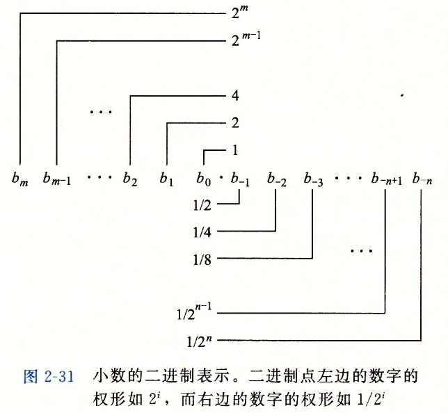
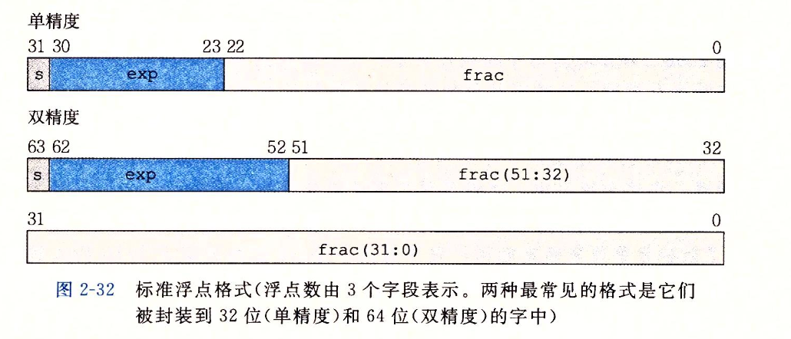
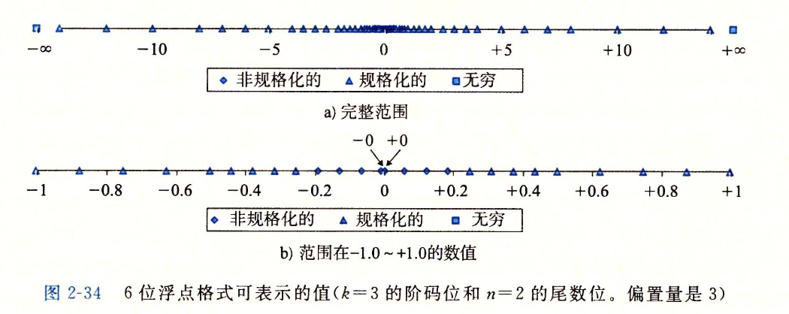

<!-- @import "[TOC]" {cmd="toc" depthFrom=1 depthTo=6 orderedList=false} -->

<!-- code_chunk_output -->

- [二进制整数的计算机编码](#二进制整数的计算机编码)
  - [补数](#补数)
  - [计算机中的补数](#计算机中的补数)
  - [补码系统](#补码系统)
- [小数的计算机编码](#小数的计算机编码)
  - [定点表示法](#定点表示法)
  - [IEEE 浮点表示](#ieee-浮点表示)
    - [舍入](#舍入)
  - [浮点运算](#浮点运算)

<!-- /code_chunk_output -->

## 二进制整数的计算机编码
### 补数
在实际的计算系统中，有限的数字范围才是常态。

以 24 小时时钟为例，有效数字就是 [0, 23]。当数字范围有限时，就一定会有 `A +- B` 的结果超出有效范围的情况发生。比如当前时间点是 23 点，`16 + 11 = 27` 超出了表示范围，而在时间系统中，我们习惯的是忽略溢出部分，只关心有效部分，因此在时间系统中，隐含的一个操作是，`(16 + 11) % 24`。

做一个变换：`(16 + 11) % 24 = (16 + 11 + 24) % 24 = (16 - 13 + 24) % 24`

我们发现，在时钟系统中，`+11` 的效果与 `-13` 的效果一样。反过来说，`-13` 的效果与 `+11` 一样。

这里我们称 13 是 11 在 24 进制下的补数。(twenty-four's complement)

补数的严格定义：**补数（complement）是对于给定的进位制，相加后能使自然数 a 的位数增加 1 的最小的数**。

https://zh.wikipedia.org/wiki/%E8%A1%A5%E6%95%B0

### 计算机中的补数
前面提到，在时钟计算系统中，`-A` 与 `+A` 的 `24‘s complement` 效果一样。这个特性对于计算机实现来说非常有吸引力，因为我们实现加法电路非常容易，如果能使用同一套电路实现加减法那么可以降低 CPU 制造成本。

时钟系统中，上述效果一样的前提是，我们只关心有效部分，不关心溢出部分。而在计算机的二进制加法电路中，天然就有这个特性。

并且对于一个二进制数 `101010110`，我们可以非常容易计算其补数
`101010110` 的 `2‘s complement` 应该是按位取反再 `+1`，即 `010101001 + 1 = 010101010`

### 补码系统
补码系统是计算机中使用的用来对二进制数进行编码的规则。

* 正数二进制和 0 的补码是其本身二进制表示在加上符号位 0
* 负数二进制的补码是其补数的二进制再加上符号位 1

**补码系统是为了解决计算机系统中存在的问题提出的，正数二进制以及 0 的计算不存在问题，所以只需要使用其本身的格式就可以。负数二进制采用符号位 + 补数的二进制表示之后，可以将对正数的减法快速变为对对应负数的加法，这才是使用补码系统的目的。**

举例：如果没有补码表示，那么对于 -1，其二进制表示应该是 `1000 0001`，最高位为符号位。我们需要一套额外的减法运算电路去进行减法计算，但是将 -1 采用补码表示后 `1111 1111`，当某个数 A 需要 - 1 时，我们只需要将操作数 A 与 `1111 1111` 送入加法电路即可得到结果。

https://zh.wikipedia.org/wiki/%E4%BA%8C%E8%A3%9C%E6%95%B8

## 小数的计算机编码
### 定点表示法
朴素的方法，跟常见的 10 进制小数一样，二进制位与小数的每一位对应，按位加权求和计算得到所表示的小数。

比如 `1011.1` 表示数 `8 + 0 + 2 + 1 + 1/2 = 11(1/2)`。

这种表示称为小数的定点表示法。

二进制小数与十进制小数一样，对于有些数无法精确表示，只能通过增加位数无限去逼近。

十进制小数表示 `1/3`: `1/3 = 3/10 + 3/100 + ... + 3/(100^m)`
二进制小数表示 `1/3`: `1/3 = 1/4 + 1/8 + 1/16 + ... + 1/(2^m)`
我们可以通过增加 m 来实现无限逼近 1/3，但是在两种进制小我们都无法精确表示 1/3 这个小数。

**定点表示法最大的问题：固定精度下，表示数的范围有限制，并且范围较小。**

对于一个给定长度 m 的采用定点表示法的二进制小数，假设我们不考虑符号位，那么其能够表示的最大范围越大，表示得到的精度就越小。（极端情况，需要表示 `INT64_MAX - 1.9`，定点表示下，用来表示整数部分的位就需要 64 位，没有位置来表示 0，那这时候误差就达到了 0.9）
### IEEE 浮点表示

https://www.h-schmidt.net/FloatConverter/IEEE754.html

对于任何一个小数 V，采用 `V=(-1)^s * M * 2^E` 的形式来表示，其中 s 被称为符号位（sign），M 称为尾数（significand）M 是一个二进制小数，E 称为阶码，作用是对浮点数进行加权，权重是 2 的 E 次幂。E 可以是负数。

上面这张图表示的是浮点数编码在 32 位与 64 位中的不同格式，具体 E 与 exp 以及 M 与 frac 的关系就不说了，反正也记不住。

2-34 这张图展示了 6 位格式下，阶码位数为 3，尾数位数为 2 时，浮点数表示数字的密度。

很明显，在不同的数字范围下，浮点数的表示精度是不同的，

#### 舍入

对于一个实数而言，当其无法在被浮点数精确表示时，我们需要找一个能够“最接近”这个实数的精确值。然而在不同的情景下，“最精确”的定义可能不同。

IEEE 定义了四种舍入方式
* 向偶数舍入
* 向零舍入
* 向下舍入
* 向上舍入

### 浮点运算
IEEE：按实数进行运算，然后再舍入。

**浮点加法不具备结合性。**
