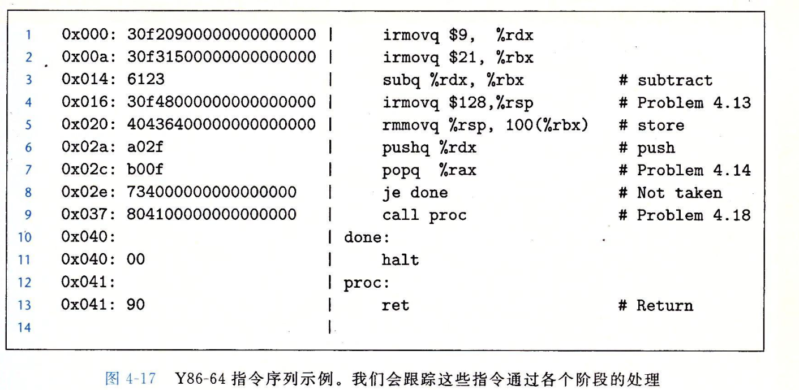
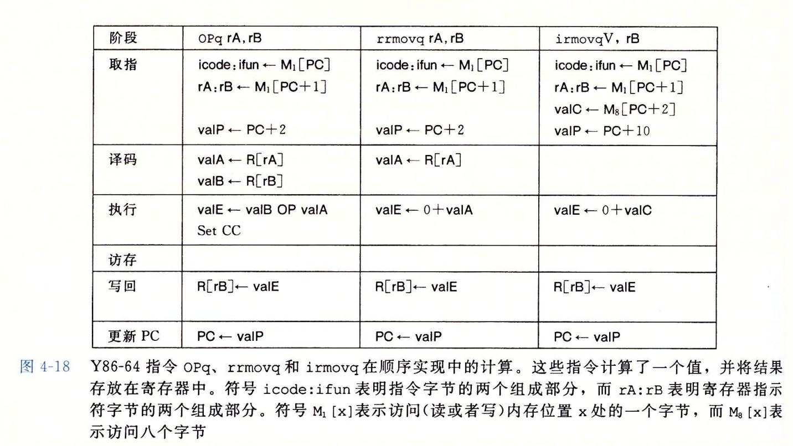
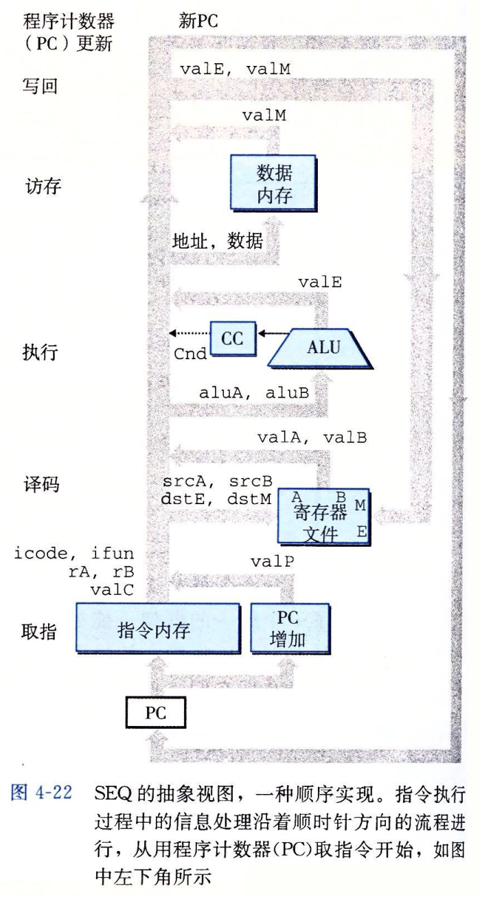
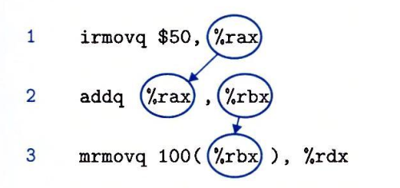
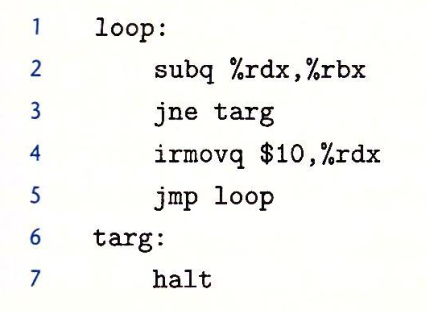

# Y86-64 的顺序实现

## 将处理组织称阶段
将处理一条指令过程分解为如下阶段：
1. 取指（fetch）：从地址为 PC 的内存地址读取出指令字节
2. 译码（decode）：从寄存器读取最多两个操作数
3. 执行（execute）：ALU 要么执行指令指明的操作，计算内存引用的有效地址，要么增加或者减少栈指针，对于得到的值，ALU 后续可能会更新条件码寄存器或者其他寄存器。对于跳转指令，这个阶段会决定是否应该选择分支
4. 访存（memory）：将数据写入内存或者从内存读取数据
5. 写回（write back）：写回结果到寄存器
6. 更新 PC（PC update）：将 PC 更新为下一条指令的地址

以如下程序为例追踪指令执行
  

4-18 展示了 Y86-64 指令集下，OPq（整数和逻辑运算）、rrmovq（寄存器到寄存器传送）、irmovq（立即数到寄存器传送）这三类指令在不同的指令执行阶段需要完成的工作。

  

对于整数操作指令，取指阶段首先从 PC 指向的内存地址读取一个字节，得到该指令本身的 icode:ifun，icode 表明该操作种类（整数操作），ifunc 表明该指令的功能（加法/减法），紧跟在 PC 后一个字节的内容为两个寄存器名，valP 表示下一个 PC 的值，这里已经从内存读了两个字节，因此下一条指令的地址应该为 PC + 2。译码阶段，通过寄存器寻址读取两个操作数，并且将这两个操作数和指令的 ifun 一起提供给 ALU，由 ALU 计算得到指令结果 valE（valB OP valA），整数操作指令在访存阶段什么也不做，写回阶段将 valE 写入到 rB，然后将 PC 设置为 valP，至此指令执行结束。

指令 rrmovq 和 irmovq 的过程和整数操作指令类似。

其他类型的指令的执行过程也可以类似组织成上述的六个阶段，不再细说。

## SEQ 硬件结构
前一小节我们将所有指令的执行都组织成了 6 个阶段，我们现在需要研究，为了实现上述的六个阶段，需要什么样的硬件结构。**实际上设计硬件结构就是，我们分析每个阶段需要哪些硬件有哪些输入与输出，这些输入与输出又会到哪些其他硬件，然后将这所有过程通过数字电路连接起来**。

首先我们可以得到如下的抽象视图

  

## Y86-64 的流水线
数据相关：
  

指令相关：
  

