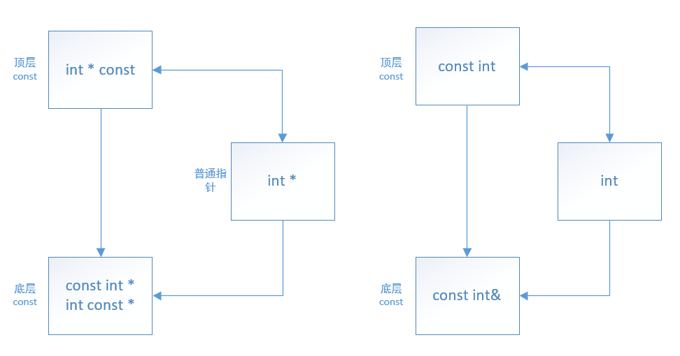

[TOC]
---
## const 变量
关键字 const 修饰的对象一旦创建之后其值就不能再改变，所以 const 对象必须初始化。初始值可以是任意复杂的表达式，这个初始值可以在编译时得到，**也可以在运行时得到**
```c++
const int i = get_size();   // 运行时初始化
const int j = 43;           // 编译时初始化
const int k;                // 错误
```
## const 与初始化
如果用一个对象去初始化另一个对象，则它们本身是不是 const 都没关系，因为初始化其实是将一个对象的拷贝复制给另一个对象，所以对原对象不会进行修改。
```c++
int i = 42;
const int ci = i;   // 正确；i 的值被拷贝给 ci
int j = ci;         // 正确；ci 的值被拷贝给 j
```

如果是编译初始化，那么编译器会用初始值替换文本中所有 const 对象的位置。默认情况下，const 对象的作用域仅在文件内有效，当多个文件中出现了同名的 const 变量时，其实等于在不同文件中分别定义了独立的变量，而为了在不同文件中使用相同的 const 变量，那么需要使用 extern 关键字。

## 引用与 const
前面说到用一个对象初始化另一个对象时，双方是否是 const 都没关系。但是引用不是对象，那么涉及到引用时，情况会是怎样？

**可以使用任意(常量/非常量)对象去绑定任意引用(const引用/非const引用)，但是不能使用 const 引用去绑定 非const 引用**，因为 const 引用表示对象不可改变，而普通引用表示对象可改变。
```c++
const int ci = 1024;    // 编译时初始化
const int &cr = ci;     // 正确
int & ri = cr;          // 错误；非常量引用不能指向常量引用
```
常量引用实际上应该被理解为对 const 的引用。

**非常量引用的类型必须与其所引用的对象类型完全一致，而且被引用的对象必须是一个左值**。当涉及到 const 时，会有例外。
```c++
int i = 10;
double dval = 3.14;
int &ir0 = 10;          // 错误：非常量引用不能绑定字面值
int &ir1 = i;           // 正确：类型完全一致
int &ir2 = dval;        // 错误：类型不一致
int &ir3 = i * 2;       // 错误：i * 2 不是左值
const int &cir0 = 10;   // 正确
const int &cir1 = dval; // 正确
const int &cir2 = i * 2 // 正确
```
在初始化常量引用时，初始值可以是任意类型的表达式，只要该表达式的结果能够转换成引用的类型即可。尤其，允许常量引用绑定非常量对象、**字面值**。

实际上，当一个引用绑定到另一种类型上时，是通过一个临时的中间变量进行绑定的：
```c++
doubel dval = 3.14;
int &ri = dval;
const int &cri = dval;
```
编译器把上述过程变为：
```c++
double dval = 3.14;
double temp0 = 3.14
const int temp1 = dval;

int &ri = temp0;        // 错误
const int &cri = temp;  // 正确
```
对于一个 int 型的变量来说，它所具有的操作与 double 类型的不同。因此 int& 是不可能直接绑定到 double 变量的。所以编译器生成一个未命名的中间临时变量(非常量)，让引用去绑定这个临时变量，该临时变量的类型与绑定的类型一致，临时变量的值由引用对象经过类型转换得到。

程序员使用非常量引用 int & 时，肯定意图是去修改引用对象的值，而现在引用其实是绑定在一个临时量上，所以这种定义方式自然被编译器认为是错误；

使用常量引用 const int & 时，程序员不打算通过该引用去改变引用对象，因此也不会去改变临时量的值，所以既然不会产生问题，那么编译器就认为这种行为合法。

## const 与指针

顶层const：对象本身是const，对任何类型对象都适用
底层const：指针或引用指向的对象是 const
```c++
int i = 10;
int const* p1 = &i; // 底层 const
const int* p2 = &i; // 底层 const，与上面的写法含义一样
*p1 = 11;   // 错误，不能通过底层 const 去修改对象


int * const p3 = &i;    // 顶层 const
p3 = p1;    // 错误，p3 本身为 const
*p3 = 11;   // 正确
```
用于引用的 const 都是底层 const，用于指针的 const 的则都有可能

顶层 const 相互之间拷贝, 顶层 const 与普通变量的拷贝不受什么影响:
```c++
const int ci = 0;
int i = 10;
int * const pc = &i;    // 正确
int * const pc2 = &ci;  // 对常量对象取地址得到的是顶层 const
int * ip = pc;          // 正确
```
涉及到底层 const 的拷贝则是有很多限制。当执行对象的拷贝操作时，拷入和拷出的双方必须具有相同的底层 const 资格，或者两个对象的值可以相互转换。通常非 const 版本可以转换为 const 版本，反之不行。
```c++
int i = 10;
int const *p0 = &i; // 正确，非 const 转换为底层 const
const int *p1 = p0; // 正确，底层 const 相互转换
int *const p2 = p0; // 错误，底层 const 不能转换为顶层 const
int *const p3 = &i; // 正确
p0 = p3;            // 正确，顶层 const 可以转换为底层 const

int *p = p0;        // 错误，底层 const 不能转换为普通指针
```


## auto 与 const

auto 会忽略掉顶层 const，底层 const 则会保存。
```c++
  int i = 0;
  const int ci = i, &cr = ci; //ci 是一个 const int，cr 也是一个 const int
  auto b = ci;  // auto 会忽略顶层const，所以 b 为 int 
  auto c = cr;  // auto 会忽略顶层const，所以 c 为 int
  auto d = &i;  // &i 为 int *，d 为 int *
  auto e = &ci; // 对常量对象取地址得到底层const, 所以 &ci 为 const int*, e 为 const int*, 指向整型常量的指针
```
如果要求推断出的类型是一个顶层 const，则需要显式说明：
```c++
const auto f = ci;
```
当 auto 的类型为引用时，**初始值的顶层const属性任然保留**
```c++
auto &h = 42;   // 错误，42 是int字面值，h 为非常量引用
                // 不能使用字面值初始化非常量引用

const auto &h = 42;  //正确

auto &ri = ci;  // 保留 ci 的顶层 const 属性，ri 是整型常量的引用
auto *p = &ri;   // ri 是整形常量的引用，该常量属性为底层const，所以 p 为指向整形常量的指针 const int*
```

