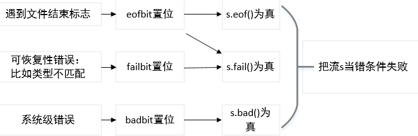

# 输入输出流

[TOC]

---
## 初识输入输出

cin 是 istream 类型的对象实例
cout、cerr、clog 是 ostream 类型的对象实例

#### 向流写入数据
<< 运算符接受两个运算对象：左侧的运算对象必须是一个 ostream 对象，右侧的对象是要打印的值。

endl 操纵符：写入 endl 的效果是结束当前行，并且将与设备相关联的缓冲区中的数据刷到设备中。缓冲区刷新操作可以保证到目前为止所产生的所有输出都真正写入输出流中，而不是仅停留在内存中等待写入流。

#### 从流读取数据

```c++
int v1 = 0, v2 = 0;
std::cin >> v1 >> v2;
```

输入运算符 >> :接受一个istream作为其左侧运算对象，接受一个对象作为其右侧运算对象。从给定的istream读入数据，并存入给定的对象中。

#### 使用 getline 读取一整行
getline 函数的参数是一个输入流和一个 string 对象，函数从给定的输入流中读入内容，直到遇到换行符为止（**换行符本身也被读取**），然后把所读到的内容保存到string对象中（**不保存换行符**）。getline只要遇到换行符就结束读取操作，并返回结果，哪怕输入的一开始就是换行符也是如此。如果输入真的一开始就是换行符，那么所得结果就是一个空string。


## IO 类
头文件 iostream 定义了用于读写的基本类型，fstream 定义了读写命名文件的类型，sstream 定义了读写内存string对象的类型。


#### IO类型间的关系
概念上，设备类型和字符大小都不会影响我们要执行的IO操作。

标准库是我们能够忽略设备的差异，这是通过继承实现的。继承机制使得我们可以声明一个特定的类继承自另一个类。我们通常可以将一个派生类对象当作其基类对象来使用。

类型 ifstream 和 istringstream 都继承自 istream。因此，我们可以像使用 istream 对象一样来使用 ifstream 和 istringstream 对象。也就是说，我们是如何使用 cin 的就可以同样地使用这些类型的对象。

### IO 对象无拷贝或赋值

由于不能拷贝IO对象，因此我们也不能将形参或返回类型设置为流类型。进行 IO 操作的函数通常以引用方式传递和返回流。读写一个 IO 对象会改变其状态，因此传递和返回的引用不能是 const 的。

### cin

cin 是 C++ 标准库 iostream 中实例化的 istream类的对象。cin主要用于从标准输入读取数据，这里的标准输入，指的是终端的键盘。下述 cin 的功能同样适用于 ifstream、istringstream 对象。

在理解cin功能时，不得不提标准输入缓冲区。当我们从键盘输入字符串的时候需要敲一下回车键才能够将这个字符串送入到缓冲区中，那么敲入的这个回车键(\r)会被转换为一个换行符\n，这个换行符\n也会被存储在cin的缓冲区中并且被当成一个字符来计算！比如我们在键盘上敲下了123456这个字符串，然后敲一下回车键（\r）将这个字符串送入了缓冲区中，那么此时缓冲区中的字节个数是7 ，而不是6。

cin读取数据也是从缓冲区中获取数据，缓冲区为空时，cin的成员函数会阻塞等待数据的到来，一旦缓冲区中有数据，就触发cin的成员函数去读取数据。

#### cin >> 

`>>` 是输入运算符，它从给定的 istream 对象中读取数据，存入到指定对象中。`>>`以空格、换行符、制表符作为结束符，存入到指定对象时不存结束符，输入结束之后，**将缓冲区刷新，但是会将结束符依然保留在缓冲区中。** 将结束符保留在缓冲区中将会对下一次的输入产生影响。
 
```c++
char x, y;
cin >> x >> y;
```
在键盘输入`a(回车)`

当输入a时，a还未进入缓冲区，当按下回车键`\r`之后，a 和 回车被一起存入缓冲区，此时缓冲区中保存的内容为：`a\n`。然后第一个输入运算符`>>`将 a 存入字符变量 x，**遇到\n后结束第一次输入，同时将\n保留在缓冲区内**，然后第二个输入运算符`>>`遇到换行符`\n`，如前所述，输入运算符在缓冲区遇到结束符(回车、制表、空格)后，不会将结束符读进变量，而是将结束符依然保存在缓冲区内，所以此时`>>`会继续等待非结束符的输入。

总结
可以将`cin>>`的行为理解为：
1. 在缓冲区中等待非结束符进入缓冲区
2. 若遇到非结束符，则将非结束符挪入目标变量，同时本次输入结束
3. 若遇到结束符，则将保存在缓冲区中，继续等待非结束符

如果前面有非结束符被读取，那么结束符可以被视为一次输入的结束；如果前面没有非结束符被读取，那么结束符会被跳过，直到等到一次“成功的”输入。

当 `cin >>` 作用于字符串时，可以理解为一次读取一个单词。

#### cin.get()

cin.get()有 4 种重载方式。常用的是不带参数的和带一个参数的。

`cin.get()`的正确理解是读入一个字符。

```c++
char a;
char b;
cin >> a;
b = cin.get();
cout << a << endl;
cout << b << endl;
cout << (int)a << ' ' << (int)b << endl;
```

输入：a(回车)

```c++
a
a


97 10
```
当在键盘输入`a（回车）`之后，缓冲区中的内容为：`a\n`，`cin>>`将a挪入变量a，然后将遇到的结束符`\n`保存在缓冲区中；`cin.get()`则是将遇到的任何字符，存入目标变量，因此变量b中将保存字符`\n`，其ASCII码转为整形正好是10。`cin.get()`也会将结束符保存在缓冲区中。

`cin.get()`每次只会从缓冲区中读取一个字符，因此它不能作用于数组。

#### cin.getline()

从标准输入读取一行。

**cin.getline()** 会将遇到的结束符从缓冲区中移出。

可以使用标准库`<string>`中的`getline`函数来替代`cin.getline`

### 流的状态

IO 库定义了与机器无关的 iostate 类型，用位模式来表达流的状态。

* badbit被置位，表示系统级错误，不可恢复
* failbit被置位，表示可恢复错误，如期待整形输入，实际输入为字符
* eofbit被置位，表示遇到文件结束标志
* goodbit的值为0，表示流正常工作

当我们使用流本身作为条件判断时，如果判断为错，那么说明eofbit、failbit、badbit其中至少一位被置位。如果需要根据流出错的类型来做出对应的处理，那么我们需要根据流的状态来做出决定。



一个流一旦发生错误，那么其上后续的 IO 操作都会失败，如果需要后续对流继续进行操作，那么需要将流的状态复位。s.clear() 将流 s 的状态复位。

**练习8.1**

编写函数，接受一个 istream& 参数，返回值类型也是 istream&。此函数须从给定流中读取数据，直至遇到文件结束标志停止。将读取的数据打印在标准输出上。完成操作后，返回流之前，对流进行复位，使其处于有效状态。
```c++
#include<iostream>
using namespace std;

istream& f(istream& in){
    int v;
    while(in >> v, !in.eof()){
        if(in.bad()){
            throw runtime_error("IO流错误");
        }
        if(in.fail()){
            cerr <<"数据错误， 请重试：" << endl;
            in.clear();
            in.ignore(100, '\n');
            continue;
        }
        cout << v << endl;
    }
    in.clear();
    return in;
}
```
可以看到函数 f 中并没有直接使用 `istream` 对象作为判断条件，而是使用 `!in.eof()` 作为判断条件，这样即使数据错误，那么依然可以通过 `in.clear()` 来挽回出现可恢复性错误的情况。如果直接使用 `while(in >> v)` 则当输入一个字符时，会直接跳出循环。

### 管理输出缓冲
每个输出流都有在内存中有一个缓冲区，用来保存程序读写的数据。这个机制是由操作系统维护的。

因为设备的写操作可能会很耗时，所以操作系统将对设备的输出数据保存在内存缓冲区中，当缓冲区满或者其他操作系统规定的条件满足时，OS将多个输出操作组合为单一的设备写操作。这样可以带来很大的性能提升。

导致缓冲区刷新（执行真正的写操作）的原因有很多：
* 程序正常结束，作为return语句的一部分，该进程所具有的缓冲区被刷新。
* 缓冲区满时，自动刷新缓冲区
* 使用操纵符如 `endl` 来显示刷新缓冲区
* 一个输出流被关联到另一个流，这时当读写被关联的流时，关联到的流的缓冲区会被刷新。

```c++
cout << "Hi!" << endl; //输出Hi!和一个换行，然后刷新缓冲区
cout << "Hi!" << flush;//输出Hi!，然后刷新缓冲区
cout << "Hi!" << ends; //输出Hi!和一个空字符，然后刷新缓冲区

cout << unitbuf; //其后所有输出操作都会立即刷新缓冲区
//任何输出都立即刷新，无缓冲
cout << nounitbuf; // 回到正常的缓冲方式
```
**有时候崩溃程序的结果没有被打印，并不一定说明结果没有得到，也可能结果在缓冲区中未被刷新！**

## 文件输入输出
如前所述 fstream 中的 ifstream、ofstream、fstream 分别继承自 iostream 中的 istream、ostream、iostream。因此头文件 fstream 的对象也具有继承自头文件 iostream 的行为，比如操作符 >> 和 <<

fstream 还有一些特有的操作

#### 成员函数 open 和 close
```c++
ifstream in(file);          // 构筑一个ifstream并打开文件
ofstream out;               // 输出流未与任何文件关联
out.open(ifile+".cpoy");    //  打开一个指定文件
```
其中file可以是string也可以是C风格字符串。
如果 open 调用失败，failbit 会被置位。
对一个已经打开的文件流调用open会失败，并导致failbit被置位。

#### 自动构造和析构
当一个fstream对象被销毁时，close会被自动调用。

### 文件模式
| 模式             | 解释                         |
| ---------------- | ---------------------------- |
| ifstream::in     | 以读方式打开                 |
| ofstream::out    | 以写方式打开                 |
| ofstream::app    | 每次写操作前均定位到文件末尾 |
| ofstream::ate    | 打开文件后立即定位到文件末尾 |
| ofstream::trunc  | 截断文件                     |
| ofstream::binary | 以二进制方式进行IO           |


## string 流
sstream 头文件中定义的类型都继承自iostream头文件。使用这些类型，我们可以像使用流一样使用string
```c++
sstream strm;   // strm 是一个未绑定的 stringstream 对象
sstream strm(s);    // strm 是一个 sstream 对象，保存 s 的一个拷贝。此构造函数是 explicit 的
strm.str();     // 返回 strm 所保存的 string 的拷贝
strm.str(s);    // 将 string s 拷贝到 strm 中。返回 void
```
### 使用 istringstream
当我们的工作是对整行文本进行处理，而其他一些工作是处理行内的单个单词时，可以使用 istringstream

### 使用 ostringstream
非连续地构造一行文本，可以每产生一个单词之后，根据单词的属性决定是否将单词加入最后的文本。

