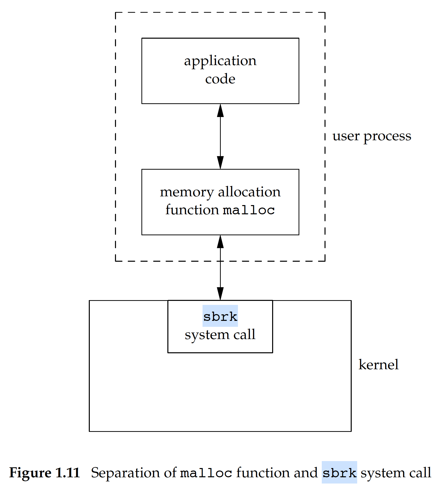

操作系统管理内存，应用需要使用内存时，需要通过系统调用来向OS进行申请。在C语言中，malloc()家族函数用于内存分配，其中关键的问题是，malloc是否只是简单进行了系统调用，而没有进行其他操作。

在Linux中，并没有名为malloc的系统调用，实际上关于应用内存分配的系统调用有两个：**sbrk** and **mmap**，以 sbrk 为例，从应用到系统调用的路径如下：
<center>
  
</center>

### Memory Layout of a C program
  

The free memory space between the top of the heap and the top of the stack is large.

### Memory Allocation
分配过程通常使用 sbrk 系统调用。**尽管 sbrk 既可以增加 heap size 也可以减小 heap size，但是大部分版本的 malloc&free 永远不会减小他们控制的内存空间。也就是说不会将已经从OS获取的内存还给OS，而是留着供下次malloc使用。**

The space that we free is available for a later allocation, but the freed space is not usually returned to the kernel; instead, that space is kept in the malloc pool.

Most implementations allocate more space than requested and use the additional space for record keeping — the size of the block, a pointer to the next allocated block, and the like. 因此，当我们对一块刚分配的内存区域之前/之后的地址进行写操作时，就有可能修改其他block的元信息，这种err通常比较难以发现。

还有一种严重的错误是释放一个已经被释放过的block，以及通过free去释放一个不是通过malloc() family 获得的block。

### Demo
```c
#include <stdio.h>
#include <stdlib.h>
#include <unistd.h>

int main(int argc, char* argv[]) {
    char *ptr[7];
    int n;

    printf("Pid of %s: %d\n", argv[0], getpid());
    printf("Initial program break : %p\n", sbrk(0));
    for(n=0; n<5; ++n) ptr[n] = malloc(16 * 1024);
    free(ptr[1]);
    printf("After 5 x 16kB malloc : %p\n", sbrk(0));
    ptr[5] = malloc(16  *1024);
    printf("After allocating 6th of 16kB : %p\n", sbrk(0));
    free(ptr[5]);
    printf("After freeing last block : %p\n", sbrk(0));
    ptr[6] = malloc(18 * 1024);
    printf("After allocating a new 18kB : %p\n", sbrk(0));
    getchar();
    return 0;
}
```

```
Pid of ./main: 20652
Initial program break : 0xe99000
After 5 x 16kB malloc : 0xebe000
After allocating 6th of 16kB : 0xebe000
After freeing last block : 0xebe000
After allocating a new 90kB : 0xee4000
```
0xebe000 - 0xe99000 = 0x25000，即 151552 bytes，即 148 kB。实际代码里申请的是 5 * 16 = 80 kB。说明 malloc 会向OS申请超过用户调用传入的地址空间，多出的地址空间会用于保存block元信息以及处于性能考虑的预申请（存疑）。比如当我们第6次malloc 16kB时，sbrk返回的heap top地址没有变动。说明用到的是预分配的内存空间。

在将最后一个16kB释放后，sbrk返回的heap top address依然没有减少，说明malloc并没有将这部分内存归还给操作系统。直到我们最后一次申请90kB空间时，heep top 才发生了增长。

https://www.makeuseof.com/memory-allocation-linux/

