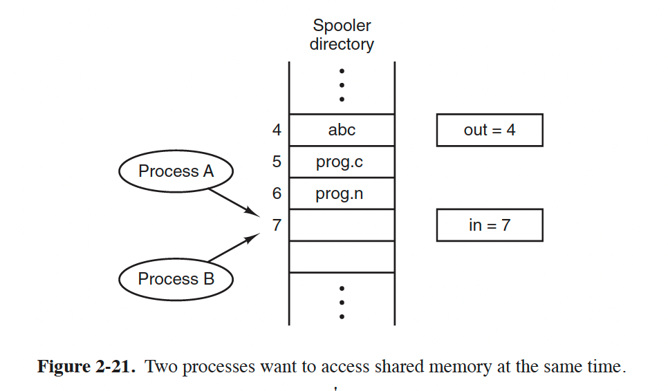
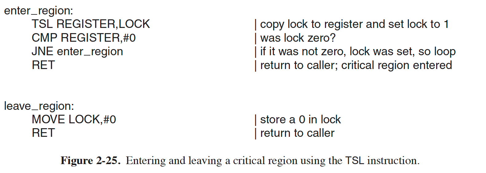
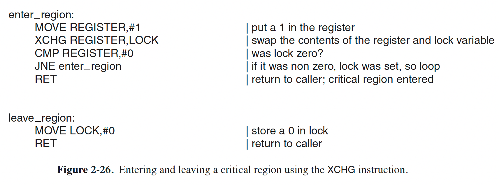
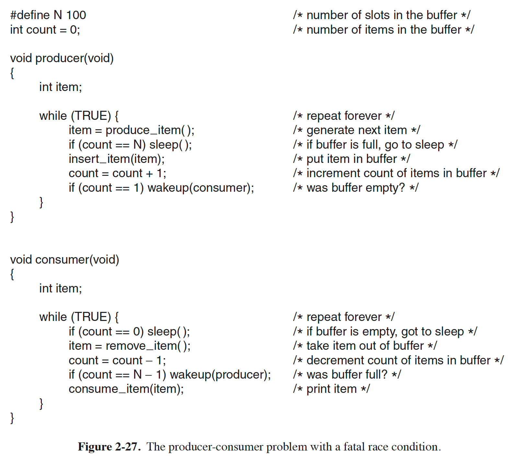
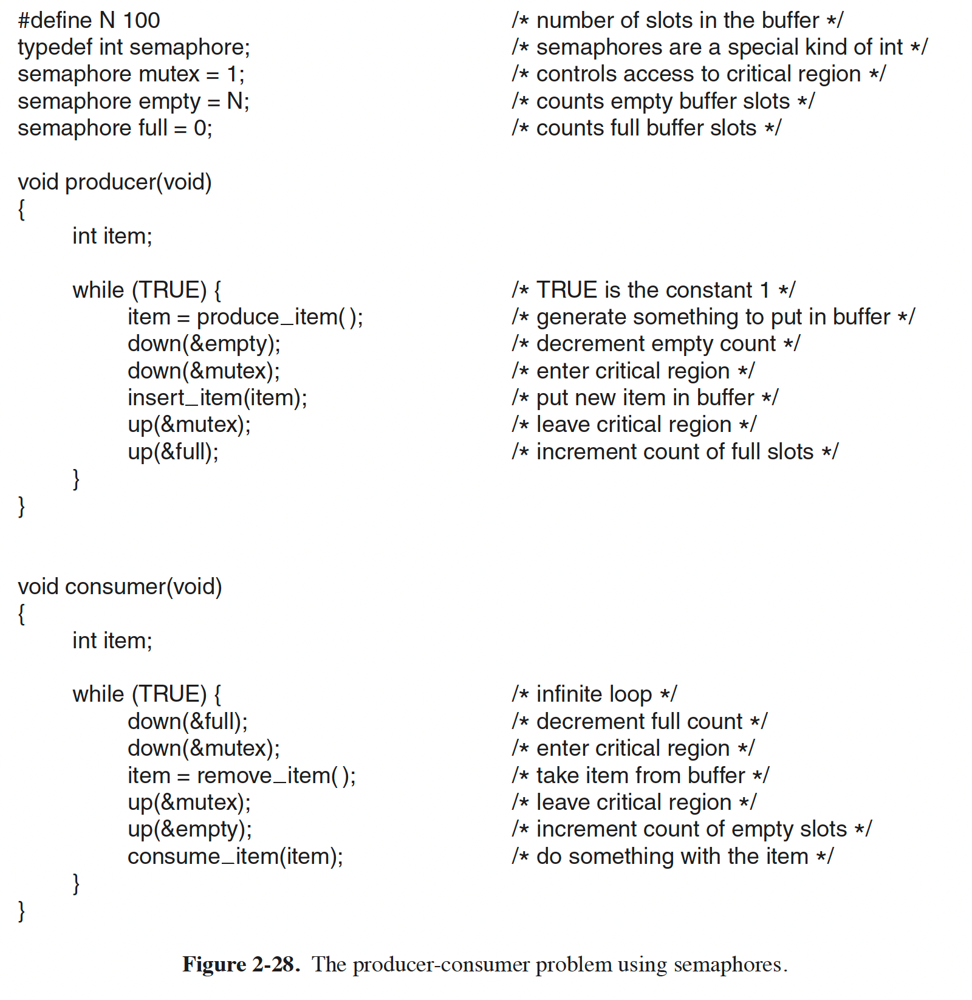
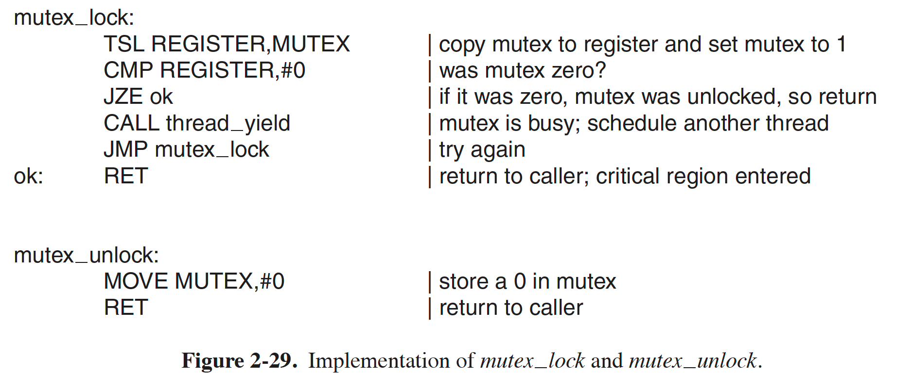

[TOC]

# Interprocess Communication
需要解决三个问题：
1. how one process can pass information to another
2. making sure two or more processes do not get in each other’s way
3. proper sequencing when dependencies are present: if process A produces data and process B prints them, B has to wait until A has produced some data before starting to print.

对于多线程场景，问题一很好解决：它们是共享内存的。
问题二与问题三的解决思路在多线程场景下与多进程场景是一致的。

### Race Conditions
进程间共享一部分storage，这部分storage可被多个进程同时读写。注意，这里的 storage 包括了 main memory 也包括 disk file。

以一个经典的打印机模型开启讨论：当进程 A 想要打印某个文件时，进程 A 将 file name 输入到一个特殊的 spooler directory，另一个进程 printer daemon，周期性地检查该目录，并且将任何出现的 file 打印出来

  

两个共享变量，out 指向下一个可被打印的文件 slot number，in 指向下一个 free slot number，共享变量被所有的进程共享。观察图 2-21 中的情景，此时进程 A 与进程 B 均想要打印某个文件。那么我们就可能面临如下的一个场景：进程 A 读 in 然后 store 到自己的局部变量 next_free_slot 中，此时为 7。就在这时，一个时钟中断发生，然后OS决定将进程 A 调度出去，要让进程 B 执行，那么进程 B 同样会得到 in 值为 7。后续会发生的事情我们可以预见到：进程 B 写进 slot 7 的 file name 将会被最后执行的进程 A 覆盖，进程 B 永远得不到它想要的打印结果。这种情景就叫做 race condition

### Critical Regions

解决上述问题，以及 sharing files、sharing everything 的关键在于，我们需要找到一种方法，确保，一个进程在使用 sharing things 的时候其他进程会被排斥在该对象以外。我们把这段访问共享区域的代码，称作 critical region。同时，出了需要前述方法外，我们还需要满足以下四个条件，才能保证我们得到的是好的解决方法：
1. No two processes may be simultaneously inside their critical regions.（基本要求）
2. No assumptions may be made about speeds or the number of CPUs.（能够处理多核场景）
3. No process running outside its critical region may block any process.（外部无阻塞）
4. No process should have to wait forever to enter its critical region.（不会永远等待）

提一嘴：不会永远等待不仅包括不死锁，还要包括不活锁。

### Mutual Exclusion with Busy Waiting
**Disable Interrupts**
在打印机问题里，我们提到时钟中断被捕获后，可能会导致当前进程被调度出执行状态，从 running 变为 block。那么我们如果在进程执行期间禁止中断呢？事实上，这会导致两个问题：
1. 我们无法确保用户进程一定会老老实实地重新开启中断。如果有一个人不老是，那就会导致系统奔溃
2. 在 multiprocesses 情景下，无法确保所有的 cpu 都禁止中断。

**Lock Variables**
思路很直观：我们新设置一个 lock variable，当其状态为 0，说明可以进入，在进入之前我们将其设置为 1，禁止其他进程进入，在我们处理完任务后，将 lock variable 重新 set 为 0，确保其他进程在之后可以进入。

问题在于：我们访问 lock variable 的代码本身也是 critical region，也就是说访问 lock variable 本身就会导致 race condition

**Strict Alternation**
Lock Variables（lv） 的一个问题是，需要将 lv 设置为 1，来阻止其他进程进入临界区，而 lv 的 read-compare-set 这一系列过程中都可能会有进程调度发生，所以才会导致问题。
Strict Alternation 相比 Lock Variables 的一个重要区别在于，在进入 critical_region 之前，我们只是 read and compare，不进行 set，只要变量（其实就是lock variabl）不等于我们期望的值，那么就不会进入临界区。具体算法如下图所示：

  

这种方式，被称之为 busy waiting。使用 busy waiting 方式实现的 lock 叫做 spin lock。

上述方式也有自己的问题：就是 process 0 和 process 1 必须交错执行，假如 process 1 执行 noncritical_region 很慢，那么 process 0 必须等到 p1 执行完 noncirtical_region 再进入 critical region 然后将 turn 设置为 0 才能继续自己的执行。这一现象违反了我们提到的条件三。

当然，该方法还有其他问题，比如 spin 的时候依然占据 CPU。

**The TSL Instruction**

    TSL RX, LOCK

TSL: Test and Set Lock 指令。从内存读取LOCK变量到寄存器RX，然后将LOCK变量在内存中的位置设置为一个非零值。**该指令执行期间没有其他进程可以访问LOCK在内存中的位置**。这是通过在该期间对memory bus加锁来实现的。

对 memory bus 加锁跟 disable interrupt 是不一样的。区别在于，disable interrupt后，执行 read memory 与 set memory 无法确保期间其他进程不会访问这段内存，因为 disable interrupt 只对一个 processor 有效，多核情况下其他核上的进程还是可以访问的。

这里实际上我们是对前述的Lock Variable方案做了加强，引入了不可分割的指令完成READ COMPARE SET操作。实际使用时，我们创建一个可以用TSL指令访问的lock variable，初始值为0，任何想要进入临界区的进程都需要通过TSL将其设置为1，在离开临界区之后，通过简单的MOVE指令将其设置为0。

下图展示了如何使用TSL实现进程间的互斥，p0通过 TSL 将内存中的 LOCK 变量设置为 1，如果 LOCK 本来就为 1，那么说明有其他进程已经“加锁”成功了，那么p0就会回到 enter_region 入口继续 TSL，否则说明 p0 加锁成功，p0 可以进入临界区，在离开时，通过普通的 move 指令将内存中的 LOCK 变量设置为 0，让其他进程可以加锁。
  


TSL 指令的另一个替代方案是 XCHG 指令，该指令可以原子性地交换两个地址的内容，这个地址既可以指向寄存器也可以是主存。所有的 x86 CPU 都使用 XCHG 来实现 low-level synchronization.

  

### Sleep and Wakeup
TSL 方案实际上是一种 busy waiting 的方案，除了会导致CPU的占用外，还会有其他问题。进程 H 具有更高的调度优先级，进程 L 具有较低的调度优先级。假如调度规则是，只要 H 在 ready 状态，那么它一定可以立刻被执行。那么，如果在某个时刻，L 进入了临界区，H 变为 ready，那么 L 将会在某个中断时刻被强制换出，后续 H 将会永远 busy waiting，因为 L 永远得不到机会离开临界区，move lock to 0。这种情景被称为优先级反转。

#### The Producer-Consumer Problem
Also known as bounded-buffer problem.

当 buffer 满了，而 producer 还是想要往内插入新的 item 时，会产生问题。解决方案是，我们让 producer 在这种情况下 sleep，当 consumer 将一个或者多个 item 从队列中移除时，producer 再被唤醒。对于 consumer 消费空队列的情况，解决方法类似：让 consumer 休眠直到有 producer 插入了新的 item。

在实际实现时，很容易想到我们需要一个变量 count 记录队列中有多少 item。假设队列最多存储 N 个item，那么 producer 首先检测 count 是否为 N，如果是则 producer go to sleep，否则 producer insert item and increase count。consumer 端是类似的，首先检查队列是否为空，如果为空则 sleep，等待 producer 添加一个 item 之后唤醒自己，否则就消费队列中的一个元素。

当我们引入 count 这个变量之后，解决了队列的同步，但是对 count 变量本身的访问依然有 race condition。例子也很好举出来，count 被进程 A 读到自己的寄存器里，在写回去之前发生进程切换，进程 B 读到的 count 就与 A 不一致了。**假设，我们通过对 count 设置由 TSL 或者 XCHG 实现的 lock variable 进行保护，确保了任何时刻只有一个进程访问 count，则依然还会有 race conditiion**

  

比如上述代码中，对于 count 变量本身的访问已经做到了互斥，但是我们依然可能遇到如下情景：
初始队列为空，consumer 刚刚将 read 读进自己的寄存器，**正要准备sleep，但是还未sleep**，此时调度器决定让 producer 执行，producer 插入新的 item，然后想要 wakeup consumer。但是此时由于 consumer 并未 sleep，所以这个 wakeup 信号会被丢失。调度器下一步决定让 consumer 继续之前的状态执行，那么 consumer 根据自己之前得到的 count == 0 决定让自己 sleep。后续 producer 将会一直 insert_item，直到队列满，producer 和 consumer 都将会永远 sleep。

这里产生 race condition 的表面原因是，wakeup 信号发送给了一个并未 sleep 的 consumer，**实际上本质是因为`if(count == 0) sleep();` 这一行代码的执行不是原子的**。单从解决该问题的目标出发，我们可以引入一个 wakeup waiting bit，保存这个 wakeup 信号，当一个进程准备 sleep 之前，它检查自己的这个标志位是否为 1。但是当我们有非常多的进程的时候，会发现这个方法并不具备可扩展性，而且，实际上会引入其他更加复杂的问题。

### Semaphores
Dijkstra 最早提出了一种新的变量类型，称为 semaphore。semaphore 为 0，代表没有收到过 wakeup 信号，为非负整数，代表一个或者多个 wakeup 信号在 pending 中。同时这类变量具有两种操作，down and up，down 操作对应 `if(count == 0) sleep(); else --count;`，延续上一小节的问题情景，down 操作的语义为，如果没有其他进程发送过 wakeup 信号，则 sleep ，否则将 wakeup 信号数量减一。
up 操作对应`++count; if(count == 1) wakeup();`，**up 操作不会导致进程阻塞**，并且一次只会 wakeup 一个其他进程。
**最重要的是，down 操作与 up 操作均为原子的：期间 count 无法被其他进程访问，且操作执行过程不可被分割。**

**Solving the Producer-Consumer Problem Using Semaphores**
在实现 semaphore 变量的时候，我们需要操作系统提供 down 操作与 up 操作的接口。通过这两个接口，我们可以保证在执行 `if(count == 0) sleep(); else --count;` 期间，中断关闭，不会有进程调度发生，同时在多核情况下，我们还需要为每个 semaphore 设置由 TSL/XCHG 实现的 lock variable。

  

上图的算法过程包含三个 semaphores：
- full 用来记录队列中有多少个item
- empty 用来记录队列中有多少空位
- mutex 用来保护队列本身，确保任何时刻只有一个进程访问队列

回到前面描述的生产者消费者算法2-27中，full 变量实际上记录了有多少个 consumer 到 producer 的 wakeup 信号被保存，其初始值为 N 表示一开始我们就给 producer 预先设置 N 个 wakeup 信号，如果该变量为 0 说明之前的 wakeup 信号已经被使用光了，队列已满；empty 变量记录了 producer 发送给 consumer 的 wakeup 信号次数，如果该变量为 0，说明当前队列为空。

这里我一直有的疑惑是，为何需要分别设置 empty 和 full，而不是只用一个 count 信号量？使用如下的代码片段：
```c++

semaphore count = 0;

void producer(void) 
{
    int item;
    while(TRUE) {
        item = produce_item();
        up(&count);
        down(&mutex);
        itsert_item(item);
        up(&mutex);
    }
}

void consumer(void) 
{
    int item;
    while(TRUE) {
        down(&count);
        down(&mutex);
        item = remove_item();
        up(&mutex);
    }
}
```
这里 producer 的部分明显是有问题的，因为 up 操作只是将 count + 1，并且 wakeup consumer，并不会 compare，所以 producer 会在超出 N 之后依然 insert。如果我们想要 compare count 与 N，那么又会导致 sleep 与 compare 不是一起原子执行。所以单独使用一个信号量是不能解决问题的。

### Mutex
信号量 semaphore 的一个特性是计数，当不需要进行同步，只需要实现互斥时，其就是一个简单版的 semaphore，称为 mutex。

  

这里通过 TSL 就可以实现互斥，不过 TSL 不会导致进程阻塞，因此我们只需要将 busy waiting 的逻辑改为执行`CALL thread_yeild`，让调度器选择下一个能够执行的进程。

TODO **Futex** 
futex：Fast user space mutex


