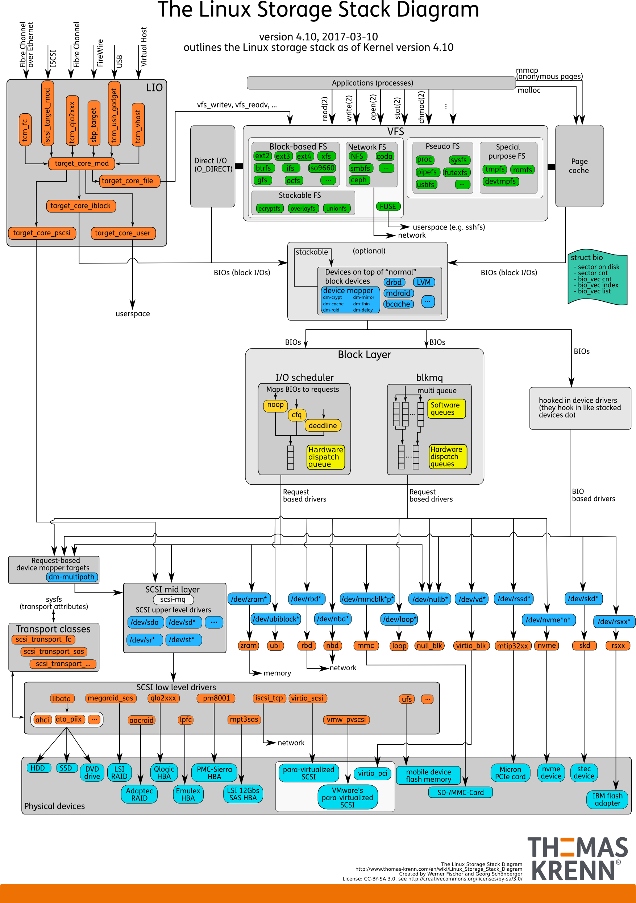
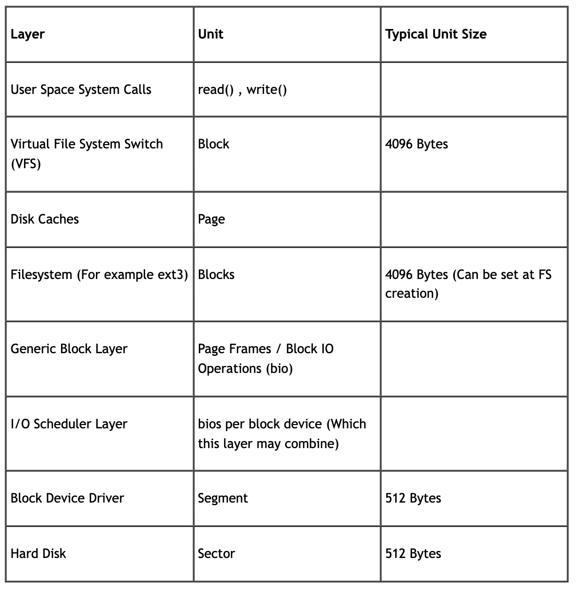

## Linux IO Stack

<center>
  
</center>

上图左上角 LIO 是指 Linux 内核中的一个模块，用于模拟块设备。整个 Linux IO Stack 从上往下可以分为四层：
* User space，通过 read/write 系统调用访问 VFS
* 文件系统层，包括 VFS & FS。VFS 是 Linux 提供的统一文件系统接口，不同的文件系统实现只需要实现 VFS 要求其实现的接口即可注册在操作系统中使用，FS 则提供了文件系统的具体实现，文件系统本质是一个 database，对外提供用户便于理解使用的目录/文件/权限管理，将用户对文件系统的请求转换为对 block device 的请求，上下两层之间的映射关系通过 inode 保存在磁盘的一部分区域中
* 块设备层，VFS 是提供了统一的文件系统接口，块设备层则提供了统一的 block device interface，各种不同的硬件设备驱动只需要实现块设备层要求其实现的接口便可以被更上层去访问。
* 设备驱动层，包括设备驱动以及设备本身，完成真正的IO操作。

如果我们将各个部分分的更细，并且总结其访问方式可以得到下面的表格

<center>
  
</center>

## iostat 

* %iowait: CPU 等待 IO 设备完成 IO 花费的时间占所有时间的百分比。另一个视角，可以理解为CPU因为在等待磁盘或者网络IO，无法利用到的时间的比例。

iostat 统计的数据都是在 OS 的 block layer 统计的，也就是说，反映的是 page cache 击穿之后的 io 请求，与应用本身的用户态 io 请求情况可能不完全一致。

```bash
iostat -d -mx 1

Device            r/s     w/s     rMB/s     wMB/s   rrqm/s   wrqm/s  %rrqm  %wrqm r_await w_await aqu-sz rareq-sz wareq-sz  svctm  %util
vda              0.00  247.50      0.00    114.44     0.00     2.00   0.00   0.80    0.00  171.46  41.94     0.00   473.48   4.04 100.00
vdb              0.00    0.00      0.00      0.00     0.00     0.00   0.00   0.00    0.00    0.00   0.00     0.00     0.00   0.00   0.00
scd0             0.00    0.00      0.00      0.00     0.00     0.00   0.00   0.00    0.00    0.00   0.00     0.00     0.00   0.00   0.00

Device            r/s     w/s     rMB/s     wMB/s   rrqm/s   wrqm/s  %rrqm  %wrqm r_await w_await aqu-sz rareq-sz wareq-sz  svctm  %util
vda              0.00  321.50      0.00    114.95     0.00     2.50   0.00   0.77    0.00  132.95  42.09     0.00   366.11   3.10  99.80
vdb              0.00    0.00      0.00      0.00     0.00     0.00   0.00   0.00    0.00    0.00   0.00     0.00     0.00   0.00   0.00
scd0             0.00    0.00      0.00      0.00     0.00     0.00   0.00   0.00    0.00    0.00   0.00     0.00     0.00   0.00   0.00

Device            r/s     w/s     rMB/s     wMB/s   rrqm/s   wrqm/s  %rrqm  %wrqm r_await w_await aqu-sz rareq-sz wareq-sz  svctm  %util
vda              0.00  349.00      0.00    114.70     0.00    15.00   0.00   4.12    0.00  123.10  42.26     0.00   336.53   2.87 100.00
vdb              0.00    0.00      0.00      0.00     0.00     0.00   0.00   0.00    0.00    0.00   0.00     0.00     0.00   0.00   0.00
scd0             0.00    0.00      0.00      0.00     0.00     0.00   0.00   0.00    0.00    0.00   0.00     0.00     0.00   0.00   0.00

Device            r/s     w/s     rMB/s     wMB/s   rrqm/s   wrqm/s  %rrqm  %wrqm r_await w_await aqu-sz rareq-sz wareq-sz  svctm  %util
vda              0.00  306.50      0.00    114.86     0.00     4.50   0.00   1.45    0.00  138.20  41.74     0.00   383.73   3.27 100.20
vdb              0.00    0.00      0.00      0.00     0.00     0.00   0.00   0.00    0.00    0.00   0.00     0.00     0.00   0.00   0.00
scd0             0.00    0.00      0.00      0.00     0.00     0.00   0.00   0.00    0.00    0.00   0.00     0.00     0.00   0.00   0.00

Device            r/s     w/s     rMB/s     wMB/s   rrqm/s   wrqm/s  %rrqm  %wrqm r_await w_await aqu-sz rareq-sz wareq-sz  svctm  %util
vda              0.00  316.00      0.00    114.68     0.00     7.00   0.00   2.17    0.00  134.86  42.01     0.00   371.62   3.16 100.00
vdb              0.00    0.00      0.00      0.00     0.00     0.00   0.00   0.00    0.00    0.00   0.00     0.00     0.00   0.00   0.00
scd0             0.00    0.00      0.00      0.00     0.00     0.00   0.00   0.00    0.00    0.00   0.00     0.00     0.00   0.00   0.00

cDevice            r/s     w/s     rMB/s     wMB/s   rrqm/s   wrqm/s  %rrqm  %wrqm r_await w_await aqu-sz rareq-sz wareq-sz  svctm  %util
vda              0.00  310.00      0.00    114.92     0.00     2.50   0.00   0.80    0.00  137.39  41.97     0.00   379.59   3.22  99.80
vdb              0.00    0.00      0.00      0.00     0.00     0.00   0.00   0.00    0.00    0.00   0.00     0.00     0.00   0.00   0.00
scd0             0.00    0.00      0.00      0.00     0.00     0.00   0.00   0.00    0.00    0.00   0.00     0.00     0.00   0.00   0.00

Device            r/s     w/s     rMB/s     wMB/s   rrqm/s   wrqm/s  %rrqm  %wrqm r_await w_await aqu-sz rareq-sz wareq-sz  svctm  %util
vda              0.00  317.50      0.00    114.58     0.00     1.50   0.00   0.47    0.00  133.88  41.87     0.00   369.53   3.16 100.20
vdb              0.00    0.00      0.00      0.00     0.00     0.00   0.00   0.00    0.00    0.00   0.00     0.00     0.00   0.00   0.00
scd0             0.00    0.00      0.00      0.00     0.00     0.00   0.00   0.00    0.00    0.00   0.00     0.00     0.00   0.00   0.00
```

上述结果是在 B+Tree 并发写入测试时候观测得到的结果。

* w/s: device 每秒完成的写入请求次数，与 r/s 一起想加就是当前的 IOPS
* wMB/s: 每秒写入的数据量，与 rMB/s 一起构成 throughput
* wrqm/s: 每秒合并的写请求次数。合并操作由内核中的 IO Scheduler Layer 完成，典型的合并时机是多个操作对于其操作的设备来说是 physically adjacent
* w_await: 写请求在 queue 中的等待时间
* wareq-sz: 每个写请求的平均大小
* svctm: 请求离开 queue 之后，device 处理花费的时间
* %uitl: The percentage of time the device spent servicing requests as opposed to being idle. 具体来说，servce time in ms * total IO operations / 1000 ms

我们看到，w/s 非常高，但是 wrpm/s 却很少，说明我们的随机 IO 比较多，同时 wMB/s 为 110MB/s， w/s 为 300，110MB / 300 约等于 360 KB，即 wareq-sz，说明绝大多数为小数据量的写入请求。

从时间角度看，写请求的 RT 平均为 133 millisec，在队列中等待的请求数量平均为 40，每个请求的真正 service time 平均为 3 millisec，刚好 w_await = aqu-sz * svctm