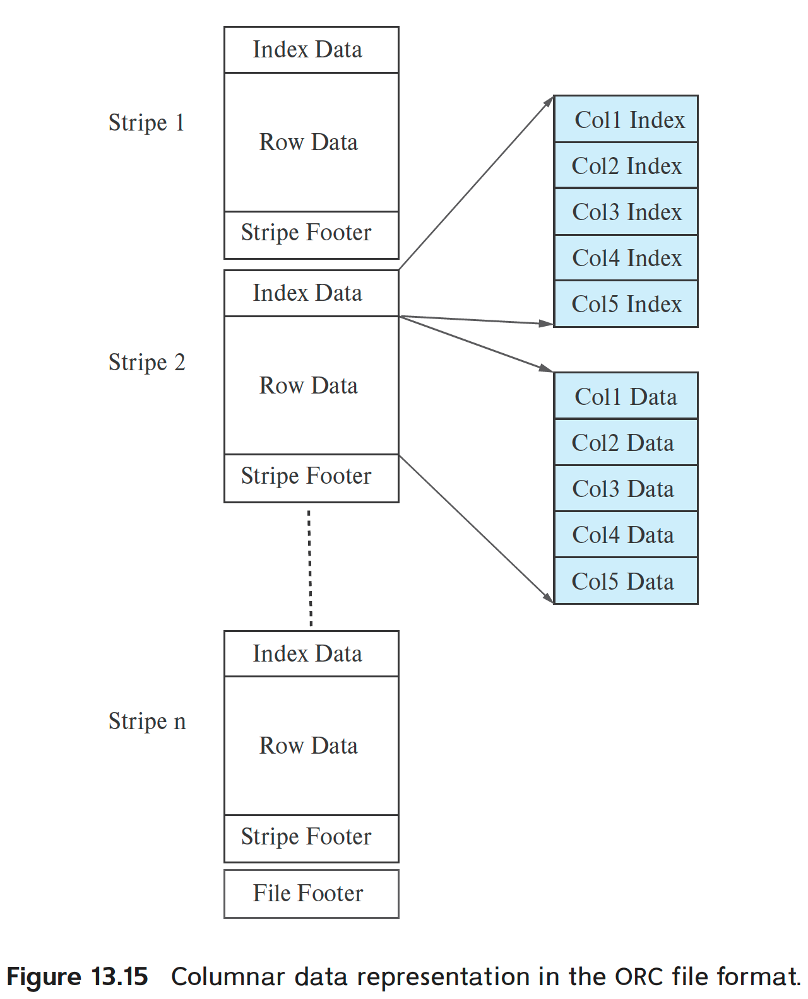

# Data Storage Structures

磁盘以及SSD都是块存储设备，即表示他们都是以 block 为单位进行读写的。然而数据库是以record为单位处理数据的，record通常远比一个block更小。

大多数数据库使用操作系统文件，作为一个中间层，来存储records。Given a set of records, the next decision lies in how to organize them in the file structure; for example, they may stored in sorted order, in the order they are created, or in an arbitrary order.

## File
## Column-Oriented Storage
列式存储的优势：
1. Reduced IO.
2. Improved CPU cache performance.
   在现代CPU架构中，当查询处理器获取特定列的内容时，多个连续的字节(cache line)将从内存中获取到CPU缓存。如果这些连续的字节中包含了查询不需要的列，那么将他们从主存fetch到cache就会浪费主存的带宽以及cache空间。
3. Improved compression.
4. Vector processing.

劣势：
1. Cost of tuple reconstruction. 当查询覆盖的列非常多时，从多个列存文件中重建出tuple的代价会很高（多次随机IO）。不过劣势1主要出现在事务处理系统里，分析型系统中往往只需要从“fact table”中输出少数几个列。
2. Cost of tuple deletion and update.
3. Cost of decompression. 

To allow skipping of attribute values from such records, compressed representations for column stores allow decompression to start at any of a number of points in the file, skipping earlier parts of the file.

ORC 和 Parquet 都是在大数据处理系统里常用的列存文件格式。

The row data area stores a compressed representation of the sequence of value for the first column, followed by the compressed representation of the second column, and so on. ORC 是在一个文件中，按照列式存储组织数据。

一些列存系统允许将那些经常被访问的列保存在一起，而不是把每个列保存在单独的文件里。

Some database systems use a column-oriented representation for data within a disk block, without using compression. 

Thus, a block contains data for a set of tuples, and all attributes for that set of tuples are stored in the same block. Such a scheme is useful in transaction-processing systems, since retrieving all attribute values does not require multiple disk accesses.