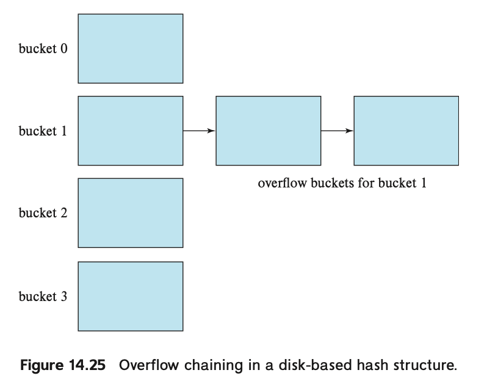

<!-- @import "[TOC]" {cmd="toc" depthFrom=1 depthTo=6 orderedList=false} -->

<!-- code_chunk_output -->

- [14.5 Hash Indices](#145-hash-indices)

<!-- /code_chunk_output -->

## 14.5 Hash Indices

主要用于在内存中进行快速定位。典型场景 hash join & main memory database. Hashin 也可以被用作组织文件内容，然而并没有广泛使用。

术语：
**bucket**: a unit of storage that can store one or more records. For in-memory hash indices, a bucket could be a linked list of index entries or records. 
**K**: the set of all search-key values
**B**: the set of all bucket addresses
**hash function h**: is a function from K to B.

With in-memory hash indices, the set of buckets is simply an array of pointers, with the ith bucket at offset i. Each pointer stores the head of a linked list containing the entries in that bucket.
**所以，bucket 中保存的是一个链表，链表中保存的是属于当前 bucket 的所有 entry**

To insert a record with search key Ki, we compute h(Ki), which gives the address of the bucket for that record. We add the index entry for the record to the list at offset i. Note that there are other variants of hash indices that handle the case of multiple records in a bucket differently; the form described here is the most widely used variant and is called overflow chaining.

Hash indexing 可以高效支持 equality queries on search key K.

Hash index 的一大问题是处理数据倾斜。
* Bucket overflow: 某个 bucket 中包含过多的 entry。处理方法就是在提供一个 overflow buckets，然后把这些 buckets 作为链表连起来。

当 bucket 的数量远远小于 records 的数量时，bucket overflow 就会发生。因此如果能够提前知道有多少 records，以及 records 的基数，那么就可以分配合适的 bucket 数量。

当 records 本身数据分布不均或者 hash 函数本身的嫌疵也会导致 bucket overflow。

Hash indexing as described above, where the number of buckets is fixed when the index is created, is called static hashing. One of the problems with static hashing is that we need to know how many records are going to be stored in the index. If over time a large number of records are added, resulting in far more records than buckets, lookups would have to search through a large number of records stored in a single bucket, or in one or more overflow buckets, and would thus become inefficient.

一种解决数据量增加导致的数据不均的方法是在数据量增长到一定程度后，执行 rehash，但是 rehash 的代价很大。

Several schemes have been proposed that allow the number of buckets to be increased in a more incremental fashion. Such schemes are called dynamic hashing techniques; the linear hashing technique and the extendable hashing technique are two such schemes.