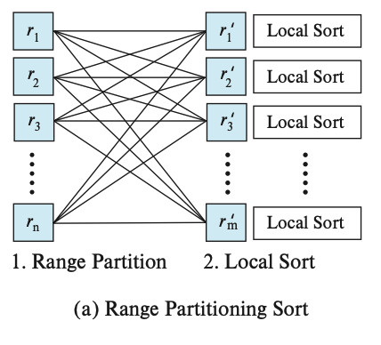
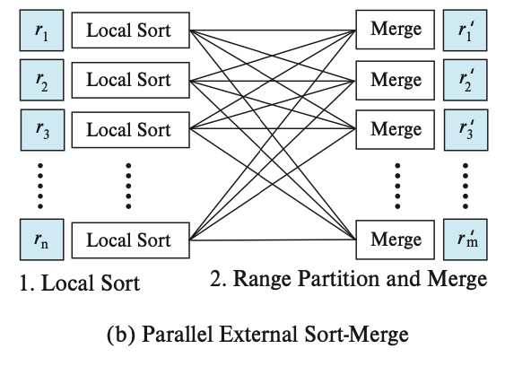
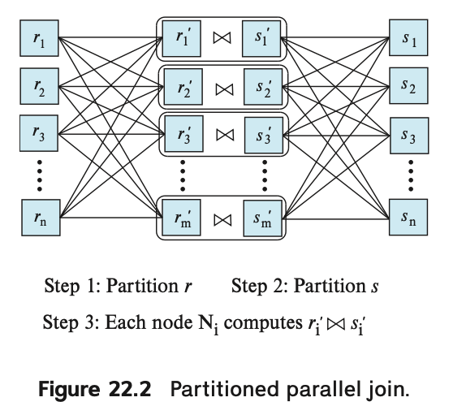

# Parallel and Distributed Query Processing
## Overview
* Interquery parallelism

    Executon of multiple queries in parallel with each other, across multiple nodes. Interquery parallelism 对于事务处理系统非常重要。interquery processing 不会使得单个事务的响应时间比其单独执行时更快。

* Intraquery parallelism

    The processing of different part of a single query, in parallel across multiple nodes. Intraquery parallelism 用于加速长时间运行的查询。

单个查询的执行会涉及到多个 operation，比如 select，joins 或者 aggregate operation。

* Intraoperation parallelism

    Process each operation above parallel, across multiple nodes.

比如有个查询要求对 table 排序，假设数据已经在多个磁盘上按照某个属性进行了 range 分区，并且 order by 字段正是在这个属性上，那么我们可以把 sort operation 实现成：1. 并行对每个 partition 排序；2. 对最终结果进行 concatenation

* Interoperation parallelism

    Parallelize the evaluation of the operator tree by evaluating in parallel some of the operations that do not depend on one another.

## Parallel Sort
Suppose that we wish to sort a relation r that resides on n nodes N1, N2, ... , Nn. 

理想情况：数据已经根据 order by 列进行了分区，那么在每个节点上的该列数据都是不相交的，不过分区内的数据并不一定已经排序，所以我们只需要在每个 node 进行排序，然后进行 concatenate 即可。
**If the relation has been range-partitioned on the attributes on which it is to be sorted, we can sort each partition separately and concatenate the results to get the full sorted relation**. Since the tuples are partitioned on n nodes, the time required for reading the entire relation is reduced by a factor of n by the parallel access.

如果数据本身不是按照 order by 的字段进行分区的。那么说明不同 node 上 order by 的列数据可能相交。那么我们有两种方式实现全局的排序：

1. 根据排序字段，对数据进行 range partition，把不同的 range 发送到不同的 node，此时数据分布与理想分布一样，那么后续处理与之前一样：在不同的 node 完成对 range 内数据排序后，将结果组合成最终的顺序

2. 先在每个节点本身不区分 range，直接排序，排序后再进行 range-partition，此时每个接收 range i 的 node i 将会收到多个有序的 tuple stream，node i 进行一次 merge sorted stream，这一步结束后，数据分布相当于在理想情况下，进行一次 local sort，后续只需要进行 concatenate。

### Range-partitioning sort

两步：
1. range-pratition the relation:
redistribute the tuples in the relation, using a range-partition strategy, so that all tuples that lie within the ith range are sent to node ni
2. sorting each partition separately
第二阶段时，每个节点已经获得了它应该包含的 range 下的所有 tuple，那么每个节点就可以并行地对其包含的 range 进行排序。

最后还需要一个 final merge operation。

range-partition sort 实现的关键是如何确保各个节点包含大致相同数量的 tuple。解决这个问题的关键方法：Virtual node partition

### Parallel External Sort-Merge

假设数据已经在多个 node 之间分区，那么 Parallel external sort-merge 的步骤是：
1. 每个 node 在本地基于 order by 目标列对其数据进行排序
2. 集群对在多个 node 上已经排好序的多个 partition 进行并行排序

其中第二步可以用如下方式进行并行实现：

1. 对每个 node 上的数据进行 range-partition，每个 node 都会把 Range `[i, j)` 发送给 Node i
2. Node i 收到的一组排好序的 stream，每个 node 就将其收到的数据进行 merge
3. The system concatenates the sorted runs on nodes N1, N2, ... , Nm to get the final result.

## Parallel Join
整体目标：把 relate 数据分割到多个 nodes，每个 nodes 完成 join 的一部分工作，然后系统再把每个 node 的结果合并。

### Partitioned Join

只适用于 equi-join。

Can be used for inner joins where the join condition is an equi-join.

使用相同的 pratition function 对 relation s 和 r 进行分区。
Once both relations are partitioned, we can use any join technique locally at each node Ni to compute join of ri and si.

If one or both of the relations r and s are already parittioned on the join attributes(by either hash partitioning or range partitioning), the woek needed for partitioning is reduced greatly. If the relations are not partitioned or are partitioned on attributes other than the join attributes, then the tuples need to be repartitioned.

考虑本地 join 算法实现时的一些可能的优化技术：
* If we use hash join locally the resultant parallel join technique is called partitioned parallel hash join.

hash join 首先需要把 input relations 分为多个 small pieces，这样在 build 阶段，每个 smaller relation 才可以 fits into memory. **因此，在 partitioned parallel join 中，每个 node i 需要对其收到的 r i 和 s i 进行 re-partition**。

TODO: Hybird hash join

### Fragment-and-Replicate Join

### Handling Skew in Parallel Joins
**join skew avoidance**
**Dynamic handling of join skew**
**Work stealing** is inexpensive in a shared-memory system, since all data can be accessed quickly from the shared memory.

In a shared-nothing environment, data movement may be required to move a task from one processor to another, but it is often worth paying the overhead to reduce the completion time of a task.