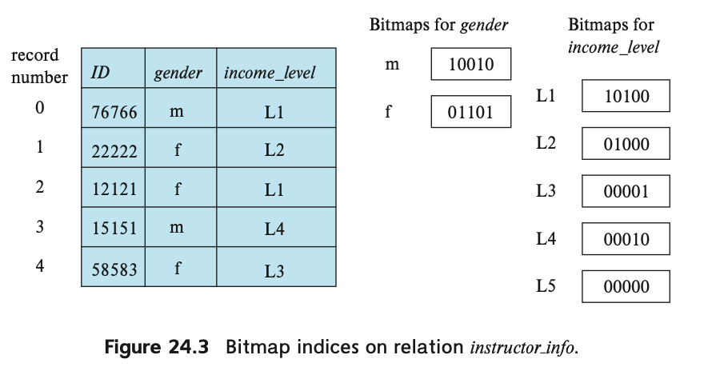

<!-- @import "[TOC]" {cmd="toc" depthFrom=1 depthTo=6 orderedList=false} -->

<!-- code_chunk_output -->

- [24.3 Bitmap Indices](#243-bitmap-indices)
  - [24.3.1 Bitmap Index Structure](#2431-bitmap-index-structure)
  - [24.3.2 Efficient Implementation of Bitmap Operations](#2432-efficient-implementation-of-bitmap-operations)

<!-- /code_chunk_output -->

## 24.3 Bitmap Indices

### 24.3.1 Bitmap Index Structure

bitmap: array of bit sequence.

考虑最简单的情况：对于关系 r 某个列 A 的可能取值 v，构造一个 bits 序列，这个序列中包含的 bit 数量与 A 的行数一样，如果 A 的行 i 的值刚好为当前的可能取值 v，那么就把序列的第 i 个 bit 设置为 1，否则设置为 0。

bitmap indices 记录了对于某个 value，其出现在关系 r 的哪些行中。比如我们通过 gender m 的 bitmap，可以快速知道哪些行的 value 是 m。

事实上，bitmap indices 的主要使用场景是在多个 key 上的 select 查询。比如在 24.3 中，我们在两个列上都有创建 bitmap indices，然后我们需要执行如下查询 `select * from instructior_info where gender = 'f' and income_level='L2'`，在有 bitmap 的情况下，我们只需要 fethc the bitmaps for gender value `f` and the bitmap for income_level value L2，然后执行 **intersection** of the two bitmaps，得到的新的 bitmap 结果将是 `01000`，说明满足过滤条件的只有第 2 行，那么我们只需要读第 2 行所在的磁盘 block 就可以得到结果。

bitmap indices 的另一个使用场景是计算某个 selection 中满足条件的 tulpe 数量。

通常来说，bitmap indices 相比实际 table 来说应当非常小。

### 24.3.2 Efficient Implementation of Bitmap Operations

使用 for loop 来计算两个 bitmap 的交集：the i-th iteration of the loop computes the and of the i-th bits of the two bitmaps.

What is important to note is that a single bit-wise and instruction can compute the intersection of 32 or 64 bits at once.

假如一张表有 1 million records，那么每个 bitmap 将会包含 1 million bits，大约 128 kilobytes，假设在 32 位机器哈桑，那么只需要 31250 条指令来计算 intersection of two bitmaps.

bitmap intersection 对应 and，bitmap union 对应 or。

bitmap 计算需要额外注意对于 record 的删除的情况。考虑 `not (income_level='L1')` 这样的过滤条件，对 L1 的 bitmap 按位取反，我们可以得到满足条件的行，**但是这些行中可能包含已经被删除的行**（被删除的行在 bitmap 中也是 0，那么取反得到了 1），所以为了删除掉被删除的行，我们还需要将 complement bitmap 与 existence bitmap 一起求交集。对于 null 值的情况也是一样。

bitmap count 有一种高效的计算方法。思路是这样，构造一个 array，array 的长度为 256，第 i 个 element 记录了一个整数，这个整数的值等于 i 的二进制表示下，有多少个 1，比如最后一个 element 是第 255 个元素，那么就存 8 (0xFF)。然后按字节遍历 bitmap，把这个字节理解成一个 UInt8 j，然后去查 array[j]，就立刻得到当前字节有多少 1，然后累加所有的值，得到整个 bitmap 有多少 1。（就是把每个字节的 bitcount 然后加起来，只不过不计算，直接查表）
