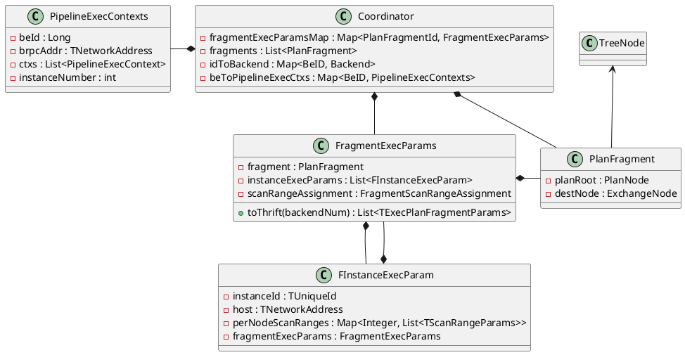

<!-- @import "[TOC]" {cmd="toc" depthFrom=1 depthTo=6 orderedList=false} -->

<!-- code_chunk_output -->

- [如何选择副本](#如何选择副本)

<!-- /code_chunk_output -->



## 如何选择副本
`FInstanceExecParam.host` 记录 instance 在哪个 host 执行。

```java
class OlapScanNode {
    private void addScanRangeLocations(Partition partition, List<Tablet> tablets) {
        for (tablet : tablets) {
            locations = new TScanRangeLocations();
            new TPolaScanRange();
            List<Replica> replicas = tablet.getQueryableReplicas();

            for (raplica : raplicas) {
                if (BE of replica is not alive)
                    continue;
                locations.addLocation(new TScanRangeLocation(BE ip:port));
            }

            this.scanRangeLocations.add(locations);
        }
    }
}
```
`scanRangeLocations` 是一个 `List<TScanRangeLocations>`。
对 doris 内表来说，每个 `TScanRangeLocations` 对应一个 tablet，`TScanRangeLocations` 本身包含一个 `List<TScanRangeLocation>`，每个 `TScanRangeLocation` 对应一个 replica。

ScanNode 构造出来后，它并没有选择某个具体的副本，`addScanRangeLocations` 只是提供了可供选择的 raplica 范围。


```java
class Coordinarot {
    private void computeFragmentHosts() {
        for (fragment : fragments) {
            if (fragment source is UNPARTITION) {
                if (has resource limit or is external scan) {
                    select any BE related to this query
                } else {
                    select any BE from cluster
                }
            } else {
                if (left most node of fragment is exchangeNode) {
                    
                } else (left node must be scanNode) {
                    if (doing colocate join) {
                        
                    } else if (doing bucket shuffle join) {

                    } else {
                        // normal scan node
                        for (scan range of this fragment) {
                            
                        }
                    }
                }
                
            }
        }
    }

    private void computeScanRangeAssignment() {
        for (scanNode : scanNodes) {
            // locations 类型是 List<ScanRangeLocation>
            locationsList = scanNode.getScanRangeLocations();
            computeScanRangeAssigmentByScheduler(scanNode, locationsList, )
        }
    }

    private void computeScanRangeAssigmentByScheduler(
        final ScanNode scanNode,
        final List<TScanRangeLocations> tablet_locations_list,
        FragmentScanRangeAssignment assignment) {

        for (TScanRangeLocations tablet_locations : tablet_locations_list) {
            for (tablet_location : tablet_locations) {
                // Replicas of distinct tablets may have same distribution topology on a set of hosts.
                // for example we have tablets A/B/C and hosts H1/H2/H3, replica Ai/Bi/Ci resides on Hi.
                // For a query with 3 fragments and all them has one ScanNode,
                // we will try to select A1/B2/C3 to assign three ScanNode to avoid IO skew.
                select a replica with minimal workload
                add the replica to assignment arg
            }
        }
    }
}
```