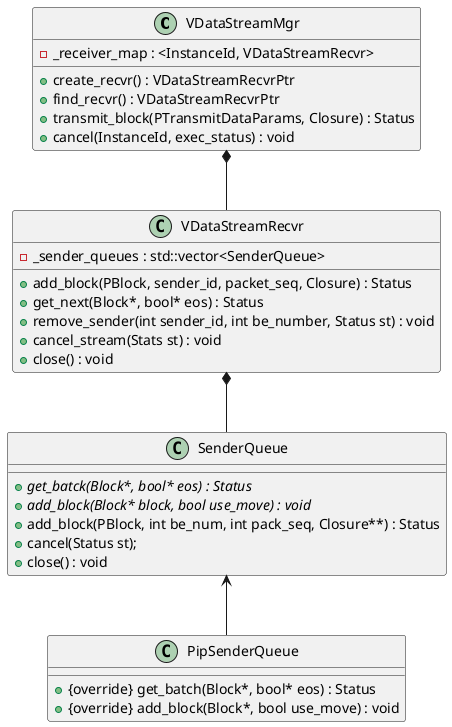
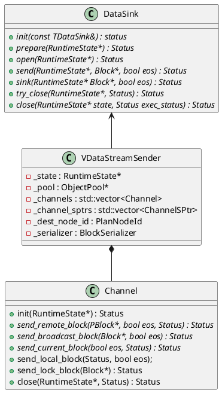

```plantuml
@startuml
class VDataStreamMgr {
    + create_recvr() : VDataStreamRecvrPtr
    + find_recvr() : VDataStreamRecvrPtr
    + transmit_block(PTransmitDataParams, Closure) : Status
    + cancel(InstanceId, exec_status) : void
    - _receiver_map : <InstanceId, VDataStreamRecvr>
}

VDataStreamMgr *-- VDataStreamRecvr

class VDataStreamRecvr {
    + add_block(PBlock, sender_id, packet_seq, Closure) : Status
    + get_next(Block*, bool* eos) : Status
    + remove_sender(int sender_id, int be_number, Status st) : void
    + cancel_stream(Stats st) : void
    + close() : void
    - _sender_queues : std::vector<SenderQueue>
}

VDataStreamRecvr *-- SenderQueue

class SenderQueue {
    + {abstract} get_batck(Block*, bool* eos) : Status
    + {abstract} add_block(Block* block, bool use_move) : void
    + add_block(PBlock, int be_num, int pack_seq, Closure**) : Status
    + cancel(Status st);
    + close() : void
}
SenderQueue <-- PipSenderQueue

class PipSenderQueue {
    + {override} get_batch(Block*, bool* eos) : Status
    + {override} add_block(Block*, bool use_move) : void
}

@enduml
```
#### 
test

```plantuml
@startuml
class DataSink {
    + {abstract} init(const TDataSink&) : status
    + {abstract} prepare(RuntimeState*) : Status
    + {abstract} open(RuntimeState*) : Status
    + {abstract} send(RuntimeState*, Block*, bool eos) : Status
    + {abstract} sink(RuntimeState* Block*, bool eos) : Status
    + {abstract} try_close(RuntimeState*, Status) : Status
    + {abstract} close(RuntimeState* state, Status exec_status) : Status
}

DataSink <-- VDataStreamSender

class VDataStreamSender {
    - _state : RuntimeState*
    - _pool : ObjectPool*
    - _channels : std::vector<Channel>
    - _channel_sptrs : std::vector<ChannelSPtr>
    - _dest_node_id : PlanNodeId
    - _serializer : BlockSerializer
}

VDataStreamSender *-- Channel

class Channel {
    + init(RuntimeState*) : Status
    + {abstract} send_remote_block(PBlock*, bool eos, Status) : Status
    + {abstract} send_broadcast_block(Block*, bool eos) : Status
    + {abstract} send_current_block(bool eos, Status) : Status
    + send_local_block(Status, bool eos);
    + send_lock_block(Block*) : Status
    + close(RuntimeState*, Status) : Status
}

@enduml
```