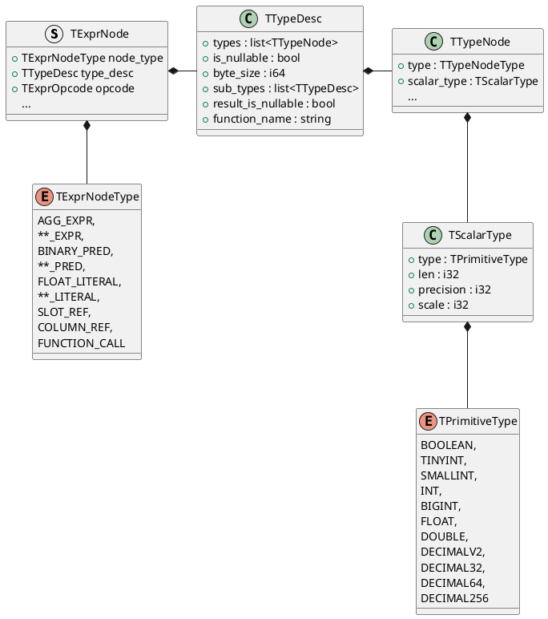

<!-- @import "[TOC]" {cmd="toc" depthFrom=1 depthTo=6 orderedList=false} -->

<!-- code_chunk_output -->

- [Cast Expr](#cast-expr)
    - [BE](#be)
- [init & prepare](#init--prepare)
    - [vexpr 的公共逻辑](#vexpr-的公共逻辑)
    - [literal](#literal)
    - [cast_expr](#cast_expr)
      - [init](#init)
      - [prepare](#prepare)
- [open & execute](#open--execute)
    - [vexpr](#vexpr)
    - [cast_expr](#cast_expr-1)
    - [literal](#literal-1)

<!-- /code_chunk_output -->





## Cast Expr
`select cast(12 as decimalv2(2,1));`
#### BE
```thrift
TExpr {
    TExprNode[0] = {
        NodeType = CAST_EXPR(5),
        TTypeDesc = {
            TTypeNode = Scalar(0),
            TScalarType = {
                TPrimitiveType = DECIMALV2(17),
                precision = 2
                scale = 1
            }
        },
        OpCode = 4
        numchild = 1
        TFcuntion = {
            name = "casttodecimalv2",
            arg_types = [
                TTypeDesc = {
                    TTYpeNode = Scalar(0),
                    TScalarType = {
                        TPrimitiveType = TINYINT(3),
                    }
                }
            ],
            return_type = TTypeDesc {
              TTypeNode = Scalar(0),
              TScalarType = {
                    TPrimitiveType = DECIMALV2(17),
                    precision = 2
                    scale = 1
                }
            },
            signature(string) = "casttodecimalv2(TINYINT)"
        }
    },
    TExprNode[1] = {
        NodeType = INT_LITERAL(9),
        TTypeDesc = {
            TTypeNode = Scalar(0),
            TScalarType = {
                 TPrimitiveType = TINYINT(3),
            }
        },
        num_child = 0,
        TIntLiteral = {
            value = 12
        }
    }
}
```
BE 看到的表达式结构如上。
## init & prepare
```cpp
Status VExpr::create_expr_tree(const TExpr& texpr, VExprContextSPtr& ctx) {
    int node_idx = 0;
    return create_tree_from_thrift(texpr.nodes, &node_idx, ...);
}

Status VExpr::create_tree_from_thrift(
                    const std::vector<TExprNode>& nodes, int* node_idx)
{
    _root_node = create_expr(nodes.front());

    std::stack<VExprPtr> stack;
    stack.push(_root_node);

    while(!stack.empty()) {
        auto parent = stack.top();
        ++node_idx;
        auto child_expr = create_expr(nodes[node_idx]);
        parent.add_child(child_expr);
        if (nodes[node_idx].num_child > 0) {
            stack.push(child_expr);
        }
    }
}
```
上述伪代码在 prepare 阶段构建 expr tree。对于每个子 expr，创建在 `VExpr::create_expr` 中完成。我们的 cast 例子中一共有两个 expr node：
```cpp
Status VExpr::create_expr(const TExprNode& expr_node, VExprSPtr& expr) {
    case TExprNodeType::INT_LITERAL:
            expr = VLiteral::create_shared(expr_node);
            break;
    case TExprNodeType::CAST_EXPR: {
            expr = VCastExpr::create_shared(expr_node);
            break;
    }
}
```
#### vexpr 的公共逻辑
vexpr 构造时的公共逻辑：
```cpp
VExpr::VExpr(const TExprNode& node)
        : _node_type(node.node_type),
          _opcode(node.__isset.opcode ? node.opcode : TExprOpcode::INVALID_OPCODE),
          _type(TypeDescriptor::from_thrift(node.type)) {
    // 这里还没有创建 BE 执行的函数
    if (node.__isset.fn) {
        _fn = node.fn;
    }

    _data_type = DataTypeFactory::instance().create_data_type(_type, node.is_nullable);
}

DataTypePtr DataTypeFactory::create_data_type(const TypeDescriptor& col_desc, bool is_nullable) {
    ...
    // 12 这个 INT_LITERAL 的具体类型为 TINYINT
    case TYPE_TINYINT:
        nested = std::make_shared<vectorized::DataTypeInt8>();
        break;
    // CAST_EXPR 的返回值类型为 TYPE_DECIMALV2
    case TYPE_DECIMALV2:
        nested = std::make_shared<vectorized::DataTypeDecimal<vectorized::Decimal128V2>>(27, 9);
        break;
    ...
    if (nested && is_nullable) {
        return make_nullable(nested);
    }
    return nested;
}
```
VExpr 在 prepare 时的公共逻辑很简单，主要是依次调用 child 的 prepare 函数：
```cpp
Status VExpr::prepare(RuntimeState* state, const RowDescriptor& row_desc, VExprContext* context) {
    for (auto& i : _children) {
        RETURN_IF_ERROR(i->prepare(state, row_desc, context));
    }
    return Status::OK();
}
```


#### literal
```cpp
VLiteral(const TExprNode& node, bool should_init = true)
    : VExpr(node), _expr_name(_data_type->get_name())
{
    if (should_init) {
        _init(node);
    }
}

void VLiteral::_init(const TExprNode& node) {
    Field field;
    field = _data_type->get_field(node);
    _column_ptr = _data_type->create_column_const(1, field);
}
```
在构造 VExpr 的时候，得到 _date_type 为 `std::make_shared<vectorized::DataTypeInt8>();`
所以 _init 的时候创建的 _column_ptr 为 `ColumnInt8`
```cpp

ColumnPtr DataTypeNumberBase<Int8>::create_column_const(size_t size, const Field& field) const
{
    return IDataType::create_column_const(size, field);
}

ColumnPtr IDataType::create_column_const(size_t size, const Field& field) const {
    auto column = create_column();
    column->reserve(1);
    column->insert(field);
    return ColumnConst::create(std::move(column), size);
}
```
注意最后我们得到的是一个包在 ColumnConst 中的 ColumnInt8 
#### cast_expr
##### init
```cpp
class VCastExpr final : public VExpr {}

VCastExpr(const TExprNode& node) : VExpr(node) {}
```
VCastExpr 构造时没有特殊的逻辑，就简单构造了父类 VExpr，执行后

`_date_type = std::make_shared<vectorized::DataTypeDecimal<vectorized::Decimal128V2>>(27, 9);`

doris cast 失败时会得到 null，因此上述 _date_type 外层是一个 `DataTypeNullable`

##### prepare

VCastExpr 在 prepare 阶段会做一些事：
```cpp
doris::Status VCastExpr::prepare(doris::RuntimeState* state, const doris::RowDescriptor& desc,
                                 VExprContext* context)
{
    // prepare children
    RETURN_IF_ERROR_OR_PREPARED(VExpr::prepare(state, desc, context));
    ...
    ColumnsWithTypeAndName argument_template;
    argument_template.reserve(2);
    argument_template.emplace_back(nullptr, child->data_type(), child_name);
    argument_template.emplace_back(_cast_param, _cast_param_data_type, _target_data_type_name);
    _function = SimpleFunctionFactory::instance().get_function(function_name, argument_template, _data_type);
    VExpr::register_function_context(state, context);
    _prepare_finished = true;
}
```
最主要的事是找到并且实例化用到的 cast 函数。
## open & execute
1. 对于普通 Expr，以后序遍历的方式调用整个表达式树上的所有 Expr::open 和 Expr::execute
2. 对于具有固定结果的 Expr，将 execute 的执行提前到 open 中执行

#### vexpr
```cpp
Status VExprContext::open(RuntimeState* state) {
    FunctionContext::FunctionStateScope scope =
            _is_clone ? FunctionContext::THREAD_LOCAL : FunctionContext::FRAGMENT_LOCAL;
    
    return _root->open(state, this, scope);
}

Status VExpr::open(RuntimeState* state, VExprContext* context,
                   FunctionContext::FunctionStateScope scope) {
    for (auto& i : _children) {
        RETURN_IF_ERROR(i->open(state, context, scope));
    }

    if (scope == FunctionContext::FRAGMENT_LOCAL) {
        RETURN_IF_ERROR(VExpr::get_const_col(context, nullptr)); // 谜之操作
    }
    return Status::OK();
}
```
vexpr 公共逻辑递归调用表达式树上所有 expr node 的 open 方法，**对于每个 node，如果其计算结果为常量，那么在 open 阶段提前执行 execute 得到所有的常量。**
```cpp
Status VExpr::get_const_col(VExprContext* context,
                            std::shared_ptr<ColumnPtrWrapper>* column_wrapper) {
    if (!is_constant()) {
        return Status::OK();
    }

    if (_constant_col != nullptr) {
        *column_wrapper = _constant_col;
        return Status::OK();
    }

    int result = -1;
    Block block;
    block.insert({ColumnUInt8::create(1), std::make_shared<DataTypeUInt8>(), ""});

    RETURN_IF_ERROR(execute(context, &block, &result));
    
    const auto& column = block.get_by_position(result).column;
    _constant_col = std::make_shared<ColumnPtrWrapper>(column);
    *column_wrapper = _constant_col;
    return Status::OK();
}
```
忽略细节，`get_const_col` 会执行 VExpr 得到一个 ColumnConst
#### cast_expr
```cpp
doris::Status VCastExpr::open(doris::RuntimeState* state, VExprContext* context,
                              FunctionContext::FunctionStateScope scope) {
    DCHECK(_prepare_finished);
    for (auto& i : _children) {
        RETURN_IF_ERROR(i->open(state, context, scope));
    }
    RETURN_IF_ERROR(VExpr::init_function_context(context, scope, _function));

    if (scope == FunctionContext::FRAGMENT_LOCAL) {
        RETURN_IF_ERROR(VExpr::get_const_col(context, nullptr));
    }

    _open_finished = true;
    return Status::OK();
}
```
`CastExpr::open` 没有复用 VExpr::open，而是在子表达式的 open 与执行自身的 `get_const_col` 之间增加了 `VExpr::init_function_context`，在执行 `VExpr::get_const_col` 时会执行到 `VCastExpr::execute`

```cpp
doris::Status VCastExpr::execute(VExprContext* context, doris::vectorized::Block* block,
                                 int* result_column_id) {
    int column_id = 0;
    RETURN_IF_ERROR(_children[0]->execute(context, block, &column_id));

    // call function
    size_t num_columns_without_result = block->columns();
    // prepare a column to save result
    block->insert({nullptr, _data_type, _expr_name});

    auto state = Status::OK();

    try {
        state = _function->execute(context->fn_context(_fn_context_index), *block,
                                   {static_cast<size_t>(column_id)}, num_columns_without_result,
                                   block->rows(), false);
        *result_column_id = num_columns_without_result;
    } catch (const Exception& e) {
        state = e.to_status();
    }
    return state;
}
```
cast_expr 在执行时先执行子表达式，当前例子里，我们可以想象 literal::execute 执行后应该会在 block 中塞一个 `ColumnConst(ColumnInt8)`
然后把从子表达式得到的结果传给 prepare 阶段找到的 function::execution。


#### literal
```cpp
Status VLiteral::open(RuntimeState* state, VExprContext* context,
                      FunctionContext::FunctionStateScope scope) {
    RETURN_IF_ERROR(VExpr::open(state, context, scope));
    return Status::OK();
}

Status VLiteral::execute(VExprContext* context, vectorized::Block* block, int* result_column_id)
{
    size_t row_size = std::max(block->rows(), _column_ptr->size());
    *result_column_id = VExpr::insert_param(block, {_column_ptr, _data_type, _expr_name}, row_size);
    return Status::OK();
}

static size_t insert_param(Block* block, ColumnWithTypeAndName&& elem, size_t size)
{
    // usually elem.column always is const column, so we just clone it.
    elem.column = elem.column->clone_resized(size);
    block->insert(std::move(elem));
    return block->columns() - 1;
}
```
拷贝了一份在 `VLiteral::_init` 阶段得到的 `ColumnInt8`，这个列会被传给 CastExpr 中的 `_funcion->execute` 函数，CastExpr 的结果则会在 `VExpr::get_const_col` 中被保存到 `_constant_col` 中。