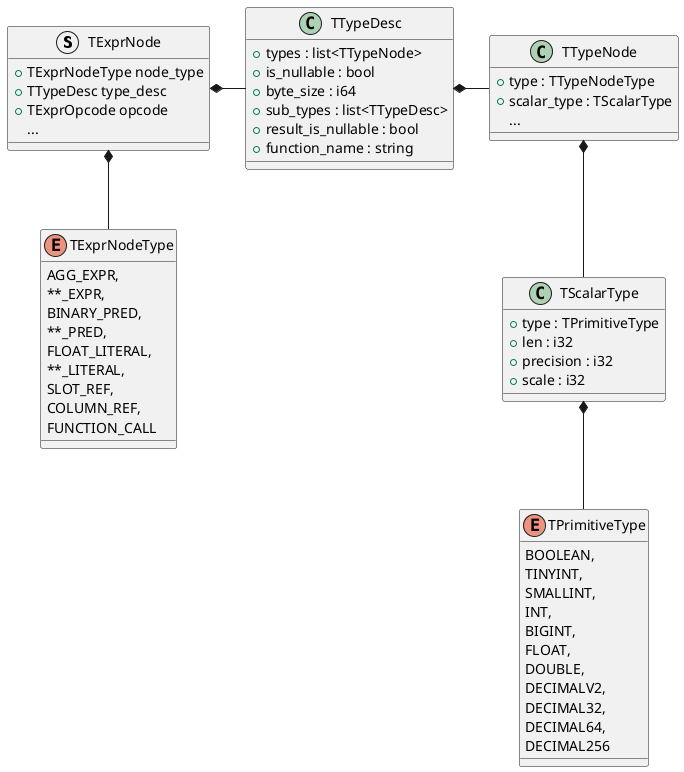

<!-- @import "[TOC]" {cmd="toc" depthFrom=1 depthTo=6 orderedList=false} -->

<!-- code_chunk_output -->

- [Cast Expr](#cast-expr)
  - [FE](#fe)
  - [BE](#be)

<!-- /code_chunk_output -->





```cpp
Status VExpr::create_tree_from_thrift(const std::vector<TExprNode>& nodes, int* node_idx,
                                      VExprSPtr& root_expr, VExprContextSPtr& ctx)
{
    // create root
    RETURN_IF_ERROR(create_expr(nodes[*node_idx], root));

    // create child
    for (size_t nodeidx = 0; node_idx < range nodes[node_idx]; ++nodex_idx)
    {
        RETURN_IF_ERROR(create_tree_thrift(nodes[*node_idx], expr));
    }

    return Status::OK();
}
```
`select * from table where user_id = 0;` user_id 类型为 BIGINT, `where user_id > 0` 的表示方式：
`where` 对应一个 conjuncts，注意是一个复数单词，所以对应数据结构是一个 `list<conjunct>`
```thrift
conjuncts(list) {
    conjunct0,
    conjunct1,
    ...
}
```
demo case 中 where 只有一个表达式，这里只有一个 conjunct。如果是 `WHERE a > b AND c < d` 这样的过滤条件，那么我们得到多个 conjuncts。

`user_id = 0` 是唯一的一个 conjunct，其类型是一个 `Expr`，Expr 是一个由 ExprNode 组成的逻辑上的树状结构，实际由一个 list 结构保存。
```thrift
TExpr {
    nodes(list) {
        ExprNode0,
        ExprNode1,
        ...
    }
}
```
`user_id = 0` 是 3 个 ExprNode 组成的 Expr，第一个 ExprNode 是代表 = 的 `BINARY_PRED`，第二第三个 `ExprNode` 则是分别代表 `user_id` 列以及 0 这个字面量。

* `BINARY_PRED`

```thrift {.line-numbers}
ExprNode {
    ExprNodeType = BINARY_PRED
    num_children = 2
    Function {
        FunctionName = "eq"
        TFunctionBinaryType::type binary_type
        TTypeDesc(list)  arg_types
        TTypeDesc ret_type
        String signature = "eq(BIGINT, BIGINT)"
    }
}
```
`user_id` 与字面量 `0` 作为 `Function` 的参数存在，对应上述第 7 行的 `TypeDesc(list)`，他俩的类型一样，都是 `BIGINT`。
```cpp
TypeDesc {
    TypeNodes (list) {
        TypeNode {
            type = SCALAR
            scalar_type = ScalarType {
                PrimitiveType = BIGINT
            }
        }
    }
}
```
函数 `eq` 的返回值是
```
TypeDesc {
    TypeNodes (list) {
        TypeNode {
            type = SCALAR
            scalar_type = ScalarType {
                PrimitiveType = BOOLEAN
            }
        }
    }
}
```
* user_id

`user_id` 与 `=` 这个 `BINARY_PRED` 都是 `ExprNode`，`user_id` 与 `0` 是作为 `=` 的 children ExprNode
```thrift
ExprNode {
    ExprNodeType = SLOT_REF
    TypeDesc {
        TypeNode {
            type = SCALAR
            TScalarType {
                PrimitiveType = BIGINT
            }
        }
    }
    number_child = 0
    TSlotRef {
        slot_id = 19
        tuple_id = 0
        col_unique_id =  19
    }
}
```

* 0
```
ExprNode {
    ExprNodeType = INT_LITERAL
    TypeDesc {
        TypeNode {
            type = SCALAR
            TScalarType {
                PrimitiveType = BIGINT
            }
        }
        num_children = 0
        TIntLiteral {
            value(int64) = 0
        }
    }
}
```
注意 0 是一个 IntLiteral，实际类型是 BIGINT。

字面量是怎么转为 Column 的：
```cpp
VExpr::Vexpr(const TExprNode& node)
    : _type_desc(TypeDescriptor(node.type)) {
        ...
    _data_type = DataTypeFactory::instance().create_data_type(_type_desc, is_nullable);
}
```
构造的到的 `_type_desc` 以及 `_data_type`
```cpp
TypeDescriptor::TypeDescriptor(...) {
    ...
    case TTypeNodeType::SCALAR: {
        const TScalarType& scalar_type = node.scalar_type;  // BIGINT
        // PrimitiveType thrift_to_type(TPrimitiveType::type ttype)
        type = thrift_to_type(scalar_type)  // TYPE_BIGINT
    }
   ...
}

DataTypePtr DataTypeFactory::create_data_type(const TypeDescriptor& col_desc) {
    DataTypePtr nested = nullptr;
    ...
    case TYPE_BIGINT:
        nested = std::make_shared<vectorized::DataTypeInt64>();
        break;
    ...
    if (nested && is_nullable) {
        return std::make_shared<vectorized::DataTypeNullable>(nested);
    }
    return nested;
}
```
`VExpr` 构造完成后，开始构造子类 `VLiteral`:
```cpp
VLiteral::VLiteral(const TExprNode& node, bool should_init)
        : VExpr(node), _expr_name(_data_type->get_name()) {
    _init(node);
}

void VLiteral::_init(const TExprNode& node) {
    Field field;
    field = _data_type->get_field(node);
    _column_ptr = _data_type->create_column_const(1, field);
}
```
这里的到的 _date_type 是 `DataTypeInt64`:
```cpp
using DataTypeInt64 = DataTypeNumber<Int64>;

template <typename T>
class DataTypeNumber final : public DataTypeNumberBase<T> {
    ...
}

template <typename T>
class DataTypeNumberBase : public IDataType {
    using ColumnType = ColumnVector<T>;
    using FieldType = T;
    ...
}


template <typename T>
Field DataTypeNumberBase<T>::get_field(const TExprNode& node) const {
    ...
    if constexpr (std::is_same_v<TypeId<T>, TypeId<Int64>>) {
        return Int64(node.int_literal.value);
    }
    ...
}
```
Field 的构造函数如下，这段模板没看懂啊，只能认为没 bug 得到正确的 int64_t 0 了。
```cpp
/// This (rather tricky) code is to avoid ambiguity in expressions like
/// Field f = 1;
/// instead of
/// Field f = Int64(1);
/// Things to note:
/// 1. float <--> int needs explicit cast
/// 2. customized types needs explicit cast
template <typename T>
    requires(!std::is_same_v<std::decay_t<T>, Field>)
Field::Field(T&& rhs) {
    auto&& val = cast_to_nearest_field_type(std::forward<T>(rhs));
    create_concrete(std::forward<decltype(val)>(val));
}
```
回到 `VLiteral::_init`
```cpp
void VLiteral::_init(const TExprNode& node) {
    Field field;
    field = _data_type->get_field(node);
    _column_ptr = _data_type->create_column_const(1, field);
}

template <typename T>
MutableColumnPtr DataTypeNumberBase<T>::create_column() const {
    return ColumnVector<T>::create();
}
```
得到的是一个 `ColumnVecotr<int64_t>`

### Cast Expr
`select cast(12 as decimalv2(2,1));`
#### FE
FE 判断需要进行 implicit cast 的时候应该会 new 一个 CastExpr，具体代码还没找到。
#### BE
```thrift
TExpr {
    TExprNode[0] = {
        NodeType = CAST_EXPR(5),
        TTypeDesc = {
            TTypeNode = Scalar(0),
            TScalarType = {
                TPrimitiveType = DECIMALV2(17),
                precision = 2
                scale = 1
            }
        },
        OpCode = 4
        numchild = 1
        TFcuntion = {
            name = "casttodecimalv2",
            arg_types = [
                TTypeDesc = {
                    TTYpeNode = Scalar(0),
                    TScalarType = {
                        TPrimitiveType = TINYINT(3),
                    }
                }
            ],
            return_type = TTypeDesc {
              TTypeNode = Scalar(0),
              TScalarType = {
                    TPrimitiveType = DECIMALV2(17),
                    precision = 2
                    scale = 1
                }
            },
            signature(string) = "casttodecimalv2(TINYINT)"
        }
    },
    TExprNode[1] = {
        NodeType = INT_LITERAL(9),
        TTypeDesc = {
            TTypeNode = Scalar(0),
            TScalarType = {
                 TPrimitiveType = TINYINT(3),
            }
        },
        num_child = 0,
        TIntLiteral = {
            value = 12
        }
    }
}
```
BE 看到的表达式结构如上。

```