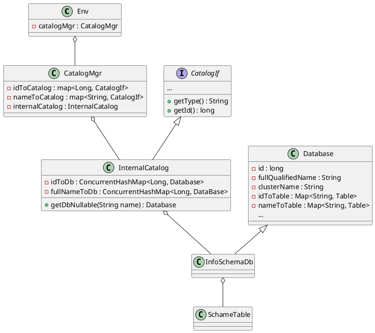

### mysqldump
```cpp
// mysqldump.cc
static int dump_all_databases() {
    ...
    uint db_cnt = 0, cnt = 0
    uint mysql_db_found = 0;
    ...
    if (mysql_query_with_error_report(mysql, &tableres, "SHOW DATABASES"))
    ...
    while ((row = mysql_fetch_row(tableres))) {
        ...
        if (mysql_db_found || (!my_strcasecmp(charset_info, row[0], "mysql"))) {
            if (dump_all_tables_in_db(row[0])) result = 1;
            mysql_db_found = 1;
            /*
                once mysql database is found dump all dbs saved as part
                of database_list
            */
            for (; cnt < db_cnt; cnt++) {
                if (dump_all_tables_in_db(database_list[cnt])) result = 1;
                my_free(database_list[cnt]);
            }
        } else {
            /*
                till mysql database is not found save database names to
                database_list
            */
            database_list[db_cnt] =
                my_strdup(PSI_NOT_INSTRUMENTED, row[0], MYF(MY_WME | MY_ZEROFILL));
            db_cnt++;
        }
    }
    assert(mysql_db_found);
    ...
}
```

### information_schema

构造 InternalCatalog 时创建 InfoSchemaDb 对象，将该对象添加到 Db map 中。

### create table 执行流程
```txt
StmtExecutor::executeByLegacy(queryId)
    StmtExecutor::handleDdlStmt()
        DdlExecutor::execute(Env, DdlStmt)
            Env::createTable(CreateTableStmt) {
                getInternalCatalog().createTable(stmt)
            }
            InternalCatalog::createTable(CreteTableStmt)
```


#### fe 元数据持久化
```java
public class InternalCatalog {
    ...
    public void createDb(CreateDbStmt stmt) {
        ...
        // Write memory
        Env.getCurrentEnv().getEditLog().logCreateDb(db);

    }
}


public class Database {
    ...
    public Pair<Boolean, Boolean> createTableWithLock(
        Table table, boolean isReplay, boolean setIfNotExist){
        ...
        // Write idToTable
        // Write nameToTable
        // Write lowerCaseToTableName
        if (!isReplay) {
            CreateTableInfo info = new CreateTableInfo(fullQualifiedName, table);
            Env.getCurrentEnv().getEditLog().logCreateTable(info);
        }
    }
}
```


### Q
当 engine 为非 olap 类型时，ddl 语句的行为应该是什么？
