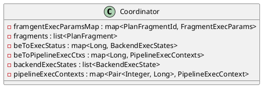
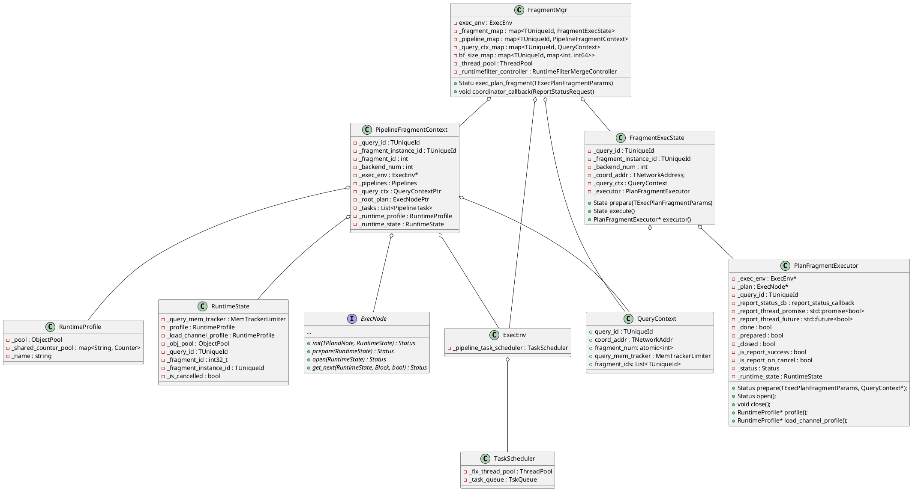
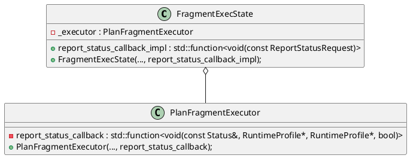

[TOC]

### QUERY 管控

QeProcessorImpl

ConnectContext


### FE

handleQueryStmt

TableQueryPlanAction.java
    
    handleQuery
    
似乎这个类的方法是专门供通过http接口查询query plan使用的

    NOTE: 有bug

    curl -X POST -H "Content-Type: application/json" -u root: -d '{"sql":"selm demo.example_tbl where city='shanghai';"}' http://127.0.0.1:8837/api/demo/example_tbl/_query_plan
    {"msg":"success","code":0,"data":{"exception":"errCode = 2, detailMessage = Unknown column 'shanghai' in 'table list'","status":400},"count":0}

```java
{
    planner = new NereidsPlanner(statementContext);
    try {
        planner.plan(parsedStmt, context.getSessionVariable().toThrift());
    } catch (Exception e) {
        LOG.debug("Nereids plan query failed:\n{}", originStmt.originStmt);
        throw new NereidsException(new AnalysisException("Unexpected exception: " + e.getMessage(), e));
    }
    profile.getSummaryProfile().setQueryPlanFinishTime();
    handleQueryWithRetry(queryId);
}

handleQueryWithRetry()
{
    ...
    handleQueryStmt();
}

private void handleQueryStmt() throws Exception {
    ...
    QueryDetail queryDetail = new QueryDetail(context.getStartTime(),
                DebugUtil.printId(context.queryId()),
                context.getStartTime(), -1, -1,
                QueryDetail.QueryMemState.RUNNING,
                context.getDatabase(),
                originStmt.originStmt);
    ...
    CacheAnalyzer cacheAnalyzer = new CacheAnalyzer(context, parsedStmt, planner);
    ...
    sendResult(isOutfileQuery, false, queryStmt, channel, null, null);
}

private void sendResult(boolean isOutfileQuery, boolean isSendFields, Queriable queryStmt, MysqlChannel channel,
            CacheAnalyzer cacheAnalyzer, InternalService.PFetchCacheResult cacheResult) throws Exception {
    RowBatch batch;
    coord = new Coordinator(context, analyzer, planner, context.getStatsErrorEstimator());
    ...
    try (Scope scope = queryScheduleSpan.makeCurrent()) {
        coord.exec();
    } catch (Exception e) {
        queryScheduleSpan.recordException(e);
        throw e;
    } finally {
        queryScheduleSpan.end();
    }
}   
```
```java
// org/apache/doris/qe/Coordinator.java
public class Coordinator {
    ...
    // Initiate asynchronous execution of query. Returns as soon as all plan fragments
    // have started executing at their respective backends.
    // 'Request' must contain at least a coordinator plan fragment (ie, can't
    // be for a query like 'SELECT 1').
    // A call to Exec() must precede all other member function calls.
    public void exec() throws Exception {
        ...
        prepare();
        // compute Fragment Instance
        computeScanRangeAssignment();

        computeFragmentExecParams();

        traceInstance();

        QeProcessorImpl.INSTANCE.registerInstances(queryId, instanceIds.size());

        if (topDataSink instanceof ResultSink || topDataSink instanceof ResultFileSink) {
            // 这里获取 be 的地址，port 是 be.conf 中的 be_port
            TNetworkAddress execBeAddr = topParams.instanceExecParams.get(0).host;  
        }
    }

    private void sendPipelineCtx() throws TException, RpcException, UserException {
        ...
        for (PipelineExecContexts ctxs : beToPipelineExecCtxs.values()) {
            Span span = Telemetry.getNoopSpan();
            if (ConnectContext.get() != null) {
                span = ConnectContext.get().getTracer().spanBuilder("execRemoteFragmentsAsync")
                        .setParent(parentSpanContext).setSpanKind(SpanKind.CLIENT).startSpan();
            }
            ctxs.scopedSpan = new ScopedSpan(span);
            ctxs.unsetFields();
            BackendServiceProxy proxy = BackendServiceProxy.getInstance();
            futures.add(ImmutableTriple.of(ctxs, proxy, ctxs.execRemoteFragmentsAsync(proxy)));
        }
    }
}
```
发送 rpc 请求是在 execRemoteFragmentsAsync 里
```java
public class Coordinator {
    ...
    public Future<InternalService.PExecPlanFragmentResult> execRemoteFragmentsAsync(BackendServiceProxy proxy) throws TException {
        try {
            TPipelineFragmentParamsList paramsList = new TPipelineFragmentParamsList();
            for (PipelineExecContext cts : ctxs) {
                cts.initiated = true;
                paramsList.addToParamsList(cts.rpcParams);
            }
            return proxy.execPlanFragmentsAsync(brpcAddr, paramsList, twoPhaseExecution);
        } catch (RpcException e) {
            // DO NOT throw exception here, return a complete future with error code,
            // so that the following logic will cancel the fragment.
            return futureWithException(e);
        }
    }
}
```


#### fragment 管控


```java {.line-numbers}
public class Coordinator {
    ...
    private void sendPipelineCtx() {
        ...
        boolean twoPhaseExecution = fragments.size() > 1;
        for (PlanFragment fragment : fragments) {
            // 开始构造 instance 参数
            FragmentExecParams params = fragmentExecParamsMap.get(fragment.getFragmentId());
            
        }
    }
}
```
从第7行开始，为每个 fragment 构造 instance 相关参数。

### BE
* rpc 入口
```cpp
// backend_service.cpp
void BackendService::exec_plan_fragment(TExecPlanFragmentResult& return_val,
                                        const TExecPlanFragmentParams& params) {
    LOG(INFO) << "exec_plan_fragment() instance_id=" << params.params.fragment_instance_id
              << " coord=" << params.coord << " backend#=" << params.backend_num;
    start_plan_fragment_execution(params).set_t_status(&return_val);
}


void FragmentMgr::_exec_actual(std::shared_ptr<FragmentExecState> exec_state,
                               const FinishCallback& cb) {
    ...
    Status st = exec_state->execute();
    ...
}


Status FragmentExecState::execute() {
    ...
    int64_t duration_ns = 0;
    {
        ...
        Status st = _executor.open();
        ...
        if (!st.ok()) {
            cancel(PPlanFragmentCancelReason::INTERNAL_ERROR, "PlanFragmentExecutor open failed");
        }
        _executor.close();
    }
}
```
其中 `PlanFragmentExecutor _executor` 在 FragmentExecState 构造时一起构造

```cpp
class PlanFragmentExecutor {
public:
    ...    
}
```

#### overall
* Query

Query：一条需要 fe 和 be 一起参与的 sql
QueryId：由 fe 赋值给 query，一起作为 query parameter 传递给 be
QueryContext：be 为每个收到的 query 创建一个 query context，保存在 FragmentMgr 中，与 query id 一一对应。
* Fragment

在 FE 的视角，一条 query 是以 fragment 为粒度执行的，一个 framgent 中将会包含数个计算 node，比如一个查询 `select * from demo.example_tbl where age <25;`，我们先通过 explain 来查看其物理执行计划：
```sql
explain select * from demo.example_tbl where age <25;
+---------------------------------------------------------------------------------------------------------------+
| Explain String                                                                                                |
+---------------------------------------------------------------------------------------------------------------+
| PLAN FRAGMENT 0                                                                                               |
|   OUTPUT EXPRS:                                                                                               |
|     user_id[#0]                                                                                               |
|     date[#1]                                                                                                  |
|     city[#2]                                                                                                  |
|     age[#3]                                                                                                   |
|     sex[#4]                                                                                                   |
|     last_visit_date[#5]                                                                                       |
|     cost[#6]                                                                                                  |
|     max_dwell_time[#7]                                                                                        |
|     min_dwell_time[#8]                                                                                        |
|   PARTITION: UNPARTITIONED                                                                                    |
|                                                                                                               |
|   VRESULT SINK                                                                                                |
|                                                                                                               |
|   1:VEXCHANGE                                                                                                 |
|      offset: 0                                                                                                |
|                                                                                                               |
| PLAN FRAGMENT 1                                                                                               |
|                                                                                                               |
|   PARTITION: HASH_PARTITIONED: user_id[#0]                                                                    |
|                                                                                                               |
|   STREAM DATA SINK                                                                                            |
|     EXCHANGE ID: 01                                                                                           |
|     UNPARTITIONED                                                                                             |
|                                                                                                               |
|   0:VOlapScanNode                                                                                             |
|      TABLE: default_cluster:demo.example_tbl(example_tbl), PREAGGREGATION: OFF. Reason: No aggregate on scan. |
|      PREDICATES: age[#3] < 25                                                                                 |
|      partitions=1/1, tablets=1/1, tabletList=10079                                                            |
|      cardinality=7, avgRowSize=1045.0, numNodes=1                                                             |
|      pushAggOp=NONE                                                                                           |
+---------------------------------------------------------------------------------------------------------------+
32 rows in set (0.02 sec)
```
为了防止歧义，这里我们称物理执行计划中的一组节点为 fragment，每个 fragment 的执行单位为 fragment instance，简称 instance。

该执行计划被分为两个 fragment，一个是 `FRAGMENT 0`，另一个是 `FRAGMENT 1`。
F0 中包含一个 VRESULT SINK 节点用于输出查询结果，一个 VEXCHANGE 节点用于接收 F1 传递给它的数据。F1 中则包含一个 VOlapScanNode 用于从 example_tbl 这张表中读数据，并且对数据进行过滤，还包含一个 STREAM DATA SINK 节点用于输出 F1 的结果给 F0。**这两个 fragment 将会对应两次对 BE 上 FragmentMgr::exec_plan_fragment 的 rpc 请求**。

每个 fragment 执行时应该创建多少 instance 由 planner 确定，每个 instance 都会在对应的 be 上创建一个对应的 `PipelineFragmentContext` 来负责管理该 instance 的执行。在本文例子中，我们修改 fe 的代码，让 F1 只生成两个 instance（默认情况下该 fragment 最少将会生成 cores/2 个 instance），F0 默认情况会包含一个 instance。
```cpp {.line-numbers}
Status FragmentMgr::exec_plan_fragment(const TPipelineFragmentParams& params,
                                       const FinishCallback& cb)
{
    ...
    // get or create query context
    std::shared_ptr<QueryContext> query_ctx;
    RETURN_IF_ERROR(_get_query_ctx(params, params.query_id, true, query_ctx));
    ...
    auto pre_and_submit = [&](int i) -> Status {
        ...
        query_ctx->fragment_ids.push_back(fragment_instance_id);
        ...
        std::shared_ptr<FragmentExecState> exec_state(
            new FragmentExecState(
                query_ctx->query_id, 
                fragment_instance_id, 
                local_params.backend_num, 
                _exec_env,
                query_ctx,
                std::bind<void>(std::mem_fn(&FragmentMgr::coordinator_callback), this,
                                std::placeholders::_1)));
        if (params.__isset.need_wait_execution_trigger && params.need_wait_execution_trigger) {
            // set need_wait_execution_trigger means this instance will not actually being executed
            // until the execPlanFragmentStart RPC trigger to start it.
            exec_state->set_need_wait_execution_trigger();
        }
        ...
        std::shared_ptr<pipeline::PipelineFragmentContext> context =
                std::make_shared<pipeline::PipelineFragmentContext>(
                        query_ctx->query_id, fragment_instance_id, params.fragment_id,
                        local_params.backend_num, query_ctx, _exec_env, cb,
                        std::bind<void>(std::mem_fn(&FragmentMgr::coordinator_callback), this,
                                        std::placeholders::_1));
        ...
        auto prepare_st = context->prepare(params, i);
        ...
        _pipeline_map.insert(std::make_pair(fragment_instance_id, context));
        ...
        return context->submit();
    }
    ...
    int target_size = params.local_params.size();
    if (target_size > 1) {
        ...
        for (size_t i = 0; i < target_size; i++) {
            _thread_pool->submit_func([&, i]() {
                prepare_status[i] = pre_and_submit(i);
                std::unique_lock<std::mutex> lock(m);
                prepare_done++;
                if (prepare_done == target_size) {
                    cv.notify_one();
                }
            });
        }
        ...
    } else {
        return pre_and_submit(0);
    }
}
```
执行 fragment 0 的请求时，前面的代码片段的第9行的 `pre_and_submit` 这个 lambda 函数将会被执行 1 次，执行 fragment 1 的请求时，`pre_and_submit` 函数将会被调用两次，该 lambda 函数的每次执行都会创建一个 `PipelineFragmentContext` 对象和一个 `FragmentExecState` 对象。
```cpp {.line-numbers}
Status PipelineFragmentContext::prepare(const doris::TPipelineFragmentParams& request,
                                        const size_t idx)
{
    ...
    /// Step 1. init _runtime_state
    ...
    /// Step 2. 根据 当前 fragment.plan 中的内容，创建 pipeline（exec node tree)
    ExecNode::create_tree(_runtime_state.get(), _runtime_state->obj_pool(),
                                  request.fragment.plan, *desc_tbl, &_root_plan)
    ...
    std::vector<ExecNode*> exch_nodes;
    ...
    /// Step 2.1 prepare
    _root_plan->prepare(_runtime_state.get());
    ...
    _root_plan->collect_scan_nodes(&scan_nodes);
    ... 
    /// TODO：需要 debug 这几个 build 函数，理解在 fragment 内构建 pipeline 的流程
    _root_pipeline = fragment_context->add_pipeline();
    _build_pipelines(_root_plan, _root_pipeline);
    ...
    _build_pipeline_tasks(request);

}

Status PipelineFragmentContext::submit()
{
    ...
    auto* scheduler = _exec_env->pipeline_task_scheduler();
    ...
    for (task : _tasks) {
        scheduler->schedule_task(task.get);
        ...
    }
}
```
TODO: TPipelineFragmentParams 中的 plan 是包含整个物理执行计划，还是只包含当前 fragment 的 plan？应该是只包含当前 fragment 的 plan node
物理执行计划应该是一个多叉树，在通过 rpc 传递这个 Plan 时，fe 会按先序遍历把这个多叉树序列化为一个 `PlanNodes.TPlan`，`ExecNode::create_tree` 将会按照相同的算法，在 be 中重建该多叉树。

 `ExecNode::create_tree`

TODO: submit 阶段什么情况下会有多个 task
submit 阶段会把当前 fragment 下创建的所有 task 提交到全局的一个 task_schedule 中的线程池内。

#### create pipeline tasks
```cpp

```


```cpp
class PipelipeTask {

}
```


在 `PlanFragmentExecutor::open()` 执行时，
1. 给 report thread pool 提交一个 task，该 task 会执行到 `PlanFragmentExecutor::send_report(false);` 用于在 Fragment 执行期间进行汇报
2. open 函数结束时，执行 `PlanFragmentExecutor::send_report(true)` 用于在 Fragment 结束（TODO: 为什么是在 open 结束 send_report(true)，而不是在 close 结束时 report(true)）

#### Sink 节点的处理

```cpp
PipelineFragmentContext::prepare(const doris::TPipelineFragmentParams& request)
{
    ...
    if (_sink) {
        RETURN_IF_ERROR(_create_sink(request.local_params[idx].sender_id,
                                     request.fragment.output_sink, _runtime_state.get()));
    }
    ...
    if (_sink) {
        _runtime_state->runtime_profile()->add_child(_sink->profile(), true, nullptr);
    }
}

Status PipelineFragmentContext::_create_sink(int sender_id, const TDataSink& thrift_sink,
                                             RuntimeState* state)
{
    OperatorBuilderPtr sink_;
    switch (thrift_sink.type) {
        case TDataSinkType::DATA_STREAM_SINK: {
        sink_ = std::make_shared<ExchangeSinkOperatorBuilder>(thrift_sink.stream_sink.dest_node_id,
                                                              _sink.get(), this);
        break;
        }
        case TDataSinkType::RESULT_SINK: {
        sink_ = std::make_shared<ResultSinkOperatorBuilder>(next_operator_builder_id(),
                                                            _sink.get());
        break;
        }
        ...
    }
    ...
    return _root_pipeline->set_sink(sink_);
}

```

对于 F00，这里会创建 ResultSinkOperatorBuild
对于 F01，这里会创建 ExchangeSinkOperatorBuilder

```cpp {.line-numbers}
Status PipelineFragmentContext::_build_pipeline_tasks(
        const doris::TPipelineFragmentParams& request) {
    _total_tasks = 0;
    for (PipelinePtr& pipeline : _pipelines) {
        // if sink
        auto sink = pipeline->sink()->build_operator();
        // TODO pipeline 1 need to add new interface for exec node and operator
        sink->init(request.fragment.output_sink);

        Operators operators;
        RETURN_IF_ERROR(pipeline->build_operators(operators));
        auto task =
                std::make_unique<PipelineTask>(pipeline, _total_tasks++, _runtime_state.get(),
                                               operators, sink, this, pipeline->pipeline_profile());
        sink->set_child(task->get_root());
        _tasks.emplace_back(std::move(task));
        _runtime_profile->add_child(pipeline->pipeline_profile(), true, nullptr);
    }

    for (auto& task : _tasks) {
        RETURN_IF_ERROR(task->prepare(_runtime_state.get()));
    }

    // register the profile of child data stream sender
    for (auto& sender : _multi_cast_stream_sink_senders) {
        _sink->profile()->add_child(sender->profile(), true, nullptr);
    }

    return Status::OK();
}
```
这里第 6 行似乎隐含了每个 pipeline 里一定会有一个 sink node？


#### Exchange 节点的处理
