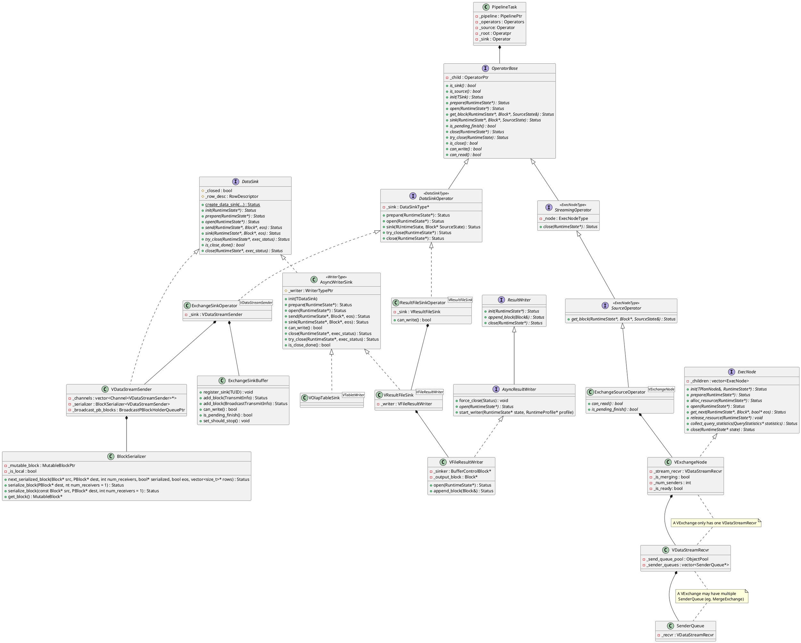

# Sink



```cpp {.line-numbers}
class PipelineTask::prepare(RuntimeState* state)
{
    ...
    DataSinkOperator::preapare(state);
    for (auto& o : _operators) {
        RETURN_IF_ERROR(o->prepare(state));
    }
    ...
    set_state(PipelineTaskState::RUNNABLE);
}
```

```cpp
TaskScheduler::_do_work(size_t index)
{
    while (_markers[index])
    {
        // Open all operatprs
        Status PipelineTask::execute(&eos)
        {
            Status PipelineTasl::_open()
            {
                for (auto& opera : _operators)
                {
                    opera->open(RuntimeState*);
                }
                DataSinkOperator::open(RuntimeState*);
            }
        }

        while (!_fragment_context->is_cancelled())
        {
            _root->get_block(RuntimeState*, Block*, SourceState*);
        }

        *eos = _data_state == SourceState::FINISHED;

        if (_block->rows() != 0 || *eos)
        {
            Status = DataSinkOperator()::sink(RuntimeState*, Block*, SourceState*);
            // Sink EOF
            if (!status.is<ErrorCode::END_OF_FILE>())
            {
                RETURN_IF_ERROR(status);
            }
            // 
            *eos = status.is<ErrorCode::END_OF_FILE>() ? true : *eos;
            if (*eos) { // just return, the scheduler will do finish work
                break;
            }
        }
    }
}
```
```cpp {.line-numbers}
template <typename DataSinkType>
class DataSinkOperator : public OperatorBase
{
    ...
    Status sink(RuntimeState* state, vectorized::Block* in_block,
                SourceState source_state) override {
        if (in_block->rows() > 0 || source_state == SourceState::FINISHED) {
            return _sink->sink(state, in_block, source_state == SourceState::FINISHED);
        }
        return Status::OK();
    }
    ...
}

class VDataStreamSender : public DataSink
{
    // Send a Block into this sink, not blocked thredd API only use in pipeline exec engine
    virtual Status sink(RuntimeState* state, vectorized::Block* block, bool eos = false) {
        return send(state, block, eos);
    }

    // Send a Block into this sink.
    virtual Status send(RuntimeState* state, vectorized::Block* block, bool eos = false) {
        return Status::NotSupported("Not support send block");
    }
}

```
这里不知道为啥要有 sink 跟 send 两个 API。。。。除了 async_writer_sink 单独实现了 sink 外，其他的都是在 sink 里调用的 send 。。。

宏观来看，ExchangeSinkOperator 的作用是把当前 pipeline 的 operators 处理完成的一个个 block 按照预设的规则发送给不同的 ExchangeSourceOperator。
从数据结构角度来看，ExchangeSinkOperator 需要把 Block 转为一个个 PBlock，然后把 PBlock 塞进 brpc 的request 中，通过 brpc 发送给对端。
也就是在下面的几个数据结构之间进行类型转换。
```cpp
class Block 
{
    private:
        using Container = ColumnsWithTypeAndName;
        Container data;
}
```
```protobuf
message PBlock {
    repeated PColumnMeta column_metas = 1;
    optional bytes column_values = 2;
    optional bool compressed = 3 [default = false];
    optional int64 uncompressed_size = 4;
    optional segment_v2.CompressionTypePB compression_type = 5 [default = SNAPPY];
    optional int32 be_exec_version = 6 [default = 0];
}

message PColumnMeta {
    message Decimal {
        optional uint32 precision = 1;
        optional uint32 scale = 2;
    }
    optional string name = 1 [default = ""];
    optional PGenericType.TypeId type = 2 [default = UNKNOWN];
    optional bool is_nullable = 3 [default = false];
    optional Decimal decimal_param = 4;
    repeated PColumnMeta children = 5;
    optional bool result_is_nullable = 6;
    optional string function_name = 7;
}

message PTransmitDataParams {
    required PUniqueId finst_id = 1;
    required int32 node_id = 2;
    // Id of this fragment in its role as a sender.
    required int32 sender_id = 3;
    required int32 be_number = 4;
    // if set to true, indicates that no more row batches will be sent
    // for this dest_node_id
    required bool eos = 5;
    optional PRowBatch row_batch = 6;
    // different per packet
    required int64 packet_seq = 7;
    optional PQueryStatistics query_statistics = 8;

    optional PBlock block = 9;
    // transfer the RowBatch to the Controller Attachment
    optional bool transfer_by_attachment = 10 [default = false];
    optional PUniqueId query_id = 11;
    optional PStatus exec_status = 12;
};
```
这里预设的规则可能有
* UNPARTITION
* HASH PARTITION
* RANGE PRATITION
* RANDOM
等等。
那么从算法的角度来说，一个 Block 需要根据不同的分区规则进行分区，得到 PBlock，按照对端的对应关系，把 PBlock 塞进不同的 PTransmitDataParams 里。

```cpp
class VDataStreamSender : public DataSink
{
    Status send(RuntimeState*, Block*, bool eos = false)
    {
        bool all_receiver_eof = true;
        for (channel : _channels)
        {
            if (!channle->is_receiver_eof())
            {
                bool all_channel_eof = std::all_of(
                    std::begin(_channels), std::end(_channels),
                    [](Channel<VDataStreamSender>* channel) { return channel->is_receiver_eof(); });

                if (all_channel_eof)
                {
                    return Status::EndOfFile("all data stream channels EOF");
                }
            }

            if (_part_type == TPartitionType::UNPARTITIONED || _channels.size() == 1)
            {
                _serializer.next_serialized_block(
                        block, block_holder->get_block(), _channels.size(), &serialized, eos);

                if (serialized)
                {
                    auto cur_block = _serializer.get_block()->to_block();
                    
                    _serializer.serialize_block(&cur_block, block_holder->get_block(), _channels.size());
                    
                    for (auto channel : _channels) {
                        status = channel->send_broadcast_block(block_holder, eos);
                    }

                }
            }
        }
    }
}
```
主要关注 `1status = channel->send_broadcast_block(block_holder, eos);` 这个函数是同步还是异步的。
```cpp
template <typename Parent = VDataStreamSender>
class PipChannel final : public Channel<Parent>
{
    ...
    Status send_broadcast_block(std::shared_ptr<BroadcastPBlockHolder>& block,
                                bool eos = false) override
    {
        if (eos) {
            if (_eos_send) {
                return Status::OK();
            }
            _eos_send = true;
        }
        if (eos || block->get_block()->column_metas_size()) {
            RETURN_IF_ERROR(_buffer->add_block({this, block, eos}));
        }
        return Status::OK();
    }

private:
    pipeline::ExchangeSinkBuffer<Parent>* _buffer = nullptr;
}

template <typename Parent>
class ExchangeSinkBuffer
{
    Status add_block(BroadcastTransmitInfo<Parent>&& request)   
    {
        if (_is_finishing) {
            return Status::OK();
        }
        TUniqueId ins_id = request.channel->_fragment_instance_id;
        if (_is_receiver_eof(ins_id.lo)) {
            return Status::EndOfFile("receiver eof");
        }
        bool send_now = false;
        {
            std::unique_lock<std::mutex> lock(*_instance_to_package_queue_mutex[ins_id.lo]);
            // Do not have in process rpc, directly send
            if (_rpc_channel_is_idle[ins_id.lo]) {
                send_now = true;
                _rpc_channel_is_idle[ins_id.lo] = false;
                _busy_channels++;
            }
            _instance_to_broadcast_package_queue[ins_id.lo].emplace(request);
        }
        if (send_now) {
            RETURN_IF_ERROR(_send_rpc(ins_id.lo));
        }

        return Status::OK();
    }
}
```

---
`AsyncResultWriter::start_writer` 在 AsyncWriterSink::open 中被执行
```cpp
void AsyncResultWriter::process_block(RuntimeState* state, RuntimeProfile* profile) {
    if (auto status = open(state, profile); !status.ok()) {
        force_close(status);
    }

    if (_writer_status.ok()) {
        while (true) {
            if (!_eos && _data_queue.empty() && _writer_status.ok()) {
                std::unique_lock l(_m);
                while (!_eos && _data_queue.empty() && _writer_status.ok()) {
                    _cv.wait(l);
                }
            }

            if ((_eos && _data_queue.empty()) || !_writer_status.ok()) {
                _data_queue.clear();
                break;
            }

            auto block = _get_block_from_queue();
            auto status = write(block);
            if (!status.ok()) [[unlikely]] {
                std::unique_lock l(_m);
                _writer_status = status;
                if (_dependency && _is_finished()) {
                    _dependency->set_ready();
                }
                break;
            }

            _return_free_block(std::move(block));
        }
    }

    // if not in transaction or status is in error or force close we can do close in
    // async IO thread
    if (!_writer_status.ok() || !in_transaction()) {
        _writer_status = close(_writer_status);
        _need_normal_close = false;
    }
    _writer_thread_closed = true;
    if (_finish_dependency) {
        _finish_dependency->set_ready();
    }
}
```