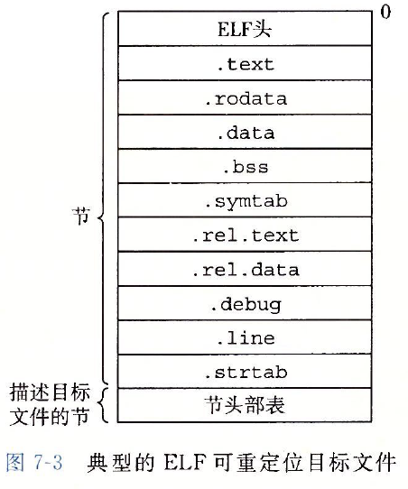

[TOC]
# Linking
什么是链接：Linking is a process of collecting and combining various pieces of code and data into a single file that can be loaded (copied) into memory and executed.
更加朴素的说法，链接是将输入的一组代码和数据的集合重新整理成一个文件，该文件可以被加载进内存并且运行。为什么单纯的代码和数据就不能被运行呢？因为通常来说，这些文件的格式无法被操作系统识别，操作系统把这些文件加载进内存后，按照自己的想法去内存的指定位置获取指令时就傻眼了，这指令我完全不认识啊，所以他们通常不能被执行。

为了规范描述，我们这里将链接器的输入文件称为可重定位目标文件，将链接器的输出文件称为可执行目标文件，有时会忽略两者的目标二字。

链接器为了得到一个可执行文件，需要完成两个主要任务：
1. Symbol resolution（符号解析）
2. Relocation（重定位）

第一个任务通俗来说，就是为每个符号找到其定义。比如我们在 main.cpp 中有这样的代码：
```c++
#include "myheader.h"

int main()
{
    ...
    auto result = myheader::Func();
    ...
    return 0;
}
```
编译器编译的时候在 myheader.h 中只找到了 `myheader::Func()` 的声明，没找到定义啊，定义在 myheader.cpp 里呢，编译器把 myheader.cpp 编译后得到了 myheader.o。main.o 跟 myheader.o 输入给链接器以后，链接器就去找到 myheader.o 中 Func 的位置，填到 main.o 中合适的位置。这个过程就是 symbol resolution，当然我这里说的很粗糙，但是就这么个整体意思。

第二个任务，重定位，则是说，main.o 既然要跟 myheader.o 合并到一起，那么新文件里，已有的符号怎么安排呢？谁在前谁在后呢？这就是重定位做的事。

## 目标文件
目标文件分为三类：
1. Relocatable object file
2. Executable object file
3. Shared object file

所有的这三类目标文件都具有相同的文件格式，称为对象文件格式。在现代的 x86-64 Linux 系统以及 UNIX 系统上，使用 Executable and Linkable Format(ELF)，其他系统使用不同的对象文件格式。目标文件中的内容，包含三部分，指令，数据以及格式信息，格式信息告诉使用者（链接器与加载器）如何解读指令与数据。

<center>
  
</center>
上图中描述了一个典型的 ELF 格式的可重定位目标文件，具体每个部分的作用不详细说了只需要知道：

1. ELF 描述了该文件的元信息（哪个平台产生的、字节序等）以及 Section header table 在哪，怎么解读其内容
2. 节头部表（Section header table）描述了图里其他各个section的偏移量
3. 其余所有section记录了指令、数据以及符号信息  

## 符号与符号表
每一个可重定位目标文件的模块 m 均包含一个符号表。该符号表记录了模块 m 定义以及引用的所有符号信息。在链接器的语境下，符号被分为三类：

* 由模块 m 定义，且可以被其他模块引用的符号的全局符号。比如模块 m 中定义的 nonstatic function 以及 global variables
* 被模块 m 引用，但是由其他模块定义的全局符号。比如 m1 引用了 m2 定义的 nonstatic function。
* 由模块 m 定义并且只可以被模块 m 引用的本地符号。比如模块 m 中的 static function 以及 static global variables

第三类中提到的本地符号并不包括函数的局部变量，链接器并不关系这类变量的地址。

符号表被保存在目标文件的 .symtab 段内，符号表的每个项具有如下信息：
```c
typedef struct {
    int name;
    char type:4,
         binding:4;
    char reserved;
    short section;
    long value;
    long size;
} Elf64_Symbol;
```
name 字段可以简单理解为是符号的名称（实际上有区别），不过注意，这里符号名称并不一定就是符号在源码中的命名，通常是经过编码或者改写后的名字，目的是为了防止重复。对于可重定位目标文件，value 通常是该对象与其所在section开始位置的偏移量；对于可执行目标文件（链接后），value 通常是一个运行时的绝对地址。

其它字段具体含义不细说。

使用 GNU readelf 程序可以检查对象文件的内容。

## 符号解析
符号解析就是链接器为所有的符号引用绑定一个符号表中的地址的过程。对于 local symbols，这一步很简单，因为符号的定义就在本模块内。对于 global symbols，编译器一旦遇到一个当前模块没有定义过的符号，它会假设其他模块有该符号的定义，同时在符号表里记录一个 linker symbol table entry，让链接器在链接的时候去其他模块里找。

然而，有可能多个目标文件里定义了具有相同名字的符号。那么链接器必须处理这种情况（报错或者找到正确的定义），在 Linux 系统上，这种问题的处理需要编译器、汇编器以及链接器一起配合。

### 链接器如何解析重复的符号名称
链接器的输入是一组可重定位目标模块。每一个模块内部都定义了一组符号。

在编译的时候，编译器会对每个 global 符号标记一个强弱类型，汇编器会将该信息记录在每个可重定位目标文件的符号表中。**函数以及初始化过的全局变量是强类型，未初始化的global variables是弱类型。**

链接器采用如下规则来处理重复的符号名称：
1. 不允许出翔具有相同名称的多个强类型符号
2. 假如有一个强类型符号和多个弱类型符号具有相同名称，那么选择强类型符号
3. 假如有多个具有相同名称的弱类型符号，选择其中任一一个

```c
/* foo1.c */
int main()
{
    return 0;
}

/* bar1.c */
int main()
{
    return 0;
}
```
基于规则 1，上述代码在链接时会报错，main 这个符号被重复定义。

同样的基于规则 1，下面的代码也会在链接时报错：
```c
/* foo2.c */
int x = 123123;

int main()
{
    return 0;
}

/* bar2.c */
int x = 123456;

int main()
{
    return 0;
}
```

但是，如果我们不对 bar2.c 中的 全局变量 x 做初始化，那么编译器会默默选择具有强类型的 foo2.c 中的 x
```c
/* foo3.c */
#include <stdio.h>
void f(void);

int x = 15213;

int main()
{
    f();
    printf("x = %d\n", x);
    return 0;
}

/* bar3.c */
int x;

void f(void)
{
    x = 15212;
}
```
上述代码在链接时 bar3.c 中的弱类型 x 地址会被 foo3.c 中的 x 替代，导致 f 修改了 foo3.c 中的全局变量 x。同样，如果遇到两个相同名称的弱类型符号，由于链接器随机选择一个，也会导致程序在运行时产生意料之外的结果。并且，当遇到两个类型不同的弱类型符号时，很可能产生非常难以定位的问题，比如
```c
/* foo5.c */
#include <stdio.h>
void f(void);

int y = 15212;
int x = 15213;

int main()
{
    f();
    printf("x = 0x%x y = 0x%x \n), x, y);
    return 0;
}

/* bar5.c */
double xl

void f(void);
{
    x = -0.0;
}
```

在一个 x86-64/Linux 系统上，doubles 是 8 字节，ints 是 4 字节。那么 bar5.c 中的语句 `x = -0,0;` 按照 double 的 8 字节对 x 赋值会**覆盖紧跟在其之后的 4 字节的 y！**。
不过幸运的是，链接器通常会在链接过程中对此类情况报一个 WARNING，所以我们对于链接时的 WARNING 一定要注意。
```bash
gcc -Wall -Og -o foobar5 foo5.c bar5.c
ld: warning: tentative definition of '_x' with size 8 from '/var/folders/3z/_h8g48f13v3g3py3qbr5frr40000gn/T/bar5-1b94ef.o' is being replaced by real definition of smaller size 4 from '/var/folders/3z/_h8g48f13v3g3py3qbr5frr40000gn/T/foo5-834229.o'

./foobar5
x = 0x0 y = 0x3b6c
```
### 链接静态库
到目前为止，我们都假设链接器的输入是一组可重定位目标文件，输出是一个可执行目标文件。在实践中，所有的构建系统都支持都提供将相关的所有模块打包进一个单独叫做静态库的文件（static library），**该文件可以作为链接器的输入**。**当静态库作为链接器的输入时，链接器只会复制静态库中被可重定位目标文件引用到的部分**。

为什么需要静态库这里不再仔细分析，只对其优点稍作总结：
1. 将所有模块编译连接得到一个静态库可以在链接时减少输入参数
   
```bash
# 不好
gcc main.c /usr/lib/printf.o /usr/lib/scanf.o ...

# 好
gcc main.c /usr/lib/libc.a
```
2. 按需拷贝，不至于使得最终的可执行目标文件过大，内容过于重复
3. 库的维护者便于发布自己的库

在 Linux 系统上，静态库文件以一个特殊的被称为 archive 的格式保存。

### 链接器如何使用静态库来解析引用
在符号解析阶段，链接器会扫描可重定位目标文件和库文件（archive 文件），顺序是从左到右，与通过命令行传递给编译器的参数顺序一致。在扫描期间，链接器维护一个集合 E，一个集合 U 以及一个集合 D。集合 E 包含将会被 merge 成可执行目标文件的所有可重定位目标文件，集合 U 包含未被解析的符号（比如有引用但是未定义的符号），集合 D 包含那些已经被定义过的符号。起初，这三个集合都是空的。
* 对于每个命令行的输入文件 f，链接器首先判断它是一个目标文件还是一个库文件。如果 f 是一个目标文件，那么链接器把 f 添加到 E 中，并且更新 U 和 D
* 如果 f 是一个库文件，链接器将会尝试为 U 中的未定义符号在 f 中找到一个定义。如果库文件中模块 m 定义了 U 中的一个符号，**那么 m 会被添加到 E**，并且更新 U 和 D。
* 如果在链接器处理完所有的文件后，集合 U 依然非空，那么就会打印错误信息。

因此，目标文件传递到链接器的命令行参数顺序非常重要。**如果定义了未定义符号的库文件出现的顺序在可重定位目标文件之前，那么引用将会失败，链接终止**。通常来说，库文件一定要放在编译参数的最后。如果库文件之间不是独立的，那么我们必须要保证，引用出现在定义之前。如果必要的话，库文件是可以倍多次输入给链接器的。

## 重定位

在符号解析阶段完成之后，链接器就为每个符号关联了其定义。此时，链接器就知道它的输入目标文件中，数据与代码段究竟有多大。此时它可以开始进行重定位阶段：**将输入的模块 merge 成一个文件，并且为每个符号设置运行时地址**。

