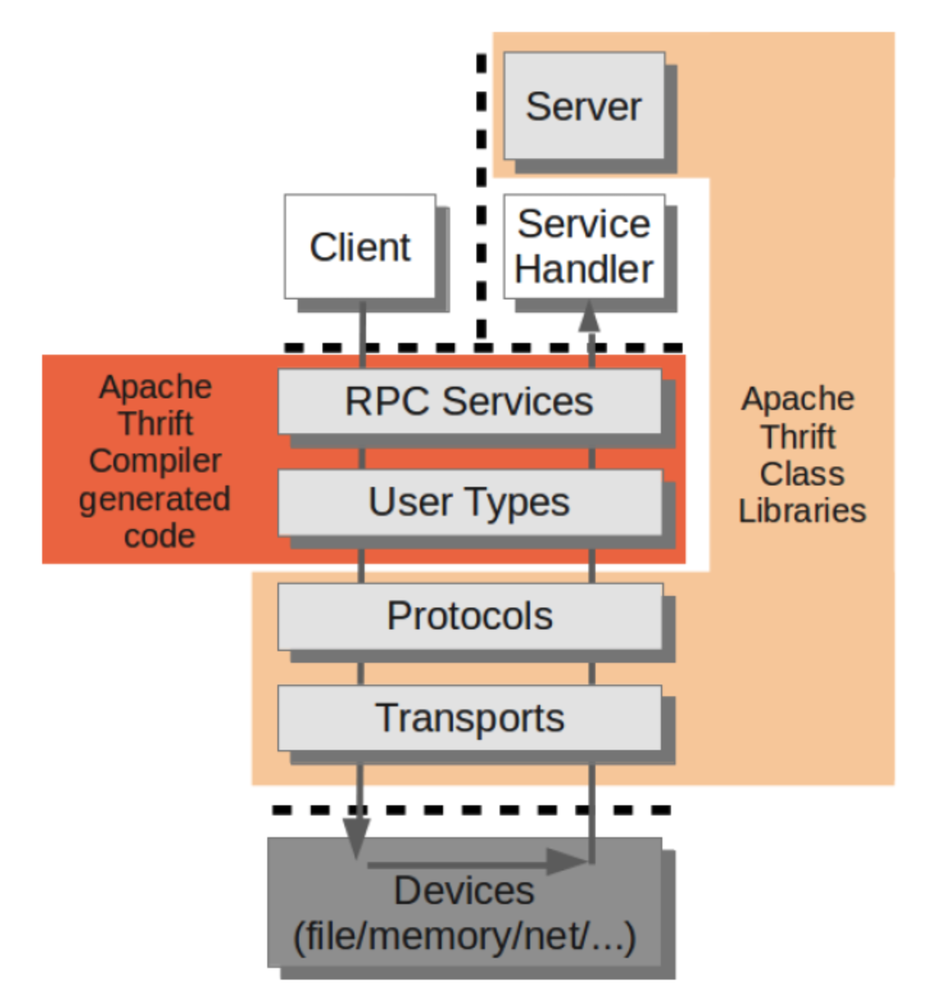
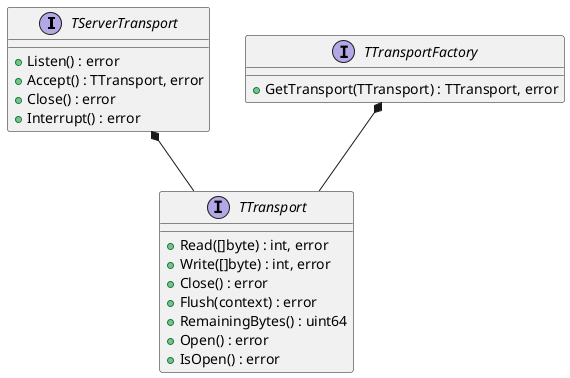
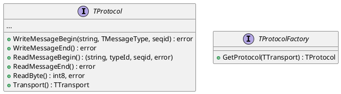

[toc]

# Thrift Overview
Thrift：Cross Language RPC Framework.

## Install

从源码编译安装 thrift 的二进制与库时，如果需要C++ library，需要依赖 boost。

遇到的坑：
* 个人开发机用的不是系统的编译器，而是在某个自定义目录下的编译器，该编译器默认搜索header的路径里不包含 /usr/include 目录。通过 yum install boost，boost 的 header 将会保存在 /usr/include 里。编写的 CMake 脚本里 include_directories(${BOOST_HEADER_DIRS}) 会忽略 /usr/include 目录[参考](https://gitlab.kitware.com/cmake/cmake/-/issues/17966)，导致编译预处理时找不到 boost 头文件。

## Architecture
<center>

</center>


- 浅黄色：你需要在本机安装的Thrfit Library.   **So you dont need to modify these codes, they will be linked into your application when you building your project.**

- 橘红色：The Thrift specified code, **which is generated by Thrift Compiler according to your IDL(Interface Defination Languages) written in .thrift files. **


## Protocols & Transports

Protocols：
- 定义如何将 Types in Coding Languages 编码为二进制流
- 定义如何将二进制流转换为 Types

Transports
- 定义如何传输这些二进制流

## IDL

```thrift
# User define type.
struct Date{
    1: i16 year,
    2: i16 month,
    3: i16 day,
}

# Service Interface.
# HalibutTracking - Service Name
# 捕鱼计数
service HalibutTracking{
    i32 GetCatchInPoundsToday(),
    # Use udt Date as parameter or return type.
    i32 GetCatchInPoundsByDate(1: Date d, 2: double t),
}
```
上述`Thrift`文件定义了`HalibutTracking`服务，该服务用到了一个`UDT Date`。通过`thrift -gen cpp halibut.thrift`可以自动产生两部分代码，一部分代码用于定义`struct Date`类型，另一部分用于定义网络服务器模型。

### User Defined Types & Serialization
对于用户定义的类型，Thtift 编译器将会产生类似如下伪代码内容的实际代码：
```c++
class Date {
 public:
	short year;
	short month;
	short day;
	read(TProtocol protocol) {…};
	write(TProtocol protocol) {…};
};
```
其中`read`和`write`方法描述了该UDT应该如何被序列化以及反序列化，序列化规则由`Thrift Compiler`根据自己的传输协议实现。

### RPC Services
#### Client
针对我们定义的service，Thrift Compiler会产生类似如下伪代码内容的实际代码，位置位于`gen-cpp/HalibutTracking.h`：
```c++
int32 HalibutTrackingClient::GetCatchInPoundsByDate(Date d, double t)
{
	send_GetCatchInPoundsByDate(d, t);
	return recv_GetCatchInPoundsByDate();
}

void HalibutTrackingClient::send_GetCatchInPoundsByDate(Date d, double t)
{
	protocol.writeMessageBegin("GetCatchInPoundsByDate", T_CALL, 0);
	HalibutTracking_GetCatchInPoundsByDate_args args;
	args.d = d;
	args.t = t;
	args.write(protocol);
	protocol.writeMessageEnd();
	protocol.getTransport().flush();
}
```
客户端的代码逻辑很清晰，就不多说了。当我们想要在创建

#### Server
`HalibutTracking.h`中会生成这么一个类：
```c++
class HalibutTrackingIf {
 public:
  virtual ~HalibutTrackingIf() {}
  virtual int32_t GetCatchInPoundsToday() = 0;
  virtual int32_t GetCatchInPoundsByDate(const Date&amp; d, const double t) = 0;
};
```
用户为了实现这个这个“RPC server”，需要继承该类，实现这两个虚函数
```c++
class HalibutTrackingHandler : virtual public HalibutTrackingIf {
 public:
  HalibutTrackingHandler() {
    // Your initialization goes here
  }

  int32_t GetCatchInPoundsToday() {
    // Your implementation goes here
    printf("GetCatchInPoundsToday\n");
  }

  int32_t GetCatchInPoundsByDate(const Date&amp; d, const double t) {
    // Your implementation goes here
    printf("GetCatchInPoundsByDate\n");
  }
};
```
然后创建server如下：
```c++
int main(int argc, char **argv) {
  int port = 9090;
  ::std::shared_ptr<HalibutTrackingHandler> handler(new HalibutTrackingHandler());
  ::std::shared_ptr<TProcessor> processor(new HalibutTrackingProcessor(handler));
  ::std::shared_ptr<TServerTransport> serverTransport(new TServerSocket(port));
  ::std::shared_ptr<TTransportFactory> transportFactory(new TBufferedTransportFactory());
  ::std::shared_ptr<TProtocolFactory> protocolFactory(new TBinaryProtocolFactory());

  TSimpleServer server(processor, serverTransport, transportFactory, protocolFactory);
  server.serve();
  return 0;
}
```

# Source code




