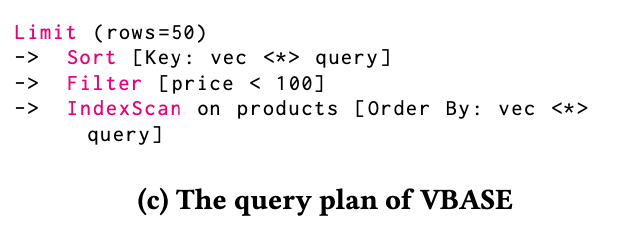

This is because, although leveraging ANN search can optimize the performance of the scan operator, the influences on other operators in the hybrid query plan are neglected.

典型的混合搜索例子：

1. 后过滤带来的性能损耗

However, systems adopting this approach, such
as PASE, pgvector, and ADBV, often use a conservatively large 𝐾′
(𝐾′ ≫𝐾), where 𝐾 denotes the desired number of results (e.g., top 50 most similar products), to ensure sufficient results meet the constraints, resulting in substantial redundant computations.
2. 在后续的 sort 算子以及 index scan 算子中距离函数的重复计算

The key reason for the inefficient query plans is that existing databases do not take
the vector attribute as a first-class citizen, and there is a lack of specific design and optimizations for hybrid queries.

CHASE 做了什么：
First, in logical plan optimization, CHASE conducts a semantic anal-
ysis to identify the type of hybrid query and rewrites the logical
plan to reduce redundant computations. 实现了一个 map 算子来 extract computed similarity results from index scan and map them to a temporary column.

This column is then directly used by sorting operators, thereby avoiding unnecessary recomputations.

Next, in physical operator optimization, CHASE improves query execution efficiency by optimizing the implementation of physical operators based on the specific characteristics
of hybrid queries. Taking the hybrid query shown in Figure 1a
as an example, CHASE optimizes the scan operator so that, after
traversing the ANN index, the scan operator not only returns the
tuples found but also the similarity scores computed during the
index traversal.