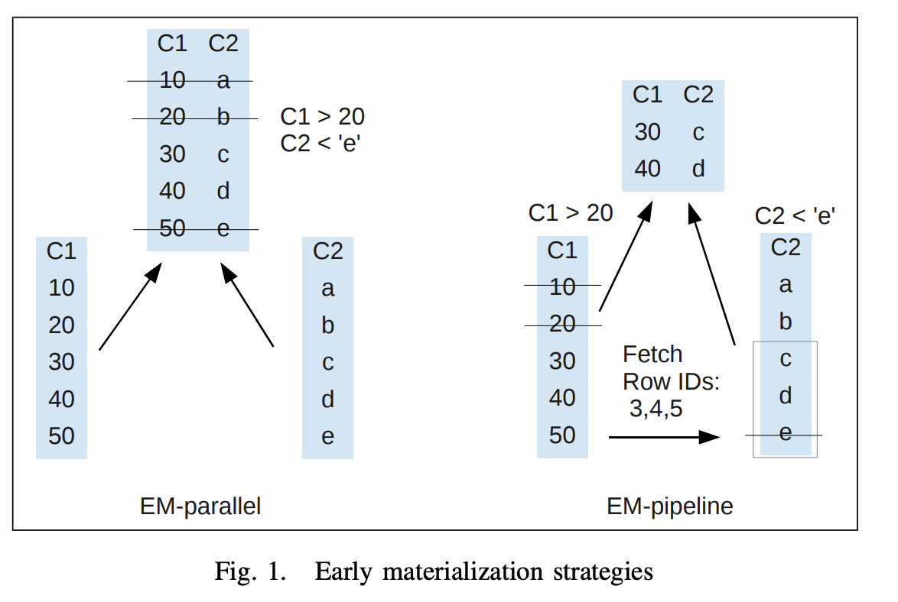
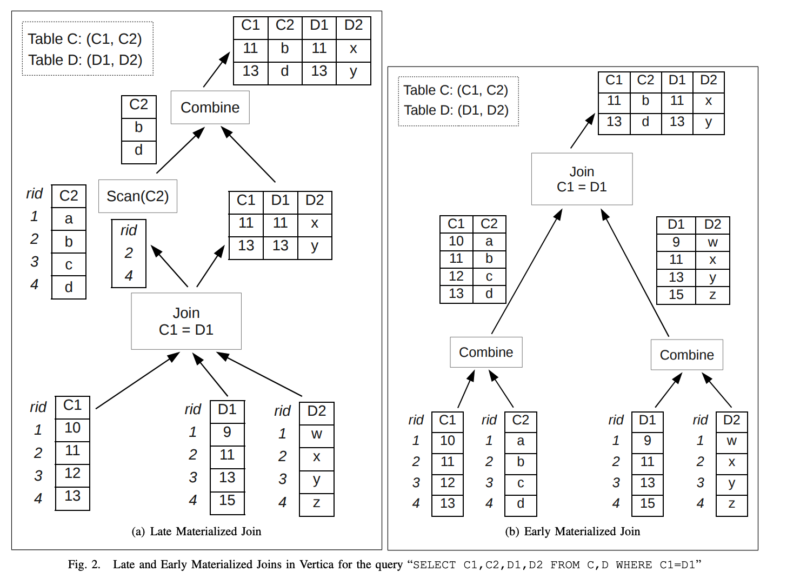
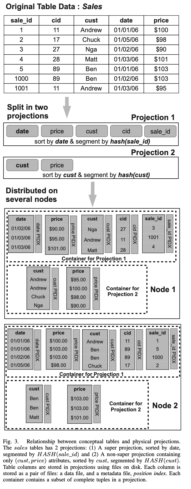
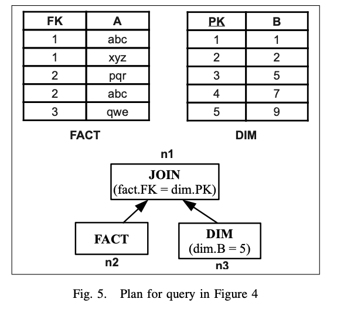
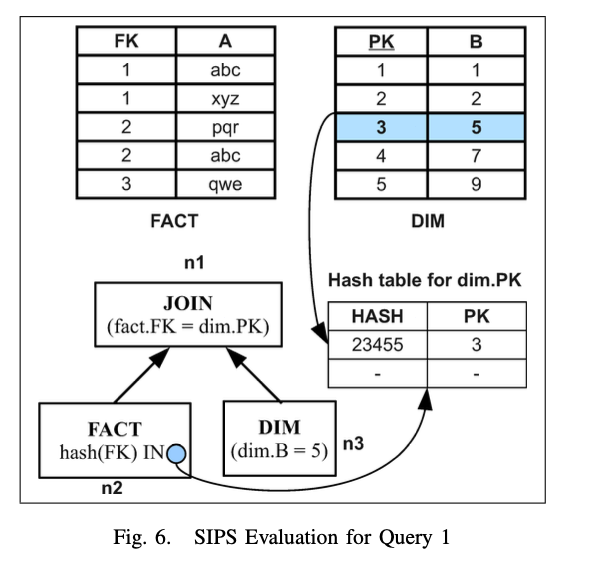

## Introduction and Motivation
Early materialization refers to the technique of stitching columns into partial tuples as early as possible, i.e., during column scan in query processing.


提前物化有两种模式，EM-parallel & EM-pipeline.
For early materialized query plans, Vertica uses the EM-pipeline strategy exclusively, since we have found that it works well in practice.


Late materialization refers to the technique of fetching columns on demand for each operator in the query plan. 比如，对于一个涉及到多个 join 的查询，只有与那个 join 条件有关的列会参与 join 判断计算，join 计算的结果 is only **the set of matching row ids**, 这个结果被用于 fetch 其他列中有用的行。由于每个 join 都会包含两张表，那么对于两者表，理论上各自都可以用 early materialization or late materialization，然而实际上，根据经验，在 Veritca 中仅对 join 操作中的一个输入进行延迟物化是有意义的。在 Vertica 中，join 的延迟物化只会对 join 操作的 outer table 应用，即用来进行 probe 的表，而对于 inner table，总是进行提前物化。



以 Fig. 2 左边的延迟物化为例，`Join C1 = D1` 的输入是 C 的 join 列 C1，以及 D 的 所有列，使用 D 表构建 hash 表之后，使用 C1 做 probe，得到 C 的 row id set，然后用这个 row id set 去 scan C2 列，然后再进行 Combine 操作。

**假如我们希望对 D 也使用延迟物化？效果并不好。因为 D 表是用来构建 hash 表的输入，在 probe 过程中，如果要输出 D 表满足 join 的 row id set，那么得到的结果天然是乱序的，如果用乱序的 row id 去 fetch，那么多次随机读效率很低，如果要等到 row id 全部产生后再 fetch D2，那么 Join 的输出就不是流式的，而是类似批处理的方式，所以对 D 表（inner table/hash build inpout）进行延迟物化是没有意义的。**

对于 large table，这种 join 的延迟物化技术的最大收益在于减少 probe 表的 disk I/O，同时这种收益也是很复杂的，– tracking which columns to materialize at what point involves a lot of bookkeeping in the optimizer, and execution engine and has to be accounted for in the cost model during query optimization.

当 join 的任何 input 都无法全部放进内存时，延迟物化相比提前物化无法带来任何收益。当 join 的任意一侧都无法全部放进内存时，我们需要使用 hybird hash join 或者 sort-merge join 算法。在 hybird hash join 中，两个 input 都需要提前进行 partition，这样得到的每个 bucket 都能够被完整加载到内存，此时，如果 join 只产生 row ids 的话，那么在 join 后重新构建 tuple 的代价很高，因为我们需要进行多次 scan（每个 bucket 都需要一个 scan）。

更加棘手的问题是，在规划期间很难预知某个 join 是否需要 spill。因此这取决于 cardinality estimation，因此在 plan 期间很难决定某个 join 操作是否需要进行延迟物化。Vertical 的早期实现里把这个决定交给用户，如果用户要求某个 query 使用延迟物化但是在执行期间遇到了 join spill，那么 query 会报错。更新的版本里则是总会规划出延迟物化，如果执行引擎遇到了一个会 spill 的 join，那么这个 join 会被动态替换为提前物化。这带来的代价是一旦发生了 join spill，那么 re-executing 的成本很高。然而这种整体重试的性能也要比在 join spill 中使用延迟物化来的好。

Sideways Information Passing (SIP) combined with early materialization can indeed provide good performance for all queries as well as these strategies for joins.

**Vertical 的经验：SIP + EM 的性能在普遍场景下都不会比 LM 差。**

## Related Work
**Column Materialization**
**Sideway Infromation Passing(SIP)** Sideways information passing techniques aim at reducing the amount of state kept in query plan operators by sending subresults computed in other parts of the plan. 
SIP 在分布式 join 执行中已经有了广泛的研究。给定 relation R and S，semi-joins 需要把 R 的 join attributes 传递到保存 S 的节点，该节点执行 join 操作，然后把结果发回到 R 所在的节点，再继续进行 reconstruction。类似地，Bloomjoins 会使用 bloomfilter 把 R 的一个 compact representation 发送到 S 节点，而不是吧真正的 join attributes 发送到 S。类似的还有 hash filters，in-memory hash join 以及 magic sets, they have been studied to prune intermediate results in processing single-site join quries.

## Data model and on-disk storage in vertica
**Projection**: Table is physically stored as projections, projection 本质是 sorted subsets of the attributes of a table. 在很多方面都与物化视图非常相似。Vertica 中有一个 super projection，它包含了所有的 column，（作用类似物化视图模式下的明细表？）同时每张表还可以定义多个 projection，每个 projection 都可以有各自的排序列以及分桶列（与 doris 的 rollup index 很像）



每个 projection 包含了一组 column，每个 column 的物理存储都包含了两个部分：一个是原始的 column data，另一个是 position index. Position index 中保存了每个 disk block 的起始位置，minimum value 以及 maximum value。

## Sideways information passing in vertical
```sql
SELECT *
FROM fact,dim
WHERE fact.FK = dim.PK
    AND dim.B = 5;
```


Fig.5 是生成的 plan，dim.B = 5 被下推到 scan 节点。

如果没有 SIP，那么 join 的 input 将会包含 FACT 表的所有行。



如果有了 SIP，那么计划如 Fig.6，区别在于，FACT 表（outer input）规划出了一个 SIP filter: `hash(FK) IN <hash-table for dim.PK>`，这个 IN predicate 检查 FK 的某个值是否存在在 SIP data structure 中。在 fact 表的 scan 阶段，SIP expression 可以从 fact 表中过滤掉不需要的数据。在这个例子中，SIP filter 正好是 join 用到的 hash 表本身，实际中还可以使用其他的 filter 比如 bloomfilter
