[TOC]

## Weaving Relations fro Cache Performance
### 1. Introduction
传统关系型数据库采用 N-ary Stoarge Model (NSM) (a.k.a., slotted pages)，将数据在磁盘上顺序保存，来优化 IO 性能。

1. In-page data placement is the key to high cache performance and that NSM exhibits low cache utilization on modern platforms.
2. Propose a new data organization model called PAX (Partition Attributes Across), that significantly improves caceh performance by grouping together all values of each attributes within each page.

NSM stores records contiguously starting from the begining of each disk page, and uses an offset (slot) table at the end of the page to locate the beginning of each record.

Decomposition Stoarge Model (DSM) partitions an n-attribute relation vertically into n sub-relations, each of which is accessed only when the corresponding attribute is needed.

最近的研究显示，影响数据库查询性能的主要原因不再是IO系统，而是 processor and the memory subsystem. When running commercial database systems on a modern processor, data requests that miss in the cache hierarchy (i.e., requests for data that are not found in any of the caches and are transferred from main memory) are a key memory bottleneck.

试验结果：
PAX vs NSM:
1. 50-75% fewer second-level cache misses due to data accesses when executing a main-memory workload
2. executes range selection queries and updates in 17-25% less elapsed time
3. executes TPC-H queries involving I/O 11-42% faster than NSM

PAX vs DSM:
当涉及到的 attributes 数量增加时，PAX 的执行时间依然保持稳定，但是由于 high record reconstruction cost, DSM 的执行时间会增加。

### 2. Related Work
#### 2.1 The N-ary Storage Model

NSM stores records sequentially on data pages.

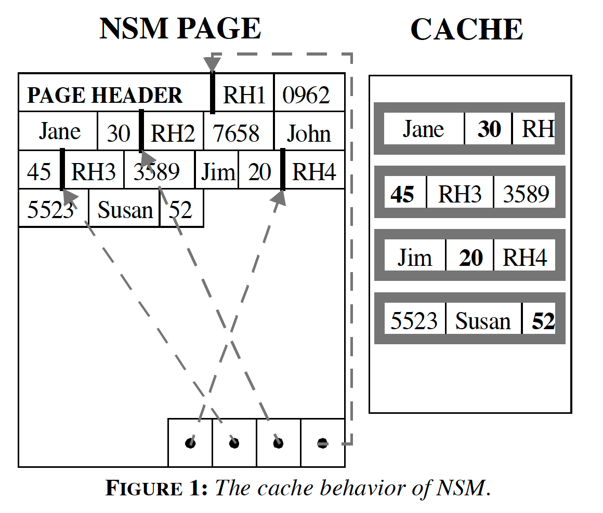  

Each record has a record header (RH) containing a null bitmap, offsets to the variable-length values, and other implementation-specific imformation. Each new record is typically inserted into the first available free space starting at the begining of the page. 

#### 2.2 The Decomposition Storage Model
垂直分区（Vertical partitioning) 将 relation 分割成多个 sub-relation，每个 sub-relation 包含 initial-relation 的一部分 attributes，来减少 I/O 相关的代价。

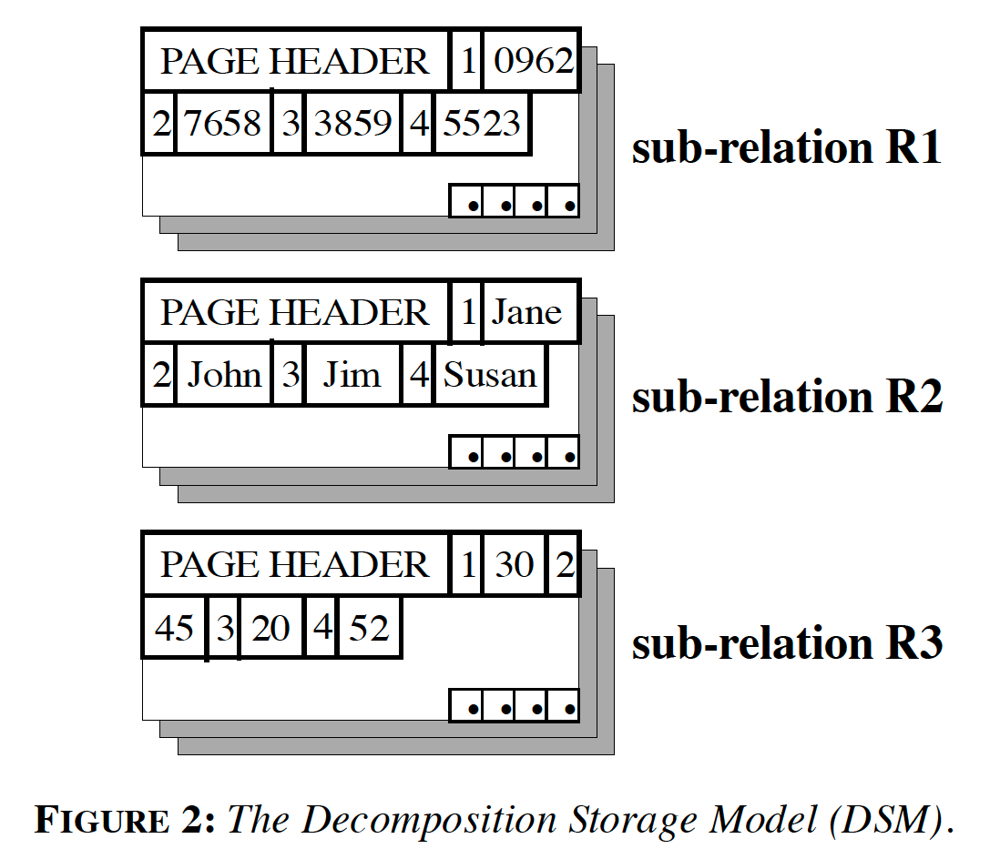  

DSM 的性能会随着访问的 attributes 数量增加而衰退。The database system 必须将先前分割的多个 sub-relation 重新合并起来以构造查询结果。**花费在合并 sub-relation 的时间随着 result relation 中 attributes 数量的增加而增加。**
An alternative algorithm partitions each relation based on an attribute affinity graph, which connects pairs of attributes based on how often they appear together in queries. The performance of affinitybased vertical partitioning depends heavily on whether queries involve attributes within the same fragment, significantly limiting its capability.

### 3. PAX

  

#### 3.1 Overview
动机：优化 NSM 的 page 内数据分布，让同一个 attribute 的值在 page 内连续。PAX 在每个 page 内将 record 垂直划分，然后将同一个 attribute 的值保存在一个 minipage 内。

#### 3.2 Design

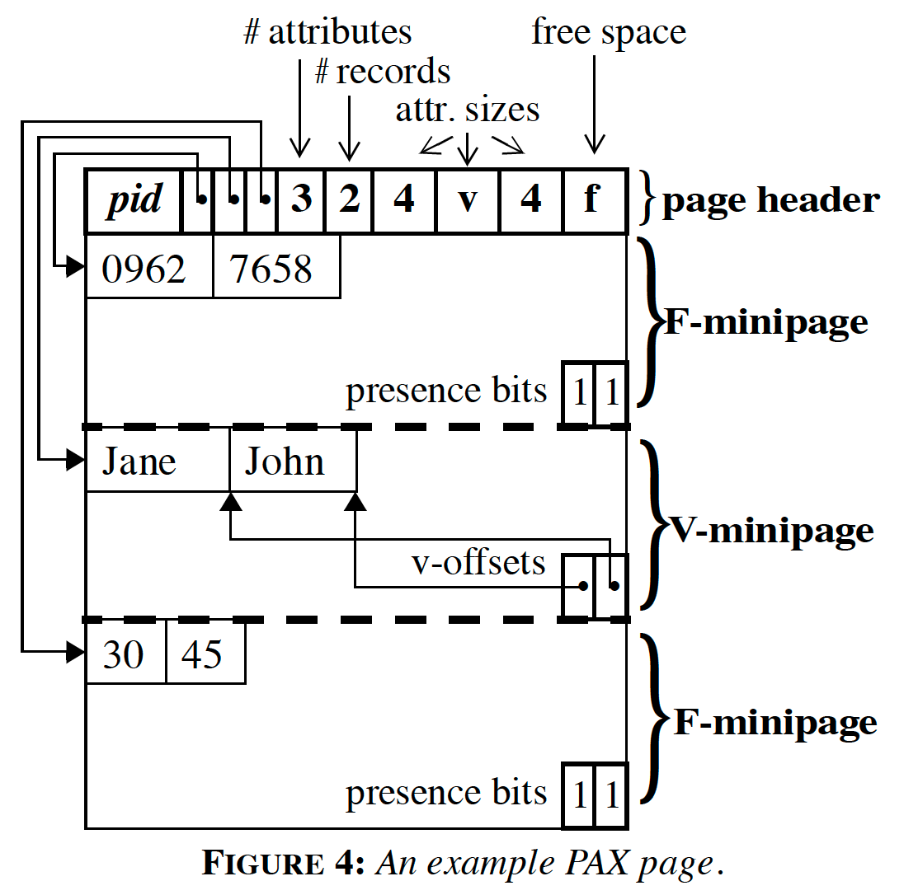  

Page 头的 page header 内保存了指向每个 minipage 起始位置的指针。每个 minipage 包含一个 record header，每个 minipage 内的结构由一下规则决定：
* 定长记录的值保存在 F-minipage 内。每个 F-minipage 的结尾处是一个 presence bit vector，用来记录 nullable-attributes 的 null value 
* 变长记录的值保存在 V-minipage 内。 V-minipage 被带有指向每个值结尾的指针划分为一个个槽位。

Record on a page are accessed either sequentially or in random order (e.g., through a non-clustered index).

**To store a relation, PAX requires the same amount of space as NSM**

#### 3.3 Evalution

The data placement schema 主要从两个方面影响性能：
1. the inter-record spatial locality minimizes data cache-related delays when executing iterators over a subset of fields in the record.
2. the record reconstruction cost minimizes the delays associated with retrieving multiple fields of the same record.

|Characeristic|NSM|DSM|PAX|
|--|---|---|--|
|Inter-record spatial locality||✅|✅|
|Low record econstruction cost|✅||✅|

Additional advantage, implementing PAX on an existing DBMS requires only changes to the page-level data manipulation code.

### 4 System Implementation
#### 4.1 Record Implementation
TPC-H tables stored using PAX need 8% less space than those stored using NSM. Up to half of the space saved in PAX is due to eliminating the slot table at the end of a page. The rest is Shore-specific overhead resulting from the 12-byte record tag. 也就是说，节省的空间与数据分布无关，只是因为 record 实现的区别导致的。
#### 4.2 Data Manipulation Algorithms
*BULK-LOADING AND INSERTIONS*
*UPDATES*
*DELETIONS*

#### 4.3 Query Operators

## Understanding Insights into the Basic Structure and Essential Issues of Table Placement Methods in Clusters

2013 年 VLDB

### 1. INTRODUCTION
### 2. TABLE PLACEMENT METHOD

#### 2.1 Definition
Basic structure of table placement method:
1. a row reordering precedure
2. a table partition procedure
3. a data packing procedure
   

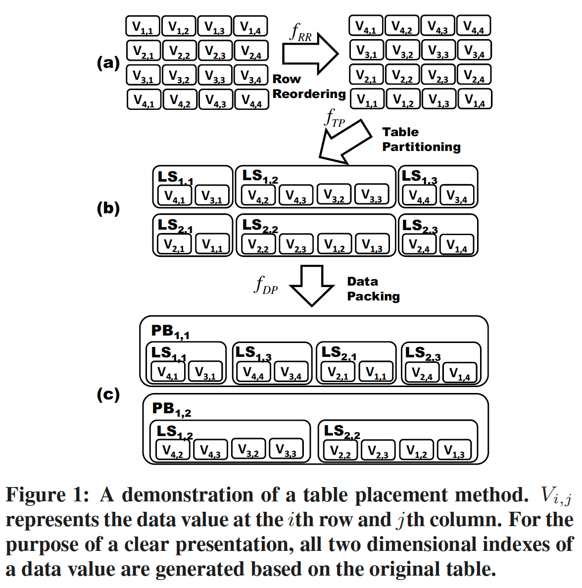

**2.1.1 Row Reordering**
根据某个 function fRR 对 row 重排，比如 fRR(1) = 10 意味着 original table 的第 1 行在 row reordering 之后将会变为第 10 行。同时，很重要的一点是，需要确保在后续的 table partitioning and data packing 过程中，row sequence 不变。

row reordering 的两个典型例子：
1. 整张表基于某个列值重新排序。
2. 将table分割成多个不重叠的subsets，然后在每个subset内部进行reorder。

**2.1.2 Table Partitioning**
使用某个分区函数 fTP 将table分割成多个不重叠的subsets（logical subsets）。经过 table partitioning 过程后，i 行 j 列的值被划分到了 logical subset LSx,y x 表示 logical-subset-row，y 表示 logical-subset-column

比如在 Figure 1 中，table 被分割成了 6 个 logical subsets。

**2.2.3 Data Packing**
利用函数 fDB，Data packing 过程将每个 logical subsets 内的数据分割到不同的 physical blocks。

A physical block is filled by a set of logical subsets and two different physical bloks do not have any common logical subsest. Also, **a physical block is the storage unit of the undelying sotrage system.** 在每个 physical block 内，logical block 按照他们的 logical subsets 的顺序保存。

#### 2.2 Existing Work
我们将会假设列类型可以是primitive data type（Integer，Double，String）.

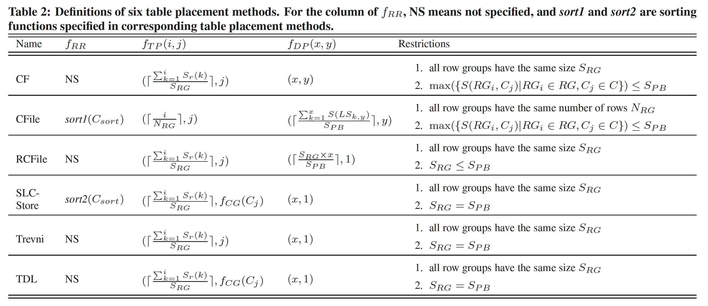  
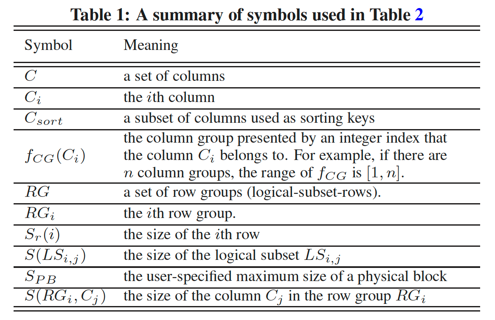  

**2.2.1 Row Reordering Variations**

不重要。测试的时候采用同一个 fRR。

**2.2.2 Table Partitioning Variations**
CF，RCFile，Trevni：
* 首先根据 size of row，将 table 划分成若干个 row group，每个 row group 的 size 一样
* 然后在每个 row group 内，将每个 column 作为一个 logical subset （观察公式里，fTP 的第二个参数都是 j，即输入的时候在第 j 列， partition 之后还是在第 j 列）
 
CFile：
* 根据 number of rows 将 table value 划分成若干个 row group，每个 row group 中包含的行数一样
* 然后在每个 row group 内，将每个 column 作为一个 logical subset

SLC-Store，TDL：
* 首先根据 size of row，将 table 划分成若干个 row group，每个 row group 的 size 一样
* 在每个 row group 内，将 column group 作为一个 logical subset

**2.2.3 Data Packing Variations**
CF：
* stores a single logical subset to a physical block，即每个 physical block 内保存一个 column
    
CFile 
* stores multiple logical subsets of a logical-subset-column to a physical block，即每个 physical block 内保存多个 column
  
RCFile:
* stores multiple row groups to a physical block，将多个 row groups 保存在一个 physical block 内

SLC-Store, Trevni, TDL：
* store a single row group to a physical block，将一个 row groups 保存在一个 physical block 内

**Summary**

对比六种具有代表性的 table placement methods 后，发现他们其实有四个关键区别，这些区别决定了他们使用的 fRR, fTP, fDP 不同

1. Row reordering: 如何对 table values 重新排序
2. Row group size: The size of a row group.
3. Grouping columns: How to group columns.
4. Packing column groups: How to pack column groups in a row group into physical blocks. This factor is dependent on underlying distributed filesystems.

#### 2.3 A Unified Evaluation Framework
Row reordering: 在将数据写入到 RCFile 之前就对 table 进行预先排序
Row group size: RCFile 的 row group size 可以被调整。Trevni 原生地会在 physical block 内保存一个 row group。
Grouping Columns: 在 RCFile 和 Trevni 中，我们可以使用复合列来模拟 multiple grouped columns
Packing column groups: 通过将表写入到多个 RCFiles 来模拟 pack column groups in a row group into one or multiple physical blocks.

### 3. STUDY METHODOLOGY
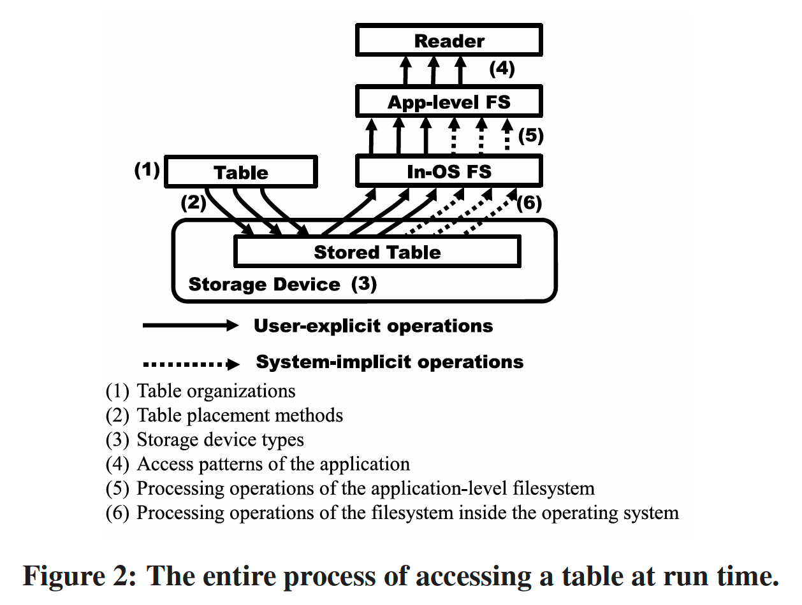  

在整个table accessing过程中，有六个点会影响到数据访问的性能：
1. Table organizations. 比如，table schema
2. Table placement methods, 决定了 table values 在 underlying system 中如何组织与保存
3. Storage device type, 存储数据的设备，HDD or SSD
4. 应用的数据访问模式，顺序读 or 随机读
5. 应用层代码对文件系统的操作，比如 application-level filesystemasynchronous readahead
6. 本地操作系统内文件系统的处理操作，local-OS asynchronous readahead

### 4. MICRO-BENCHMARK RESULTS
#### 4.1 Rationality and Objectives
#### 4.2 Controlled Experimental Environment
**4.2.1 Table Organizations**
1. number or columns
2. size of a value of a column

16 columns, fixed length string of 40 chars

**4.2.2 Table Placement Methods**
1. Do not use any row reordering

T1 and T2 以不同的 table placement methdos 保存。每个 table 以一个三元组来表表示。
(fTp, fDp, table)

fTP is represented by a 2-tuple (RG,CG)
RG 代表 row group size: 64MB
CG 代表 how columns were grouped. 
    grouped：2 columns were grouped into a column group
    non-grouped: a single column was stored in a column group

(256MB, grouped) 代表 row group size 为 256MB，两个列作为一个 column group

fDP 用 n-file 来表示，which means the number of files (physical blocks) that a row group was packed into。
**4.2.3 Storage Device Type**
HDD
**4.2.4 Accessing Patterns of the Application**
Fro reading a row group, RCFile loads data in a column by column way.
For Trevni, we used both column by column and row by row methods.

**4.2.5 Processing Operations of the Application-level Filesystem**

LFS, DFS

LFS: buffered read operations
DFS: 
1. 如果数据在 client 是 co-located，那么 client 可以直接从 local OS 读文件，short circuit
2. client fetch data from sever, bufferedd read operation is used.

LFS does not have a mechanism to issue asynchronous requests to prefetch data which may be used in future. However, DFS can be configured to issue asynchronous requests to local OS through posix fadvise 6. Since this mechanism relies on local OS readahead, we disabled DFS readahead in our study and focused on the impact from local OS readahead.

**4.2.6 Processing Operations of the Filesystem in OS**
For read operations from application-level filesystems or those directly from applications, local OS will execute these operations as requested. Also, local OS will issue asynchronous readahead requests in an adaptive way [26]. In our study, we used different maximum readahead sizes.

### 4.6 Experimental Results
T1 2100000 行，size of a column was 80.1 MiB
T2 700000 行，size of a column was 26.7 MiB

#### 4.6.1 Experimental Results

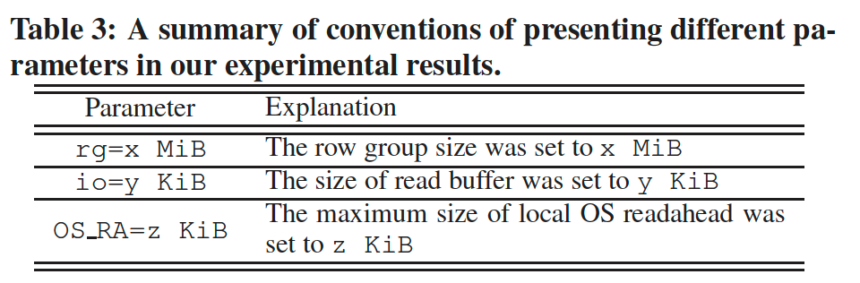  

**4.6.1 Row Group Size**

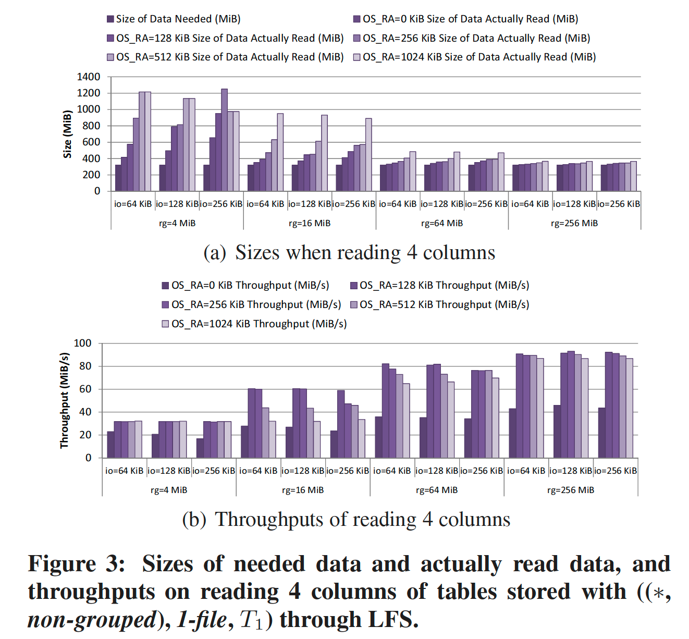  

With a given table, the size of a row group determines the size of every column in this row group. Because data of a column stored in two row groups may not stored contiguously, if the size of this column in a row group is small, lots of seeks will be introduced and the performance of reading this column will be degraded.

Figure 3，((*, non-grouped), 1-file, T1)，测试不同的 LFS read buffer size and different maximum local OS readahead size，1-file 表示一个 row group 中的数据保存在一个文件内，注意是一个 row group 的数据，不是一个 table 的数据保存在一个文件内。

OS_RA表示本地文件系统的 readahead buffer size。

首先，当 local OS readahead is disabled。
当 RG size 为 4MB 时，一个 RG 中的 column 的大小约为 256KB+ （4 MB / 16 再加一些附加信息)。那么当 read buffer 大小为 256KB 时，为了读一个列 256KB+ 的数据，LFS 需要读两次，所以实际上读取的数据约为 needed data 的两倍。
而随着 RG size 增加，RG 中 single column 的大小逐渐远超 io buffer 的时候，unnecessary data read 将会越来越少。

其次，当我们打开 local OS readhead 时，我们设置的 OS_RA 越大，那么 ra 会放大前面说的 unnecessary data read。比如，当 rg size 为 4 MB，read buffer size 为 256KB 时，随着 OS_RA 变大，实际读取的数据将会越来越多。

然后，随着 row group size 增大，**there will be less buffered read operations that read unneeded data from the device, and local OS readahead will do less useless work.**

从 Figure 3 我们可得出这样的结论：
1. row group size 越大，可以减少更多的 unnecessary data read
2. readbuffer 略小于 needed data 时，会导致最多的 unnecessary data read，并且会导致文件系统的预读性能更差。

Figure 3(b) 展示了对应的 LFS data reading throughput。当读操作会读取很多 unnecessary data 时，throughput of data reading 会非常低。

**4.6.1 Grouping Columns**

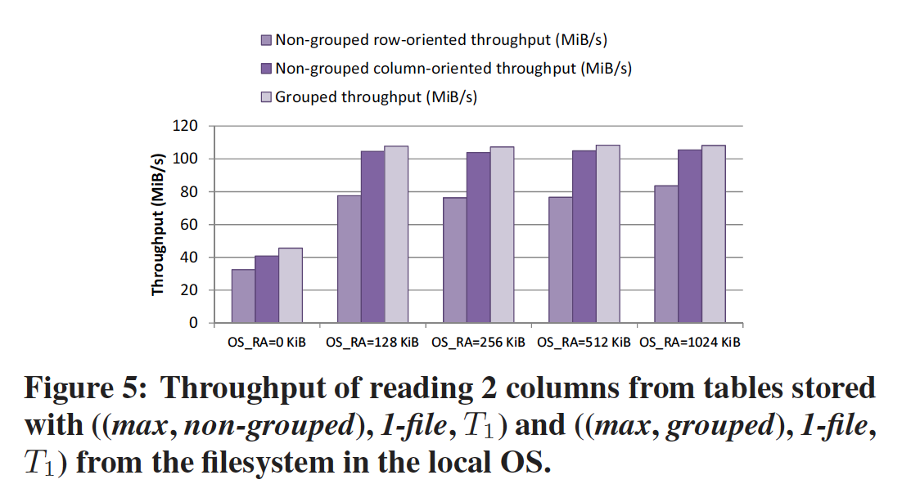  

比较 ((max, non-grouped), 1-file, T1) ((max, grouped), 1-file, T1)

We configured Trevni to directly access local filesystem instead of accessing files through LFS of DFS. Through this way, we can eliminate the impacts from buffered read operation introduced by LFS and DFS.

对于 non-grouped method，测试了采用 行存访问 与 列存访问 两种模式的 throughput。

结论：
row-oriented method 在不同的 OS_RA 下，总是性能较差。
columns-oriented method 总是比 row-oriented method 好，但是总是比 grouping columns 差一点点。

分析：
* 在 non-grouped 模式下，row-oriented method 将会产生大量的 seek （读一行需要读一次column1，读一次column2）
* non-grouped column-oriented method 只比 grouped 模式的性能少一点点，是因为，non-grouped 比 grouped 多了一倍的 seek 次数（在每个 row group内，前者一共 16 column，后者一共 8 column）

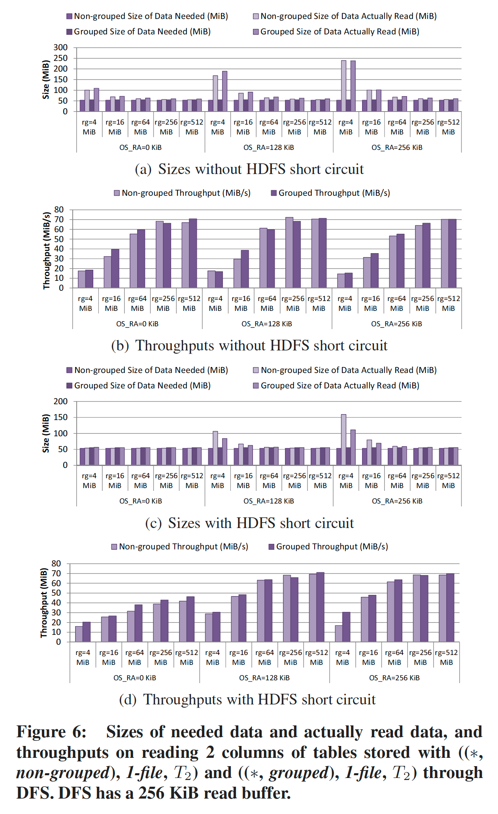  

Figure 6 的测试：
* with and without HDFS short circuit,
* varied row group sizes,
* different maximum local OS readahead sizes.
  
结论：
* small row group size 时，grouping columns 性能更好

**4.6.3 Packing Column Groups**
将一个 row group 保存到多个 physical block 的不同方式引入了新的问题。

For simplicity, when columns in a row group were packed into multiple physical blocks, we stored a single column in a physical block.

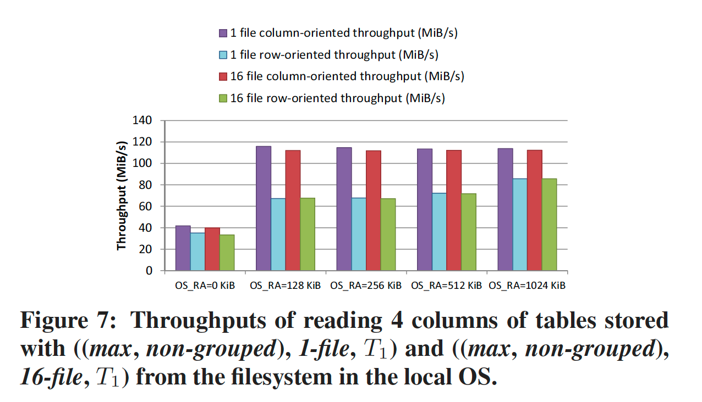  

Figure 7 在本地文件系统测试。

结论：
 1. column oriented 总是比 row-oriented 的 throughput 更高
 2. 1 file 相比 16 file 没有很大的差别

### 4.7 Summary
**4.7.1 Row Group Size**
Action 1: Action 1: using a sufficiently large row group size.

如果 row group size 过小，buffered read operations 情况下，underlying storage system 会 load 更多的非必要数据，并且 row group 变多，disk seek 会变多。

**4.7.2 Grouping Columns**
Action 2: if a sufficiently large row group size is used and columns in a row group can be accessed in a column-oriented way, it is not necessary to group multiple columns to a column
group.

1. 在 column-oriented method 下，如果 group multiple columns together，会导致有 unnecessary data is laoded
2. group columns 本身有计算成本

**4.7.3 Packing Column Groups**
Action 3: if a sufficiently large row group size is used, it is not necessary to pack column groups (or columns) into multiple physical blocks.

我们将 column group 放在相邻的 physical block 的目的是能够在之后顺序读 column group。
当我们将 row group 设置的足够大之后，local OS filesystem 的 readahead 次数将会减少，并且每次 load 到的 unnecessary data 也会减少，所以

### 6 THE DATA READING EFFICIENCY AND THE DEGREE OF PARALLELISM

However, in a distributed environment, increasing the row group size may not always result in performance improvement.

s smaller row group size can increase the available degree of parallelism.
High degree of parallelism:
1. more tasks can be used to process data in parallel
2. tasks to read data can be more balanced

The essential issue to be considered is the trade-off between the degree of parallelism in a cluster and the data reading efficiency in each individual machine (or each data processing task).

实际测试：使用 TPC-H的 lineitem table, call it L.

分析在不同的 row group size 的时候，data reading efficiency 的大小

The data reading efficiency is calculated as the ratio of the data reading throughput to the disk bandwidth.

  

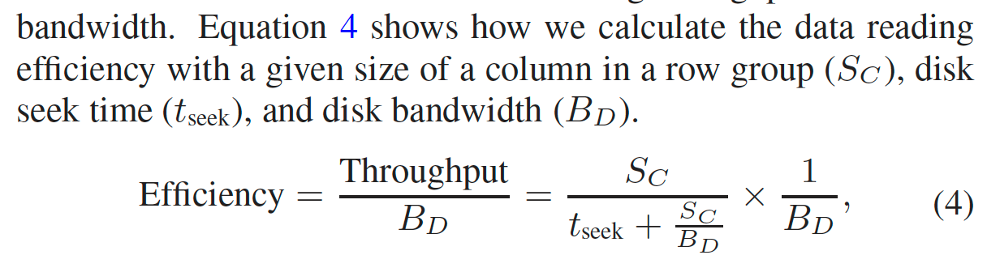  

tseek = 10 ms

Summary:
1. 当 rg size 从很小开始增加时，read efficient 增加很快，并且 colunn 大小越大，增加的速度越快
2. 当 rg size 增大到一定程度后，read efficient 不再增加，趋于稳定，是因为 rg size 增加后限制了数据处理的并行度

### 7 ORC FILE: A CASE STUDY
ORC 优化 RCFile 而出现。

**Row reordering**
The writer of ORC File does not sort a table, but users can explicitly sort it as a pre-process.
ORC 支持 predicate pushdown。

**Table partitioning**
ORC 默认是 256 MiB 的 row group size（stripe in ORC).

**Data packing**
ORC File does not store a stripe to multiple files.

### 8 CONCLUSION
Main findings:
1. row group size 应该足够大
2. 当 row group size 足够大，并且应用层使用 column-oriented method 访问数据时，没必要将多个 column group 成一个 column group
3. 当 1，2 都满足时，没必要将每个 column 都放在单独的 physical block 内（即没必要一个 column 一个列文件）
4. 在分布式计算集群下，row group size 的选择需要在 每台机器的 read efficiency 与集群的并行度之间进行综合选择。

## Delta Lake: HighPerformance ACID Table Storage over Cloud Object Stores
### 2. MOTIVATION: CHARACTERISTICS AND CHALLENGES OF OBJECT STORES
#### 2.1 Object Store APIs
#### 2.2 Consistency Properties
#### 2.3 Performance Characteristics
Each read operation usually incurs at least 5-10 ms of base latency, and can then read data at roughly 50-100 MB/s, so an operation needs to read at least several hundred kilobytes to achieve at least half the peak throughput for sequential reads, and multiple megabytes to approach the peak throughput. Moreover, on typical VM configurations, applications need to run multiple reads in parallel to maximize throughput.

LIST operations also require significant parallelism to quickly list large sets of objects. For example, S3’s LIST operations can only return up to 1000 objects per requests, and take tens to hundreds of milliseconds, so clients need to issue hundreds of LISTs in parallel to list large buckets or “directories”.

Delta Lake 的实现中，metadata about available objects (including their names and data statics) is stored in the Delta log instead, but we also parallize reads from this log over the cluster.

#### 2.4 Existing Approaches for Table Storage
**Directories of Files**
Store the table as a collection of objects. Split data into multiple objects based on one or more attributes，不同的 objects 放置在不同的 directories 下。

比如，mytable/date=2020-01-01/obj1，mytable/date=2020-01-01/obj2 中保存从一月一号开始的数据，
mytable/date=2020-01-02/obj1 保存从一月二号开始的数据。

可以减少 LIST object 操作的开销。

这种模式起源于基于 Apache Hive 的 HDFS

Challenges：
* No atomicity across multiple objects
* Eventual consistency: 即使事务成功，有些 clients 可能还是看不到对象的更新。
* Poor performance: 即使数据已经被 partitioned into directories，Listing objects 操作依然开销很大。Moreover, access per-object statistics stored in Parquet or ORC file is expensive because it requires additional high-latency reads for each feature.
* No management functionality: The object store does not implement standard utilities such as table versioning or audit logs that are familiar from data warehouses.

**Custom Storage Engines**
Snowflake. 通过使用一个单独的，强一致性的服务，来保存元数据。元数据包括：what objects comprise a table. Cloud Object 被当作一个朴素的block device。缺点：需要一个高可靠的服务去保存元数据，并且如果要查询外部表，那么会导致一些额外的开销。

Challenges:
* All I/O operations to a table need contact the medata service.
* 与现有计算引擎的兼容性不好，用户可能需要额外开发的 connectors

Apache Hive ACID 在 HDFS or object stores 上，通过使用 Hive Metastore 实现了类似的方式。Hive Merastore (使用关系型数据库) 用于记录 multiple files that hold updates for a table stored in ORC format.

**Metadata in Object Stores**
Store a transaction log and metadata directly within the cloud object store, and use a set of protocol over object store operations to achieve serializability. Table data is stored in Parquet format.

Apache Hudi 与 Apache Iceberg 也支持上述实现。

### 3. DELTA LAKE STORAGE FORMAT AND ACCESS PROTOCOLS

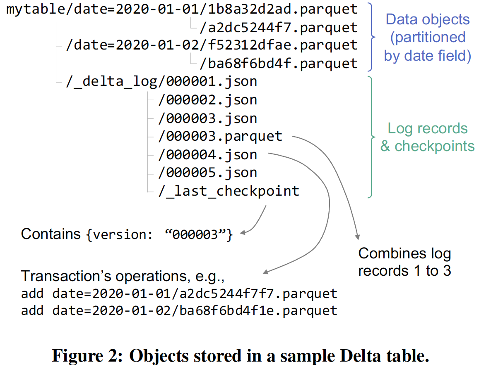  

#### 3.1 Storage Format
**3.1.1 Data Objects**
Apache Parquet format. Organized into directories using Hive's partition naming convention.

Parquet: column-oriented, diverse compression updates, supported nested data types fro semi-structures data

每个数据对象都有一个unique name，typically chosen by the writer by generating a GUID. **However, which objects are part of each version of the table is determined by the transaction log.**

**3.1.2 Log**
log 保存在 table 的 _delta_log 子目录下。

A sequence of JSON objects with increasing zero-padded numerical IDs to store the log records, together with occasional checkpoints for specific log objects that summarize the log up to that point in Parquet format.

* Change Metadata
* Add or Remove Files
  这一步里，在添加一个 data object 时，会将其中的 data statistics, such as the total record count and per-column min/max values and null count, 添加到 log 中。
* 

#### 3.1 Storage Format

### 4.4 Data Layoout Optimization

## Apache Hudi & Apache IceBerg

## Optimal Column Layout for Hybrid Workloads
### 1. INTRODUCTION

The Problem: Conflicting Design Goals for HTAP. One big challenge when designing systems for HTAP workloads comes from the fact that data layout decisions designed for read-intensive scenarios
do not typically work well for write-intensive scenarios and vice versa.

This paper focus:
1. how to physically order data
2. whether columns should be dense
3. how to allocate buffer space for updates