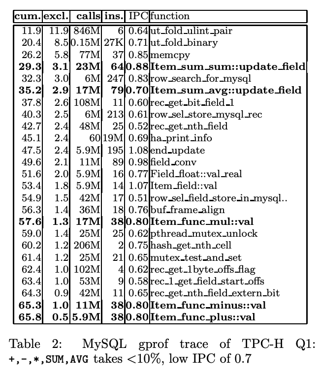
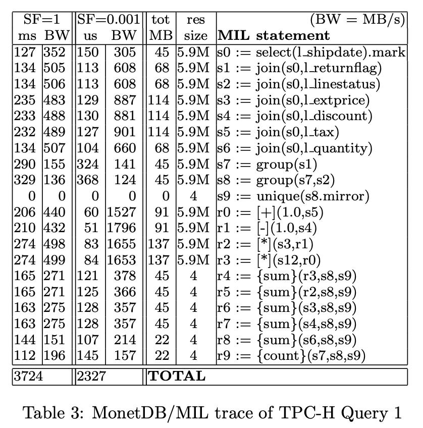
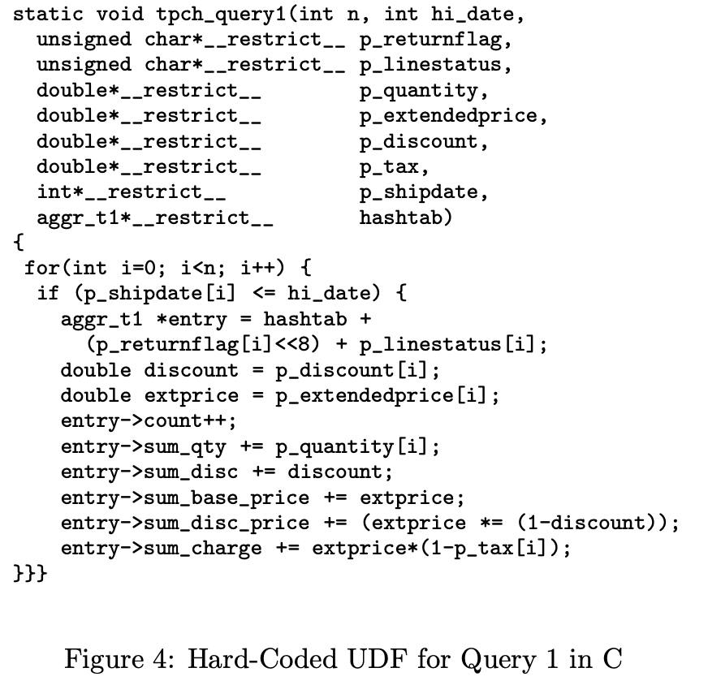
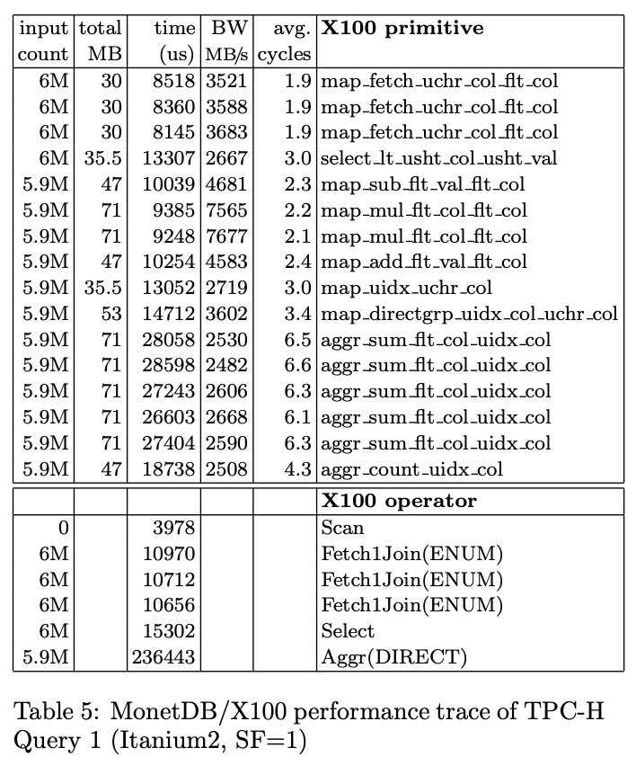

<!-- @import "[TOC]" {cmd="toc" depthFrom=1 depthTo=6 orderedList=false} -->

<!-- code_chunk_output -->

- [MonetDB/X100: Hyper-Pipelineing Query Execution](#monetdbx100-hyper-pipelineing-query-execution)
  - [Abstract](#abstract)
  - [Introduction](#introduction)
    - [Outline](#outline)
  - [How CPUs Work](#how-cpus-work)
  - [Microbenmark: TPC-H Query 1](#microbenmark-tpc-h-query-1)
    - [Query 1 on Relational Database Systems](#query-1-on-relational-database-systems)
    - [Query 1 on MonetDB/MIL](#query-1-on-monetdbmil)
    - [Query 1 Baseline performance](#query-1-baseline-performance)
  - [X100: A Vectorized Query Process](#x100-a-vectorized-query-process)
    - [Query Language](#query-language)
    - [Vectorized Primitives](#vectorized-primitives)
  - [Query 1 performance](#query-1-performance)
    - [Vector Size Impact](#vector-size-impact)

<!-- /code_chunk_output -->

# MonetDB/X100: Hyper-Pipelineing Query Execution

## Abstract
这篇文章从 CPU 计算的角度去分析数据库系统实现的问题。

## Introduction

现代 CPU 很强，但是研究显示数据库系统的 IPC (Instruction per cycle) 较低。本文没有分析内存/缓存 (这两个实际上很重要) 对于查询性能的影响，而是调查关系数据库是如何与现代的 super-scalar CPUs 交互的，测试集是 TPC-H。

调查结论是，大多数 DBMS 实现的架构阻碍了编译器去使用优化技术，这导致了较低的 CPU 效率。**Particularly, the common way to implement the popular Volcano [10] iterator model for pipelined processing, leads to tuple-at-a-time execution, which causes both high interpretation overhead, and hides opportunities for CPU parallelism from the compiler.**

文章同时也分析了内存数据库 MonetDB 的性能，尽管 MonetDB 使用的是 column-at-a-time (一次处理一列数据) execution model，但是它使用的 full-column materialization 导致它在查询执行中传递了过大的数据流。在他们使用场景中，这种缺点导致 MonetDB 严重受制于内存带宽，进而导致 CPU 使用效率大幅减低。

因此，文章在 ModetDB 系统下，实现了一个新的查询引擎 —— X100。

特点：
* vectorized query processing model

### Outline
Section 2 介绍现代 super-scalar CPU 架构，关注其中与 query execution performance 相关的。
Section 3 Performance analysis of TPC-H on RDBMSs then MonetDB and finally hand-coded implementation as a baseline of maximum achievable raw performance.
Section 4 Architecture of new X100 query processor of MonetDB
Section 5 Performance of X100 compared with MIL(original query engine of MonetDB)

## How CPUs Work

指令流水线：将 CPU 指令需要完成的工作分割成更多的步骤，每一个步骤需要做的事更少，意味着 CPU 频率可以进一步提高。

While the 1988 Intel 80386 CPU executed one instruction in one (or more) cycles, the 1993 Pentium already had a 5-stage pipeline, to be increased in the 1999 PentiumIII to 14 while the 2004 Pentium4 has 31 pipeline stages.

Pipelines introduce two dangers:
1. if one instruction needs the result of a previous instruction, it can not be pushed into the pipeline right after it, but must wait until the first instruction has passed through the pipeline
2. in case of IF-a-THEN-b-ELSE-c branches, the CPU must predict whether a will evaluate to true or false. It might guess the latter and put c into the pipeline, just after a. Many stages further, when the evaluation of
a finishes, it may determine that it guessed wrongly (i.e. mispredicted the branch), and then must flush the pipeline (discard all instructions in it) and start over with b. 更明显的是，如果 pipeline 更长，那么分支预测失败的代价就越高。翻译转换到数据库系统中，那些有数据依赖的 selection operator，假如其 selectivity 既不高也不低，那么我们就几乎无法预测哪些数据要读哪些不要读。

除此以外，super-scalar CPUs 提供了将多个不相关的指令并行执行的可能性。即，CPU 有多条 pipeline。在每个时钟周期，一条新的指令可以被 push 到多条流水线中执行。super-scalar CPU 可以使 IPC > 1。

Intel Itanium2 processors 有 6 条流水线，每条流水线有 7 个 stage，因此它的时钟周期较低，只有 1，5GHz。相反，Pentium4 的流水线有 31 个 stage，并且始终频率为 3.6GHz，但是它只有 3 条流水线。从理论上来说，为了达到各自的最强性能，Itanium2 需要同时执行 7 * 6 = 42 条相互不依赖的指令，而 Pentium4 需要 31 * 3 = 93 条相互不依赖的指令。Such parallelism cannot always be found, and therefore many programs use the resources of the Itanium2
much better than the Pentium4, which explains why in benchmarks the performance of both CPUs is similar, despite the big clock speed difference.

对于提高 CPU 使用率来说，编译优化非常重要。其中最重要的技术是 loop pipelineling。比如有两个相互依赖的操作 `F()`, `G()`，我们需要将这两个操作 apply 到数组 A 的所有 n 个不相关的元素上。如果不做优化，那么我们看到的最直观的操作顺序是
`F(A[0]),G(A[0]),F(A[1]),G(A[1]),...,F(A[n]),G(A[n])`
如果我们的 CPU 是支持 super-scalar 的话，那么上述的执行路径是无法把多条流水线塞满的。因为 `G()` 的执行依赖于 `F()` 的结果，当我们把 `F()` 塞进流水线 1 后，必须等 `F()` 执行完才能把 `G()` 塞进流水线，因此这种执行顺序导致只能用到一条流水线。
```
F(A[0]) G(A[0]) F(A[1]) G(A[1]) F(A[2]) G(A[2])
```
假设 CPU 有三条流水线，如果我们把上述的执行路径改写为
`F(A[0]),F(A[1]),F(A[2]),G(A[0]),G(A(1)),G(A(2))...`
的话，那么我们可以得到如下的执行路径
```
F(A[0]) G(A[0])
F(A[1]) G(A[1])
F(A[2]) G(A[2]) 
```
对于 Itanium2 processors 来说，编译器的优化非常重要，因为它删减了用于判断指令能否乱序执行的电路，增加了 pipeline 数量。增加 pipeline 数量后，Itanium2 processors 可以使用其他的分支预测技术来减少分支预测失败，比如同时并行执行 THEN 和 ELSE 分支，然后根据 IF 结果去 discard 某一个结果。这种技术也依赖于编译器去找到能够进行分支预测的机会。


分析 Figure 2：
* 普通 CPU (没有 super-scalar，只有 pipeline) 比如 AthlonMP 在 selectivity = 50% 的时候表现最差，因为分支预测失败最多。那么更改了写法之后，AthlonMP 的性能不再被 selectivity 影响，but incurs a higher average cost。
* Itanium2 支持 super-scalar，有趣的一点是，它的 branch version 性能最好并且不受 selectivity 影响，**因为编译器会把代码翻译为 hardware-predicated code（即前面提到的在多条 pipeline 中同时执行 THEN-ELSE 分支）**


Finally, we should mention the importance of on-chip caches to CPU throughput. About 30% of all instructions executed by a CPU are memory loads and stores, that access data on DRAM chips, located inches away from the CPU on a motherboard.

## Microbenmark: TPC-H Query 1
为什么选择 TPC-H query 1:
1. 没有 join (防止各种花哨的 join 算法对结果有影响)
2. 专注于 expression calculation


### Query 1 on Relational Database Systems


RDBMS 的实现基于关系代数运算，makes costs of "real work" is only a tiny fraction of total query execution cost.
Table 2 解读：
* cum. : function 的累积执行时间
* execl. : function 减去函数调用后，占整个 query 执行时长的比例
* calls. : function 被调用多少次
* ins. : average number of instructions executed on each call
* IPC : IPC

Observation:
* 10% costs on agg function(dispalyed in boldface)
* 28% hash table related
* 62% other
* Item_func_plus::val has a cost of 38 instructions per addition.

测试是在 MIPS R12000 CPU 上执行的，该 CPU 可以在一个 cycle 中执行 3 个整型或者浮点数指令 + 1 个 load/store 指令。平均的操作延迟是 5 个 cycle。
对于一个简单的 `+(double lhs, double rhs)` 来说，汇编实现如下
```
LOAD src1,reg1
LOAD src2,reg2
ADD reg1,reg2,reg3
STOR dst,reg3
```
由于有 3 个 load/store 指令，那么在 MIPS 上，每个 `+(double lhs, double rhs)` 需要 3 个 cycle。然而 MYSQL 的 `Item_func_plus::val` 函数，执行一次加法，需要 38/0.8 = 49 个 cycle。

**One explanation for this high cost is the absence of loop pipelining. As the routine called by MySQL only computes one addition per call, instead of an array of additions, the compiler cannot perform loop pipelining.**，因此哪怕 MYSQL 在真正执行加法时也是用的是上述 4 个指令的组合，但是由于它们无法被编译器优化为可以在 super-scaler 上并行执行的代码，那么每个指令都需要 5 个 cycle 的延迟，累计就是 20 个 cycle 才可以执行一次加法。多出来的其他 19 个 cycle 是在做函数调用的控制流工作（jump，压栈等）。

### Query 1 on MonetDB/MIL

MonetDB —— 纯列存。

SF = 0.001 的时候，MonetDB 的相对执行速度几乎是 SF = 1 的两倍。
MIL 的性能瓶颈在内存带宽。

On SF=1, MonetDB gets stuck at 500MB/s, which is the maximum bandwidth sustainable on this hardware. When running purely in the CPU cache at SF=0.001, bandwidths can get above 1.5GB/s. For the multiplexed multiplication [*](), a bandwidth of only 500MB/s means 20M tuples per second (16 bytes in, 8 bytes out), thus 75 cycles per multiplication on our 1533MHz CPU, which is even worse than MySQL.

MontetDB 内存问题是 Full materialization 导致的。

### Query 1 Baseline performance

手写 UDF。




The UDF gets passed in only those columns touched by the query.

**We pass these arrays as __restrict__ pointers, such that the C compiler knows that they are non-overlapping.  Only then can it apply loop-pipeline.**

Table 1 是可以看到手写代码的性能的，达到了 0.22 秒。

## X100: A Vectorized Query Process
Disk: fragmented data layout
RAM: memory-to-cache and cache-to-memory routines
Cache: volcano-like execution pipeline based on a vectorized-processing model. Small vertical chunks of cache-resident data items, called 'vectors' are the unit of operation for X100 execution primitives.

The X100 query processing operators should be cache- conscious and fragment huge datasets efficiently into cache-chunks and perform random data ac- cess only there.

CPU: 利用编译器实现 loop pipeline.
Currently, this compilation is statically steered, but it may eventually become a run-time activity mandated by an optimizer.

### Query Language
基于标准关系代数，而不是基于 column-at-a-time 的模型。
```sql
select returnflag, sum(extendedprice * (1 - discount)) as discountprice
from lineitem
where shipdata < '1998-09-03'
group by returnflag
```
对于这一个查询，需要一个 scan 去读 lineitem 的 4 列数据，然后 select operator 执行 `where shipdata < '1998-09-03`，这样输出 tuple 将会包含 3 列，每一列都已经被过滤过一次，然后最后执行一个 hash agg，以 returnflag 为 hash key，得到一个 hash table，running value 是 `(extendedprice * (1 - discount))`

转化成 X100 的查询语言如下：
```
Aggr{
  Project(
    Select(
      Table(lineitem),
      < (shipdata, date('1998-09-03'))),
    [discountprice = *(-(flt('1.0'), discount), extendedprice)],
    [returnflag],
    [sum_disc_price = sum(discountprice)]
  )
}
```
Volcano-like pipeline, on the granularity of a vector(1000 value).


X100 的执行模式：
* SCAN operator 还是不变，读 4 列上来
* SELECT operator 根据 predicate 计算得到一个 select-vector。
* PROJECT operator 会根据 select-vector 来判断要对哪些 tuple 计算表达式 `extendedprice * (1 - discount)`
* AGGRERATE operator 中。 `map_hash_chr_col` 的输入是 selection-vector + col returnflag，输出是 hash table + another vector，another vector 是跟 select-vector 对应的，记录了每个 select-vector 中的 tuple 在 hash table 的哪一行。
`aggr_sum_fit_col` 则有三个输入，selection-vector + hash-table-position-vector + discountprice。
假如前两个是 vec1 vec2，那么 aggr_sum_fit_col 做的事就类似
```c
void aggr_sum_fit_col(vec1, vec2, input, output_hash) {
  for (int i = 0; i < n; ++i) {
    int j = vec1[i];
    output_hash[j] += input[i];
  }
}
```
### Vectorized Primitives
在 vertically fragmented data model 中，每个 execution primitives only know about the columns they operate on without having to know about the overall table layout(e.g record offsets). 因此 C 编译器会发现，X100 的 vectorized primitives 只在 restricted independent array of fixed shape 上执行，此时编译器就可以使用比较激进的 loop pipeline
```c
map_plus_double_col_double_col(int n, double* __restrict__ res, double* __restrict__ col1, double* __restrict__ col2, int* __restrict sel)
{
  if (sel) {
    for(int j=0; j<n; j++) {
      int i = sel[j];
      res[i] = col1[i] + col2[i];
    }
  } else {
    for(int i=0; i<n; i++) {
      res[i] = col1[i] + col2[i];
    }
  }
}
```
前面代码中的 sel 代表 selection-vector，X100 选择在多个 operator 之间传递 sel 而不是直接过滤掉下面算子传上来的数据。根本原因是，leaving the vectors delivered by the child operator intact is often quicker than copying all selected data into new (contiguous) vectors.

X100 中的向量化算子并不是直接手写的，而是 generted from primitive patterns，相当于是有一个 make 脚本，读入描述文件，然后产生 C 代码。

## Query 1 performance
**X100 implements detailed tracing and profiling support using low-level CPU counters, to help analyze query performance.**




Table5 解读：
第一张表展示了以 vectorized primitives 作为统计维度的结果。第二张表以算子维度统计结果。
* avg.cycles 很低说明 X100 处理每一行数据时占用的时钟周期很短
* 由于 X100 的 process primitives 一次处理一批数据，因此用到了非常高的带宽。
* FetchJoin 非常高效（没看懂）

### Vector Size Impact

X100 默认使用 1024 作为 vector 的大小。

**Preferably, all vectors together should comfortably fit the CPU cache size, hence they should not be too big. However, with really small vector sizes, the possibility of exploiting CPU parallelism disappears.**


Figure 10 解读：
* 当计算的使用的中间结果无法放进 cache 的时候，性能开始下降。
在 Query 1 中使用到的 tuple 的大小约为 40 字节，因此，当 vector 行数超过 8K 的时候，就需要使用 320 KB 的 cache memory，这超过了 AthlonMP 上 L1 & L2 加起来的大小。

When the vectors do not fit in any cache anymore, we are materializing all intermediate results in main memory.