<!-- @import "[TOC]" {cmd="toc" depthFrom=1 depthTo=6 orderedList=false} -->

<!-- code_chunk_output -->

- [向量量化](#向量量化)
  - [Scalar Quantization](#scalar-quantization)
    - [Uniform](#uniform)
    - [NonUniform](#nonuniform)
    - [Benchmark](#benchmark)
  - [Product Quantization](#product-quantization)
    - [算法原理](#算法原理)
    - [Faiss 实现](#faiss-实现)
    - [LUT 加速计算](#lut-加速计算)
    - [BenchMark](#benchmark-1)
    - [RabitQ](#rabitq)
      - [Index Phase](#index-phase)
      - [CodeBook Construction](#codebook-construction)
      - [QueryPhase](#queryphase)
      - [Concentration of measure](#concentration-of-measure)

<!-- /code_chunk_output -->


# 向量量化
在向量搜索场景下，向量量化（Vector Quantization）技术的核心思想是通过把高精度的向量编码映射到另一个低精度的向量的方式，实现在略微降低召回率的情况下，大幅度地减少向量的内存开销的目标。其本质是多种有损压缩算法。
## Scalar Quantization
核心思路：不降低维度，只降低每个维度存储数值的精度。统计数据分布信息，把连续实数区间的浮点数映射到离散分布的整型数字区间。如果不同维度之间的数据分布不同，那么就每个维度单独统计分布，单独进行编码，否则所有维度使用相同的分布信息。

假设某一个维度真实值的取值范围是 $[m, M]$，使用 $n$ bits 的整型做编码，那么最多能表达的 code 值范围是：

$$
2^{n} - 1
$$

考虑非均匀分布的情况（不同维度分布区间不同），由于每一维的统计信息都是不一样的，所以对于 N 个 D 维度的向量，会计算得到一个 1*D 的矩阵保存统计信息，这个向量的每一个维度保存的是一个数据结构 Stat，Stat 里面记录了这一个维度上的 min，max 统计信息。把每一个 code 值看作是一个“桶”，那么问题就变成了如何把连续分布的实数投影到有限数量的“桶”里。

如果把真实值范围均分成 $T$ 个桶，每个桶的宽度（步长，scale）为：

$$
	scale = \frac{\text{max\_val} - \text{min\_val}}{\text{max\_code}}
$$


假设计划使用 $b$ bits 进行编码，那么可以计算得到：

$$
	max\_code = (1 \ll b) - 1
$$

$$
	scale = \frac{\text{max\_val} - \text{min\_val}}{\text{max\_code}}
$$

编码阶段，对于入参 $x$，它的编码后的值为：

$$
	code = \frac{x - \text{min\_val}}{\text{scale}}
$$

解码阶段，对于码值 $c$，它的原始值为：

$$
x = c \times \text{scale} + \text{min\_val}
$$

下面是一段 python 代码演示 ScalarQuantizer 的核心编解码实现
```python
import numpy as np

class SimpleScalarQuantizer:
    def __init__(self, nbits=8):
        self.nbits = nbits
        self.max_code = (1 << nbits) - 1  # 2^nbits - 1
        self.scale = None
        self.min_val = None
    
    def train(self, x: np.ndarray):
        """
        这里用 min-max 区间来决定量化参数
        """
        self.min_val = np.min(x)
        max_val = np.max(x)
        self.scale = (max_val - self.min_val) / self.max_code
    
    def encode(self, x: np.ndarray) -> np.ndarray:
        """
        浮点 -> 量化编码（uint8）
        """
        codes = np.round((x - self.min_val) / self.scale).astype(np.int32)
        codes = np.clip(codes, 0, self.max_code).astype(np.uint8)
        return codes
    
    def decode(self, codes: np.ndarray) -> np.ndarray:
        """
        量化编码 -> 重建浮点
        """
        return codes.astype(np.float32) * self.scale + self.min_val
```
### Uniform
faiss 的 Scalar Quantization 实现分为 Uniform 和 NonUniform，Uniform 指的是所有维度的分布相同，此时我们不用每个维度单独统计 MinMax，只需要统计所有维度的 MinMax。
```c++
void train_Uniform(
        RangeStat rs,
        float rs_arg,
        idx_t n,    // n 等于 N * D，100个1024维度的向量 n 就等于 102400
        int k,
        const float* x,
        std::vector<float>& trained) {
    trained.resize(2);    // vmin,vmax 是所有维度的min和max
    float& vmin = trained[0];
    float& vmax = trained[1];
    if (rs == ScalarQuantizer::RS_minmax) {
        vmin = HUGE_VAL;
        vmax = -HUGE_VAL;
        for (size_t i = 0; i < n; i++) {
            if (x[i] < vmin)
                vmin = x[i];
            if (x[i] > vmax)
                vmax = x[i];
        }
        // rs_arg 的默认值为0，用来扩展 min max 的范围，防止 train 阶段
        // 统计的 min max 小于 add 阶段的 min max
        float vexp = (vmax - vmin) * rs_arg;
        vmin -= vexp;
        vmax += vexp;
    }
}
```
### NonUniform
NonUniform 分布，则指的是不同维度的数据分布不同，比如
```python
vec1 = [0.1, 0]
vec2 = [0.2, 100]
```
此时 dim 1 的 min max 与 dim 2 的 min max 差距过大，如果都按照相同分布去统计 min max，用 8bit 去进行编码，那么最终得到的码值为：

$$
	\text{vec1} = [0, 121], \quad \text{vec2} = [13, 255]
$$

再解码得到：

$$
	\text{vec1} = [0.1, 1.0015686] \\
	\text{vec2} = [0.19686274, 1.99999994]
$$

可以看到相比原始值误差很大。对于 NonUniform 的向量，就需要每个维度单独统计分布，faiss 的实现中先对原始矩阵进行转置，然后对于每个维度单独计算 MinMax。
```c++
std::vector<float> xt(n * d);
for (size_t i = 1; i < n; i++) {
    const float* xi = x + i * d;
    for (size_t j = 0; j < d; j++) {
        xt[j * n + i] = xi[j];
    }
}
std::vector<float> trained_d(2);
#pragma omp parallel for
for (int j = 0; j < d; j++) {
    // 转置之后按行重新计算 MinMax
    train_Uniform(rs, rs_arg, n, k, xt.data() + j * n, trained_d);
    vmin[j] = trained_d[0];
    vmax[j] = trained_d[1];
}
```
此时得到的码值为：

$$
	\text{vec1} = [0, 0], \quad \text{vec2} = [255, 255]
$$

解码：

$$
	\text{vec1} = [1.00000001 \times 10^{-1}, 0.00000000] \\
	\text{vec2} = [2.00000000 \times 10^{-1}, 1.00000002 \times 10^{2}]
$$

精度大大提高。
但是不论是Uniform 还是 NonUniform 的实现，其最终的假设都是对于某一个维度上的值，其分布是均匀的。此时按照固定步长去分桶后计算的结果才是可靠的，如果单一维度上的数据不是均匀分布，而是比如正态分布这样在某个范围中数据大量分布，存在稠密与稀疏区间的分布，那么标量量化的结果就会误差很大。

### Benchmark
128 维度向量上的测试结果如下：

| 行数 | Method      | Params         | Train Time(s) | Build Time(s) | Total Time(s) | Search Time(ms) | Recall@100 | Mem(MB) | Compress |
|------|-------------|---------------|---------------|---------------|---------------|-----------------|------------|---------|----------|
| $10000$  | HNSW-Flat   | $M=32$         | $0.00$        | $0.22$        | $0.22$        | $0.01$          | $0.788$    | $4.9$   | $1.0$    |
|        | HNSW-SQ     | $M=32$, QT	extsubscript{8bit} | $0.00$        | $1.69$        | $1.70$        | $0.06$          | $0.787$    | $1.2$   | $4.0$    |
|        | HNSW-SQ     | $M=32$, QT	extsubscript{4bit} | $0.00$        | $2.57$        | $2.57$        | $0.07$          | $0.703$    | $0.6$   | $8.0$    |
| $50000$  | HNSW-Flat   | $M=32$         | $0.00$        | $7.82$        | $7.82$        | $0.02$          | $0.502$    | $24.4$  | $1.0$    |
|        | HNSW-SQ     | $M=32$, QT	extsubscript{8bit} | $0.01$        | $86.39$       | $86.40$       | $0.08$          | $0.505$    | $6.1$   | $4.0$    |
|        | HNSW-SQ     | $M=32$, QT	extsubscript{4bit} | $0.01$        | $77.14$       | $77.15$       | $0.11$          | $0.456$    | $3.1$   | $8.0$    |
| $100000$ | HNSW-Flat   | $M=32$         | $0.00$        | $22.28$       | $22.28$       | $0.04$          | $0.378$    | $48.8$  | $1.0$    |
|        | HNSW-SQ     | $M=32$, QT	extsubscript{8bit} | $0.01$        | $226.14$      | $226.15$      | $0.08$          | $0.381$    | $12.2$  | $4.0$    |
|        | HNSW-SQ     | $M=32$, QT	extsubscript{4bit} | $0.01$        | $207.30$      | $207.32$      | $0.11$          | $0.355$    | $6.1$   | $8.0$    |


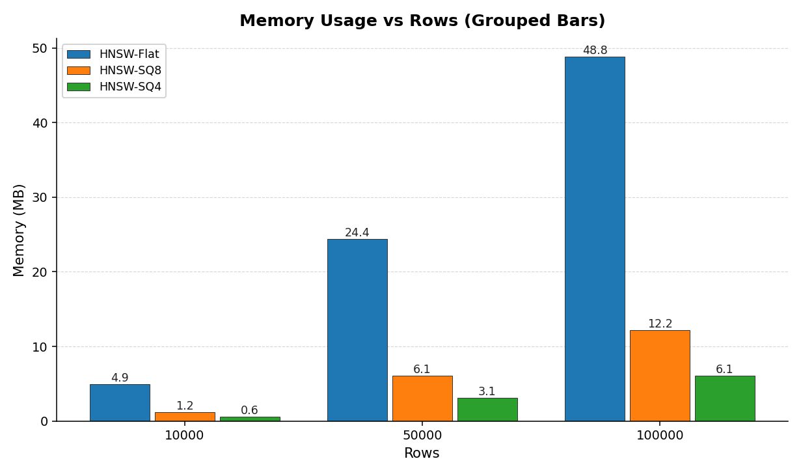

可以看到，标量量化对于索引构建来说开销还是很大的。INT8 量化对于召回率的影响较小，同时对于查询速度也没有明显的影响。

## Product Quantization

### 算法原理
Scalar Quantization 在某一维度数据分布不均匀时效果较差。针对这种情况，常见的做法是引入聚类算法，将数据进行非均匀分桶，从而更好地适应分布特征。
[图片]
先用最朴素的做法，对每一个维度的数据，使用 k-means 算法为该维度训练 256 个质心（centroid），每个质心都用一个 float32 存储，每个质心都有一个 ID。把原始向量中该维度的 float32 替换为一个 INT8，INT8 的值保存的是距离该维度最近的质心的 ID。
举个例子，有 10 个维度为 8 的向量
```python
import numpy as np

# 构造 10 个 8 维向量
vecs = np.array([
    [0.1, 0.2, 1.0,  1.1, 10.0, 10.2, 50.0, 50.1],
    [0.2, 0.3, 1.1,  1.0, 10.1, 10.3, 50.2, 50.0],
    [0.15,0.25,1.05, 1.05,10.05,10.25,50.1, 50.05],  
    [5.0, 5.1, 1.0,  1.2, 20.0, 20.1, 60.0, 60.2],   
    [5.2, 5.0, 1.1,  1.3, 20.1, 20.0, 60.1, 60.3],  
    [9.0, 9.2, 2.0,  2.1, 30.0, 30.2, 70.0, 70.1],
    [9.1, 9.3, 2.1,  2.0, 30.1, 30.3, 70.2, 70.0],
    [15.0,15.1,3.0,  3.1, 40.0, 40.1, 80.0, 80.2],
    [15.1,15.2,3.1,  3.0, 40.1, 40.2, 80.1, 80.3],
    [20.0,20.1,4.0,  4.1, 50.0, 50.1, 90.0, 90.2],
])
```

第一个维度通过 k-means 分成 10 个质心（样本太少无法分称 256 个桶）之后的结果为
[ 0.15, 5.1, 9.05, 15.05, 20]
用距离最近的质心的 ID 替换原始向量中的 float32，那么第一个维度的值将会变成：
[0, 0, 0, 1, 1, 2, 2, 3, 3, 4]
在解码阶段，对于每个维度的值，用质心 ID 对应的质心替换 INT8，就得到了解码值。
[ 0.15, 0.15, 0.15, 5.1, 5.1, 9.05, 9.05, 15.05, 15.05, 20] 
```python
/** Constructor.
    *
    * @param d      dimensionality of the input vectors
    * @param M      number of subquantizers
    * @param nbits  number of bit per subvector index
    */
IndexPQ(int d, size_t M, size_t nbits, MetricType metric = METRIC_L2);
```
这个是 faiss 的 PQ 量化器构造函数。
实际使用中，不会每个维度都去构造256个质心，而是均匀地把 d 维的向量切分成 M 个子向量，这样就有 d / M 组子向量，每组子向量有 2^nbit - 1 个质心，每个质心的维度等于子向量的维度等于 d / M。
对于 N 个 d 维度的向量，量化后存储质心的内存大小为 d * (2^nbits - 1) * 4 字节，存储向量的内存大小为 N * D 字节。
为什么要切分子向量之后再聚类，而不是直接在原始向量上做聚类？
1. 在原始向量上直接做聚类相当于直接把 N 个原始向量映射到某一个向量，那最终的精度就极低了。

为什么不是在每个维度都去构造质心？

1. 子向量维度过小会导致每个sub-vector上k-means聚类的效果变差（某些维度之间可能具有相关性，过小的维度划分会丢失这种相关性）。
2. 质心过多会导致编码开销过大。每多一组子向量就意味着需要多一轮的k-means聚类，这个过程几乎等于进行多轮distance的暴力计算。

总之，M 越小编码精度越低训练代价越小，M越大精度越高训练代价越大。
### Faiss 实现
Faiss中有多种优化，这里只看最基础的标准训练过程
Train_Shared指的是所有的子向量共享同一组质心，这种方式最简单。
```c++
void ProductQuantizer::train(size_t n, const float* x) {
    Clustering clus(dsub, ksub, cp);
    
    if (verbose) {
        clus.verbose = true;
        printf("Training all PQ slices at once\n");
    }
    
    IndexFlatL2 index(dsub);
    
    clus.train(n * M, x, assign_index ? *assign_index : index);
    for (int m = 0; m < M; m++) {
        set_params(clus.centroids.data(), m);
    }
}
```
Train_Shared 把 n 个 d 维度的向量"reshape" 成 n*M 个 d/M 的向量，然后用这 n*M 个向量做训练，得到 M 组质心，每组质心的质心数量是 2^nbits个，每个质心的size是 d/M。
训练阶段得到的结果是每个子向量组的质心。质心保存在一个vector里面，质心的个数是 M * 2^nbits，每个质心的 size 是 d/M。
```c++
struct ProductQuantizer {
    /// Centroid table, size M * ksub * dsub.
    /// Layout: (M, ksub, dsub)
    std::vector<float> centroids;
    
    /// return the centroids associated with subvector m
    float* get_centroids(size_t m, size_t i) {
        return &centroids[(m * ksub + i) * dsub];
    }
}
```
### LUT 加速计算
PQ 量化在编码阶段完成后，会为每组子向量计算一个 LUT，LUT 是一个二维数组，这个二维数组保存的是每个质心之间相互的“距离”，当需要计算两个编码后的向量之间的距离时，不再需要解码步骤，直接查表得到每个子向量的之间的距离，然后相加就得到完整的两个向量之间的距离。
### BenchMark
测试数据: dim=128

| Method      | Config                              | efS | Train(s) | Add(s)  | Build(s) | Search(ms) | R@100  | mbs_on_disk | Compress |
|-------------|-------------------------------------|-----|----------|---------|----------|------------|--------|-------------|----------|
| HNSW-Flat   | $M=32$                              | $64$ | $0.00$   | $0.24$  | $0.24$   | $0.01$     | $0.786$| $7.5$       | $0.7$    |
| HNSW-SQ     | $M=32$, QT\_8bit                   | $64$ | $0.00$   | $1.78$  | $1.78$   | $0.06$     | $0.783$| $3.8$       | $1.3$    |
| HNSW-SQ     | $M=32$, QT\_4bit                   | $64$ | $0.00$   | $2.52$  | $2.52$   | $0.07$     | $0.702$| $3.2$       | $1.5$    |
| HNSW-PQ     | $M=32$, PQ(m=64,nbits=8,tr=1.00)    | $64$ | $6.61$   | $0.57$  | $7.18$   | $0.02$     | $0.728$| $3.3$       | $1.5$    |
| HNSW-Flat   | $M=32$                              | $64$ | $0.00$   | $7.65$  | $7.65$   | $0.02$     | $0.502$| $37.4$      | $0.7$    |
| HNSW-SQ     | $M=32$, QT\_8bit                   | $64$ | $0.01$   | $86.37$ | $86.38$  | $0.08$     | $0.503$| $19.1$      | $1.3$    |
| HNSW-SQ     | $M=32$, QT\_4bit                   | $64$ | $0.01$   | $77.14$ | $77.15$  | $0.11$     | $0.457$| $16.0$      | $1.5$    |
| HNSW-PQ     | $M=32$, PQ(m=64,nbits=8,tr=1.00)    | $64$ | $31.44$  | $20.82$ | $52.26$  | $0.02$     | $0.487$| $16.2$      | $1.5$    |
| HNSW-Flat   | $M=32$                              | $64$ | $0.00$   | $21.71$ | $21.71$  | $0.03$     | $0.387$| $74.8$      | $0.7$    |
| HNSW-SQ     | $M=32$, QT\_8bit                   | $64$ | $0.01$   | $226.64$| $226.66$ | $0.08$     | $0.376$| $38.2$      | $1.3$    |
| HNSW-SQ     | $M=32$, QT\_4bit                   | $64$ | $0.01$   | $207.03$| $207.04$ | $0.11$     | $0.351$| $32.1$      | $1.5$    |
| HNSW-PQ     | $M=32$, PQ(m=64,nbits=8,tr=1.00)    | $64$ | $39.99$  | $61.25$ | $101.23$ | $0.03$     | $0.363$| $32.2$      | $1.5$    |

测试 256 dim

| Method      | Config                      | efS | Train(s) | Add(s) | Build(s) | Search(ms) | R@100 | mbs_on_disk | Compress |
|-------------|-----------------------------|-----|----------|--------|----------|------------|-------|-------------|----------|
| HNSW-Flat   | $M=32$                      | $64$ | $0.00$   | $0.70$ | $0.70$   | $0.02$     | $0.689$ | $12.4$      | $0.8$    |
| HNSW-SQ     | $M=32$, QT_8bit             | $64$ | $0.00$   | $7.91$ | $7.91$   | $0.12$     | $0.684$ | $5.0$       | $1.9$    |
| HNSW-SQ     | $M=32$, QT_4bit             | $64$ | $0.00$   | $10.76$ | $10.76$  | $0.15$     | $0.625$ | $3.8$       | $2.6$    |
| HNSW-PQ     | $M=32$, PQ(m=128,nbits=8,tr=1.00) | $64$ | $12.85$  | $2.72$ | $15.56$  | $0.03$     | $0.643$ | $4.1$       | $2.4$    |
| HNSW-Flat   | $M=32$                      | $64$ | $0.00$   | $17.33$ | $17.33$  | $0.04$     | $0.330$ | $61.8$      | $0.8$    |
| HNSW-SQ     | $M=32$, QT_8bit             | $64$ | $0.01$   | $217.44$ | $217.45$ | $0.16$     | $0.336$ | $25.2$      | $1.9$    |
| HNSW-SQ     | $M=32$, QT_4bit             | $64$ | $0.01$   | $204.41$ | $204.42$ | $0.20$     | $0.313$ | $19.1$      | $2.6$    |
| HNSW-PQ     | $M=32$, PQ(m=128,nbits=8,tr=1.00) | $64$ | $62.83$  | $88.18$ | $151.01$ | $0.05$     | $0.324$ | $19.3$      | $2.5$    |
| HNSW-Flat   | $M=32$                      | $64$ | $0.00$   | $42.72$ | $42.72$  | $0.06$     | $0.215$ | $123.6$     | $0.8$    |
| HNSW-SQ     | $M=32$, QT_8bit             | $64$ | $0.03$   | $501.92$ | $501.94$ | $0.16$     | $0.225$ | $50.4$      | $1.9$    |
| HNSW-SQ     | $M=32$, QT_4bit             | $64$ | $0.03$   | $490.05$ | $490.08$ | $0.21$     | $0.203$ | $38.2$      | $2.6$    |
| HNSW-PQ     | $M=32$, PQ(m=128,nbits=8,tr=1.00) | $64$ | $82.64$  | $217.02$ | $299.66$ | $0.05$     | $0.229$ | $38.4$      | $2.5$    |

```bash
OMP_NUM_THREADS=32 ./integrate_faiss/faiss_analysis -hnsw_M 64 -efC 400 -efS 400 --dim 256 --nb 10000,50000,100000 --nq 100 --k 100 --sq-qtype QT_8bit,QT_4bit --pq-m 128 --which hnsw_flat,hnsw_sq,hnsw_pq
```
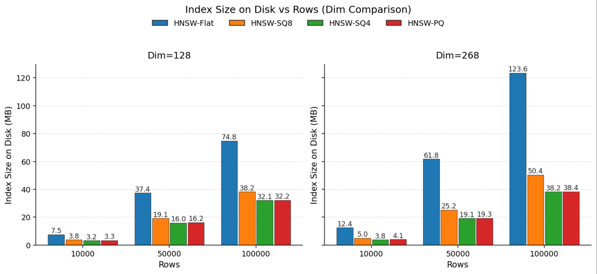
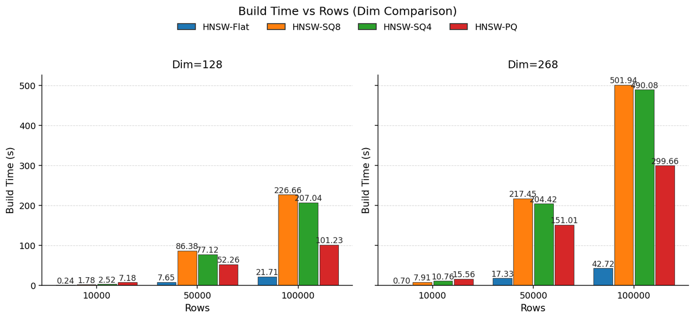
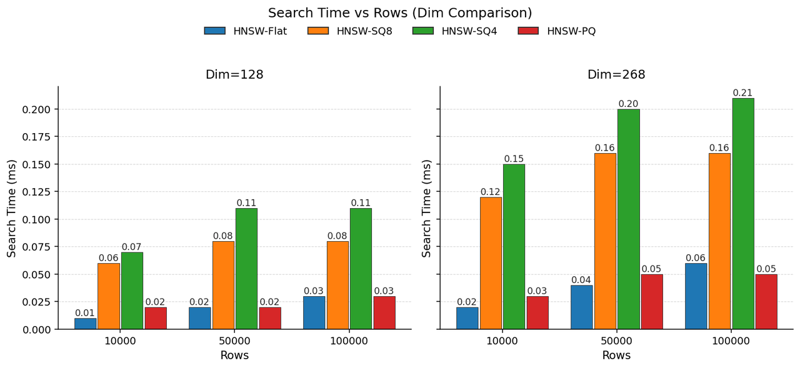
解读benchmark的结果，首先，PQ 量化最明显的正面效果在于其对数据的压缩，其次是对搜索速度的提高。
但是其显著的代价在于：编码的计算开销很大。但是相比 SQ，PQ 可以能够通过 LUT 加速搜索阶段的速度。
### RabitQ
PQ 算法的主要问题在于它本身无法对其误差有一个系统性的约束。
原因在于
1. 索引阶段使用 K-means 对子向量进行聚类，然而由于 k-means 算法本身是一个启发式的算法，在运行过程就有很多的随机因子，所以 k-means 聚类本身的误差就无法系统性计算。
2. 距离计算过程中，使用质心之间的距离近似替代原始距离，这个过程会引入无法被系统约束的误差。

因此，在某些测试数据集上，PQ 算法可能会导致召回率的崩塌。
RabitQ 解决了上述问题。
在 Codebook 构建阶段，RabitQ 首先对 data vector 进行归一化，得到只保留相对于质心的单位方向向量。这样所有的向量都位于一个 D 维度的超球面上。然后，对于原始向量，RabitQ 使用距离量化后的原始向量最近的 D 维的超立方体上的顶点来作为原始向量的编码。在距离计算阶段，RabitQ 设计了一个精妙的方式，能够在保证系统误差在一定范围内的同时，使用编码后的向量进行距离计算。
#### Index Phase
简化 l2 distance 的计算：
1. 计算 data vector 的质心 c
2. 把所有向量改成其相对质心的相对向量
3. 对改写后的向量做归一化
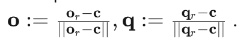
改写完成后，用超立方体的顶点替换 O，就完成了对数据向量的编码。
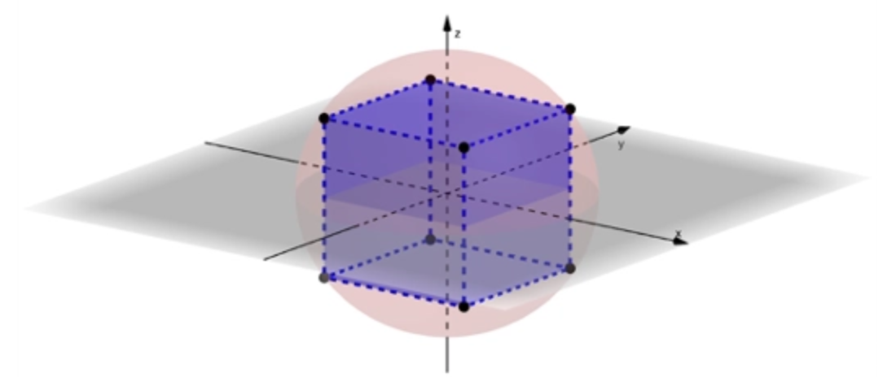
计算向量之间的平方欧式距离，就变成了 
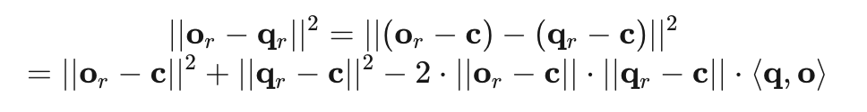
o_r 表示的是原始数据向量，(o_r - c)^2 表示的是原始数据向量与质心之间的平方欧式距离，是可以在index阶段提前计算的。
q_r 表示的查询向量 q 相对质心的平方欧式距离，这个可以在查询阶段计算一次。
真正需要计算的就只有 q 和 o 的内积。
#### CodeBook Construction
在 index phase 阶段，把所有的向量都改写成了相对质心的单位方向向量（Index Pahse阶段的 o），那么以质心为坐标原点，所有的单位方向向量就会分布在一个新的单位球体(unit sphere)上，即下图的粉色球体。

现在考虑编码，向量编码的本质是一种有损的压缩算法，目标都是用一个近似向量去替代原始向量。那么很自然地，当我们已经把所有的原始数据向量转换成了一个单位球体的表面上的点后，最直接的方式就是用距离单位向量最近的某个超立方体（hypercube）的顶点去替换单位方向向量，这个超立方体“嵌套”在单位球体上，那么这些顶点也就位于这个单位球体上，他们的坐标就可以用 D 维的 1 bit 来表达。
另外由于随机误差不等式是建立在随机的单位向量上的，所以在构造codebook之前，可以对超立方体做随机的旋转。
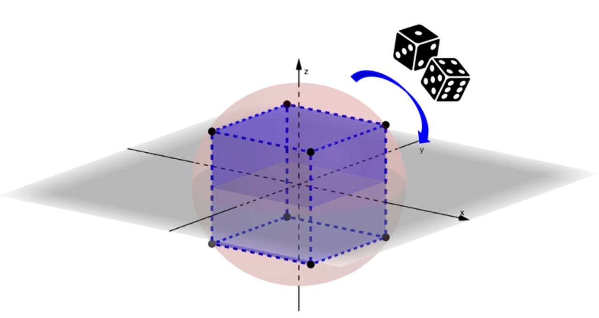
#### QueryPhase
Distance Estimation
在解决编码问题之后，下一步就需要设计如何进行距离计算。
前面已经进行过公式推理了，原始向量之间的欧式距离中包含很多可以进行预计算的部分，唯一需要进行运行时计算的只剩 q 与 o 的点积计算。
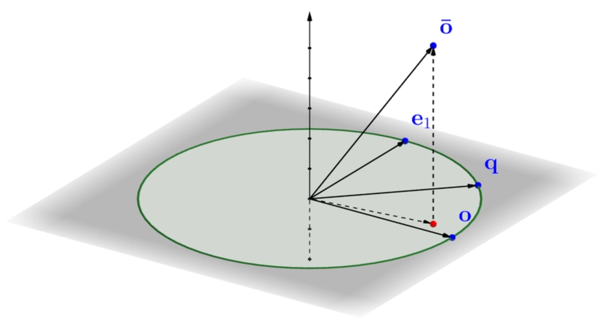
以 q 和 o 组成一个超平面，e1 是与 o 正交的向量，通过分析这些点之间的几何关系，可以推断出下面的公式：
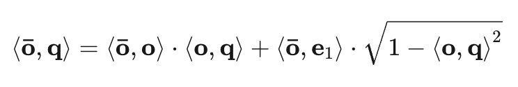
O^- 是经过随机旋转得到的超立方体的顶点，其在数据向量与查询向量组成的超平面上的投影，绝大多数都位于原始数据向量的方向上。下图的红色点云区域。
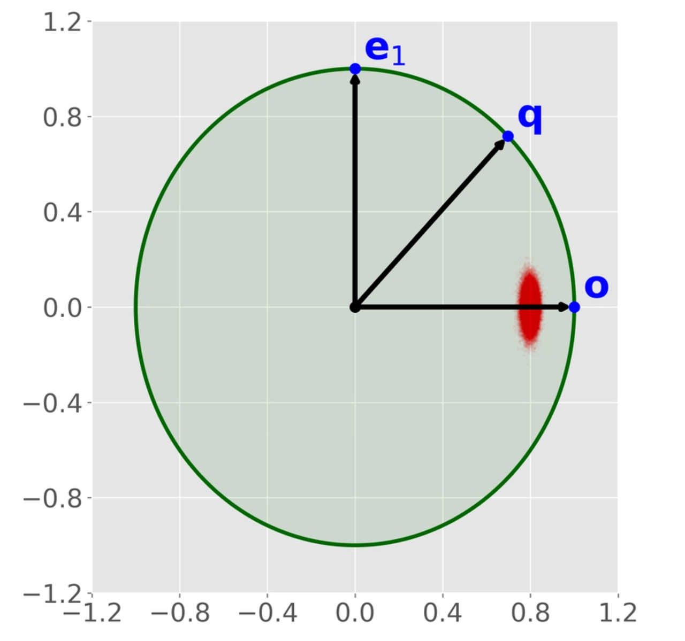
 所以上述公式的第二部分近似等于 0，误差在 [0, 2 / √D] 之间。
那么可以推出
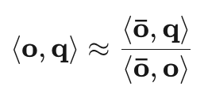
编码后超立方体的顶点与查询向量的内积可以直接计算，分母部分超立方体顶点与原始数据向量的内积可以在index phase提前计算。
#### Concentration of measure
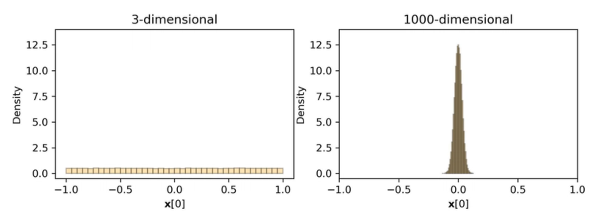
随机误差不等式大概是说：假设 X 向量是一个单位向量，单位向量的长度是 1。X[0] 表示的是 X 的第 0 维，当 X 的维度为 3 的时候，X[0]会在 -1.0 到 +1.0 之间均匀分布。但是当 X 的维度增加，比如到 1000 之后，那么 X 的分布将会集中在 0.0 附近，具体来说，绝大多数的 X[0] 将会分布在 [- 2 /√D, 2 / √D]) 之间。
这个不等式将会被用来系统性约束新的量化算法的误差。

https://www.elastic.co/search-labs/blog/scalar-quantization-101
https://qdrant.tech/articles/scalar-quantization
https://zilliz.com/learn/scalar-quantization-and-product-quantization
https://www.lx.it.pt/~mtf/Vector_quantization.pdf


