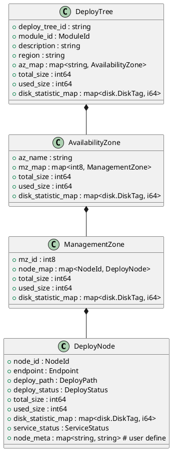
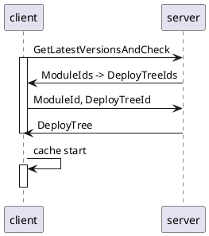

## Goalng Client
client 的内存中为每个 module 维护一个 deploy_tree
```golang
type deployTreeCache struct {
	module_deploy_tree_map map[model.ModuleId]deployTreeCacheEntry
	cache_mutex            sync.RWMutex
}
```

nmc 启动时从 nms 获取deploy tree
```cpp
int NodeManagerClientCache::PullModule(MODEL::ModuleId::type module_id) {
    /// A. 根据 module id 获取 deploy tree id
  std::string deploy_tree_id;
  int ret = node_manager_client_impl_->GetDeployTreeId(module_id, &deploy_tree_id);
  
  ...

  WriteLock wlock(deploy_tree_cache_.module_deploy_tree_mutex);
  auto& deploy_tree_cache_entry = deploy_tree_cache_.module_deploy_tree_map[module_id];
  deploy_tree_cache_entry.module_id = module_id;
  deploy_tree_cache_entry.deploy_tree_id = deploy_tree_id;
  deploy_tree_cache_entry.version = -1;
  deploy_tree_cache_entry.rpc_mutex.lock();
  wlock.unlock();

    /// B. 执行 rpc 操作，从 nms 获取 deploy tree
  ret = PullDeployTreeNoLock(module_id, deploy_tree_id, -1);
  if (ret != kSuccess) {
    NM_LOGF(NM_WARN, "PullDeployTreeNoLock failed, ret = {} deploy_tree_id = {}, module_id = {}",
             GetErrorCodeStr(ret), deploy_tree_id, module_id);
  }

  deploy_tree_cache_entry.rpc_mutex.unlock();
  return ret;
}

```



```plantuml
interface TClient {
  + error Call(Context, method_str, args, result)
}
class NodeManagerServiceClient {
  + c thrfit.TClient
}

NodeManagerServiceClient *-- TClient

interface NodeManagerService {
  + (ListHostsResponse, error) ListHosts(context) 
  + ... xxx (...)
}
```