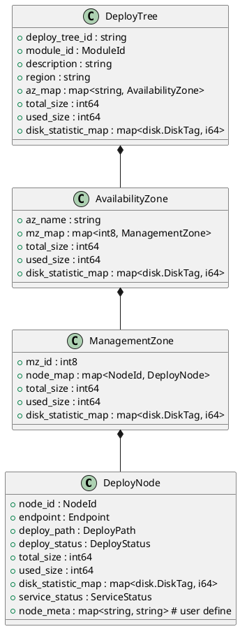

### Cloud Object Storage

Vid - Volume ID，由Allocator分配
Vbid - Volume 内代表 blob 的 ID
VletId：Vid+Seq（唯一代表历史上的一个vlet，seq始终加）
Bid: Vid + Vbid
Vlet Index: Vlet 的 shard index

SpaceId to ClusterId
10280(6666): [15183,15184,15185,15186,15191,15192,15193,15194,15204,15205,15206,15211,15212,15213,15214,15234,15243,15244,15522,15523,15784,15785,15937,16428,16429,16430,16431,16470]


#### Columbus
```
struct Cluster {
    1. cluster_id uint64;
    2. cluster_mata {
       1. region string;
       2. address string; // NodeManager ServiceName
    };
    3. space_id_list list<SpaceId>
}
```

map<ClusterId, Cluster>

#### NodeManager


#### Cayman
一致性哈希。保存 slot -> nodeid 的映射。


#### NodeMonitor&Audiene
Overall：NodeMonitor 这套服务用于向集群中的各个节点推送其订阅的信息。

对于每个需要接收信息推送的进程，其需要完成两个步骤：
1. 在 NodeMonitor 中注册自己，记录自己需要订阅哪些类型的事件
2. 启动 NodeMonitorClient（本质是一个 service），用于接收事件推送。

NodeMonitorClient的协议:
```thrift
service NodeMonitorClientService {
    PushEventsResponse PushEvents(1: PushEventsRequest request);
    PushDiskEventsResponse PushDiskEvents(1: PushDiskEventsRequest request);
    PushEventGroupsResponse PushEventGroups(1: PushEventGroupsRequest request);
}

struct PushEventsRequest {
  1: list<event.Event> events;
}

struct Event {
  1: node.NodeId target;
  2: EventName event_name;
  3: monitor_info.MonitorInfo monitor_info;
}

struct MonitorInfo {
  1: HealthInfo health_info;
  2: BlackInfo black_info;
  3: BackgroundInfo bg_info;
  4: DiskIoStats disk_io_stats;
}
```
NodeMonitor的协议：
```thrift
service NodeMonitorService {
  UpdateHealthInfosResponse UpdateHealthInfos(1:UpdateHealthInfosRequest request);
  BlackNodesResponse BlackNodes(1:BlackNodesRequest request);
  UnblackNodesResponse UnblackNodes(1:UnblackNodesRequest request);
  ListBlackNodesResponse ListBlackNodes(1:ListBlackNodesRequest request);
  ListMonitorInfosResponse ListMonitorInfos(1:ListMonitorInfosRequest request);
  GetMonitorInfoResponse GetMonitorInfo(1:GetMonitorInfoRequest request);

  // Disk BG/FG
  BackgroundNodeDisksResponse BackgroundNodeDisks(1:BackgroundNodeDisksRequest request);
  ForegroundNodeDisksResponse ForegroundNodeDisks(1:ForegroundNodeDisksRequest request);
  ListBackgroundNodeDisksResponse ListBackgroundNodeDisks();

  // Notify
  NotifyResponse Notify(1: NotifyRequest request);

  //OnRestart
  OnRestartResponse OnRestart(1: OnRestartRequest request);

  // Sync DeployTree/LocationTree
  NotifyDeployTreeChangeResponse NotifyDeployTreeChange(1:NotifyDeployTreeChangeRequest request);
  RetryNotifyDeployTreeChangeResponse RetryNotifyDeployTreeChange(1:RetryNotifyDeployTreeChangeRequest request);

  NotifyLocationTreeChangeResponse NotifyLocationTreeChange();
  RetryNotifyLocationTreeChangeResponse RetryNotifyLocationTreeChange(1:RetryNotifyLocationTreeChangeRequest request);
}
```
HearBeat 负责调用 NodeMonitorService 的接口，推送事件到 NodeMonitor，然后由 NodeMonitor 推送这些事件到订阅这些事件的 NodeMonitorClient

* Audience

```thrift
namespace AUDIENCE {
class MsgHandler {
    virtual std::tuple<int, std::string> HandleMsg(int msg_type, int msg_id, const std::string& content) = 0;
}
}
```
